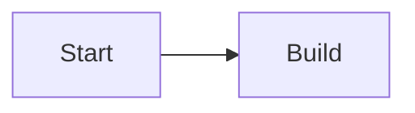

# Markdown 扩展语法说明

扩展语法解析入口：`src/plugins/markdown/build/remark-extended-build.ts`  
文章页运行时入口：`src/plugins/runtime/article/index.js`

## 必要配置

在 `src/site.config.ts` 中确认：

```ts
markdown: {
  extended: {
    enable: true,
    parserMode: "build-time",
    chartjs: { enable: true, defaultHeight: 320, bundleUrl: "..." },
    demoBlock: { enable: true },
    tabs: { enable: true },
    steps: { enable: true },
    mark: { enable: true, variants: ["tip", "warning", "danger", "important"] },
    icon: { enable: true, provider: "iconify", bundleUrl: "..." }
  },
  copy: { code: true, math: true, mermaid: true }
},
diagram: {
  fallbackToCdn: true,
  mermaid: { source: "local", localBundle: "/vendor/diagram/mermaid.esm.min.mjs", bundleUrl: "..." },
  echarts: { source: "local", localBundle: "/vendor/diagram/echarts.esm.min.js", bundleUrl: "..." }
}
```

## 1) Shortcodes

## Video

```md
[video url="https://example.com/demo.mp4"][/video]
[video url="https://example.com/demo.mp4" width="480" height="270"]caption[/video]
[video url="https://example.com/demo.mp4" autoplay="true"][/video]
```

## Checkbox

```md
[checkbox]todo item[/checkbox]
[checkbox checked="true"]done item[/checkbox]
```

## Hidden text

```md
[hidden]click to reveal[/hidden]
[hidden type="background"]masked text[/hidden]
[hidden type="blur" tip="hover tip"]blur text[/hidden]
```

## Admonition

```md
[admonition]default notice[/admonition]
[admonition title="Warning" color="red"]risk text[/admonition]
[admonition title="Info" icon="info" color="blue"]message[/admonition]
```

支持颜色：`indigo | green | red | blue | orange | black | grey`

## 2) Chart.js 容器

~~~md
::: chartjs Request Trend
```json
{
  "type": "line",
  "data": {
    "labels": ["Mon", "Tue", "Wed"],
    "datasets": [{ "label": "UV", "data": [12, 18, 9] }]
  }
}
```
chart notes here
:::
~~~

## 2.1) Demo 一体化容器（写法 + 效果）

~~~md
[demo title="Mermaid 演示" lang="mermaid" mode="split" result="auto"]

预览区会自动渲染，源码区保留原始代码块。
[/demo]
~~~

说明：

- `mode`: `split | stack`（并排 / 上下）
- `result`: `auto | force`

## 3) Tabs 容器

~~~md
::: tabs
@tab Java
```java
System.out.println("Hello");
```

@tab TypeScript
```ts
console.log("Hello");
```
:::
~~~

## 4) Steps 容器

```md
:::: steps
- install deps
- run dev
- build
::::
```

## 5) Inline mark 和 icon

## Inline mark

```md
this is ==important=={.tip}
this is ==danger=={.danger}
```

## Inline icon

```md
icon sample :[mdi:rocket 20px/#0ea5e9]:
```

## 6) 运行时增强块

以下能力在文章页运行时处理：

- Mermaid fenced block
- Draw.io fenced block
- ECharts `chart` fenced block
- `demo` 短代码预览区的图形渲染
- 代码块 toolbar / copy / 行号增强
- 代码块底部折叠图标（展开/收起）
- KaTeX 复制按钮
