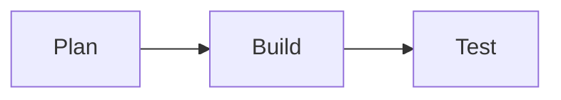
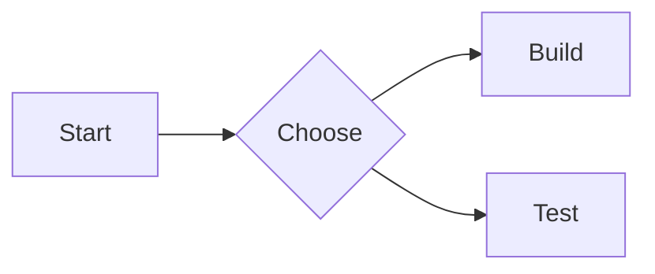

# Markdown 扩展完整演示模板

下面内容可直接复制到一篇测试文章中做全量验收。

~~~md
---
title: "Markdown 扩展完整演示"
summary: "用于验证 tabs/steps/chartjs/shortcode/diagram/code-copy"
---

## 视频
[video url="https://interactive-examples.mdn.mozilla.net/media/cc0-videos/flower.mp4"][/video]

## 复选框
[checkbox]未完成任务[/checkbox]
[checkbox checked="true"]已完成任务[/checkbox]

## 隐藏文本
[hidden]点击显示秘密[/hidden]
[hidden type="blur" tip="点击查看"]模糊内容[/hidden]

## Admonition
[admonition title="警告" color="orange"]请先在测试环境验证。[/admonition]

## 行内 mark 与 icon
这是 ==重点=={.tip}，图标：:[mdi:rocket 18px/#0ea5e9]:

## Steps
:::: steps
- Step 1: 拉取代码
- Step 2: 安装依赖
- Step 3: 运行构建
::::

## Tabs
::: tabs
@tab TS
```ts
const sum = (a: number, b: number) => a + b;
```

@tab Rust
```rust
fn sum(a: i32, b: i32) -> i32 { a + b }
```
:::

## Chart.js
::: chartjs 请求趋势
```json
{
  "type": "bar",
  "data": {
    "labels": ["Mon", "Tue", "Wed"],
    "datasets": [{ "label": "Requests", "data": [120, 98, 140] }]
  }
}
```
图表说明：近三日请求量。
:::

## Demo（写法 + 效果）
[demo title="Mermaid Demo" lang="mermaid" mode="split" result="auto"]

预览区自动渲染，源码区保留可复制代码。
[/demo]

## Mermaid


## Draw.io
```drawio
https://example.com/your-diagram.drawio
```

## ECharts
```chart
{
  "xAxis": { "type": "category", "data": ["A", "B", "C"] },
  "yAxis": { "type": "value" },
  "series": [{ "type": "line", "data": [3, 9, 5] }]
}
```
~~~
