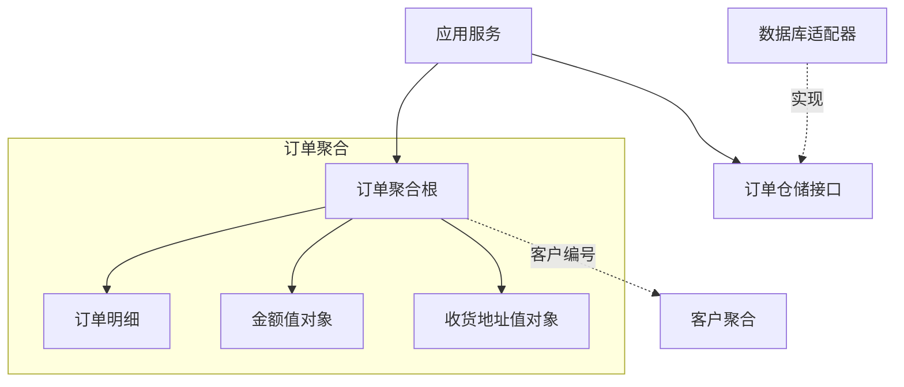

DDD（领域驱动设计）用业务语言组织模型和代码。先明确一个词在什么业务范围内成立，再决定对象之间怎样协作。它不要求使用微服务，也没有固定的目录模板。

## 先划分限界上下文

“订单”在交易系统中关注成交和取消，在仓储系统中关注拣货与发货。两个上下文可以共享订单编号，但不必共享同一个 Java 类或同一套状态。

战略设计关注领域划分、限界上下文及其关系；战术设计关注上下文内部的实体、值对象、聚合等模型。上下文边界可以体现在单体应用的模块中，也可以对应独立服务。参见 [Bounded Context](https://martinfowler.com/bliki/BoundedContext.html)。

## 实体、值对象与聚合

| 概念 | 判断方式 | 订单场景示例 |
| --- | --- | --- |
| 实体 | 通过身份区分，属性变化后仍是同一个对象 | 订单修改收货地址后，订单编号不变 |
| 值对象 | 通过属性值比较，通常设计为不可变 | 金额由数值和币种共同决定 |
| 聚合 | 为一组业务不变量划定修改边界 | 订单与订单明细共同维护总额和可修改状态 |
| 聚合根 | 外部修改聚合的入口，是聚合中的一个实体 | 通过订单添加明细、取消订单 |

实体不等同于数据库表对应的 PO。值对象可以作为参数和返回值，不存在“不能作为方法入参”的限制。聚合也不是把一次 SQL 涉及的所有表装进一个对象；应从必须一起保持的业务规则确定边界。参见 [Value Object](https://martinfowler.com/bliki/ValueObject.html) 和 [DDD Aggregate](https://martinfowler.com/bliki/DDD_Aggregate.html)。

图中的客户通过编号关联，不必随每次订单修改一起加载和更新。跨聚合的流程可采用事件和补偿等方式协调，但“跨聚合只能最终一致”不是可以脱离业务要求使用的结论。

## 业务行为放在哪里

- **实体或值对象**：处理属于自身的规则，例如订单是否允许取消、金额运算时币种是否一致。
- **领域服务**：表达确实不适合归属于某个实体或值对象的领域操作。
- **应用服务**：协调请求、事务、仓储和领域对象，组织一次用例。
- **基础设施**：实现数据库访问、消息发送、第三方接口调用等技术细节。

充血模型把规则与状态放在一起，但不意味着把缓存、HTTP 调用和所有校验都塞进实体。工厂用于封装复杂对象的创建，仓储提供获取和保存聚合的抽象。

## 端口、适配器和事件

端口定义系统需要的接口，适配器用数据库、HTTP 客户端或消息系统实现这些接口。HTTP 控制器、消息监听器和定时任务可以作为调用应用服务的入口；这是组织依赖的方式，不是 DDD 强制要求的类名。

领域事件记录已经发生的业务事实，例如“订单已支付”。事件如何可靠发布、重复消息如何处理，需要结合事务和消息系统设计，发布一个 Java 事件本身不等于完成跨服务一致性。

关于方法与模型的关系，可继续阅读 [Domain Driven Design](https://martinfowler.com/bliki/DomainDrivenDesign.html)。
