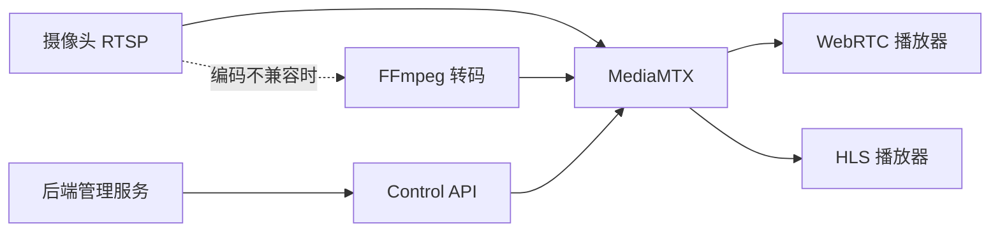

MediaMTX 可以接收摄像头 RTSP 流，再通过 WebRTC 或 HLS 提供给浏览器。协议转换不等于视频转码：源视频编码必须与客户端兼容，否则还需要调整相机编码或使用 FFmpeg 转码。浏览器支持情况见 [MediaMTX WebRTC 文档](https://mediamtx.org/docs/features/webrtc-specific-features)。



## 下载与版本

本文按原示例的 **v1.15.3** 整理，配置键以该版本随附的 `mediamtx.yml` 为准。下载对应系统的程序后，将可执行文件与配置文件放在同一目录。升级前比较配置差异，不要把其他版本的片段直接拼入。

- [v1.15.3 发布页](https://github.com/bluenviron/mediamtx/releases/tag/v1.15.3)
- [v1.15.3 配置文件](https://github.com/bluenviron/mediamtx/blob/v1.15.3/mediamtx.yml)

## 接入一路摄像头

在随附配置中修改下列项目，保留原有鉴权配置。`readTimeout`、`hls` 等是顶层字段；摄像头参数放在 `paths` 中。地址与凭据需自行替换。

```yaml
readTimeout: 10s
writeTimeout: 10s

api: yes
apiAddress: 127.0.0.1:9997
metrics: yes
metricsAddress: 127.0.0.1:9998

webrtc: yes
webrtcAddress: :8889
webrtcLocalUDPAddress: :8189
webrtcAdditionalHosts: []

hls: yes
hlsAddress: :8888
hlsVariant: lowLatency

paths:
  cam_parking_01:
    source: rtsp://<CAMERA_USER>:<CAMERA_PASSWORD>@<CAMERA_IP>:554/cam/realmonitor?channel=1&subtype=1
    rtspTransport: tcp
    sourceOnDemand: yes
```

这里的 RTSP URL 是大华常见格式，通道和码流编号仍需核对设备。`sourceOnDemand: yes` 表示有读取者时才拉取源流；若需要持续录制，应单独核对拉流和录制策略。

Windows PowerShell 启动命令：

```powershell
.\mediamtx.exe .\mediamtx.yml
```

## 先用内置播放页验证

| 用途 | 本机示例地址 |
| --- | --- |
| WebRTC 播放页 | `http://localhost:8889/cam_parking_01` |
| WHEP 信令端点 | `http://localhost:8889/cam_parking_01/whep` |
| HLS 播放列表 | `http://localhost:8888/cam_parking_01/index.m3u8` |
| 运行中的路径 | `http://127.0.0.1:9997/v3/paths/list` |
| Prometheus 指标 | `http://127.0.0.1:9998/metrics` |

WHEP 地址供播放器发起信令请求，不是直接打开就能观看的 HTML 页面。API 根路径也不是管理状态页。

客户端不在服务器本机时，将播放地址里的 `localhost` 换成客户端可达的服务器地址，并检查 WebRTC 媒体端口和 ICE 候选地址。`webrtcAdditionalHosts` 用于公告可达地址，不用于绑定监听网卡；复杂 NAT 环境可能需要 STUN/TURN。

## 嵌入自己的页面

可以先嵌入内置播放页，再根据界面需要使用官方 JavaScript reader。参见 [浏览器播放文档](https://mediamtx.org/docs/read/web-browsers)。

```html
<iframe
  title="停车场摄像头"
  src="http://<MEDIA_HOST>:8889/cam_parking_01"
  style="width:100%;aspect-ratio:16/9;border:0"
  allow="autoplay; fullscreen"
  allowfullscreen>
</iframe>
```

自定义 HTML 由 Nginx 等 Web 服务器提供。把文件放在 MediaMTX 可执行文件旁边，不会让它自动成为 `:8889/your-page.html`。HTTPS 页面也需要使用 HTTPS 播放入口，避免混合内容拦截。

## 通过 Control API 管理路径

以下请求在服务器本机执行，依赖配置中的本机 API 权限。远程管理需要另外配置访问权限和传输保护；仅开启 TLS 不会授予或限制某个用户的 API 权限。

```bash
curl http://127.0.0.1:9997/v3/paths/list

curl -X POST http://127.0.0.1:9997/v3/config/paths/add/cam_parking_02 \
  -H 'Content-Type: application/json' \
  -d '{"source":"rtsp://<CAMERA_USER>:<CAMERA_PASSWORD>@<CAMERA_IP>:554/cam/realmonitor?channel=1&subtype=1"}'

curl -X DELETE http://127.0.0.1:9997/v3/config/paths/delete/cam_parking_02
```

路径列表返回分页对象，包含 `pageCount`、`itemCount` 和 `items`，不是裸数组；每个路径的就绪状态、轨道和读取者按版本对应的结构解析。字段定义见 [v1.15.3 Control API](https://github.com/bluenviron/mediamtx/blob/v1.15.3/api/openapi.yaml)。

## 排查顺序

1. 用 FFprobe 或 VLC 在服务器上验证源 RTSP，确认网络、凭据和编码。
2. 查看 MediaMTX 日志及 `/v3/paths/list`，确认路径就绪。
3. 打开内置播放页，检查浏览器网络请求和 ICE 连接状态。
4. 验证客户端支持的视频、音频编码；协议能连接不代表能够解码。
5. 再接入自定义页面、鉴权和反向代理。

延迟需要测量采集到显示的完整过程，不能只根据协议名承诺固定毫秒数。多路播放时同时观察服务器出口带宽和客户端解码负载。
