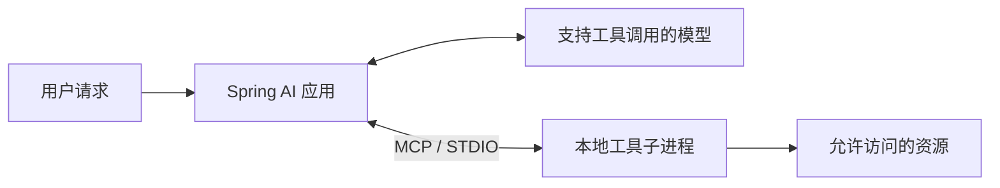

## 模型、客户端与工具服务的关系

Spring AI 支持本地与在线模型的统一封装调用，结合 MCP（Model Context Protocol）协议，可把服务端开放的文件操作转换为模型可调用的工具。

下面按 **Spring AI 1.0.x** 的 API 组织示例。两个模型方案分别配置；依赖版本统一由项目的 `spring-ai-bom` 管理。升级到其他版本时，先核对相应版本的 Starter 和工具回调接口。



MCP 连接由应用建立，模型返回工具调用请求。在线模型也可以经由本地应用调用本地工具；工具并不会因此搬到模型提供方的服务器。

## 本地 Ollama + Qwen3 模型接入 MCP 实践

[Spring AI](https://docs.spring.io/spring-ai/reference/api/mcp/mcp-client-boot-starter-docs.html)

### 推荐模型：Qwen3

使用 [Qwen3 模型](https://ollama.com/library/qwen3)，原因如下：

- 示例选用支持工具调用的 Qwen3 版本。
- MCP 由客户端与服务端实现，模型通过工具调用能力接入；不能把某次兼容性问题概括为整个模型家族“不支持 MCP”。应分别核对模型版本、模型提供方接口和客户端适配。

### 1. 引入依赖

```xml

<dependency>
    <groupId>org.springframework.ai</groupId>
    <artifactId>spring-ai-starter-model-ollama</artifactId>
</dependency>
<dependency>
    <groupId>org.springframework.ai</groupId>
    <artifactId>spring-ai-starter-mcp-client</artifactId>
</dependency>
```

### 2. 配置 `application.yml`

```yaml
spring:  
  ai:
    ollama:
      base-url: http://127.0.0.1:11434
      embedding:
        enabled: true
        model: nomic-embed-text
        options:
          num-batch: 512
    mcp:
      client:
        stdio:
          servers-configuration: classpath:config/mcp-servers.json
```

### 3. MCP 工具配置 `mcp-servers.json`

在不使用本地服务的情况下，你也可以接入以下 **云端托管的 MCP Server**：

- 🔗 [Smithery AI MCP 服务](https://smithery.ai/)
- 🔗 [Glama MCP 服务](https://glama.ai/mcp/servers)

它们支持通过浏览器接入标准 MCP 工具链，适合快速接入和调试。

#### 本地文件操作：server-filesystem 模式

若使用 `server-filesystem` 工具运行在本地环境，可实现如下能力：

- 📂 **读取 / 写入 / 删除本地文件**
- 📁 **操作指定目录下的文件结构**
- ✅ **完整支持 MCP 文件类工具接口**

但需注意以下前提条件：

- 本地需安装好 **Node.js 和 npm**
- 全局安装或通过 `npx`
  调用 [`@modelcontextprotocol/server-filesystem`](https://www.npmjs.com/package/@modelcontextprotocol/server-filesystem)

示例启动命令配置如下：

```json
{
  "mcpServers": {
    "filesystem": {
      "command": "npx.cmd",
      "args": [
        "-y",
        "@modelcontextprotocol/server-filesystem",
        "C:\\Users\\flycode\\Desktop\\temp"
      ]
    }
  }
}
```

📌 配置说明：

- MCP 工具将操作 `C:\\Users\\flycode\\Desktop\\temp` 目录
- 可通过 Ollama 实现 AI 与文件系统的交互

### 4. Spring Bean 配置

```java
@Configuration
public class OllamaConfig {
    @Bean
    public ChatClient.Builder ollamaChatClientBuilder(OllamaChatModel ollamaChatModel) {
        return ChatClient.builder(ollamaChatModel);
    }
}
```

### 5. 调用测试：生成本地文件

```java
@Resource
private ToolCallbackProvider toolCallback;
@Resource
private ChatClient.Builder ollamaChatClientBuilder;

@Test
public void makeNewText() {
    String prompt = "帮我生成一个测试.txt文件到C:\\Users\\flycode\\Desktop\\temp位置，并且内容是测试xxxx";
    
    String text = ollamaChatClientBuilder
        .defaultToolCallbacks(toolCallback)
        .build()
        .prompt(new Prompt(prompt, OllamaOptions.builder().model("qwen3:latest").build()))
        .call()
        .chatResponse()
        .getResult()
        .getOutput()
        .getText();

    log.info(text);
}
```

### 实际效果

📂 本地文件已自动创建：


## 使用 ZhiPu AI 在线模型调用 MCP 工具

[ZhiPu AI](https://www.bigmodel.cn/dev/api/normal-model/glm-4)

此方案使用智谱模型生成工具调用请求，MCP 文件工具仍由客户端应用在本地启动。需同时保留前面的 MCP Client 依赖。

📌 注意：

- 选择支持工具调用的模型和接口；模型提供方、客户端适配与 MCP 传输是不同层次。
- 调用将消耗较多 Token，按需使用

### 1. 引入依赖

```xml

<dependency>
    <groupId>org.springframework.ai</groupId>
    <artifactId>spring-ai-starter-model-zhipuai</artifactId>
</dependency>
```

### 2. 配置 `application.yml`

```yml
spring:
  ai:
    zhipuai:
      api-key: xxxxxx  # 请替换为你的真实密钥
      chat:
        options:
          model: glm-4-plus
      base-url: https://open.bigmodel.cn/api/paas/
    mcp:
      client:
        stdio:
          servers-configuration: classpath:config/mcp-servers.json
```

### 3. 配置 Bean

```java
@Configuration
public class ZhipuConfig {

    @Bean
    public ChatClient.Builder zhipuChatClientBuilder(ZhiPuAiChatModel zhipuChatModel) {
        return ChatClient.builder(zhipuChatModel);
    }
}
```

### 4. 测试 MCP 工具能力

```java
@Resource
private ToolCallbackProvider toolCallback;
@Resource
private ChatClient.Builder zhipuChatClientBuilder;

@Test
public void test2() {
    String res = zhipuChatClientBuilder
        .defaultToolCallbacks(toolCallback)
        .build()
        .prompt("当前有哪些工具可用")
        .call()
        .chatResponse()
        .getResult()
        .getOutput()
        .getText();

    log.info(res);
}
```

### 效果展示

✨ 可用 MCP 工具一览（自动返回）：


## 自定义 MCP 服务开发指南

为了实现更灵活的 AI 工具接入能力，我们可以自定义一个 MCP 服务模块，用于提供本地能力（例如系统信息、文件操作等）供 AI 调用。

> 官方文档参考：[Spring AI - MCP Server Starter](https://docs.spring.io/spring-ai/reference/api/mcp/mcp-server-boot-starter-docs.html)

### 1. 引入核心依赖

在新建的 Spring Boot 模块中添加以下依赖：

```xml
<dependency>
    <groupId>org.springframework.ai</groupId>
    <artifactId>spring-ai-starter-mcp-server</artifactId>
</dependency>
```

### 2. 实现自定义工具类（以获取电脑配置信息为例）

```java
@Service
@Slf4j
public class ComputerService {
    @Tool(description = "获取电脑配置信息")
    public String getComputerInfo(@ToolParam(description = "电脑名称") String computerName) {
        log.info("获取电脑配置信息" + computerName);

        // 操作系统名称
        String osName = System.getProperty("os.name");
        // 操作系统版本
        String osVersion = System.getProperty("os.version");
        // 操作系统架构
        String osArch = System.getProperty("os.arch");
        // 当前 Java 进程所属用户
        String userName = System.getProperty("user.name");
        // 用户的主目录
        String userHome = System.getProperty("user.home");
        // 用户的当前工作目录
        String currentDir = System.getProperty("user.dir");
        // Java 运行时环境版本
        String javaVersion = System.getProperty("java.version");
        StringBuilder res = new StringBuilder();
        return res.append("Operating System: ").append(osName).append("\n")
                .append("OS Version: ").append(osVersion).append("\n")
                .append("OS Architecture: ").append(osArch).append("\n")
                .append("User Name: ").append(userName).append("\n")
                .append("User Home: ").append(userHome).append("\n")
                .append("Current Directory: ").append(currentDir).append("\n")
                .append("Java Version: ").append(javaVersion).append("\n").toString();
    }
}
```

### 3. 配置 application.yml

STDIO 使用子进程的标准输入和输出传递协议消息，不属于 WebMVC 或 WebFlux。HTTP 服务端使用相应的 Web Starter；本节只配置 STDIO。

关闭 Web 服务和启动横幅，同时明确启用 STDIO：

```yml
spring:
  application:
    name: mcp-server-computer

  ai:
    mcp:
      server:
        stdio: true
        name: ${spring.application.name}
        version: 1.0.0

  main:
    banner-mode: "off"
    web-application-type: none

```

`logging.file.name` 只添加日志文件，不会自动关闭控制台日志。为避免污染 STDIO，在服务端的 `src/main/resources/logback-spring.xml` 中将日志输出到标准错误：

```xml
<configuration>
    <appender name="STDERR" class="ch.qos.logback.core.ConsoleAppender">
        <target>System.err</target>
        <encoder><pattern>%d{HH:mm:ss} %-5level %logger - %msg%n</pattern></encoder>
    </appender>
    <root level="INFO"><appender-ref ref="STDERR"/></root>
</configuration>
```

工具代码也不要使用 `System.out.println`。只有协议消息可以写入标准输出。

### 4. 启动类与工具注册

```java
@SpringBootApplication
@Slf4j
public class ComputerApplication implements CommandLineRunner {

    public static void main(String[] args) {
        SpringApplication.run(ComputerApplication.class, args);
    }

    @Override
    public void run(String... args) throws Exception {
        log.info("Computer service started");
    }
    // 将当前MCP工具注册到ToolBackProvider中
    @Bean
    public ToolCallbackProvider computerTool(ComputerService computerService) {
        return MethodToolCallbackProvider.builder().toolObjects(computerService).build();
    }
}
```

### 5. 打包服务 Jar 供调用

将该模块 **打包为可执行 Jar**，记录生成的路径（例如：`ai-mcp-server-computer-1.0-SNAPSHOT.jar`）：

> 🧭 例如：`D:\myprojects\Konwledge\xxx\target\ai-mcp-server-computer-1.0-SNAPSHOT.jar`


### 6. 配置调用方 JSON 文件

在调用智谱模型的 Spring AI 客户端应用中的 `mcp-servers.json` 配置文件中添加如下内容：

```json
{
  "mcpServers": {
    "filesystem": {
      "command": "npx.cmd",
      "args": [
        "-y",
        "@modelcontextprotocol/server-filesystem",
        "C:\\Users\\flycode\\Desktop\\temp"
      ]
    },
    "mcp-server-computer": {
      "command": "java",
      "args": [
        "-jar",
        "D:\\myprojects\\Konwledge\\xxx\\target\\ai-mcp-server-computer-1.0-SNAPSHOT.jar"
      ]
    }
  }
}
```

### 7. 调用测试

模型回复不能代替工具注册检查。先通过 MCP 的 `tools/list` 核对实际工具，再观察调用日志及文件结果。下面的提问用于体验模型交互：

```java
@Resource
private ChatClient.Builder zhipuChatClientBuilder;

@Test
public void testToolAvailability() {
    String res = zhipuChatClientBuilder
                    .defaultToolCallbacks(toolCallback)
                    .build()
                    .prompt("当前有哪些工具可用")
                    .call()
                    .chatResponse()
                    .getResult()
                    .getOutput()
                    .getText();
    log.info(res);
}
```

📸 测试效果如下图所示：


### 8. AI 问答调用效果

示例 prompt：调用工具生成电脑配置文件

```java
@Test
public void testComputerTool() {
    String prompt = "获取我的电脑配置信息，帮我生成一个电脑配置.txt文件到C:\\Users\\flycode\\Desktop\\temp位置，并且内容是电脑配置信息";
    String text = zhipuChatClientBuilder
                    .defaultToolCallbacks(toolCallback)
                    .build()
                    .prompt(new Prompt(prompt))
                    .call()
                    .chatResponse()
                    .getResult()
                    .getOutput()
                    .getText();
    log.info(text);
}
```

最终 AI 成功读取配置信息并创建文件：


## 参考

- [Spring AI 1.0 MCP Client](https://docs.spring.io/spring-ai/reference/1.0/api/mcp/mcp-client-boot-starter-docs.html)
- [Spring AI 1.0 MCP Server](https://docs.spring.io/spring-ai/reference/1.0/api/mcp/mcp-server-boot-starter-docs.html)
