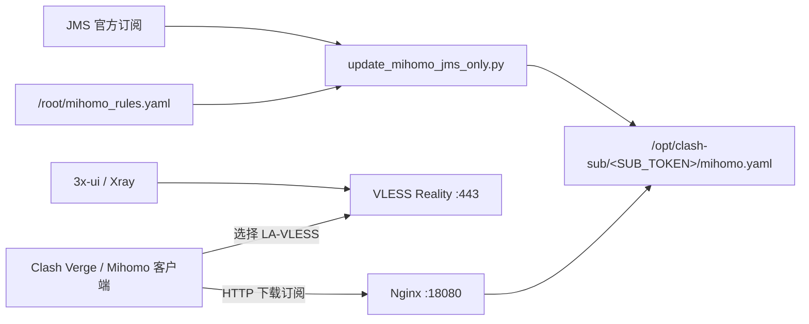

本文整理 Debian VPS 上 3x-ui、Xray Reality、Nginx 和 Mihomo 订阅的部署、备份、迁移与排障步骤。

文中的 `<VPS_IP>`、`<OLD_IP>`、`<NEW_IP>`、`<SUB_TOKEN>` 等均为占位符，执行命令前请替换为实际值。账号密码、UUID、Reality 私钥和订阅凭据应单独保存。

订阅生成部分依赖自定义脚本 `update_mihomo_jms_only.py` 和规则文件 `mihomo_rules.yaml`，本文未附脚本源码；相关命令适用于已有这套配置的环境。

## 1. 方案概览

这套部署分为三部分：

1. **3x-ui / Xray**
   - 管理 Xray 入站
   - 自建节点使用 `VLESS + Reality`
   - 对外服务端口：`443`

2. **Nginx**
   - 对外提供 Mihomo / Clash Meta 配置文件下载
   - 订阅服务端口：`18080`
   - URL 结构：

```text
http://<VPS_IP>:18080/<SUB_TOKEN>/mihomo.yaml
```

3. **Mihomo 配置生成**
   - Python 脚本读取自建 LA-VLESS 参数
   - 拉取 JMS 官方订阅
   - 加载个人路由规则
   - 最终生成一个统一的 `mihomo.yaml`
   - 客户端只需要订阅这一份文件

整体关系：



## 2. 环境与端口

系统以 Debian GNU/Linux 为例，具体版本和架构通过第 4 节的命令确认。

端口约定：

| 用途 | 端口 | 说明 |
|---|---:|---|
| SSH | 22（如未自定义） | 系统管理 |
| VLESS Reality | 443 | 自建 LA-VLESS |
| Mihomo 订阅 | 18080 | Nginx 静态文件服务 |
| 3x-ui 面板 | `<PANEL_PORT>` | 实际端口以面板配置为准 |

## 3. 文件目录约定

目前最关键的文件：

```text
/root/update_mihomo_jms_only.py
/root/mihomo_rules.yaml

/opt/clash-sub/
└── <SUB_TOKEN>/
    ├── mihomo.yaml
    └── mihomo.yaml.bak
```

3x-ui 默认 SQLite 数据库通常位于：

```text
/etc/x-ui/x-ui.db
```

3x-ui 相关目录应重点备份：

```text
/etc/x-ui/
/etc/default/x-ui        # 如果存在
/root/cert/              # 如果证书放在这里
```

Nginx：

```text
/etc/nginx/nginx.conf
/etc/nginx/sites-available/
/etc/nginx/sites-enabled/
/etc/nginx/conf.d/
```

## 4. 新服务器初始化

以下以 Debian 为例。

### 4.1 基础检查

```bash
cat /etc/os-release
uname -a
ip addr
ip route
free -h
df -h
```

设置时区：

```bash
timedatectl set-timezone Asia/Shanghai
timedatectl
```

更新系统：

```bash
apt update
apt upgrade -y
```

安装基础工具：

```bash
apt install -y \
  curl \
  wget \
  vim \
  nano \
  ca-certificates \
  unzip \
  tar \
  git \
  python3 \
  python3-pip \
  python3-yaml \
  net-tools \
  lsof
```

## 5. 安装 3x-ui

当前采用的是 `MHSanaei/3x-ui`。

官方脚本安装方式：

```bash
bash <(curl -Ls https://raw.githubusercontent.com/mhsanaei/3x-ui/master/install.sh)
```

安装后：

```bash
x-ui
```

进入管理菜单。

建议立即记录以下内容，但放在**私人密码管理器**中：

```text
面板地址：
面板端口：
Web Base Path：
管理员账号：
管理员密码：
3x-ui 版本：
Xray-core 版本：
```

查看服务：

```bash
systemctl status x-ui
```

常用操作：

```bash
systemctl restart x-ui
systemctl stop x-ui
systemctl start x-ui
```

## 6. 3x-ui 的备份重点

3x-ui 最重要的是数据库。

默认 SQLite：

```text
/etc/x-ui/x-ui.db
```

其中包含：

- 入站
- 客户端
- 面板设置
- Xray 相关配置

在线备份使用 SQLite 的备份接口（需安装 `sqlite3`），不要直接复制正在写入的数据库文件：

```bash
umask 077
sqlite3 /etc/x-ui/x-ui.db ".backup '/root/x-ui-backup-$(date +%F).db'"
```

如果要打包整个目录，先停服务以保持数据库与附属文件一致，完成后再启动。这会短暂中断服务：

```bash
systemctl stop x-ui
tar -czf /root/x-ui-etc-$(date +%F).tar.gz /etc/x-ui
systemctl start x-ui
```

如果有证书：

```bash
tar -czf /root/x-ui-cert-$(date +%F).tar.gz /root/cert 2>/dev/null
```

迁移时建议尽量：

```text
旧服务器 3x-ui 主版本
≈
新服务器 3x-ui 主版本
```

避免数据库结构跨度过大。

## 7. 配置自建 VLESS Reality

本文示例将自建节点命名为：

```text
LA-VLESS
```

核心参数结构：

```yaml
- name: LA-VLESS
  type: vless
  server: <VPS_IP>
  port: 443
  uuid: <VLESS_UUID>
  network: tcp
  udp: true
  tls: true
  servername: <REALITY_SNI>
  client-fingerprint: chrome
  reality-opts:
    public-key: <REALITY_PUBLIC_KEY>
    short-id: <REALITY_SHORT_ID>
```

但迁移时最重要的不是手工重新生成这些参数，而是：

> **优先直接迁移 3x-ui 数据库。**

只要数据库恢复成功，原来的：

- UUID
- Reality Private Key
- Reality Public Key
- Short ID
- SNI
- 入站端口
- 客户端配置

都可以保持一致。

## 8. 安装 Nginx

Debian 简单安装：

```bash
apt update
apt install -y nginx
```

启动：

```bash
systemctl enable nginx
systemctl start nginx
systemctl status nginx
```

查看版本：

```bash
nginx -v
```

检查配置：

```bash
nginx -t
```

重新加载：

```bash
systemctl reload nginx
```

## 9. Nginx 提供 Mihomo 订阅

当前订阅 URL 设计：

```text
http://<VPS_IP>:18080/<SUB_TOKEN>/mihomo.yaml
```

而实际文件：

```text
/opt/clash-sub/<SUB_TOKEN>/mihomo.yaml
```

因此可以使用类似下面的 Nginx 配置。

> 这是按当前目录结构整理出的迁移模板。迁移旧服务器时，优先用 `nginx -T` 导出原始配置核对。

创建：

```bash
nano /etc/nginx/sites-available/clash-sub
```

示例：

```nginx
server {
    listen 18080;
    listen [::]:18080;

    server_name _;

    root /opt/clash-sub;

    default_type text/plain;
    charset utf-8;

    # 替换为实际订阅令牌；只允许下载当前配置。
    location = /<SUB_TOKEN>/mihomo.yaml {
        try_files $uri =404;
    }

    location / {
        return 404;
    }

    access_log /var/log/nginx/clash-sub.access.log;
    error_log  /var/log/nginx/clash-sub.error.log;
}
```

启用：

```bash
ln -s /etc/nginx/sites-available/clash-sub \
      /etc/nginx/sites-enabled/clash-sub
```

检查：

```bash
nginx -t
systemctl reload nginx
```

检查端口：

```bash
ss -lntp | grep 18080
```

理想状态：

```text
0.0.0.0:18080
或
*:18080
```

这样服务器以后换 IP，一般**不需要改 Nginx listen**。

## 10. 创建订阅目录

```bash
mkdir -p /opt/clash-sub/<SUB_TOKEN>
chmod 755 /opt/clash-sub
chmod 755 /opt/clash-sub/<SUB_TOKEN>
```

不要使用容易猜到的目录：

```text
/subscribe/
/config/
/clash/
```

应使用随机 Token，例如：

```text
/xxxxxxxxxxxxxxxxxxxxxxxxxxxxxxxx/
```

Token 等价于“知道地址即可下载配置”的访问凭据，因此不要公开。

## 11. Mihomo 路由规则

当前规则文件：

```text
/root/mihomo_rules.yaml
```

设计原则：

```text
1. localhost / LAN / 自建 VPS 直连
2. OpenAI、Claude、Grok、Gemini 等走 PROXY
3. GitHub、Docker、开发资源走 PROXY
4. Telegram、Discord、Reddit 等走 PROXY
5. 国内域名和国内 IP 直连
6. 未匹配流量最终 MATCH,PROXY
```

当前自建 VPS 的 DIRECT 规则：

```yaml
- IP-CIDR,<VPS_IP>/32,DIRECT,no-resolve
```

迁移到新 IP 后必须一起修改。

规则末尾：

```yaml
- GEOSITE,CN,DIRECT
- GEOIP,CN,DIRECT
- MATCH,PROXY
```

将兜底规则 `MATCH,PROXY` 放在末尾。

## 12. Mihomo 配置生成脚本

当前脚本：

```text
/root/update_mihomo_jms_only.py
```

输出：

```text
/opt/clash-sub/<SUB_TOKEN>/mihomo.yaml
```

规则文件：

```text
/root/mihomo_rules.yaml
```

脚本的核心作用：

```text
JMS 主站订阅 ─┐
              ├─> 选择可用节点更多的一份
JMS 镜像订阅 ─┘
                  ↓
             规范化 JMS 节点
                  ↓
         加入自己的 LA-VLESS
                  ↓
          加载 mihomo_rules.yaml
                  ↓
            校验 YAML / Mihomo
                  ↓
           原子写入 mihomo.yaml
```

脚本还会保留：

```text
mihomo.yaml.bak
```

保留上一份配置，便于更新失败时回滚。

## 13. LA-VLESS 的 IP 配置

脚本内部采用环境变量优先：

```python
"server": os.environ.get("LA_VLESS_SERVER", "<VPS_IP>")
```

因此迁移时先检查：

```bash
echo "$LA_VLESS_SERVER"
```

如果存在环境变量，应优先修改环境变量来源。

寻找：

```bash
grep -R "LA_VLESS_SERVER" \
  /etc/environment \
  /etc/default \
  /etc/systemd/system \
  /root \
  2>/dev/null
```

如果没有设置环境变量，则修改 Python 脚本里的默认 IP。

## 14. 重新生成 Mihomo 配置

手动执行：

```bash
python3 /root/update_mihomo_jms_only.py
```

成功时应看到：

```text
OK: updated ...
```

然后检查：

```bash
ls -lh /opt/clash-sub/<SUB_TOKEN>/mihomo.yaml
```

确认自建节点：

```bash
grep -n "LA-VLESS" \
  /opt/clash-sub/<SUB_TOKEN>/mihomo.yaml
```

检查服务器：

```bash
grep -n "server:" \
  /opt/clash-sub/<SUB_TOKEN>/mihomo.yaml | head
```

## 15. 客户端订阅地址

Clash Verge / Mihomo 客户端使用：

```text
http://<VPS_IP>:18080/<SUB_TOKEN>/mihomo.yaml
```

如果以后绑定域名，更推荐：

```text
https://sub.example.com/<SUB_TOKEN>/mihomo.yaml
```

这样后续服务器换 IP 时，只改 DNS，不需要在所有设备中修改订阅 URL。

## 16. 防火墙 / 安全组

迁移新 VPS 时至少确认：

```text
22/tcp      SSH
443/tcp     VLESS Reality
18080/tcp   Mihomo 订阅
<PANEL_PORT>/tcp   3x-ui 面板
```

查看监听：

```bash
ss -lntup
```

如果使用 UFW：

```bash
ufw status
```

如果使用 nftables：

```bash
nft list ruleset
```

如果云厂商有 Security Group / Firewall，还要同时在云平台开放。

## 17. 原服务器更换公网 IP

如果仅更换公网 IP，且仍使用原服务器及其 3x-ui / Xray 配置，可保留原有 UUID 和 Reality 参数。

假设：

```bash
OLD_IP="<OLD_IP>"
NEW_IP="<NEW_IP>"
```

第一步，全局搜索旧 IP：

```bash
grep -RF -- "$OLD_IP" \
  /root \
  /etc/nginx \
  /etc/x-ui \
  /opt/clash-sub \
  2>/dev/null
```

重点检查：

```text
/root/update_mihomo_jms_only.py
/root/mihomo_rules.yaml
/opt/clash-sub/<SUB_TOKEN>/mihomo.yaml
Nginx 配置
systemd 环境变量
```

编辑脚本中的默认地址和规则中的 VPS 地址，将旧 IP 替换为新 IP；若设置了 `LA_VLESS_SERVER`，还需修改其环境变量来源。

```bash
nano /root/update_mihomo_jms_only.py
nano /root/mihomo_rules.yaml
```

重新生成：

```bash
python3 /root/update_mihomo_jms_only.py
```

最后确认旧 IP 已不存在：

```bash
grep -RF -- "$OLD_IP" \
  /root/update_mihomo_jms_only.py \
  /root/mihomo_rules.yaml \
  /opt/clash-sub/<SUB_TOKEN>/mihomo.yaml
```

理想结果：

```text
没有输出
```

## 18. 完整迁移：旧 VPS → 新 VPS

推荐顺序：

```text
旧服务器备份
    ↓
新服务器初始化
    ↓
安装同主版本 3x-ui
    ↓
停止 x-ui
    ↓
恢复 x-ui 数据库
    ↓
启动 x-ui
    ↓
确认 VLESS Reality
    ↓
安装 Nginx
    ↓
恢复 Nginx 配置
    ↓
恢复脚本和规则
    ↓
恢复 /opt/clash-sub
    ↓
替换新 IP
    ↓
重新生成 mihomo.yaml
    ↓
检查端口
    ↓
客户端测试
    ↓
最后切换 DNS / 订阅 URL
```

## 19. 旧服务器备份命令

创建目录：

```bash
BACKUP_DIR="/root/vps-migration-$(date +%F)"
umask 077
mkdir -p "$BACKUP_DIR"
```

### 19.1 备份 3x-ui

目录备份期间暂停服务；确认复制成功后再继续迁移，错误不要忽略。若不能停机，使用前文的 SQLite 在线备份方式另行导出数据库。

```bash
systemctl stop x-ui
cp -a /etc/x-ui "$BACKUP_DIR/"
systemctl start x-ui
[ ! -f /etc/default/x-ui ] || cp -a /etc/default/x-ui "$BACKUP_DIR/"
[ ! -d /root/cert ] || cp -a /root/cert "$BACKUP_DIR/"
```

### 19.2 备份 Nginx

```bash
cp -a /etc/nginx "$BACKUP_DIR/"
nginx -T > "$BACKUP_DIR/nginx-T.txt" 2>&1
```

### 19.3 备份 Mihomo 生成系统

```bash
cp -a /root/update_mihomo_jms_only.py "$BACKUP_DIR/"
cp -a /root/mihomo_rules.yaml "$BACKUP_DIR/"
cp -a /opt/clash-sub "$BACKUP_DIR/"
```

### 19.4 记录服务版本

```bash
{
  echo "===== DATE ====="
  date

  echo "===== OS ====="
  cat /etc/os-release

  echo "===== KERNEL ====="
  uname -a

  echo "===== IP ====="
  ip addr

  echo "===== ROUTE ====="
  ip route

  echo "===== LISTEN ====="
  ss -lntup

  echo "===== X-UI ====="
  x-ui version 2>&1 || true

  echo "===== NGINX ====="
  nginx -v 2>&1 || true

  echo "===== PYTHON ====="
  python3 --version
} > "$BACKUP_DIR/system-info.txt"
```

打包：

```bash
tar -czf "${BACKUP_DIR}.tar.gz" -C /root "$(basename "$BACKUP_DIR")"
```

然后：

> **必须把压缩包下载到本地或另一台服务器。不要只保存在即将删除的旧 VPS 上。**

## 20. 新服务器恢复

先安装：

```bash
apt update
apt install -y curl nginx python3 python3-yaml
```

安装 3x-ui：

```bash
bash <(curl -Ls https://raw.githubusercontent.com/mhsanaei/3x-ui/master/install.sh)
```

恢复数据库前停止：

```bash
systemctl stop x-ui
```

备份新安装产生的数据库：

```bash
cp /etc/x-ui/x-ui.db /etc/x-ui/x-ui.db.fresh.bak
```

恢复旧数据库：

```bash
cp /root/restore/x-ui/x-ui.db /etc/x-ui/x-ui.db
```

权限检查：

```bash
ls -lh /etc/x-ui/x-ui.db
```

启动：

```bash
systemctl start x-ui
systemctl status x-ui
```

然后恢复：

```text
/etc/nginx/
/root/update_mihomo_jms_only.py
/root/mihomo_rules.yaml
/opt/clash-sub/
```

不要直接盲目覆盖新服务器的所有 `/etc`。

## 21. 迁移后修改公网 IP

假设：

```bash
OLD_IP="<OLD_IP>"
NEW_IP="<NEW_IP>"
```

先查：

```bash
grep -R "$OLD_IP" \
  /root/update_mihomo_jms_only.py \
  /root/mihomo_rules.yaml \
  /opt/clash-sub \
  /etc/nginx \
  /etc/default/x-ui \
  2>/dev/null
```

确认后再替换相应配置。

避免全盘自动替换；数据库、缓存和日志中的历史地址应分别判断是否需要修改。

## 22. 迁移后的验证顺序

### 22.1 SSH

客户端：

```bash
ssh root@<NEW_IP>
```

### 22.2 端口

服务器：

```bash
ss -lntp | grep -E ':443|:18080'
```

### 22.3 Nginx

```bash
nginx -t
systemctl status nginx
```

测试：

```bash
curl -I \
  "http://127.0.0.1:18080/<SUB_TOKEN>/mihomo.yaml"
```

公网：

```bash
curl -I \
  "http://<NEW_IP>:18080/<SUB_TOKEN>/mihomo.yaml"
```

### 22.4 3x-ui

```bash
systemctl status x-ui
```

然后进入面板确认：

```text
入站存在
客户端存在
VLESS Reality 443 正常
UUID 正常
Reality 参数正常
流量统计正常
```

### 22.5 Mihomo

```bash
python3 /root/update_mihomo_jms_only.py
```

检查：

```bash
grep -n "<NEW_IP>" \
  /opt/clash-sub/<SUB_TOKEN>/mihomo.yaml
```

最终客户端更新订阅，测试：

```text
LA-VLESS
JMS-AUTO
OpenAI
Claude
Grok
GitHub
Telegram
```

## 23. 常用排障命令

### 端口被谁占用

```bash
ss -lntup
```

或：

```bash
lsof -i :443
lsof -i :18080
```

### x-ui

```bash
systemctl status x-ui
journalctl -u x-ui -n 100 --no-pager
```

### Nginx

```bash
nginx -t
systemctl status nginx
journalctl -u nginx -n 100 --no-pager
tail -n 100 /var/log/nginx/error.log
```

订阅专用日志：

```bash
tail -f /var/log/nginx/clash-sub.access.log
tail -f /var/log/nginx/clash-sub.error.log
```

### 查看公网出口

```bash
curl -4 ifconfig.me
```

如果不想依赖第三方：

```bash
ip addr
ip route
```

### 查旧 IP 遗留

```bash
grep -R "<OLD_IP>" \
  /root \
  /etc/nginx \
  /etc/x-ui \
  /opt/clash-sub \
  2>/dev/null
```

## 24. 私有配置清单

将迁移参数集中记录在私有文件中，例如：

```text
/root/vps-private.env
```

内容：

```bash
VPS_IP="<CURRENT_IP>"

XUI_PANEL_PORT="<PANEL_PORT>"
XUI_WEB_PATH="<WEB_PATH>"
XUI_USERNAME="<USERNAME>"

LA_VLESS_PORT="443"
LA_VLESS_UUID="<UUID>"
LA_VLESS_SERVERNAME="<REALITY_SNI>"
LA_VLESS_PUBLIC_KEY="<PUBLIC_KEY>"
LA_VLESS_PRIVATE_KEY="<PRIVATE_KEY>"
LA_VLESS_SHORT_ID="<SHORT_ID>"

SUB_PORT="18080"
SUB_TOKEN="<LONG_RANDOM_TOKEN>"

JMS_SERVICE_ID="<PRIVATE>"
JMS_SUB_ID="<PRIVATE>"
```

权限：

```bash
chmod 600 /root/vps-private.env
```

该文件包含密钥和订阅凭据，不要提交到 Git 或放进 Nginx 发布目录。

## 25. 必须备份与可重建的文件

### 必须备份

```text
/etc/x-ui/x-ui.db
/root/cert/（如果有）
/root/update_mihomo_jms_only.py
/root/mihomo_rules.yaml
Nginx 自定义配置
私人参数清单
```

### 可以重新生成

```text
/opt/clash-sub/<SUB_TOKEN>/mihomo.yaml
/opt/clash-sub/<SUB_TOKEN>/mihomo.yaml.bak
```

因为它们可以通过：

```bash
python3 /root/update_mihomo_jms_only.py
```

重新生成。

但为了故障回滚，迁移时仍建议一起备份。

## 26. 建议后续优化

可从订阅地址、参数管理和备份三个方面简化后续迁移。

### 26.1 订阅使用域名，而不是 IP

当前：

```text
http://<VPS_IP>:18080/<SUB_TOKEN>/mihomo.yaml
```

以后推荐：

```text
https://sub.example.com/<SUB_TOKEN>/mihomo.yaml
```

服务器换 IP：

```text
只修改 DNS
```

客户端完全不用修改订阅地址。

### 26.2 把 LA_VLESS_SERVER 完全环境变量化

不要把 IP 写死在 Python：

```bash
export LA_VLESS_SERVER="<VPS_IP>"
```

Python：

```python
os.environ["LA_VLESS_SERVER"]
```

以后换 IP 只改一个地方。

### 26.3 建立一键备份

定期备份：

```text
x-ui.db
Nginx
生成脚本
规则
证书
私人配置
```

并同步到：

```text
本地电脑
NAS
另一台 VPS
加密云盘
```

不要把备份只留在 VPS 本机。

## 27. 最终迁移检查表

迁移前：

- [ ] 记录旧 IP / 新 IP
- [ ] 记录 3x-ui 版本
- [ ] 备份 `/etc/x-ui/x-ui.db`
- [ ] 备份 `/root/cert`
- [ ] 备份 `/etc/nginx`
- [ ] 备份 `/root/update_mihomo_jms_only.py`
- [ ] 备份 `/root/mihomo_rules.yaml`
- [ ] 备份 `/opt/clash-sub`
- [ ] 导出 `nginx -T`
- [ ] 导出 `ss -lntup`
- [ ] 下载备份到服务器之外

新服务器：

- [ ] 更新 Debian
- [ ] 安装基础工具
- [ ] 安装 3x-ui
- [ ] 恢复 x-ui 数据库
- [ ] 检查 Reality
- [ ] 安装 Nginx
- [ ] 恢复订阅站点
- [ ] 恢复 Python 脚本
- [ ] 恢复规则
- [ ] 修改新 IP
- [ ] 重新生成 Mihomo
- [ ] 检查 443
- [ ] 检查 18080
- [ ] 测试订阅 URL
- [ ] 更新客户端订阅
- [ ] 测试 LA-VLESS
- [ ] 测试 JMS
- [ ] 搜索旧 IP 是否仍有残留
- [ ] 最后再下线旧 VPS

## 28. 服务器环境速查

登录服务器后，可用以下命令查看系统、网络、服务和配置文件：

```bash
echo "===== SYSTEM ====="
cat /etc/os-release
uname -a

echo
echo "===== NETWORK ====="
ip -br addr
ip route

echo
echo "===== LISTEN ====="
ss -lntup

echo
echo "===== X-UI ====="
systemctl status x-ui --no-pager 2>/dev/null || true

echo
echo "===== NGINX ====="
systemctl status nginx --no-pager 2>/dev/null || true
nginx -v 2>&1 || true

echo
echo "===== IMPORTANT FILES ====="
ls -lh \
  /etc/x-ui/x-ui.db \
  /root/update_mihomo_jms_only.py \
  /root/mihomo_rules.yaml \
  2>/dev/null

echo
echo "===== SUBSCRIPTION ====="
find /opt/clash-sub -maxdepth 2 -type f -name 'mihomo.yaml' \
  -ls 2>/dev/null
```
