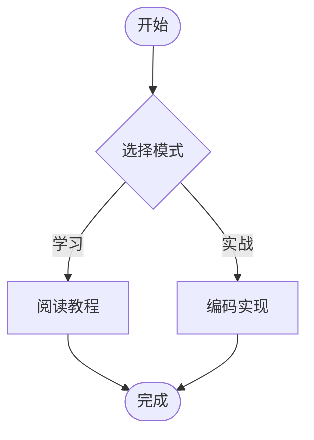

这是一篇用于站点能力验收的展示文章：🙂 🚀 📚

## 1. 公式演示

行内公式：$e^{i\pi}+1=0$。

块级公式：

$$
\nabla \cdot \vec{E} = \frac{\rho}{\varepsilon_0},\qquad
\nabla \times \vec{B} = \mu_0\vec{J} + \mu_0\varepsilon_0\frac{\partial \vec{E}}{\partial t}
$$

矩阵：

$$
A = \begin{bmatrix}
1 & 2 & 3 \\
0 & 1 & 4 \\
5 & 6 & 0
\end{bmatrix}
$$

## 2. Mermaid 流程图



## 3. 代码块（多语言）

```ts
interface User {
  id: string;
  name: string;
}

export function greet(user: User): string {
  return `Hello, ${user.name}`;
}
```

```rust
fn fib(n: usize) -> usize {
    match n {
        0 => 0,
        1 => 1,
        _ => fib(n - 1) + fib(n - 2),
    }
}
```

```bash
pnpm install
pnpm dev
pnpm build
```

```html
<style>
  .badge {
    padding: 4px 10px;
    border-radius: 999px;
    background: linear-gradient(90deg, #0ea5e9, #14b8a6);
    color: #fff;
    font-weight: 600;
  }
</style>

<button class="badge" id="demo-btn">点击我</button>
<script>
  const btn = document.getElementById("demo-btn");
  btn?.addEventListener("click", () => alert("Hello from inline script"));
</script>
```

## 4. GFM 表格与任务列表

| 能力 | 状态 | 说明 |
| --- | --- | --- |
| 公式渲染 | ✅ | 支持 KaTeX |
| Mermaid | ✅ | 支持复制源码 |
| 代码复制 | ✅ | 支持语言标签 |
| 任务列表 | ✅ | 支持 GFM |

- [x] 支持公式复制
- [x] 支持代码复制
- [x] 支持 Mermaid 复制
- [ ] 后续补充 ECharts 复杂示例

## 5. 表情与引用

> 这是一段引用文本，适合强调关键结论。 🎯

常用表情：😀 😎 🤖 🧠 ⚙️ 🧪 ✅ ❌ 📈
