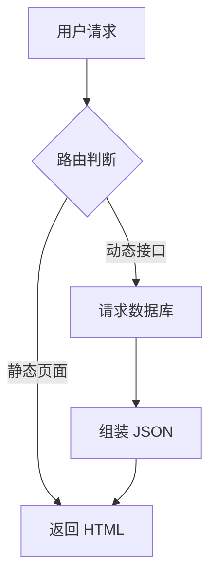

import CardGrid from '@/components/mdx/CardGrid.astro';
import LinkCard from '@/components/mdx/LinkCard.astro';

这是一篇测试 MDX 功能与进阶语法的文章，你可以在其中混合使用标准 Markdown 语法和我们刚刚封装的 React/Astro UI 组件。由于我们修改了前置配置（Frontmatter），现在不需要再手动填写 `pubDate`、`draft`、`encrypted` 等无聊的默认属性了！

## 1. 自由分组卡片测试 (AI Hub 示例)

你可以通过自定义组件 `<CardGrid>` 来控制网格显示的列数，在里面嵌套普通的列表即可实现卡片组效果。

<CardGrid columns={2}>

- [OpenAI (ChatGPT)](https://openai.com)
  全球领先的 AI 研发机构，ChatGPT 创造者。
  
- [Anthropic (Claude)](https://anthropic.com)
  以安全性为核心的下一代长文本 AI 模型。
  
- [Midjourney](https://midjourney.com)
  当前最强大的 AI 绘图与创意生成工具。
  
- [Google DeepMind](https://deepmind.google)
  Gemini 模型的诞生地，致力于解决最艰难的智能问题。

</CardGrid>

如果需要更个性化的带 Icon 的单独卡片，可以使用 `<LinkCard>`：

<LinkCard 
  title="VitePress 官方文档" 
  desc="Vue 驱动的极简静态网站生成器，本项目设计的灵感来源之一。"
  url="https://vitepress.dev"
  icon="⚡"
/>

---

## 2. 动图与视频测试

直接插入动图与常规图片完全一样，Astro 会自动优化并支持懒加载。

*(这里放置一张测试 GIF)*


## 3. 流程图渲染测试 (Mermaid)

我们的博客内置了 Mermaid 渲染器，只需编写代码块，前端便会生成矢量图：



## 4. 数学公式 (KaTeX)

无论是行内公式还是块级公式，都能完美呈现。著名的质能方程：$E = mc^2$。

复杂的积分公式：

$$
\int_{-\infty}^\infty e^{-x^2} dx = \sqrt{\pi}
$$

## 5. 代码块高亮

支持极其丰富的语言高亮：

```rust
fn main() {
    let mut numbers = vec![3, 1, 4, 1, 5, 9, 2, 6];
    numbers.sort();
    println!("Sorted: {:?}", numbers);
}
```
