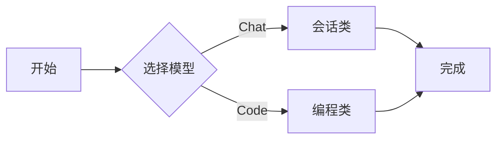

import CardGrid from "@/components/mdx/CardGrid.astro";
import LinkCard from "@/components/mdx/LinkCard.astro";
import MediaCard from "@/components/mdx/MediaCard.astro";

这篇文章用于演示：卡片组件、Mermaid、公式复制和代码复制。

## 卡片网格

<CardGrid columns={2}>

- [OpenAI](https://openai.com)
  通用模型能力与产品生态。
- [Anthropic](https://anthropic.com)
  长文本与安全性表现突出。
- [Google AI](https://ai.google)
  多模态模型与工具链。
- [Perplexity](https://www.perplexity.ai)
  联网研究与问答体验。

</CardGrid>

<LinkCard
  title="VitePress 文档"
  desc="静态文档站的优秀体验参考。"
  url="https://vitepress.dev"
  icon="📘"
/>

<MediaCard
  title="可自定义图片位置与尺寸"
  desc="支持 left/right/top/background 布局，支持自定义图片宽高与卡片宽高。"
  url="https://astro.build"
  image="https://images.unsplash.com/photo-1518770660439-4636190af475?auto=format&fit=crop&w=1200&q=80"
  imagePosition="right"
  imageWidth={240}
  imageHeight={140}
/>

## Mermaid



## 数学

$$
\int_0^1 x^2 dx = \frac{1}{3}
$$

## 代码

```ts
export const hello = (name: string) => `hello ${name}`;
```
