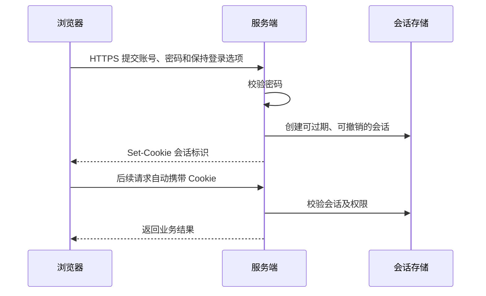

登录页的“记住密码”和“保持登录”是两件事：密码可以交给浏览器或密码管理器保存，登录状态由服务端会话管理。不要把可解密的密码写入 Cookie 或 localStorage；如果私钥也随前端代码发布，拿到代码的人就能解密。

## 让浏览器填写密码

使用标准的 `name` 和 `autocomplete`，让浏览器识别登录表单。是否保存、自动填充，仍由用户和浏览器设置决定。参见 [MDN 密码输入框](https://developer.mozilla.org/en-US/docs/Web/HTML/Reference/Elements/input/password)。

```html
<form id="login-form">
  <label for="username">账号</label>
  <input id="username" name="username" autocomplete="username" required>

  <label for="password">密码</label>
  <input id="password" name="password" type="password"
         autocomplete="current-password" required>

  <label><input name="rememberMe" type="checkbox">保持登录</label>
  <button type="submit">登录</button>
  <p id="login-status" role="status"></p>
</form>
```

## 提交表单

下面约定同源的 `/api/login` 接收 JSON，成功返回 2xx，并由服务端设置会话 Cookie。接口需要在后端实现；密码放在请求体中，经 HTTPS 传输，不拼进 URL。

```js
const form = document.querySelector('#login-form');
const status = document.querySelector('#login-status');
const button = form.querySelector('button');

form.addEventListener('submit', async (event) => {
  event.preventDefault();
  if (button.disabled || !form.reportValidity()) return;
  button.disabled = true;
  status.textContent = '';
  const fields = new FormData(form);
  try {
    const response = await fetch('/api/login', {
      method: 'POST',
      credentials: 'same-origin',
      headers: { 'Content-Type': 'application/json' },
      body: JSON.stringify({
        username: fields.get('username'),
        password: fields.get('password'),
        rememberMe: fields.get('rememberMe') === 'on'
      })
    });
    if (!response.ok) throw new Error('登录失败，请检查账号密码后重试');
    form.elements.namedItem('password').value = '';
    window.location.assign('/');
  } catch (error) {
    status.textContent = error.message || '请求失败，请稍后重试';
  } finally {
    button.disabled = false;
  }
});
```

## 服务端保存登录状态



Cookie 中只放会话标识。`HttpOnly` 由服务器通过 `Set-Cookie` 设置，前端 JavaScript 不能创建或读取这类 Cookie；`Secure` 限制其经安全连接发送，`SameSite` 则约束跨站携带行为。实际策略还需与跨域部署和 CSRF 防护配合。参见 [MDN Set-Cookie](https://developer.mozilla.org/en-US/docs/Web/HTTP/Reference/Headers/Set-Cookie)。

“保持登录”决定会话保存多久，不代表会话永久有效。退出登录、修改密码和撤销设备时，服务端都应使相应会话失效。
