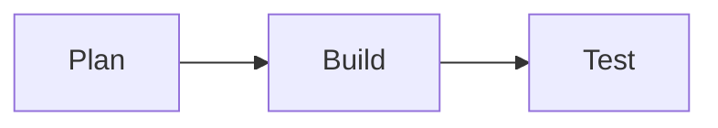
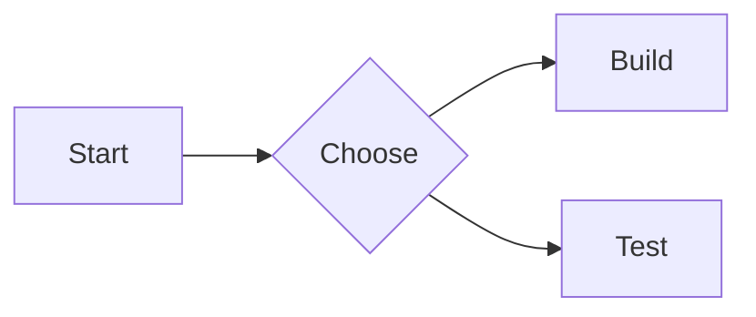

这篇文档是面向站点使用者的总手册。每个能力都按固定结构说明：

1. 配置开关（`src/site.config.ts`）
2. 语法写法（可直接复制）
3. 效果展示（本页实际渲染结果）

## 快速导航

- [1. 全局配置入口](#1-全局配置入口)
- [2. 评论系统效果展示](#2-评论系统效果展示)
- [3. 封面与列表卡片效果展示](#3-封面与列表卡片效果展示)
- [4. 字体与像素风效果展示](#4-字体与像素风效果展示)
- [5. 代码块能力效果展示](#5-代码块能力效果展示)
- [6. Markdown 扩展总开关](#6-markdown-扩展总开关)
- [7. Shortcode 与行内增强效果展示](#7-shortcode-与行内增强效果展示)
- [8. Tabs 与 Steps 效果展示](#8-tabs-与-steps-效果展示)
- [9. 图表与流程图效果展示](#9-图表与流程图效果展示)
- [10. 数学公式复制与行内图标效果展示](#10-数学公式复制与行内图标效果展示)
- [11. 最小排查清单](#11-最小排查清单)

## 1. 全局配置入口

所有可配置项都在：

- `src/site.config.ts`

建议使用流程：

1. 先在 `site.config.ts` 打开能力
2. 再在文章中写对应语法
3. 最后运行 `npm run build` 做一次完整校验

## 2. 评论系统效果展示

配置路径：`comment.*`

可选 provider：

- `giscus`
- `waline`
- `twikoo`
- `off`

配置示例：

```ts
comment: {
  provider: "waline",
  giscus: {
    repo: "owner/repo",
    repoId: "",
    category: "General",
    categoryId: ""
  },
  waline: {
    serverUrl: "https://your-waline-server"
  },
  twikoo: {
    envId: "your-env-id"
  }
}
```

效果展示：

- 将 `provider` 设置为 `giscus` / `waline` / `twikoo` 后，文章底部会自动渲染评论区。
- 将 `provider` 设置为 `off` 时，评论区不显示。
- 本页底部就是评论系统的实际展示位置。

## 3. 封面与列表卡片效果展示

### 3.1 全局卡片封面策略

配置路径：`blog.listCard.*`

```ts
blog: {
  listCard: {
    defaultCoverMode: "right", // right | left | top | none
    coverWidth: 224,
    coverHeight: 154,
    coverAspectRatio: "16 / 9"
  }
}
```

### 3.2 单篇文章封面写法

在文章 frontmatter 中配置：

```yaml
cover: "https://images.unsplash.com/..."
coverMode: "right" # left | right | top | none
```

效果展示：

- 文章列表页（`/blog`）中的卡片会按 `coverMode` 呈现封面位置。
- `none` 会隐藏卡片封面；`left` / `right` / `top` 会切换图片方位。
- 打开列表页即可看到本文卡片的实际封面布局。

## 4. 字体与像素风效果展示

配置路径：`theme.typography.*`

```ts
theme: {
  typography: {
    fontPresetDefault: "pixel", // regular | pixel
    fontPresets: {
      regular: { sans: "...", serif: "...", display: "...", tech: "...", mono: "..." },
      pixel: { sans: "...", serif: "...", display: "...", tech: "...", mono: "..." }
    }
  }
}
```

调试时可临时切换：

```js
document.documentElement.dataset.fontPreset = "regular";
// or
document.documentElement.dataset.fontPreset = "pixel";
```

效果展示：

- 切换为 `pixel` 后，页面文字会呈现像素字体风格；切回 `regular` 恢复常规字体。
- 可直接在本页执行上面的控制台命令观察字体变化。

## 5. 代码块能力效果展示（高亮、复制、行号、窗口条）

配置路径：

- `codeHighlight.*`
- `codeTheme.*`
- `markdown.copy.code`

```ts
codeHighlight: {
  provider: "expressive", // expressive | shiki | prism | rehype-pretty-code
  lineNumbers: true,
  window: {
    titleMode: "lang" // lang | filename | none
  }
},
markdown: {
  copy: {
    code: true
  }
}
```

语法写法：

~~~md
```ts
const message = "hello flycode";
console.log(message);
```
~~~

效果展示：

```ts
const message = "hello flycode";
console.log(message);
```

```bash
npm run dev
npm run build
```

```java
public class HelloWorld {
  public static void main(String[] args) {
    System.out.println("Hello FlyCodeCenter");
  }
}
```

## 6. Markdown 扩展总开关

配置路径：`markdown.extended.*`

```ts
markdown: {
  extended: {
    enable: true,
    parserMode: "build-time",
    tabs: { enable: true },
    steps: { enable: true },
    chartjs: {
      enable: true,
      defaultHeight: 320,
      bundleUrl: "https://cdn.jsdelivr.net/npm/chart.js@4.4.3/dist/chart.umd.min.js"
    },
    mark: { enable: true, variants: ["tip", "warning", "danger", "important"] },
    icon: {
      enable: true,
      provider: "iconify",
      bundleUrl: "https://code.iconify.design/iconify-icon/2.1.0/iconify-icon.min.js"
    }
  }
}
```

## 7. Shortcode 与行内增强效果展示

### 7.1 视频（video）

语法写法：

~~~md
[video url="https://interactive-examples.mdn.mozilla.net/media/cc0-videos/flower.mp4"][/video]
[video url="https://interactive-examples.mdn.mozilla.net/media/cc0-videos/flower.mp4" width="640" height="360"]演示视频[/video]
~~~

效果展示：

[video url="https://interactive-examples.mdn.mozilla.net/media/cc0-videos/flower.mp4"][/video]

[video url="https://interactive-examples.mdn.mozilla.net/media/cc0-videos/flower.mp4" width="640" height="360"]演示视频[/video]

### 7.2 Todo 复选框（checkbox）

语法写法：

~~~md
[checkbox]未完成任务[/checkbox]
[checkbox checked="true"]已完成任务[/checkbox]
~~~

效果展示：

[checkbox]默认复选框[/checkbox]

[checkbox checked="true"]已经完成的项目[/checkbox]

[checkbox checked="false"]还未完成的项目[/checkbox]

### 7.3 隐藏文本（hidden）

语法写法：

~~~md
[hidden]点击显示内容[/hidden]
[hidden type="background"]背景遮罩文本[/hidden]
[hidden type="blur" tip="点击查看"]模糊文本[/hidden]
~~~

效果展示：

[hidden]一段隐藏的文本[/hidden]

[hidden type="background"]黑条隐藏文本[/hidden]

[hidden type="blur"]模糊隐藏文本[/hidden]

[hidden tip="你知道的太多了"]鼠标停留会有提示[/hidden]

### 7.4 警告 / 提示块（admonition）

语法写法：

~~~md
[admonition]默认提示[/admonition]
[admonition title="警告" color="red"]请先在测试环境验证。[/admonition]
[admonition title="信息" icon="info" color="blue"]这是一个信息提示。[/admonition]
~~~

效果展示：

[admonition]默认警告[/admonition]

[admonition title="警告" color="red"]请先在测试环境验证。[/admonition]

[admonition title="信息" icon="info" color="blue"]这是一个信息提示。[/admonition]

[admonition title="带图标示例" icon="flag" color="indigo"]带标题和图标的提示块。[/admonition]

可用颜色：`indigo | green | red | blue | orange | black | grey`

### 7.5 行内高亮与图标（mark + icon）

语法写法：

~~~md
这是 ==重点=={.tip}
这是 ==警告=={.warning}
这是 ==危险=={.danger}
图标：:[mdi:rocket 18px/#0ea5e9]:
~~~

效果展示：

这是 ==重点=={.tip}
这是 ==警告=={.warning}
这是 ==危险=={.danger}
图标：:[mdi:rocket 18px/#0ea5e9]:

## 8. Tabs 与 Steps 效果展示

### 8.1 tabs

语法写法：

~~~md
::: tabs
@tab TypeScript
```ts
console.log("Hello TypeScript");
```

@tab Rust
```rust
fn main() {
  println!("Hello Rust");
}
```
:::
~~~

效果展示：

::: tabs
@tab TypeScript
```ts
console.log("Hello TypeScript");
```

@tab Rust
```rust
fn main() {
  println!("Hello Rust");
}
```
:::

### 8.2 steps

语法写法：

~~~md
:::: steps
- 安装依赖
- 启动开发
- 打包构建
::::
~~~

效果展示：

:::: steps
- 拉取代码
- 安装依赖
- 启动开发
- 打包发布
::::

### 8.3 demo（语法 + 效果同屏）

配置路径：

- `markdown.extended.demoBlock.enable`

语法写法：

~~~md
[demo title="Mermaid 演示" lang="mermaid" mode="split" result="auto"]

预览区自动渲染，源码区保留原始代码。
[/demo]
~~~

效果展示：

[demo title="Mermaid 演示" lang="mermaid" mode="split" result="auto"]

预览区自动渲染，源码区保留原始代码。
[/demo]

## 9. 图表与流程图效果展示

相关开关：

- `features.diagram.mermaid = true`
- `features.diagram.drawio = true`
- `features.diagram.echarts = true`
- `diagram.fallbackToCdn = true`
- `diagram.mermaid.source = "cdn" | "local"`
- `diagram.echarts.source = "cdn" | "local"`
- `markdown.extended.chartjs.enable = true`

### 9.1 Mermaid

语法写法：

~~~md

~~~

效果展示：


### 9.2 Draw.io

语法写法：

~~~md
```drawio
https://example.com/your-diagram.drawio
```
~~~

效果展示：

```drawio
https://example.com/your-diagram.drawio
```

说明：将 URL 替换为你自己的可访问 `.drawio` 文件地址后，即可显示真实图形。

### 9.3 ECharts

语法写法：

~~~md
```chart
{
  "xAxis": { "type": "category", "data": ["A", "B", "C"] },
  "yAxis": { "type": "value" },
  "series": [{ "type": "line", "data": [3, 9, 5] }]
}
```
~~~

效果展示：

```chart
{
  "xAxis": { "type": "category", "data": ["A", "B", "C"] },
  "yAxis": { "type": "value" },
  "series": [{ "type": "line", "data": [3, 9, 5] }]
}
```

### 9.4 Chart.js 容器

语法写法：

~~~md
::: chartjs 请求趋势
```json
{
  "type": "bar",
  "data": {
    "labels": ["Mon", "Tue", "Wed"],
    "datasets": [{ "label": "Requests", "data": [120, 98, 140] }]
  }
}
```
图表说明文本
:::
~~~

效果展示：

::: chartjs 请求趋势
```json
{
  "type": "bar",
  "data": {
    "labels": ["Mon", "Tue", "Wed"],
    "datasets": [{ "label": "Requests", "data": [120, 98, 140] }]
  }
}
```
图表说明：近三日请求量。
:::

## 10. 数学公式复制与行内图标效果展示

配置路径：

- `markdown.copy.math`
- `markdown.extended.icon.enable`

语法写法：

~~~md
行内公式：$E = mc^2$

$$
\int_0^1 x^2 dx = \frac{1}{3}
$$

图标：:[mdi:math-integral 18px/#0284c7]:
~~~

效果展示：

行内公式：$E = mc^2$

$$
\int_0^1 x^2 dx = \frac{1}{3}
$$

图标：:[mdi:math-integral 18px/#0284c7]:

## 11. 最小排查清单

1. 功能不生效时，先确认 `site.config.ts` 对应开关是否开启。
2. 语法不渲染时，先确认 `markdown.extended.enable` 与 `parserMode`。
3. 图表不渲染时，检查浏览器网络是否加载了对应 bundle。
4. Draw.io 只显示空白时，检查 `.drawio` 文件 URL 是否可访问。
5. 代码块样式异常时，确认 `codeHighlight.provider` 与 `codeTheme` 配置。
6. 评论不显示时，检查 provider 配置与环境变量是否完整。
