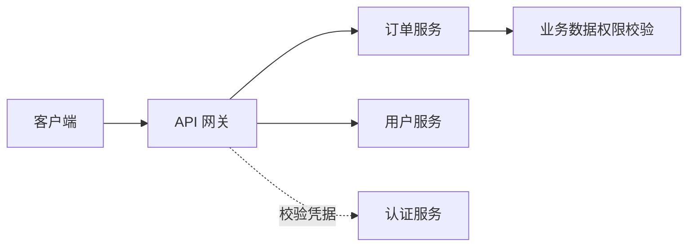

API 网关接收外部请求，再将其路由到后端服务。多个服务需要统一认证、限流和访问日志时，可以把这些入口规则集中在网关；规模较小的应用不一定需要单独引入。

## 核心功能一览

| 功能类别 | 作用说明 |
|----------|----------|
| 路由转发 | 将外部请求按照配置路由至对应的服务或接口 |
| 负载均衡 | 在多个实例间分发请求，支持随机、轮询、加权等算法 |
| 用户鉴权 | 统一认证与授权逻辑，保障接口访问安全 |
| 跨域处理 | 全局配置 CORS，无需各服务单独实现 |
| 通用逻辑封装 | 统一处理请求频次、日志、公共参数等通用业务 |
| 黑白名单 | 基于 IP、用户 ID 控制访问权限，有效抵御恶意请求 |
| 灰度发布 | 基于权重实现流量分发，实现接口/版本逐步上线 |
| 流量染色 | 添加自定义 Header，用于 A/B 测试、调试、追踪等 |
| 接口保护 | 实现限流、熔断、降级、超时控制、敏感信息脱敏 |
| 日志聚合 | 收集统一请求日志，便于监控、告警、审计 |
| 文档聚合 | 聚合各服务的 API 文档，统一展示与维护 |

## 功能详解

### 1. 路由转发（Routing）
API 网关根据配置规则将请求转发至目标服务或接口，是网关的基础职责之一。支持静态 URI 路由、Path 匹配、正则匹配、Header/Query 参数路由等方式。

### 2. 负载均衡（Load Balancing）
在存在多个后端实例的情况下，网关可以根据策略将请求分发至不同实例。常见策略包括：
- 轮询（Round-Robin）
- 随机（Random）
- 权重（Weight-Based）
- 最少连接数（Least Connection）

### 3. 用户鉴权（Authentication & Authorization）
支持多种鉴权方式，如：
- Token/JWT 校验
- OAuth2.0 / OpenID Connect
- 与身份中心集成（如 Keycloak、Auth0）

网关鉴权需要配合后端服务的访问限制，否则调用者仍可能绕过网关直连服务。资源归属和数据权限通常仍需业务服务校验。

### 4. 统一跨域处理（CORS）
通过全局配置跨域策略（如 `Access-Control-Allow-Origin`），避免每个服务独立配置，提高前后端协作效率。

### 5. 统一业务逻辑封装
如：接口调用计数、公共参数校验、通用异常处理等，在网关层统一封装，提升代码复用性，降低服务重复实现成本。

### 6. 黑白名单访问控制
- 白名单：允许特定 IP、应用、用户访问。
- 黑名单：阻止恶意请求、封禁高频访问者。

适用于安全防护和风控系统。

### 7. 灰度发布（发布控制）
通过流量权重控制策略（Weighted Routing）将部分请求引导到新版本接口，实现：
- 低风险上线
- 接口 A/B 对比
- 实时回滚切换

### 8. 流量染色（Traffic Tagging）
通过添加请求标识（如请求头 Header），对流量进行“染色”，实现不同类型用户或来源流量的分组管理，常用于：
- 灰度测试
- 预发环境隔离
- 流量回溯与追踪

### 9. 接口保护机制

| 功能 | 说明 |
|------|------|
| 请求限制 | 控制并发数、QPS，防止服务过载 |
| 限流（Rate Limiting） | 配置每秒最大请求数（如令牌桶、漏桶算法） |
| 熔断（Circuit Breaker） | 后端服务不可用时自动熔断，快速失败 |
| 降级处理 | 后端异常时返回默认值或兜底响应，保障体验 |
| 超时控制 | 限制等待时间；客户端结束等待不代表后端操作已经取消 |
| 信息脱敏 | 脱敏返回值中的敏感字段（如手机号、身份证号） |

### 10. 日志统一采集
对请求全生命周期（请求时间、源 IP、响应码、耗时、错误信息等）进行记录，便于后续：
- 链路追踪
- 性能监控
- 安全审计

### 11. API 文档聚合
自动聚合各下游服务的 Swagger/OpenAPI 文档，统一在一个界面展示，提高团队协作与接口管理效率。

## 网关类型分类

| 类型 | 说明 |
|------|------|
| 业务网关（微服务网关） | 为业务 API 提供路由与入口策略（如 Spring Cloud Gateway）；不等同于所有服务间流量治理 |
| 全局网关（边缘网关） | 位于系统入口层，连接外部用户与内网服务，承担更复杂的协议转换、安全过滤、设备接入（如 Nginx、Kong） |

## 主流网关实现方案

| 名称 | 简介 |
|------|------|
| **Nginx** | 高性能反向代理，广泛用于静态资源分发、请求转发 |
| **Kong** | 企业级 API 网关，支持插件扩展，兼容 REST 和 gRPC |
| **Spring Cloud Gateway** | Spring 生态中的响应式网关，集成方便，支持路由、过滤器、限流、断路器等 |
| **Zuul（已过时）** | Netflix 推出的网关，现已被 Spring 官方推荐替代为 Gateway |

## 部署时需要确认

不同实现支持的过滤器、负载均衡策略和文档聚合能力并不相同。部署前核对所选版本的功能，并明确哪些请求必须经过网关、哪些服务只允许内网访问。

> 📖 参考阅读实现KONG网关：[KONG 实践指南（CSDN）](https://blog.csdn.net/qq_21040559/article/details/122961395)
