# 常见网络协议完全指南：从面试答题到深入理解

*内容基于 IETF RFC 官方规范文档整理，所有协议行为以原始标准为准，文末附完整参考来源。*

---

## 目录

- [Part 1：面试标准答案速查](#part-1面试标准答案速查)
- [Part 2：应用层协议深度解析](#part-2应用层协议深度解析)
- [Part 3：传输层协议深度解析](#part-3传输层协议深度解析)
- [Part 4：网络层协议深度解析](#part-4网络层协议深度解析)
- [Part 5：协议关联与综合理解](#part-5协议关联与综合理解)
- [参考资料](#参考资料)

---

## Part 1：面试标准答案速查

> 适合直接用于面试作答，每条控制在 2～4 句话内。

### 应用层常见协议

**HTTP**：基于 TCP 协议，用于 Web 浏览器与服务器之间传输超文本和多媒体内容。无状态协议，每次请求相互独立，状态保持靠 Cookie/Session 实现。

**SMTP**：基于 TCP 协议，只负责电子邮件的**发送**，不负责接收。接收邮件需要使用 POP3 或 IMAP 协议。

**POP3 / IMAP**：均基于 TCP，负责邮件接收。POP3 将邮件下载到本地，默认删除服务端副本，不支持多端同步；IMAP 在服务器端维护邮件状态，支持多设备同步、搜索、标记等高级功能，是现代邮件客户端的主流选择。

**FTP**：基于 TCP，用于计算机之间的文件传输，可屏蔽操作系统和文件存储方式的差异。传输过程**不加密**，存在安全风险，敏感数据传输应使用 SFTP。

**SSH**：基于 TCP，通过加密和认证机制实现安全的远程登录、文件传输等功能，是明文协议 Telnet 的安全替代方案。

**DNS**：通常基于 UDP（端口 53），负责将域名解析为 IP 地址。响应数据过大或进行区域传送（Zone Transfer）时改用 TCP。

**RTP**：通常基于 UDP，提供端到端的实时音视频数据传输，不保证传输质量，该功能由 WebRTC 补充实现。

### 传输层常见协议

**TCP**：面向连接，提供可靠、有序、无重复的数据传输服务，通过三次握手建立连接，含确认重传、流量控制、拥塞控制机制。

**UDP**：无连接，提供尽最大努力的数据传输服务，不保证可靠性，首部开销小，延迟低，适合实时性要求高的场景。

### 网络层常见协议

**IP**：定义数据包格式，负责逻辑寻址和跨网络路由转发。分为 IPv4（32 位地址）和 IPv6（128 位地址）两个版本。

**ARP**：解决网络层地址（IP）与链路层地址（MAC）之间的映射问题，在局域网内广播查询目标 IP 对应的 MAC 地址。

**ICMP**：传输网络状态和错误消息，`ping` 命令和 `traceroute` 命令均基于此协议实现。

**NAT**：在局域网私有 IP 地址与广域网公网 IP 地址之间进行转换，允许多台内网主机共用一个公网 IP 访问互联网。

**OSPF**：内部网关协议，基于链路状态算法（Dijkstra），综合考虑链路带宽和延迟等因素选择最佳路径，适用于中大型网络。

**RIP**：内部网关协议，基于距离向量算法，以跳数为度量标准，最大支持 15 跳，适用于小型网络，现已逐渐被淘汰。

**BGP**：外部网关协议，负责在不同自治系统之间交换路由信息，是互联网骨干网的核心路由协议，具有高度灵活性和可扩展性。

---

## Part 2：应用层协议深度解析

### 2.1 HTTP — 超文本传输协议

HTTP（HyperText Transfer Protocol）由 Tim Berners-Lee 于 1989 年在 CERN 提出，规范由 IETF 和 W3C 共同维护。

#### HTTP 的无状态特性

HTTP 是一个**无状态（Stateless）**协议，这意味着服务器不会在两次请求之间保留任何客户端状态。每次 HTTP 请求对服务器来说都是全新的，它不记得你上次请求了什么。

这个设计让服务器实现变得简单，但也带来了问题：用户登录之后刷新页面，怎么保持登录状态？解决方案是在应用层自行维护状态：

```
客户端           服务端
  │ POST /login  │
  │─────────────▶│ 验证账号密码
  │ Set-Cookie:  │
  │◀─────────────│ session_id=abc123
  │              │
  │ GET /profile │
  │ Cookie: session_id=abc123
  │─────────────▶│ 查找 session 表，识别用户
  │ 200 OK       │
  │◀─────────────│
```

#### HTTP 各版本演进

| 版本 | 发布时间 | 核心改进 | 传输层 |
|------|---------|---------|--------|
| HTTP/0.9 | 1991 | 仅支持 GET，只能传 HTML | TCP |
| HTTP/1.0 | 1996（RFC 1945） | 支持请求头、多种内容类型 | TCP（短连接） |
| HTTP/1.1 | 1997（RFC 2616） | 持久连接、管道化、分块传输 | TCP（长连接） |
| HTTP/2 | 2015（RFC 7540） | 多路复用、头部压缩、服务端推送 | TCP |
| HTTP/3 | 2022（RFC 9114） | 基于 QUIC，解决队头阻塞 | UDP（QUIC） |

**HTTP/1.1 长连接**（`Connection: keep-alive`）：默认复用同一个 TCP 连接，避免每次请求都重新三次握手，显著降低延迟。

**HTTP/2 多路复用**：HTTP/1.1 虽然支持管道化，但服务端响应必须按请求顺序返回，一个慢请求会阻塞后面所有请求（队头阻塞）。HTTP/2 将请求/响应拆分为帧（Frame），通过流（Stream）并发传输，彻底解决了应用层的队头阻塞。

**HTTP/3 与 QUIC**：HTTP/2 在 TCP 层仍存在队头阻塞（TCP 的可靠传输机制导致）。HTTP/3 改用 QUIC 协议（基于 UDP 自建可靠传输），在 UDP 层实现独立流，彻底消除队头阻塞。

#### 一次完整的 HTTP 请求报文

```
GET /index.html HTTP/1.1         ← 请求行：方法 URI 版本
Host: www.example.com            ← 必填头部：目标主机
User-Agent: Mozilla/5.0 ...      ← 客户端标识
Accept: text/html,application/json
Accept-Encoding: gzip, deflate
Connection: keep-alive           ← 请求长连接
Cookie: session_id=abc123        ← 携带会话信息
                                 ← 空行（标志请求头结束）
```

```
HTTP/1.1 200 OK                  ← 响应行：版本 状态码 描述
Content-Type: text/html; charset=utf-8
Content-Length: 1024
Cache-Control: max-age=3600      ← 缓存控制
Set-Cookie: session_id=abc123; Path=/; HttpOnly
                                 ← 空行
<html>...</html>                 ← 响应体
```

#### 常用 HTTP 状态码

| 分类 | 范围 | 常见状态码 |
|------|------|----------|
| 1xx 信息 | 100～199 | 100 Continue |
| 2xx 成功 | 200～299 | 200 OK、201 Created、204 No Content |
| 3xx 重定向 | 300～399 | 301 永久重定向、302 临时重定向、304 Not Modified |
| 4xx 客户端错误 | 400～499 | 400 Bad Request、401 Unauthorized、403 Forbidden、404 Not Found |
| 5xx 服务端错误 | 500～599 | 500 Internal Server Error、502 Bad Gateway、503 Service Unavailable |

---

### 2.2 HTTPS — HTTP 的安全版本

HTTPS 不是一个独立协议，而是 **HTTP + TLS/SSL**。TLS（Transport Layer Security）在 TCP 和 HTTP 之间建立一个加密层，解决三个问题：

- **机密性**：数据加密传输，防止窃听
- **完整性**：数字签名，防止篡改
- **身份验证**：证书机制，防止中间人攻击

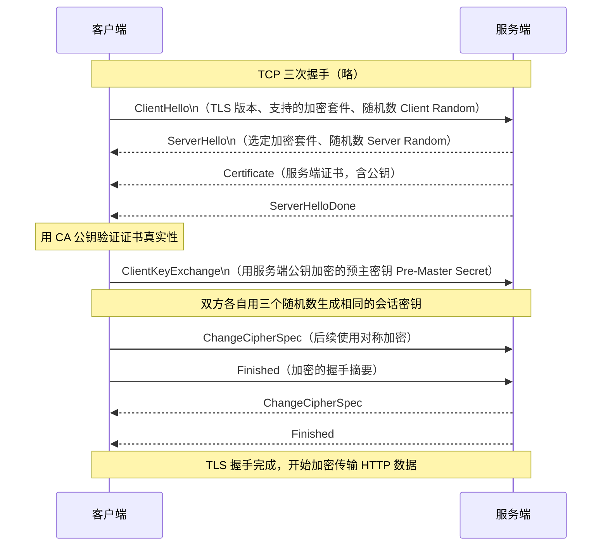

---

### 2.3 电子邮件协议三件套：SMTP、POP3、IMAP

电子邮件系统中，三个协议各司其职：

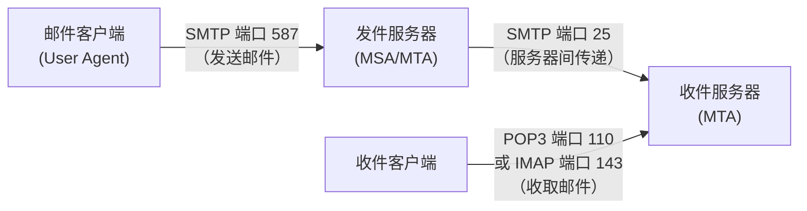

**SMTP（Simple Mail Transfer Protocol）**，RFC 5321：

- 负责邮件从客户端到服务器、以及服务器之间的传递
- 客户端提交邮件用端口 587（需认证），服务器间传递用端口 25
- 纯文本协议，加密版为 SMTPS（端口 465）或 STARTTLS

**POP3 vs IMAP 核心差异**：

| 维度 | POP3（RFC 1939） | IMAP（RFC 9051） |
|------|-----------------|-----------------|
| 邮件存储位置 | 下载到本地，服务端可选删除 | 保留在服务端 |
| 多端同步 | 不支持 | 支持（读、删、移动等状态同步） |
| 离线访问 | 支持（已下载的邮件） | 需要额外配置 |
| 带宽消耗 | 每次全量下载 | 只下载需要查看的部分 |
| 适用场景 | 单设备使用，带宽受限 | 多设备、现代邮件客户端 |

---

### 2.4 FTP 与 SFTP — 文件传输协议

FTP（File Transfer Protocol，RFC 959）是一个有趣的协议，它使用**两条 TCP 连接**：

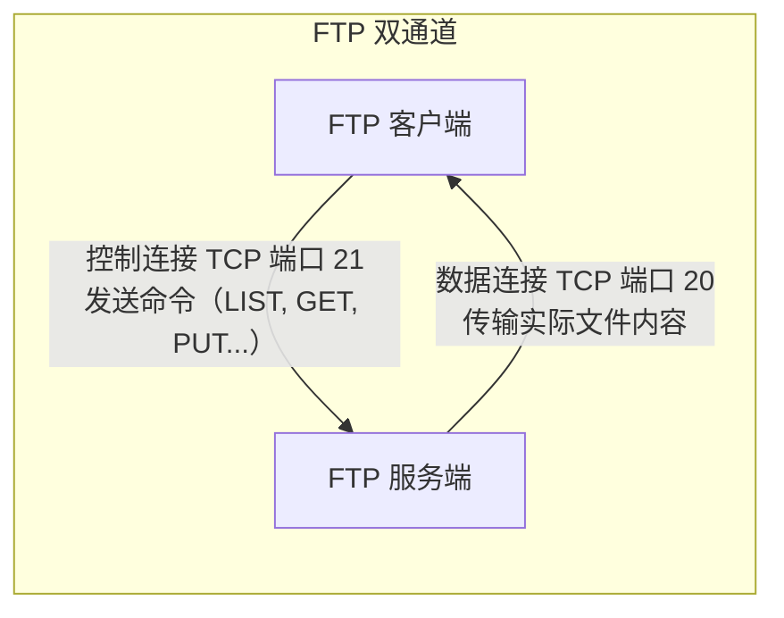

- **控制连接（端口 21）**：整个会话期间保持，用于发送 FTP 命令（`LIST`、`RETR`、`STOR` 等）
- **数据连接（端口 20）**：每次传输文件临时建立，传完即断

FTP 的致命缺陷是**传输过程完全明文**，包括用户名、密码和文件内容，极易被嗅探。生产环境中应使用：
- **SFTP（SSH File Transfer Protocol）**：在 SSH 加密隧道中传输，与 FTP 命令不兼容，是独立协议
- **FTPS（FTP over TLS/SSL）**：FTP + TLS 加密，与 FTP 兼容

---

### 2.5 Telnet 与 SSH — 远程登录的演进

**Telnet（RFC 854）** 是最早的远程登录协议，所有数据（含密码）均以**明文**传输。在任何存在网络嗅探可能的环境下使用 Telnet，等同于把密码写在明信片上寄出去。

**SSH（Secure Shell，RFC 4253）** 通过以下机制解决安全问题：

- **加密传输**：所有数据经过对称加密，防止嗅探
- **完整性校验**：MAC 码防止数据被篡改
- **身份验证**：支持密码验证和更安全的公私钥验证

SSH 除了远程登录，还支持：
- `scp`：基于 SSH 的文件复制
- `sftp`：基于 SSH 的文件传输
- **SSH 隧道（端口转发）**：将其他协议封装在 SSH 连接中传输，实现加密穿透

---

### 2.6 DNS — 互联网的电话簿

DNS（Domain Name System）规范定义于 RFC 1034 和 RFC 1035（Mockapetris，1987），是互联网最基础的服务之一。

#### DNS 的树形层次结构

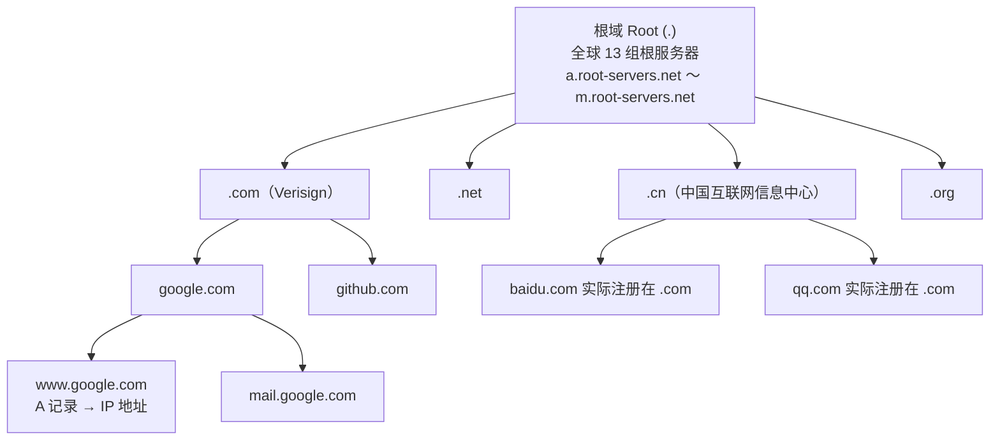

#### DNS 的两种查询模式

**递归查询（Recursive Query）**：客户端把查询任务完全交给 DNS 解析器，解析器负责找到最终答案再返回。这是客户端与本地 DNS 服务器之间的通信方式。

**迭代查询（Iterative Query）**：每个被询问的服务器要么返回最终结果，要么返回"你去问那个服务器"的指引，查询发起方自己一步步向前。这是 DNS 解析器与根服务器、TLD 服务器、权威服务器之间的通信方式。

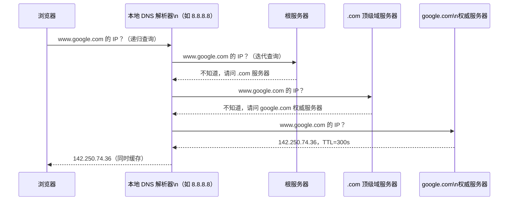

#### 为什么 DNS 默认用 UDP 而非 TCP？

根据 RFC 1035 的规定，DNS 消息默认通过 UDP 端口 53 传输。原因是：

- DNS 查询和响应报文通常很小（一般不超过 512 字节），无需 TCP 的可靠传输开销
- UDP 不需要三次握手，查询延迟更低
- DNS 客户端在超时后直接重发请求，应用层自行实现了简单的重试机制

以下情况才切换为 TCP 端口 53：
- 响应数据超过 512 字节（DNS EDNS0 扩展可提高此上限）
- 区域传送（Zone Transfer）：主 DNS 服务器向从服务器同步全量数据，数据量大，需要 TCP 的可靠传输

---

### 2.7 RTP — 实时传输协议

RTP（Real-time Transport Protocol，RFC 3550）是音视频实时传输的基础协议，视频会议、网络电话（VoIP）、直播等场景都依赖它。

RTP 本身不保证实时性，这句话初看很矛盾，但逻辑是清楚的：

- RTP 提供**时间戳（Timestamp）**和**序列号（Sequence Number）**，让接收端能够重排帧顺序并计算播放时间
- RTP 工作在 UDP 之上，利用 UDP 的低延迟特性
- 真正的质量保障（丢包重传、带宽估计、拥塞控制）由 **RTCP（RTP Control Protocol）** 配合，或由 **WebRTC** 框架实现

为什么实时音视频用 UDP 而非 TCP？TCP 的重传机制会导致等待，在实时通话中"等一个旧数据包"比"直接跳过这一帧"体验更差。网络电话宁可声音偶尔有杂音，也不能为了等旧包而卡顿 500 毫秒。

---

## Part 3：传输层协议深度解析

### 3.1 TCP 核心机制

TCP（Transmission Control Protocol，RFC 793）提供可靠传输，背后有四个核心机制：

#### 确认与重传

TCP 每发送一段数据，都会等待接收方的 ACK（确认）。如果在超时时间内没有收到 ACK，就重新发送。超时时间是动态计算的（RTT 估算），由 RFC 6298 规定。

```
发送方             接收方
  │  Seq=1, Len=100  │
  │─────────────────▶│
  │      ACK=101      │  期望下一个字节从 101 开始
  │◀─────────────────│
  │  Seq=101, Len=100 │
  │─────────────────▶│
  │         ×         │  数据丢失
  │  (超时重传)       │
  │  Seq=101, Len=100 │
  │─────────────────▶│
  │      ACK=201      │
  │◀─────────────────│
```

#### 流量控制（滑动窗口）

接收方在 TCP 首部的**窗口字段（Window Size）**中告知发送方"我的缓冲区还剩多少空间"，发送方据此控制发送速度，防止接收方缓冲区溢出。

```
发送窗口 = min(接收方通告窗口, 拥塞窗口)
```

#### 拥塞控制

拥塞控制不是保护接收方，而是**保护网络**，防止大量数据涌入网络导致路由器缓冲区溢出。TCP 拥塞控制由 RFC 5681 规范，包含四个阶段：

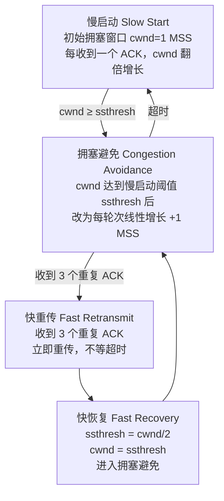

#### TCP 与 UDP 选择决策

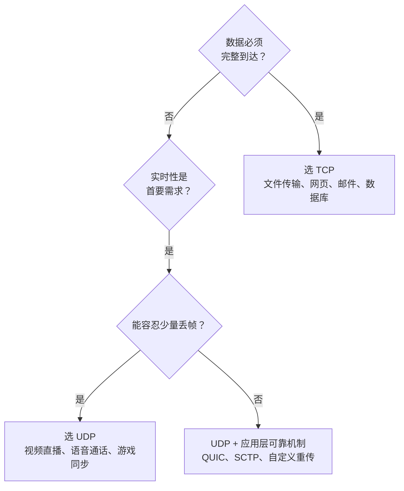

---

## Part 4：网络层协议深度解析

### 4.1 IP 协议：互联网的基石

IP（Internet Protocol）是 TCP/IP 协议栈中最核心的协议。它只做一件事：**尽力将分组从源主机转发到目的主机**，不保证可靠、不保证顺序、不保证延迟。

#### IPv4 与 IPv6

| 维度 | IPv4（RFC 791，1981） | IPv6（RFC 8200，2017） |
|------|----------------------|----------------------|
| 地址长度 | 32 位，约 43 亿个地址 | 128 位，约 3.4×10³⁸ 个地址 |
| 地址表示 | 点分十进制：`192.168.1.1` | 冒号十六进制：`2001:db8::1` |
| 首部长度 | 20～60 字节 | 固定 40 字节 |
| 地址耗尽 | 2011 年 IANA 已分配完毕 | 近乎无限 |
| NAT 需求 | 依赖 NAT 延缓耗尽 | 不再需要 NAT |
| 安全 | IPSec 可选 | IPSec 内置 |

#### IP 分组首部关键字段

```
 0               1               2               3
 0 1 2 3 4 5 6 7 0 1 2 3 4 5 6 7 0 1 2 3 4 5 6 7 0 1 2 3 4 5 6 7
+-+-+-+-+-+-+-+-+-+-+-+-+-+-+-+-+-+-+-+-+-+-+-+-+-+-+-+-+-+-+-+-+
|Version|  IHL  |     DSCP    |ECN|         Total Length        |
|版本(4) |首部长度|      区分服务      |          总长度             |
+-+-+-+-+-+-+-+-+-+-+-+-+-+-+-+-+-+-+-+-+-+-+-+-+-+-+-+-+-+-+-+-+
|         Identification        |Flags|      Fragment Offset    |
|           标识                |标志 |         片偏移量          |
+-+-+-+-+-+-+-+-+-+-+-+-+-+-+-+-+-+-+-+-+-+-+-+-+-+-+-+-+-+-+-+-+
|  Time to Live |    Protocol   |         Header Checksum       |
|  TTL（生存时间）|  上层协议(6=TCP)|           首部校验和          |
+-+-+-+-+-+-+-+-+-+-+-+-+-+-+-+-+-+-+-+-+-+-+-+-+-+-+-+-+-+-+-+-+
|                       Source Address（源 IP 地址）               |
+-+-+-+-+-+-+-+-+-+-+-+-+-+-+-+-+-+-+-+-+-+-+-+-+-+-+-+-+-+-+-+-+
|                    Destination Address（目的 IP 地址）            |
+-+-+-+-+-+-+-+-+-+-+-+-+-+-+-+-+-+-+-+-+-+-+-+-+-+-+-+-+-+-+-+-+
```

**TTL（Time to Live）字段**：每经过一个路由器 TTL 减 1，为 0 时路由器丢弃该分组并向源主机发送 ICMP 超时消息。`traceroute` 命令正是利用这一机制，通过发送 TTL 从 1 开始递增的分组，逐步收集路径上每个路由器的地址。

---

### 4.2 ARP — 地址解析协议

ARP（Address Resolution Protocol，RFC 826）解决一个具体问题：你知道目标主机的 IP 地址，但要在以太网上发送数据帧，你需要知道它的 **MAC 地址**。

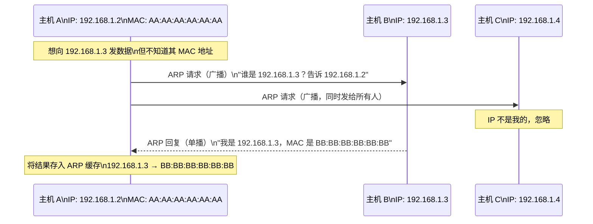

**ARP 缓存**：每次 ARP 查询结果会缓存一段时间（Linux 默认 20 分钟），避免重复广播。可以用 `arp -a` 命令查看本机当前的 ARP 缓存表。

**ARP 欺骗（ARP Spoofing）**：ARP 协议没有认证机制，攻击者可以发送伪造的 ARP 回复，将自己的 MAC 地址与目标 IP 绑定，从而劫持局域网内的流量——这是中间人攻击（MITM）在局域网内的常见实现方式。

---

### 4.3 ICMP — 网络诊断的工具箱

ICMP（Internet Control Message Protocol，RFC 792）是 IP 的"错误报告机制"，封装在 IP 数据报中传输。

常见的 ICMP 报文类型：

| 类型 | 代码 | 含义 | 对应工具 |
|------|------|------|---------|
| 0 | 0 | Echo Reply（回声回复） | `ping` 响应 |
| 3 | 0 | Destination Unreachable（目标不可达）| 路由无法到达时 |
| 8 | 0 | Echo Request（回声请求） | `ping` 请求 |
| 11 | 0 | Time Exceeded（TTL 超时） | `traceroute` 利用此机制 |

#### ping 的工作原理

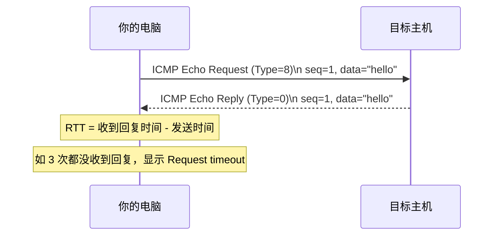

#### traceroute 的工作原理

`traceroute` 利用 TTL 字段，从 TTL=1 开始依次递增，每次触发一个路由器返回 ICMP Time Exceeded 消息，从而获取每一跳路由器的地址：

```
traceroute www.google.com
 1  192.168.1.1 (家庭路由器)       1.234 ms
 2  10.X.X.X  (运营商接入节点)     8.456 ms
 3  202.X.X.X (运营商骨干节点)    12.789 ms
 ...
 9  142.250.74.36 (Google 服务器) 45.123 ms
```

---

### 4.4 NAT — 解决 IPv4 地址耗尽的过渡方案

NAT（Network Address Translation，RFC 3022）允许一个路由器用**一个公网 IP 地址**代表内网中的多台主机与外部通信。

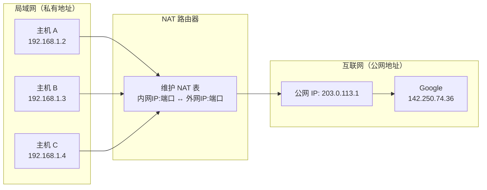

**NAT 转换表示例**：

| 内网 IP:端口 | 外网 IP:端口 | 目的 IP:端口 |
|------------|------------|------------|
| 192.168.1.2:54321 | 203.0.113.1:40001 | 142.250.74.36:443 |
| 192.168.1.3:54322 | 203.0.113.1:40002 | 142.250.74.36:443 |

NAT 的副作用：破坏了 IP 层的端到端通信原则，导致 P2P 应用（如视频通话、BitTorrent）需要额外的 NAT 穿透技术（STUN/TURN/ICE）。这也是 IPv6 消除 NAT 依赖的重要动机之一。

---

### 4.5 路由协议：OSPF、RIP 与 BGP

互联网由数万个**自治系统（Autonomous System，AS）**组成，每个 AS 是由同一机构管理的一组路由器和网络。

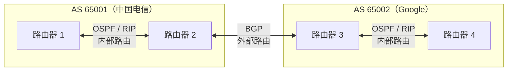

#### OSPF（RFC 2328）

OSPF 是一种**链路状态路由协议**。每台路由器了解整个 AS 内所有链路的状态，然后用 **Dijkstra 最短路径算法**自行计算到每个目标的最优路径。

特点：
- 收敛速度快（拓扑变化时快速重新计算）
- 考虑链路带宽、延迟等因素，路径选择更智能
- 支持分层设计（骨干区域 + 普通区域），适合大型网络

#### RIP（RFC 2453）

RIP 是一种**距离向量路由协议**。每台路由器只知道邻居的信息，靠邻居之间互相传递"到某个目标的跳数"逐步建立全局视图。

特点：
- 配置简单，适合小型网络
- 以**跳数**为唯一度量（不考虑带宽），可能选出质量差的路径
- 最大跳数 15，超过 15 跳认为不可达（限制了网络规模）
- 收敛慢，拓扑变化后需要较长时间才能稳定
- 已逐渐被 OSPF 取代

#### BGP（RFC 4271）

BGP 是互联网的**核心路由协议**，负责在不同 AS 之间交换路由信息。

与 OSPF/RIP 不同，BGP 是**路径向量协议**，它传递的是完整的 AS 路径信息（如"经过 AS65001 → AS65002 → AS15169 可以到达 Google 的网段"），而非简单的跳数或链路状态。

BGP 是全球互联网维持互联互通的基础。每当主要 ISP 的 BGP 配置出错，都可能造成大规模的路由黑洞事故（如 2010 年中国电信劫持全球 15% 路由的事件，以及 2021 年 Facebook 宕机事件）。

---

## Part 5：协议关联与综合理解

### 5.1 协议全景图

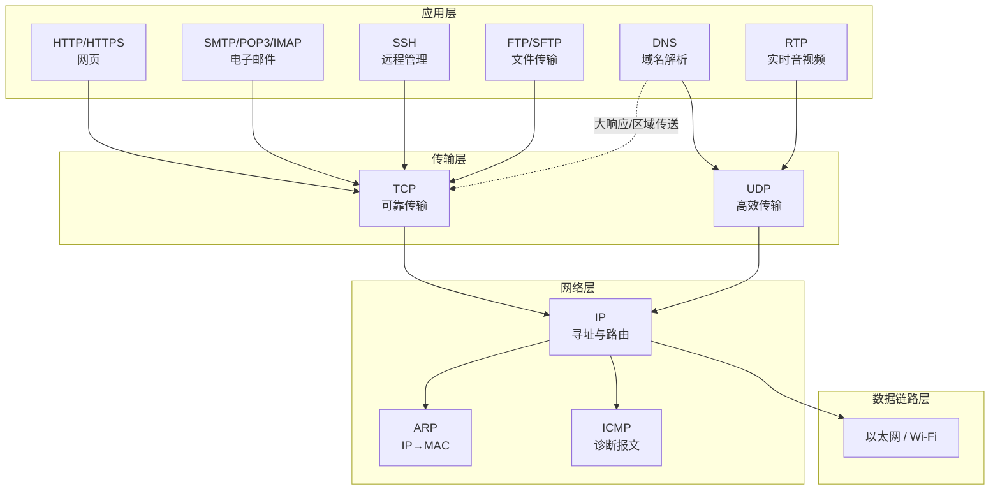

### 5.2 一次 HTTPS 请求涉及的所有协议

当你在浏览器访问 `https://www.google.com` 时，以下协议**全部参与**：

```
1. DNS（UDP 53）    → 将 www.google.com 解析为 IP 地址
2. ARP              → 将网关 IP 解析为 MAC 地址（局域网内）
3. TCP（SYN/SYN-ACK/ACK）  → 与 Google 服务器建立 TCP 连接
4. TLS              → 在 TCP 之上建立加密通道（HTTPS）
5. HTTP（GET /）    → 发送实际的页面请求
6. ICMP             → 可能在路径中诊断连通性
7. IP               → 在整个传输过程中负责路由和寻址
8. 路由协议（OSPF/BGP）  → 确定数据包在互联网上走的路径
```

---

## 参考资料

**RFC 标准文档**

1. J. Postel. *Internet Control Message Protocol*. **RFC 792**, IETF, September 1981. https://datatracker.ietf.org/doc/html/rfc792
2. D. Plummer. *An Ethernet Address Resolution Protocol*. **RFC 826**, IETF, November 1982. https://datatracker.ietf.org/doc/html/rfc826
3. J. Postel. *Transmission Control Protocol*. **RFC 793**, IETF, September 1981. https://datatracker.ietf.org/doc/html/rfc793
4. J. Postel. *User Datagram Protocol*. **RFC 768**, IETF, August 1980. https://datatracker.ietf.org/doc/html/rfc768
5. J. Postel. *Internet Protocol*. **RFC 791**, IETF, September 1981. https://datatracker.ietf.org/doc/html/rfc791
6. P. Mockapetris. *Domain Names — Concepts and Facilities*. **RFC 1034**, IETF, November 1987. https://datatracker.ietf.org/doc/html/rfc1034
7. P. Mockapetris. *Domain Names — Implementation and Specification*. **RFC 1035**, IETF, November 1987. https://datatracker.ietf.org/doc/html/rfc1035
8. J. Myers, M. Rose. *Post Office Protocol Version 3*. **RFC 1939**, IETF, May 1996. https://datatracker.ietf.org/doc/html/rfc1939
9. J. Klensin. *Simple Mail Transfer Protocol*. **RFC 5321**, IETF, October 2008. https://datatracker.ietf.org/doc/html/rfc5321
10. M. Crispin. *Internet Message Access Protocol (IMAP) - Version 4rev2*. **RFC 9051**, IETF, August 2021. https://datatracker.ietf.org/doc/html/rfc9051
11. J. Postel, J. Reynolds. *File Transfer Protocol*. **RFC 959**, IETF, October 1985. https://datatracker.ietf.org/doc/html/rfc959
12. T. Ylonen, C. Lonvick. *The Secure Shell (SSH) Transport Layer Protocol*. **RFC 4253**, IETF, January 2006. https://datatracker.ietf.org/doc/html/rfc4253
13. H. Schulzrinne et al. *RTP: A Transport Protocol for Real-Time Applications*. **RFC 3550**, IETF, July 2003. https://datatracker.ietf.org/doc/html/rfc3550
14. S. Kent, K. Seo. *Network Address Translation (NAT)*. **RFC 3022**, IETF, January 2001. https://datatracker.ietf.org/doc/html/rfc3022
15. J. Moy. *OSPF Version 2*. **RFC 2328**, IETF, April 1998. https://datatracker.ietf.org/doc/html/rfc2328
16. G. Malkin. *RIP Version 2*. **RFC 2453**, IETF, November 1998. https://datatracker.ietf.org/doc/html/rfc2453
17. Y. Rekhter et al. *A Border Gateway Protocol 4 (BGP-4)*. **RFC 4271**, IETF, January 2006. https://datatracker.ietf.org/doc/html/rfc4271
18. R. Fielding et al. *Hypertext Transfer Protocol -- HTTP/1.1*. **RFC 2616**, IETF, June 1999. https://datatracker.ietf.org/doc/html/rfc2616
19. M. Thomson, C. Benfield. *HTTP/2*. **RFC 9113**, IETF, June 2022. https://datatracker.ietf.org/doc/html/rfc9113
20. M. Bishop. *HTTP/3*. **RFC 9114**, IETF, June 2022. https://datatracker.ietf.org/doc/html/rfc9114

**书籍**

21. James F. Kurose, Keith W. Ross. *Computer Networking: A Top-Down Approach*, 8th Edition. Pearson, 2021.
22. W. Richard Stevens. *TCP/IP Illustrated, Volume 1: The Protocols*. Addison-Wesley, 1994.
