# 深入理解 P2P 网络与分布式哈希表：从原理到 Chord、Kademlia

> **摘要**：本文从 P2P 网络的本质问题出发，逐步推导出分布式哈希表（DHT）的设计哲学，并深入剖析 Chord（2001）与 Kademlia（2002）两种经典算法的核心机制。如果你用过 BT 下载、IPFS 或以太坊，那你已经在不知情的情况下受益于这些技术。

---

## 目录

1. [为什么需要 P2P？](#1-为什么需要-p2p)
2. [P2P 网络的演化史：三代架构的取舍](#2-p2p-网络的演化史三代架构的取舍)
3. [分布式哈希表：优雅的工程解法](#3-分布式哈希表优雅的工程解法)
4. [Chord 算法：环形世界的寻路艺术](#4-chord-算法环形世界的寻路艺术)
5. [Kademlia 算法：异或距离的魔法](#5-kademlia-算法异或距离的魔法)
6. [对比与总结](#6-对比与总结)
7. [参考资料](#7-参考资料)

---

## 1. 为什么需要 P2P？

你曾经打开某个视频网站，发现“视频加载失败”或“服务器维护中”吗？这背后是**中心化架构（Client-Server）**的天然缺陷。

### 1.1 传统 CS 架构的致命弱点

在 CS 架构中，服务器是一切的中枢：它存储资源、处理请求、维护状态。客户端只是一个被动的消费者。

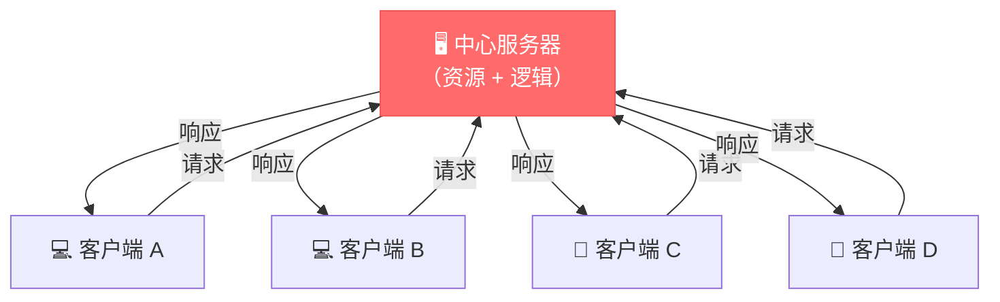

这个模型清晰、简单、易于管理，但存在三类核心风险：

| 风险类型 | 触发条件 | 结果 |
|---------|---------|------|
| 单点故障 | 服务器宕机 / 断电 | 所有用户无法访问 |
| DDoS 攻击 | 大量恶意流量涌入 | 服务瘫痪 |
| 行政干预 | 政策封锁 / 版权诉讼 | 服务永久下线 |

历史上 Napster（第一代 P2P 音乐分享平台）就是因为存在中央目录服务器，被版权方一纸诉状强制关闭，一夜之间数千万用户失去服务。这成为推动真正去中心化技术的导火索。

### 1.2 P2P 的核心理念：消灭"单点"

P2P（Peer-to-Peer）的核心思想是：**让每个参与者既是服务的消费者，也是服务的提供者**。

学术界给出的精确定义如下（来自 Schollmeier, 2001）：

> *"A Peer-to-Peer system is a self-organizing system of equal, autonomous entities (peers) which aims for the shared usage of distributed resources in a networked environment avoiding central services."*
>
> — R. Schollmeier, *A Definition of Peer-to-Peer Networking for the Classification of Peer-to-Peer Architectures and Applications*, 2001

即：P2P 系统是一个自组织的系统，由平等、自主的节点（peers）构成，目标是在无中心服务的网络环境中共享分布式资源。

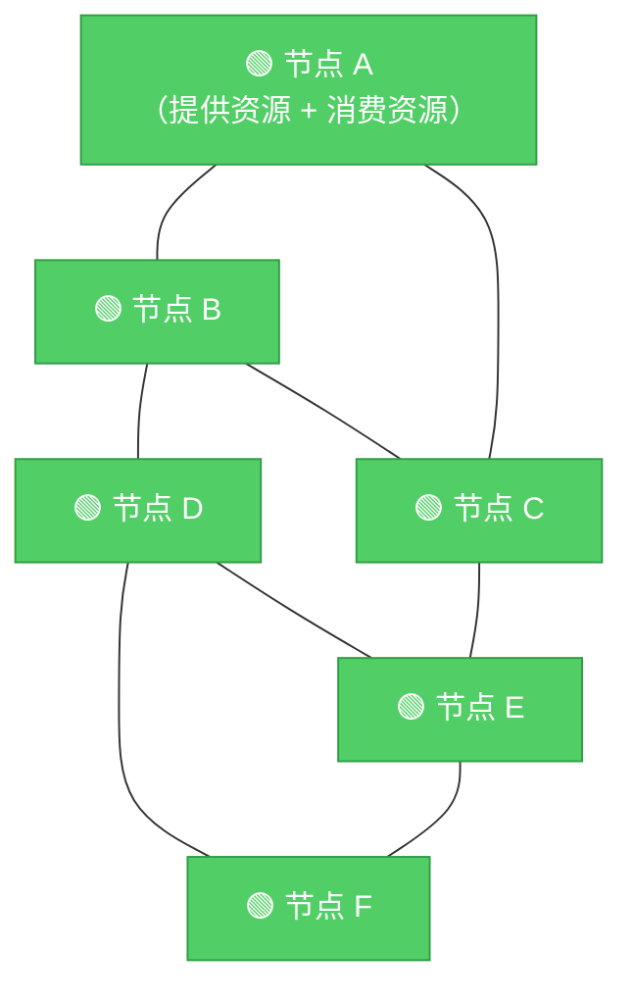

即使其中几个节点下线，整个网络依然正常运转——这就是 P2P 的魅力。

---

## 2. P2P 网络的演化史：三代架构的取舍

P2P 技术不是一蹴而就的，它经历了三代演化，每一代都是对上一代缺陷的回应。

### 第一代：中央索引服务器（Napster 模式）

**做法**：资源本身分散在各个节点，但维护一台中央服务器保存"资源 → 节点地址"的映射（目录服务）。

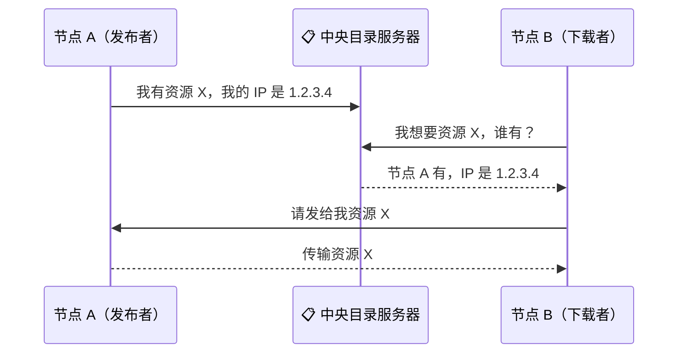

**优点**：查找效率高，只需一次目录查询。

**缺点**：目录服务器是整个系统的阿喀琉斯之踵。Napster 因此被美国唱片业协会（RIAA）起诉，2001 年被迫关闭。

---

### 第二代：泛洪搜索（Gnutella 模式）

**做法**：彻底去掉中央服务器。当节点 A 想要资源 X 时，它向所有邻居广播请求；邻居再向它们的邻居广播，以此类推，直到找到拥有资源的节点。

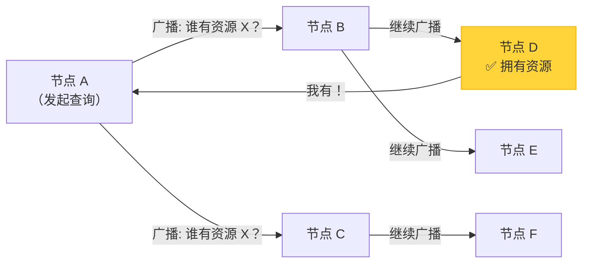

**优点**：真正去中心化，无单点故障。

**缺点**：每次查找可能引发指数级的消息扩散。如果网络中有 N 个节点，最坏情况下需要触达所有节点。当用户规模增大时，网络会被大量无效请求淹没。Gnutella 早期版本正是因此几乎把整个网络拖垮。

---

### 第三代：结构化 P2P——分布式哈希表（DHT）

前两代是两个极端：要么有中心服务器（高效但脆弱），要么完全泛洪（鲁棒但低效）。**分布式哈希表找到了中间道路**。

在一个有 $N$ 个节点的 DHT 中：
- 每个节点只需存储 $O(\log N)$ 个其他节点的信息
- 查找一个资源只需经过 $O(\log N)$ 次跳转
- 无需中央服务器，完全自组织

这是一个非常漂亮的结果，接下来我们来看它是如何实现的。

---

## 3. 分布式哈希表：优雅的工程解法

DHT 的设计基于三个核心概念：**地址空间、责任划分和路由机制**。

### 3.1 统一的地址空间

DHT 用一个统一的 $m$ 位整数空间（通常 $m = 160$）来标识所有的**节点**和**资源**：

- **节点 ID**：将节点的 IP 地址 + 端口用 SHA-1 哈希，得到一个 160 位整数
- **资源 Key**：将资源文件内容（或文件名）用 SHA-1 哈希，得到一个 160 位整数

SHA-1 的输出均匀分布在整个 160 位空间上，这使得 ID 和 Key 的分布是随机且均匀的，避免了热点集中问题。

```
资源文件 ──SHA-1──→ Key（160位整数）
节点IP:Port ──SHA-1──→ Node ID（160位整数）
```

### 3.2 责任划分：谁负责哪些资源？

有了统一的地址空间，就需要定义"哪个节点负责哪个 Key"。不同的 DHT 算法有不同的做法：

- **Chord**：每个 Key 由 ID 最接近且大于等于它的节点负责（顺时针最近节点）
- **Kademlia**：每个 Key 由异或距离最近的 $k$ 个节点负责

### 3.3 路由：如何找到目标节点？

路由是 DHT 的核心挑战。每个节点维护一个**路由表（Routing Table）**，存储部分其他节点的联系方式。消息沿着路由表逐跳转发，每跳都使目标节点更近。


整个过程的关键设计原则：**每跳都将剩余距离大约减半**，从而保证 $O(\log N)$ 的查找效率。

---

## 4. Chord 算法：环形世界的寻路艺术

Chord 由 MIT 的 Ion Stoica、Robert Morris 等人于 2001 年提出，发表在 ACM SIGCOMM 会议上，是最经典的 DHT 算法之一。

> 参考论文：Ion Stoica et al., *"Chord: A Scalable Peer-to-peer Lookup Service for Internet Applications"*, ACM SIGCOMM 2001.

### 4.1 Chord 环：把地址空间弯成一个圆

Chord 将 $0$ 到 $2^m - 1$ 的整数首尾相连，形成一个**环形地址空间（Chord Ring）**。节点和资源都可以在这个环上找到对应的位置。

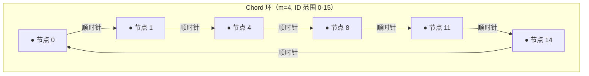

**关键规则（后继规则）**：Key 为 $k$ 的资源，由顺时针方向第一个 ID $\geq k$ 的节点负责，称该节点为 $k$ 的**后继**，记作 $\text{successor}(k)$。

举个例子，在上图中：
- Key = 1 → `successor(1) = 节点 1`（ID 恰好等于 1）
- Key = 5 → `successor(5) = 节点 8`（顺时针方向第一个 ID ≥ 5 的节点）
- Key = 15 → `successor(15) = 节点 0`（环绕到起点）

### 4.2 Finger Table（路由表）：对数跳转的秘密

如果每个节点只知道它的直接后继，查找一个资源可能需要绕环一圈，最坏情况是 $O(N)$ 次跳转，效率极低。

Chord 的解法是为每个节点维护一张**Finger Table（指针表）**，长度为 $m$。对于节点 $n$，其第 $i$ 个 finger 指向：

$$\text{finger}[i] = \text{successor}(n + 2^{i-1}) \quad (1 \leq i \leq m)$$

直觉上理解：finger table 的条目分别负责"距我 $2^0$、$2^1$、$2^2$、...、$2^{m-1}$ 距离处"的资源对应的节点。间距呈指数增长，这正是实现 $O(\log N)$ 查找的关键。

以节点 $n=4$，$m=4$ 为例，环中节点为 {0, 1, 4, 8, 11, 14}：

| Finger 编号 $i$ | 查找位置 $4 + 2^{i-1}$ | $\text{finger}[i]$ |
|:--------------:|:-------------------:|:-----------------:|
| 1 | $4 + 1 = 5$ | 节点 8 |
| 2 | $4 + 2 = 6$ | 节点 8 |
| 3 | $4 + 4 = 8$ | 节点 8 |
| 4 | $4 + 8 = 12$ | 节点 14 |

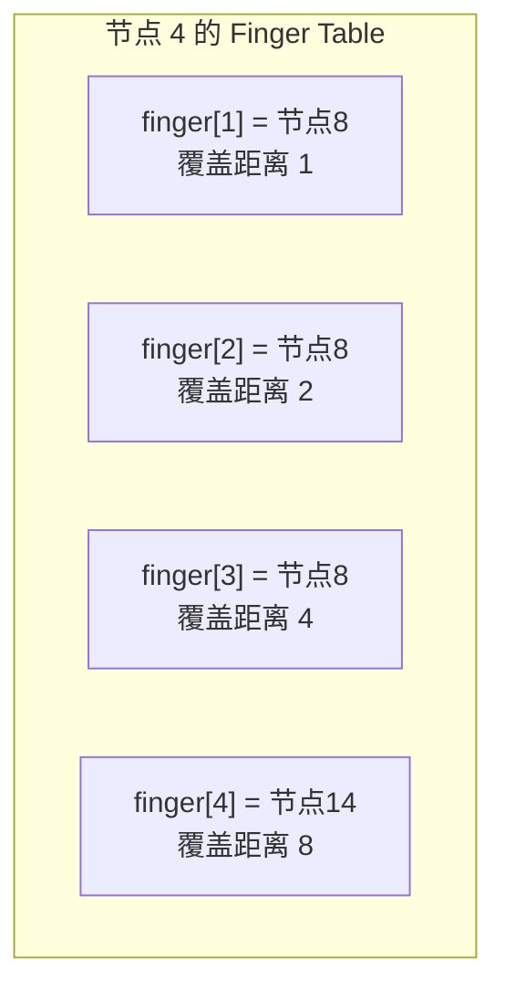

### 4.3 查找过程：逐步逼近目标

**查找算法**：节点 $n$ 查找 Key $k$：

1. 如果 $k$ 在 $(n, \text{finger}[1]]$ 区间内，则直接返回 `finger[1]`（后继节点）
2. 否则，从 finger table **从后向前**找到最后一个 ID 在 $(n, k)$ 区间内的节点 $p$，将查找请求转发给 $p$
3. 重复上述过程，直到找到目标节点

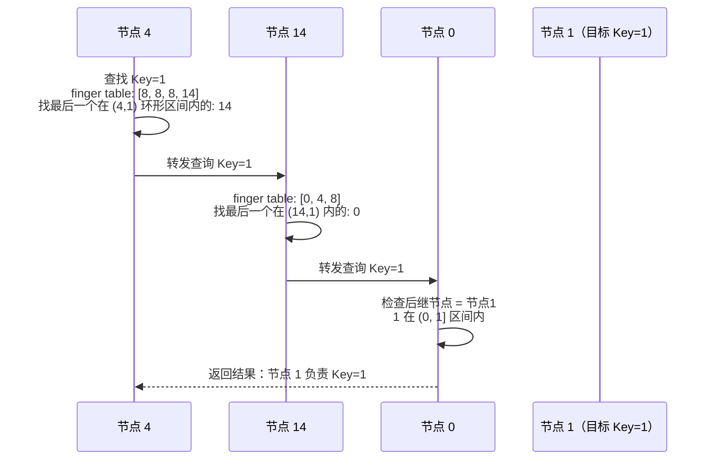

**每一跳都至少将剩余未搜索的环空间减半**，因此整个过程最多 $O(\log N)$ 跳。

### 4.4 节点加入：优雅的自组织

当新节点 $n$ 想加入 Chord：

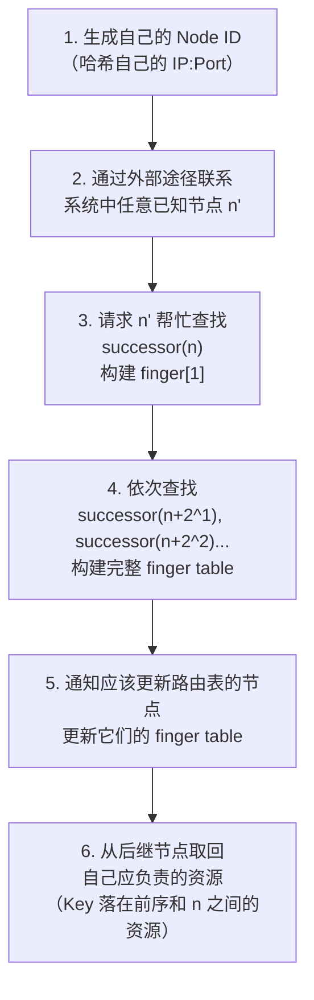

**并发加入的处理**：多个节点同时加入时，一次性更新所有节点的 finger table 可能导致不一致。Chord 的核心保证只有一条：**每个节点的直接后继（finger[1]）必须始终正确**。

为此，每个节点周期性执行 `stabilize()` 操作：

```
procedure stabilize(n):
    x = n.successor.predecessor   // 获取后继的前序节点
    if x 在 (n, n.successor) 区间内:
        n.successor = x           // x 更适合做我的后继
    n.successor.notify(n)         // 告诉后继我的存在
    
procedure notify(n, candidate):
    if n.predecessor == nil 或 candidate 在 (n.predecessor, n) 区间内:
        n.predecessor = candidate // 更新前序
```

这个操作足够简单，又能在多节点并发加入时保证环的最终一致性。

### 4.5 节点失效：后继列表的冗余设计

后继节点失效是 Chord 最严重的情况——环会断裂，查找失效。解决方案是每个节点维护一个**后继列表**，长度通常为 $r = \log N$，存储顺时针方向最近的 $r$ 个节点。

当前后继失效时，从后继列表中取下一个有效节点作为新后继。即使连续 $r-1$ 个后继都同时失效，系统也能自我恢复。

对于资源的持久性，每个资源不仅存储在负责它的节点，还会**冗余存储**在若干后继节点上，抵御节点失效导致的数据丢失。

---

## 5. Kademlia 算法：异或距离的魔法

Kademlia 由 Petar Maymounkov 和 David Mazières 于 2002 年提出，现在被广泛应用于 BitTorrent 的 DHT 网络（即 `magnet:` 磁力链接背后的技术）、以太坊节点发现协议（RLPx）、IPFS 等主流系统。

> 参考论文：Petar Maymounkov, David Mazières, *"Kademlia: A Peer-to-peer Information System Based on the XOR Metric"*, IPTPS 2002.

### 5.1 异或距离：颠覆直觉的距离定义

Kademlia 用**异或（XOR）**来定义两个 ID 之间的"距离"：

$$d(A, B) = A \oplus B$$

这不是普通意义上的数学距离，但它满足距离度量的所有公理（非负性、同一性、对称性、三角不等式），而且有一个独特性质：

> **单向性（Unidirectionality）**：对于任意节点 $n$ 和距离 $d$，至多存在一个节点 $p$ 使得 $d(n, p) = d$。
>
> 证明：若 $n \oplus p = d$，则 $p = n \oplus d$ 是唯一确定的值。

这个性质保证了：**无论查找从哪个节点出发，寻找同一个 Key 的路径总是收敛到同一条路径上**。这显著提高了系统的可预测性，也为缓存机制提供了理论基础。

**与二叉树的对应关系**：将每个 ID 的 160 位二进制展开，可以把所有节点想象为一棵高度为 161 的二叉树上的叶子节点：从根节点出发，遇到 `1` 向左，遇到 `0` 向右。

```
ID = 101...
      │││
      │││── 第3位: 1 → 左
      ││─── 第2位: 0 → 右  
      │──── 第1位: 1 → 左
```

两个 ID 共同前缀越长（在二叉树中共同祖先越深），它们的异或值就越小，即距离越近。这与我们直觉上"相似的 ID 距离近"吻合。

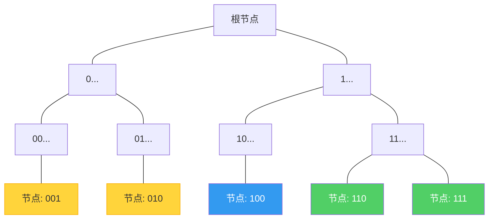

> 对于蓝色节点 `100`：与绿色节点（`110`, `111`，共享前缀 `1`）距离较近；与黄色节点（`001`, `010`，最高位不同）距离较远。

### 5.2 k-Bucket：精妙的路由表设计

对于任意节点，我们可以把整个二叉树按照"是否包含自己"，从根到叶逐层剖开，得到 $m$ 个不包含自己的子树。每个子树对应距离在 $[2^i, 2^{i+1})$ 范围内的所有节点。

Kademlia 从每个子树中选取最多 $k$ 个节点，形成 $k$ **桶（k-bucket）**。整个路由表就是这 $m$ 个 k-bucket 的集合。

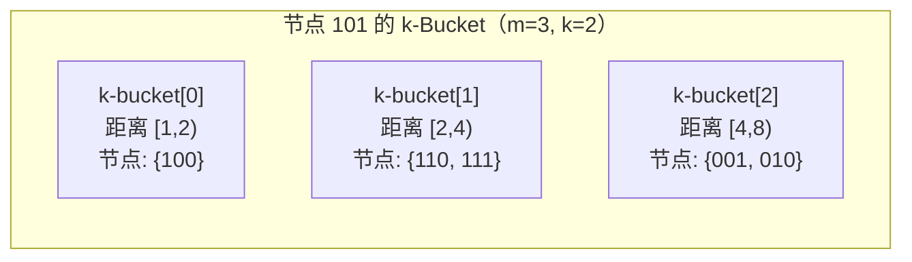

**k 的选择**：$k$ 的取值通常使得"系统中任意 $k$ 个节点在一小时内同时失效"的概率可以忽略不计。BitTorrent 的 Kademlia 实现中取 $k = 20$。

### 5.3 节点查找：并行的递归逼近

Kademlia 的核心操作是 **`FIND_NODE`**：给定一个 Key，返回当前节点所知道的距 Key 最近的 $k$ 个节点。

实现：
1. 计算 $\text{dist} = \text{self} \oplus \text{Key}$
2. 找出 dist 对应的 k-bucket，返回其中节点
3. 若 k-bucket 中节点不足 $k$ 个，从相邻 bucket 补充

在此基础上，**节点查找（Node Lookup）** 是一个迭代过程：

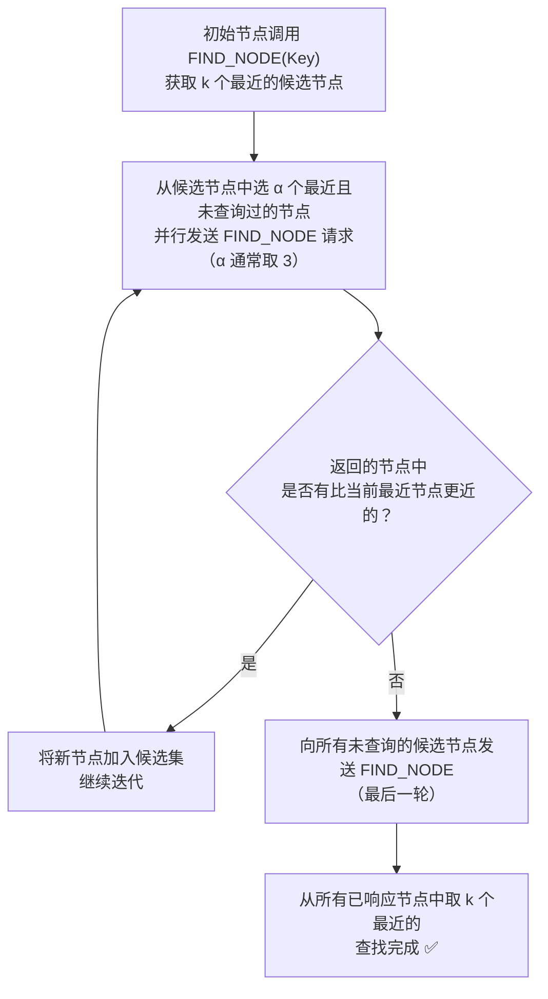

参数 $\alpha$（并发度）的作用：同时并行发送 $\alpha$ 个请求，既提高效率，又避免等待慢速节点而阻塞整个查找过程。

### 5.4 资源的存储与获取

**存储（STORE）**：
1. 对资源的 Key 执行节点查找
2. 获取距离 Key 最近的 $k$ 个节点
3. 将资源存储到这 $k$ 个节点上（冗余存储）

**获取（FIND_VALUE）**：
1. 类似节点查找，但一旦遇到拥有目标资源的节点立即停止
2. 成功后，将资源缓存在查找路径上距 Key 最近的节点上

**缓存的价值**：由于 Kademlia 的单向性，之后其他节点查找同一 Key 时，路径会经过这个缓存节点，从而提前命中缓存，降低全网负载。

### 5.5 k-Bucket 的维护：LRU + 活跃度优先

k-bucket 使用**最近最少使用（LRU）**策略管理节点列表：

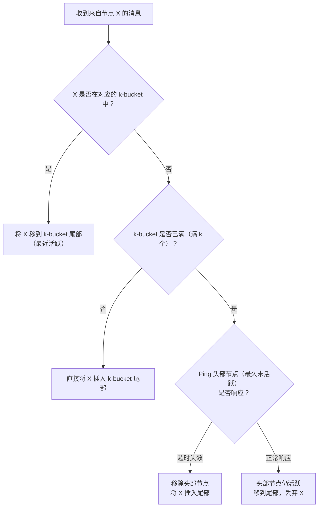

这个设计背后有一个来自论文的关键观察：

> 节点在线时长越长，它继续在线的可能性越大。（Kademlia 论文 Section 2.4）

因此优先保留长期在线的节点（LRU 头部在线时间长），而不是盲目替换成新节点——这使得 k-bucket 天然地倾向于存储稳定节点，提升了路由的可靠性。

### 5.6 节点加入：一次查找搞定一切

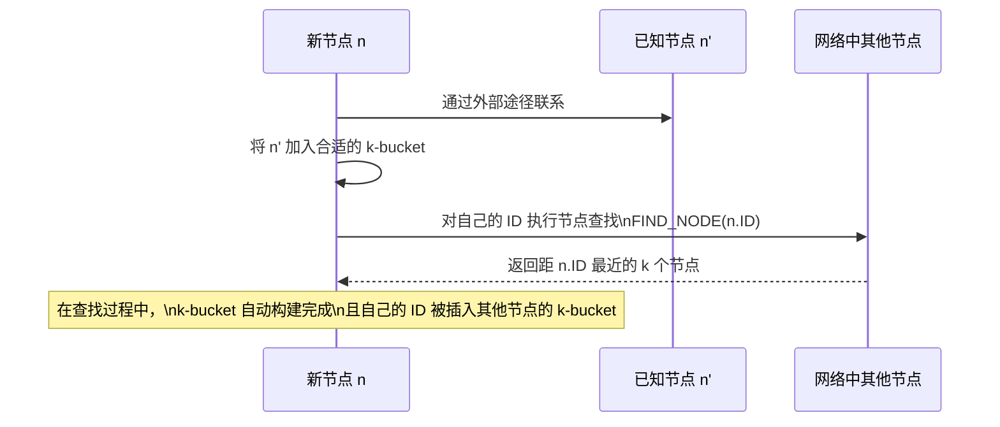

新节点加入后，资源获取由**周期性重发**机制保证：
- 每隔 1 小时，所有节点重新发布它们持有的资源
- 每隔 24 小时，节点丢弃未收到任何重发消息的资源

这样，新加入节点自然会在下一个重发周期收到它应负责的资源，无需任何额外操作。

**优化**：若一个节点刚收到某资源的存储请求，它认为此时距离自己最近的其他 $k-1$ 个节点也一定收到了同样的请求；因此它在接下来一小时内不再重发该资源。这避免了大量冗余的重发流量。（Kademlia 论文 Section 2.5）

---

## 6. 对比与总结

### 6.1 Chord vs Kademlia

| 维度 | Chord | Kademlia |
|------|-------|----------|
| **地址结构** | 有序环（线性顺序） | 二叉树（异或距离） |
| **路由表大小** | $O(\log N)$ 个 finger | $m$ 个 k-bucket，每个最多 $k$ 个节点 |
| **查找复杂度** | $O(\log N)$ 跳 | $O(\log N)$ 跳（$\alpha$ 路并行） |
| **路由方向** | 单向（顺时针） | 双向均可（异或对称） |
| **节点失效处理** | 需要后继列表额外支持 | k-bucket + LRU 天然容错 |
| **节点加入** | 需手动更新他人 finger table | 节点查找过程自动完成 |
| **资源重分配** | 需显式操作 | 周期性重发自动完成 |
| **实际应用** | 学术研究、部分系统原型 | BitTorrent DHT、以太坊、IPFS |

### 6.2 为什么 Kademlia 更流行？

Kademlia 的工程优势体现在：

1. **容错性更高**：k-bucket 的 LRU 策略自然过滤失效节点，无需 Chord 那样显式的 stabilize 协议
2. **自愈能力强**：节点的加入和离开几乎不需要额外协议开销
3. **查找并发**：$\alpha$ 并发查找显著降低延迟
4. **路由信息互通**：任何一次通信都附带路由信息更新，信息的复用效率更高

### 6.3 DHT 在现实系统中的应用

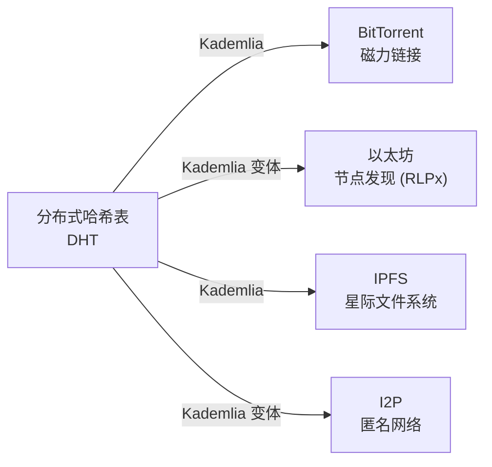

---

## 7. 参考资料

1. Ion Stoica, Robert Morris, David Karger, M. Frans Kaashoek, Hari Balakrishnan. **"Chord: A Scalable Peer-to-peer Lookup Service for Internet Applications"**. *ACM SIGCOMM 2001*. https://pdos.csail.mit.edu/papers/chord:sigcomm01/chord_sigcomm.pdf

2. Petar Maymounkov, David Mazières. **"Kademlia: A Peer-to-peer Information System Based on the XOR Metric"**. *IPTPS 2002*. https://pdos.csail.mit.edu/~petar/papers/maymounkov-kademlia-lncs.pdf

3. R. Schollmeier. **"A Definition of Peer-to-Peer Networking for the Classification of Peer-to-Peer Architectures and Applications"**. *IEEE P2P 2001*.

4. Bram Cohen. **"Incentives Build Robustness in BitTorrent"**. *Workshop on Economics of Peer-to-Peer Systems*, 2003.

5. BitTorrent Enhancement Proposals: BEP-0005 (DHT Protocol). https://www.bittorrent.org/beps/bep_0005.html

---

> **写在最后**：P2P 和 DHT 技术体现了一种深刻的工程哲学——**通过让每个参与者承担适度的局部责任，整个系统获得了远超任何中心节点的整体能力**。这不仅是计算机科学的优雅，也是一种关于协作与分布的思考方式。
