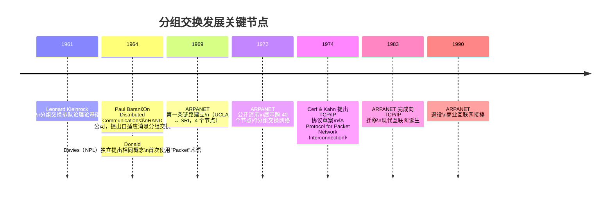
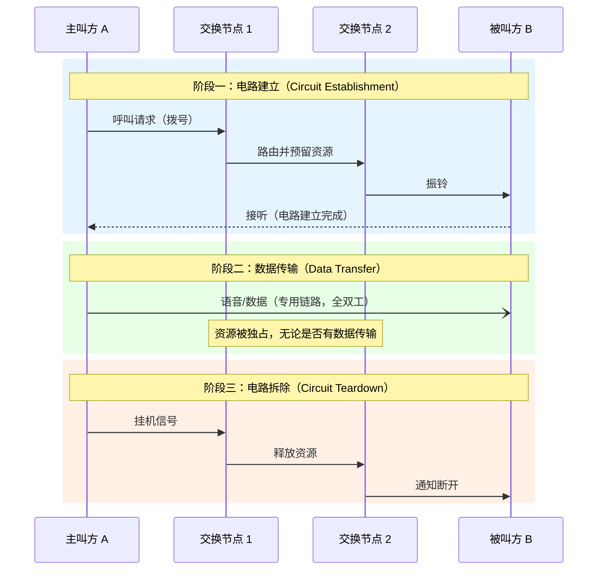
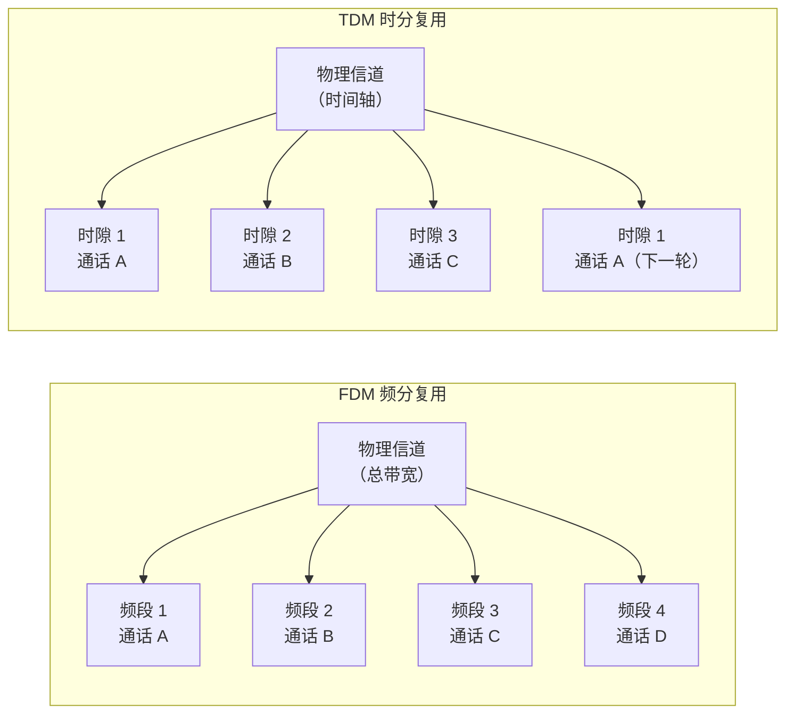
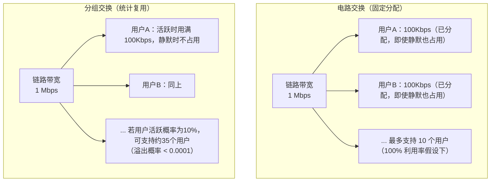
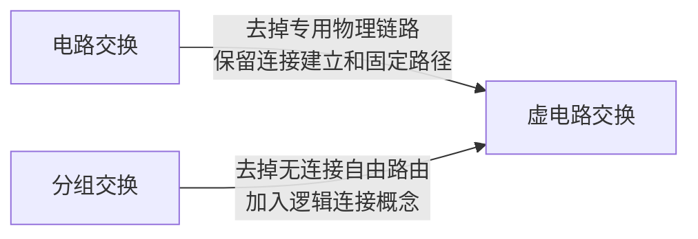

# 电路交换与分组交换

---

## Part 1｜面试题标准答案

> 适合直接用于面试作答，逻辑清晰、要点完整。

### 核心区别

**电路交换（Circuit Switching）** 在通信双方开始传输数据之前，必须先建立一条端到端的专用物理链路，通信期间该链路被独占，通信结束后才释放。传统的公共电话交换网（PSTN）是其最典型的应用。

**分组交换（Packet Switching）** 将数据拆分为带有首部（源地址、目的地址、序号等控制信息）的小单元——分组（Packet），分组在网络中独立路由，逐跳以"存储-转发（Store and Forward）"方式传递，中间链路不被任何一对通信方独占，多个分组可共享同一条链路。现代互联网（IP 网络）即基于分组交换。

### 三个核心对比维度

| 维度 | 电路交换 | 分组交换 |
|------|---------|---------|
| **链路占用** | 独占，全程保持 | 共享，按需使用 |
| **线路利用率** | 低，通常不足 10% | 高，统计复用 |
| **时延特性** | 建立连接时延大，传输时延恒定 | 无需建立连接，但存在排队/转发时延 |
| **适用场景** | 实时语音（电话） | 数据传输（互联网） |

### 存储转发机制

分组交换的核心是**存储转发**：中间节点（路由器）收到一个完整分组后，先缓存，再根据目的地址查找路由表，转发到下一跳。类比邮局：收到信件后先入库，再按目的地批量转发，而非为每封信专门开辟一条传输通道。

---

## Part 2｜深度扩展：历史、原理与现代演进

---

### 1. 历史背景：两种交换思想的诞生

#### 1.1 电路交换的起源——19 世纪的电话网络

电路交换的历史可以追溯到 1876 年贝尔发明电话之后。最初的电话系统依赖**人工话务员（Operator）**在交换机房手动将插头插入对应插孔，在两部电话之间建立物理铜线连接——这便是"电路交换"思想最朴素的体现。

进入 20 世纪，自动化的机电式交换机（如步进制交换机 Strowger Switch，1889 年）取代了人工话务员，但其本质逻辑未变：通话前建立专用电路，通话全程占用，挂机后释放。这套体系在全球电话网络（PSTN，Public Switched Telephone Network）中延续了超过一个世纪。

#### 1.2 分组交换的诞生——冷战与核威胁的产物

分组交换的思想诞生于冷战背景下对通信系统生存性（Survivability）的追求。

**1961 年**，MIT 的 Leonard Kleinrock 在其博士论文中首次提出了使用分组（Packets）在网络中传递数据的数学理论，为分组交换奠定了排队论基础，其论文后来被视为分组交换理论的奠基性工作之一。

**1964 年**，RAND 公司的 Paul Baran 在报告《On Distributed Communications》中独立提出了"自适应消息分组交换（Adaptive Message Block Switching）"概念，核心动机是：如果苏联核武器摧毁了美国通信网络的部分节点，网络应能自动绕路继续工作。传统电路交换网络因为依赖专用链路，一旦中间节点被摧毁，整个通话就会中断，这与军事需求相悖。

**同年**，英国国家物理实验室（NPL）的 Donald Davies 独立提出了几乎相同的概念，并率先使用了"Packet"这一术语——该词沿用至今。



---

### 2. 电路交换：深入原理

#### 2.1 三个阶段

电路交换的完整通信过程分为三个严格的阶段：



#### 2.2 频分多路复用（FDM）与时分多路复用（TDM）

在一条物理传输介质（如光缆）上，电路交换通过两种方式划分"电路"：

**频分多路复用（FDM，Frequency Division Multiplexing）**：将信道的总带宽划分为若干个频率子带，每路通话独占一个子带。无线广播、模拟电话即使用此方式。

**时分多路复用（TDM，Time Division Multiplexing）**：将时间划分为等长的时间槽（Time Slot），循环分配给各路通话，每路通话在固定时隙中传输。数字电话网络（如 E1/T1 线路）使用此方式——E1 标准将一条 2.048 Mbit/s 的线路划分为 32 个 64 kbit/s 的时隙。



#### 2.3 为何线路利用率低？

考虑一个典型场景：两人打电话，其中约 50% 的时间是静默的（一方说话时另一方在听）。在静默期，独占的电路依然被保持，不传输任何有效数据，这部分带宽白白浪费。研究表明，PSTN 中的电路平均利用率确实很低。

---

### 3. 分组交换：深入原理

#### 3.1 分组的结构

每个分组（Packet）由两部分组成：

```
┌──────────────────────────────────────────────────────────┐
│                        分组（Packet）                      │
├──────────────────────┬───────────────────────────────────┤
│       首部（Header）  │           载荷（Payload）           │
│  源地址 | 目的地址   │                                     │
│  序号   | 校验和     │        实际数据（如 IP 数据报）       │
│  TTL    | 协议类型   │                                     │
└──────────────────────┴───────────────────────────────────┘
```

首部包含路由所需的所有控制信息，中间节点只需读取首部即可完成转发决策，无需关心载荷内容。

#### 3.2 存储转发的时延分析

存储转发是分组交换的核心机制，但它引入了**转发时延（Store-and-Forward Delay）**。假设：

- 链路带宽为 $R$ bps
- 分组大小为 $L$ bits
- 源到目的地共经过 $N$ 条链路（$N-1$ 个中间节点）

则端到端的存储转发时延为：

$$T_{total} = N \cdot \frac{L}{R}$$

```mermaid
gantt
    title 存储转发时延示意（3条链路，L/R = 1个时间单位）
    dateFormat  X
    axisFormat %s

    section 链路 1（节点0→节点1）
    传输分组    :a1, 0, 1

    section 链路 2（节点1→节点2）
    等待接收完整分组  :crit, done, 0, 1
    传输分组          :a2, 1, 2

    section 链路 3（节点2→目的地）
    等待接收完整分组  :crit, done, 0, 2
    传输分组          :a3, 2, 3
```



总时延 = 3 × (L/R)，即 $N \times \frac{L}{R}$。

#### 3.3 统计多路复用：分组交换的效率优势

与电路交换的固定分配不同，分组交换使用**统计多路复用（Statistical Multiplexing）**：链路带宽按需分配，没有数据发送时不占用任何资源。



**数值示例（Kurose & Ross《Computer Networking》中的经典例子）**：

设链路带宽 1 Mbps，每个用户活跃时需要 100 kbps，但每个用户只有 10% 的时间在活跃传输。

- 电路交换：最多支持 **10** 个用户（每人固定分配 100 kbps）
- 分组交换：若有 35 个用户，在某一时刻超过 10 个用户同时活跃的概率约为 0.0004，几乎可忽略不计，因此可支持 **35 个用户**，是电路交换的 3.5 倍

#### 3.4 分组交换的四种时延

分组在网络中经历的端到端时延由四部分叠加而成：


| 时延类型 | 公式 | 影响因素 | 典型量级 |
|---------|------|---------|---------|
| **处理时延** $d_{proc}$ | — | 路由器性能 | 微秒级 |
| **排队时延** $d_{queue}$ | 取决于流量强度 | 网络拥塞程度 | 微秒～毫秒 |
| **传输时延** $d_{trans}$ | $L / R$ | 分组大小、链路带宽 | 微秒～毫秒 |
| **传播时延** $d_{prop}$ | $d / s$（$s \approx 2\times10^8$ m/s） | 物理距离 | 毫秒级（跨洲） |

> 常见混淆：**传输时延**是把分组的所有比特"推入"链路所需的时间，取决于分组大小和链路带宽；**传播时延**是一个比特从链路一端传播到另一端所需的时间，取决于物理距离。两者量纲相同但含义截然不同。

---

### 4. 虚电路交换：介于两者之间的折中

现实中还存在一种折中方案——**虚电路交换（Virtual Circuit Switching）**，兼具两种交换方式的部分特性。



| 特性 | 电路交换 | 虚电路交换 | 数据报分组交换 |
|------|---------|-----------|------------|
| 需要建立连接 | ✅ 物理连接 | ✅ 逻辑连接 | ❌ |
| 固定路径 | ✅ | ✅ | ❌（逐包独立路由） |
| 独占资源 | ✅ | ❌（共享） | ❌ |
| 分组携带地址 | 无需 | 仅携带 VCI 标识 | 完整目的地址 |
| 代表技术 | PSTN | ATM、X.25、MPLS | IP 网络 |

ATM（Asynchronous Transfer Mode，异步传输模式）是虚电路交换的典型代表，曾被业界寄望为"下一代网络"的基础技术，但最终输给了更简单灵活的 IP 分组交换。MPLS（多协议标签交换）则是目前仍大量用于运营商骨干网的虚电路技术。

---

### 5. 现代网络中的演进

#### 5.1 VoIP：在分组交换网上模拟电路交换体验

随着互联网普及，传统 PSTN 电路交换网络逐渐被基于 IP 的语音通话（VoIP，Voice over IP）所取代。Skype、微信语音、企业 SIP 电话系统均属此类。

VoIP 本质上是在分组交换网上传输实时音频，面临的核心挑战正是分组交换的天然缺陷——**不确定的排队时延和抖动（Jitter）**。解决方案包括：

- **RTP 协议**（Real-time Transport Protocol）：专为实时音视频设计的传输协议
- **抖动缓冲区（Jitter Buffer）**：在接收端缓存少量数据包，平滑时延抖动
- **QoS 机制**：通过 DSCP 标记、优先队列等手段给语音包更高的转发优先级

#### 5.2 5G 网络切片：软件定义的"虚拟电路交换"

5G 引入的**网络切片（Network Slicing）**技术，本质上是在共享的分组交换物理基础设施上，通过 SDN/NFV 技术为不同业务（如自动驾驶、远程手术、普通移动上网）划分出逻辑独立、具有不同 QoS 保障的"虚拟网络"——这在理念上与虚电路交换有着深刻的传承关系。

---

### 6. 参考资料

1. James F. Kurose, Keith W. Ross. **《Computer Networking: A Top-Down Approach》**, 8th Edition. Pearson, 2021. — 第 1 章 1.3 节"The Network Core"

2. Andrew S. Tanenbaum, David J. Wetherall. **《Computer Networks》**, 5th Edition. Pearson, 2011. — 第 1 章"Introduction"

3. Paul Baran. **"On Distributed Communications: I. Introduction to Distributed Communications Networks"**. RAND Corporation Memorandum RM-3420-PR, August 1964.

4. Leonard Kleinrock. **"Information Flow in Large Communication Nets"**. *RLE Quarterly Progress Report*, MIT, July 1961. — 分组交换理论的奠基论文

5. V. G. Cerf, R. E. Kahn. **"A Protocol for Packet Network Interconnection"**. *IEEE Transactions on Communications*, May 1974. — TCP/IP 的原始论文

6. Wikipedia. **"Circuit switching"**. https://en.wikipedia.org/wiki/Circuit_switching

7. Wikipedia. **"Packet switching"**. https://en.wikipedia.org/wiki/Packet_switching

8. Wikipedia. **"Paul Baran"**. https://en.wikipedia.org/wiki/Paul_Baran

9. Wikipedia. **"Donald Davies"**. https://en.wikipedia.org/wiki/Donald_Davies
