# 网络分层模型完全指南：从"发出一个请求"到真正理解协议栈

*内容基于《计算机网络：自顶向下方法》（Kurose & Ross）、RFC 793、RFC 1034、RFC 791 等 IETF 标准规范，所有协议行为以原始 RFC 文档为准。*

---

## 目录

- [从一个浏览器请求开始](#从一个浏览器请求开始)
- [为什么网络要分层](#为什么网络要分层)
- [三种分层模型总览](#三种分层模型总览)
- [OSI 七层模型：逐层拆解](#osi-七层模型逐层拆解)
- [TCP/IP 四层模型：互联网的实际基础](#tcpip-四层模型互联网的实际基础)
- [五层协议模型：教学的折中方案](#五层协议模型教学的折中方案)
- [深入传输层：TCP 与 UDP](#深入传输层tcp-与-udp)
- [TCP 三次握手与四次挥手](#tcp-三次握手与四次挥手)
- [深入应用层：DNS 解析全流程](#深入应用层dns-解析全流程)
- [数据封装与解封装：完整流程](#数据封装与解封装完整流程)
- [各层协议完整汇总](#各层协议完整汇总)
- [参考资料](#参考资料)

---

## 从一个浏览器请求开始

在读任何协议定义之前，先想清楚一件具体的事：**你在浏览器里输入 `https://www.google.com` 然后按回车，接下来发生了什么？**

这个过程涉及至少以下几个步骤：

1. 浏览器把 `www.google.com` 这个域名解析成 IP 地址（DNS 查询）
2. 你的电脑与 Google 服务器建立 TCP 连接（三次握手）
3. 浏览器通过 HTTPS 发送 HTTP 请求
4. 服务器返回网页内容
5. 数据经过多个路由器逐跳转发才到达目的地
6. 整个过程中，数据被不断地打包、拆包

这些步骤涉及的所有工作，是由一套分层的协议体系完成的。**理解分层，就是理解这套体系是如何把一个极其复杂的问题切分成可以各自解决的小问题的。**

---

## 为什么网络要分层

在分层思想被提出之前，网络通信是一锅粥——IBM、DEC、Honeywell 等公司各自定义私有的网络协议，彼此之间完全无法互通。一台 IBM 大型机和一台 DEC 工作站，哪怕同在一栋楼里，也没有通用的方式互相传数据。

分层的本质是**关注点分离（Separation of Concerns）**，计算机科学里有一句广为人知的名言：

> *Any problem in computer science can be solved by adding another level of indirection.*
> — David Wheeler，剑桥大学，被誉为"子程序之父"

分层带来三个具体的工程收益：

**各层独立，互不干扰**。每一层只需要关心自己的职责，通过标准接口与上下层交互，不需要知道下层是怎么实现的。就像你调用 `fetch()` 发 HTTP 请求时，不需要知道 TCP 是怎么保证可靠传输的。

**高内聚低耦合，方便替换**。只要对外接口不变，每层的内部实现随时可以更新。IPv4 向 IPv6 的演进，对应用层开发者几乎完全透明，就是这个原理在起作用。

**复杂问题分解**。一个跨越全球的网络通信问题，被分解成"如何寻址""如何路由""如何保证可靠""如何呈现给应用"等若干个边界清晰的子问题，每个子问题都有对应的协议来解决。

这和软件工程里把系统分成 Controller / Service / Repository 三层、让每层专注做一件事，是同一种设计哲学。

---

## 三种分层模型总览

网络分层模型有三个版本，分别适用于不同的场景：

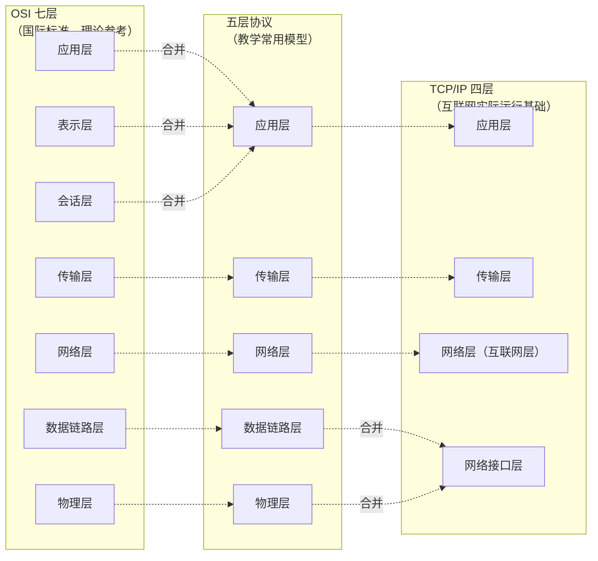

| 模型 | 层数 | 提出方 | 时间 | 现状 |
|------|------|-------|------|------|
| OSI | 7 | ISO（国际标准化组织） | 1984 | 理论参考标准，从未被完整实现 |
| TCP/IP | 4 | IETF / 学术界 | 1974 | 互联网的实际运行基础 |
| 五层协议 | 5 | 教学综合模型 | — | 学术教学，结合两者优点 |

---

## OSI 七层模型：逐层拆解

OSI（Open Systems Interconnection）模型由国际标准化组织（ISO）在 1984 年正式发布，标准编号 **ISO/IEC 7498-1**。它将网络通信划分为七层，每一层向上提供服务，向下调用服务。

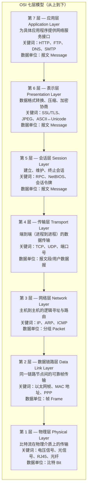

### 每层详解

#### 第 7 层：应用层

直接面向用户和应用程序。HTTP 协议就在这一层——你的浏览器用 HTTP 告诉服务器"我想要 `/index.html`"这个文件。DNS 也在这层，负责把域名翻译成 IP 地址。

应用层不关心数据是怎么传输的，它只定义"我要什么、怎么表达"。

#### 第 6 层：表示层

解决"同一份数据在不同系统上格式不一样"的问题。例如，Windows 和 Linux 对文本的换行符编码不同（`\r\n` vs `\n`），不同语言的字符编码也不同（ASCII、UTF-8、GBK）。表示层负责在这些格式之间转换，让应用层不需要关心数据格式的差异。

SSL/TLS 的加密协商过程在概念上属于这一层，尽管在 TCP/IP 实践中它被嵌入应用层协议（HTTPS）。

#### 第 5 层：会话层

管理两个节点之间的"对话"。比如，在一次文件传输过程中，如果连接中断，会话层的功能是让传输从中断点续传，而不是从头开始。

在实际的 TCP/IP 实现中，会话层和表示层的功能**由应用层开发者自行处理**，并不存在独立的协议。TLS 握手、HTTP Cookie、WebSocket 的会话管理，都是应用层自己搞定的。

**这就是 OSI 从未被完整实现的核心原因**：表示层和会话层的边界模糊，且功能可以被上下层吸收，单独成层反而增加了复杂性。

#### 第 4 层：传输层

这是协议栈的关键转折点。在传输层之上，是"应用程序的世界"；在传输层之下，是"网络的世界"。传输层的职责是**在两个进程之间**建立端到端的通信通道。

注意这里的"进程"而非"主机"：一台主机可以同时运行微信、浏览器、SSH 客户端，这三个进程都在收发数据。区分它们靠的是**端口号（Port）**——每个进程绑定一个端口，数据包到达后根据端口分发给对应的进程。

- **TCP（传输控制协议）**：有连接、可靠、有序
- **UDP（用户数据报协议）**：无连接、不可靠、高效

#### 第 3 层：网络层

负责**在不同网络之间**传递分组，即路由和逻辑寻址。IP 地址是网络层的地址。路由器工作在这一层，它读取 IP 数据包的目的地址，查路由表，决定把数据包转发到哪个下一跳。

网络层只负责"尽力而为"地转发，不保证顺序，不保证到达——可靠性是传输层的事。

#### 第 2 层：数据链路层

网络层的视角是"主机到主机"，但数据在物理上传输时，是在**同一条链路的相邻节点**之间传递的。链路层负责把分组封装成"帧"，加上 MAC 地址（物理地址），在同一子网内找到下一跳。

以太网协议是最常见的链路层协议。交换机工作在这一层，根据 MAC 地址转发帧。

#### 第 1 层：物理层

物理层关心的是比特（0 和 1）在物理介质上的传输：用什么电压表示 1，用什么电压表示 0；信号的频率是多少；连接器的形状是什么。它不关心这些比特组成了什么意思。

物理层的作用是**屏蔽传输介质的差异**，让数据链路层感觉不到自己是在铜缆、光纤还是无线电波上传输数据。

---

## TCP/IP 四层模型：互联网的实际基础

1974 年，Vint Cerf 和 Robert Kahn 在论文《A Protocol for Packet Network Interconnection》中首次提出了 TCP 协议的概念。两人因此在 2004 年获得图灵奖，被称为"互联网之父"。

TCP/IP 模型只有四层，是今天互联网实际运行的基础：

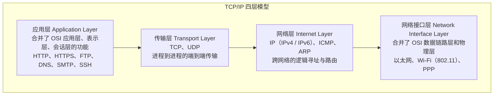

TCP/IP 有一个重要的设计哲学——**端到端原则（End-to-End Argument）**，由 Saltzer、Reed、Clark 在 1984 年的论文中提出：

> 应该尽可能地将功能放在网络的端点（即主机），而不是放在中间的网络节点（路由器）上。网络核心只做一件事：尽力转发 IP 分组。

这个原则让 TCP/IP 具有极强的扩展性：你可以在 IP 之上随意发明新的应用层协议，完全不需要改动网络核心。HTTP、SMTP、BitTorrent、WebRTC——这些都是在 IP 之上的应用层创新，网络基础设施完全不需要感知它们的存在。

---

## 五层协议模型：教学的折中方案

五层协议模型综合了 OSI 和 TCP/IP 各自的优点，在《计算机网络：自顶向下方法》（Kurose & Ross，被全球数百所大学采用的教材）中被广泛使用：

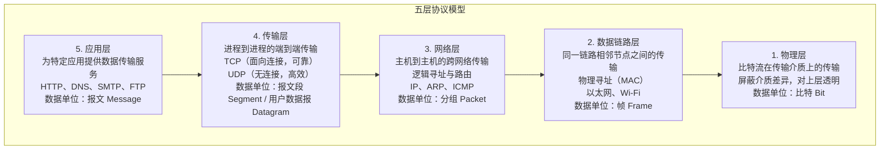

五层模型保留了物理层和数据链路层的独立性（相比 TCP/IP 把两者合并），同时取消了 OSI 中实用价值存疑的表示层和会话层。这是一个在理论完整性和工程实用性之间取得平衡的设计。

---

## 深入传输层：TCP 与 UDP

传输层是整个协议栈中对开发者最直接相关的层，几乎所有网络编程都从这里开始。

### TCP 与 UDP 的核心对比

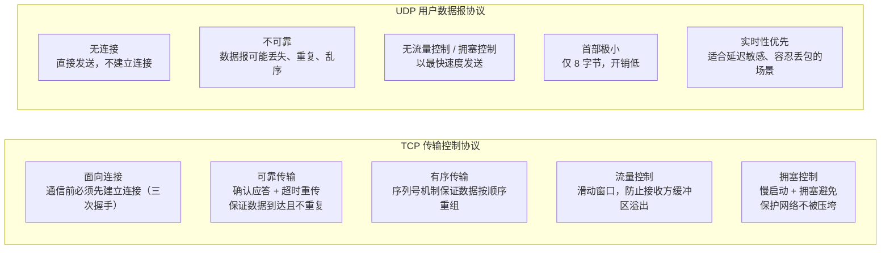

### TCP 报文段首部结构

TCP 的每一个控制特性都体现在首部字段中（来源：RFC 793，1981）：

```
 0                   1                   2                   3
 0 1 2 3 4 5 6 7 8 9 0 1 2 3 4 5 6 7 8 9 0 1 2 3 4 5 6 7 8 9 0 1
+-+-+-+-+-+-+-+-+-+-+-+-+-+-+-+-+-+-+-+-+-+-+-+-+-+-+-+-+-+-+-+-+
|          Source Port          |       Destination Port        |
|         源端口（16位）          |        目的端口（16位）          |
+-+-+-+-+-+-+-+-+-+-+-+-+-+-+-+-+-+-+-+-+-+-+-+-+-+-+-+-+-+-+-+-+
|                        Sequence Number                        |
|                     序列号（32位）                              |
+-+-+-+-+-+-+-+-+-+-+-+-+-+-+-+-+-+-+-+-+-+-+-+-+-+-+-+-+-+-+-+-+
|                    Acknowledgment Number                      |
|                    确认号（32位）                               |
+-+-+-+-+-+-+-+-+-+-+-+-+-+-+-+-+-+-+-+-+-+-+-+-+-+-+-+-+-+-+-+-+
|  Data |           |U|A|P|R|S|F|                               |
| Offset| Reserved  |R|C|S|S|Y|I|           Window             |
|       |           |G|K|H|T|N|N|           窗口大小            |
+-+-+-+-+-+-+-+-+-+-+-+-+-+-+-+-+-+-+-+-+-+-+-+-+-+-+-+-+-+-+-+-+
|           Checksum            |         Urgent Pointer        |
|           校验和              |          紧急指针               |
+-+-+-+-+-+-+-+-+-+-+-+-+-+-+-+-+-+-+-+-+-+-+-+-+-+-+-+-+-+-+-+-+
```

关键字段说明：

| 字段 | 长度 | 作用 |
|------|------|------|
| 源/目的端口 | 各 16 位 | 标识发送方/接收方的进程 |
| 序列号（Seq） | 32 位 | 标识本报文段第一个字节在字节流中的位置 |
| 确认号（Ack） | 32 位 | 期望收到对方下一个字节的序号 |
| 控制位（SYN/ACK/FIN/RST） | 各 1 位 | 控制连接的建立、维持和终止 |
| 窗口大小（Window） | 16 位 | 告知对方自己当前的接收缓冲区大小（流量控制） |

### 选择 TCP 还是 UDP？

| 场景 | 推荐 | 原因 |
|------|------|------|
| 网页浏览（HTTP/HTTPS） | TCP | 页面必须完整到达，乱序或丢失是不可接受的 |
| 文件下载（FTP、SFTP） | TCP | 文件字节必须完整且有序 |
| 电子邮件（SMTP、IMAP） | TCP | 邮件内容不能有任何丢失 |
| 视频直播、音视频通话 | UDP | 宁可丢一帧，也不能为等待重传而卡顿 |
| DNS 查询 | UDP（主） | 请求响应都很小，速度优先，丢了直接重发 |
| 在线游戏（实时同步） | UDP | 位置同步要求极低延迟，一个旧包丢了无所谓 |

---

## TCP 三次握手与四次挥手

### 为什么需要三次握手？

RFC 793 对三次握手的设计原因有明确说明：

> *The principle reason for the three-way handshake is to prevent old duplicate connection initiations from causing confusion.*
> — RFC 793, IETF, 1981

三次握手的核心目标有两个：
1. **同步双方的初始序列号（ISN，Initial Sequence Number）**，保证后续数据传输的有序性
2. **确认双方的发送和接收能力都正常**

两次握手不够：客户端的 SYN 在网络里可能延迟，之后客户端放弃重发一个新 SYN；旧的 SYN 迟迟到达服务端，服务端 SYN-ACK 之后进入 ESTABLISHED，但客户端并不认这个连接——白白占用服务端资源。三次握手中，客户端在收到 SYN-ACK 后必须发 ACK，服务端才进入 ESTABLISHED，避免了这个问题。

### 三次握手过程

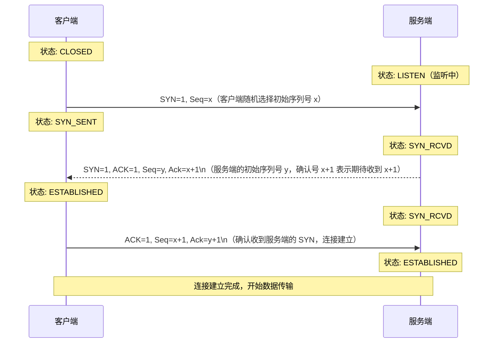

**为什么 ACK 号是 Seq+1？** 因为 SYN 标志本身占用一个序列号，所以对方期望接下来收到的第一个数据字节是 Seq+1。

### 四次挥手过程

断开连接需要四次，因为 TCP 是**全双工**的——两个方向的数据流必须分别独立关闭。

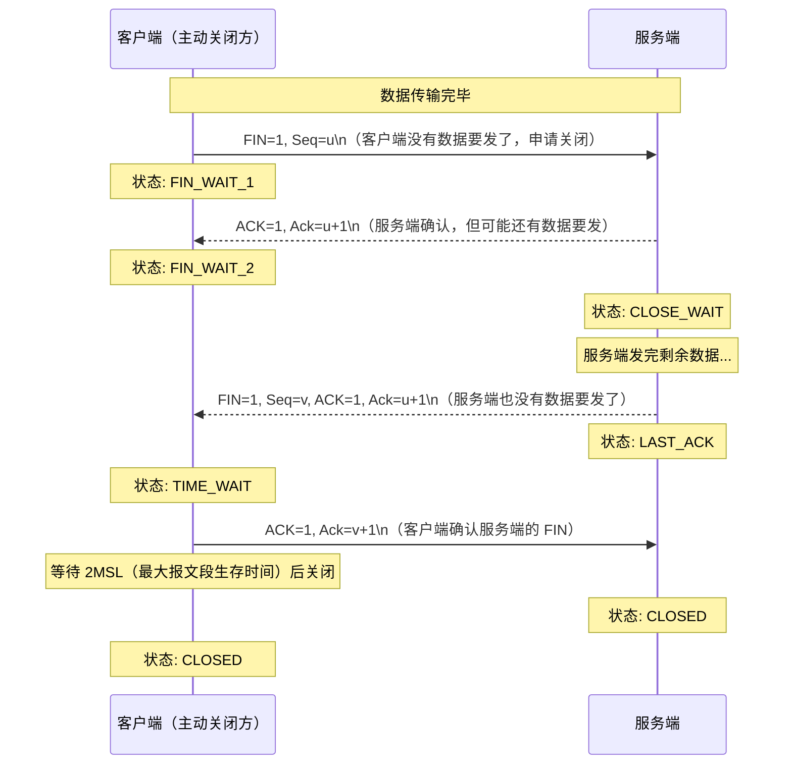

**为什么第三步和第四步不能合并？** 服务端收到客户端的 FIN 后，可能还有数据没有发完。它先发 ACK 告知"我知道你想关了"，等自己的数据发完后再发 FIN。这两步之间有时间差，所以无法合并。

**为什么客户端要等 2MSL（约 2 分钟）？** 两个原因：
- 防止最后一个 ACK 丢失：如果最后的 ACK 丢失，服务端会重发 FIN，客户端在 TIME_WAIT 期间能收到并重发 ACK
- 让网络中残留的旧数据包完全消亡，避免被下一个相同端口的新连接误收

### TCP 状态机全图

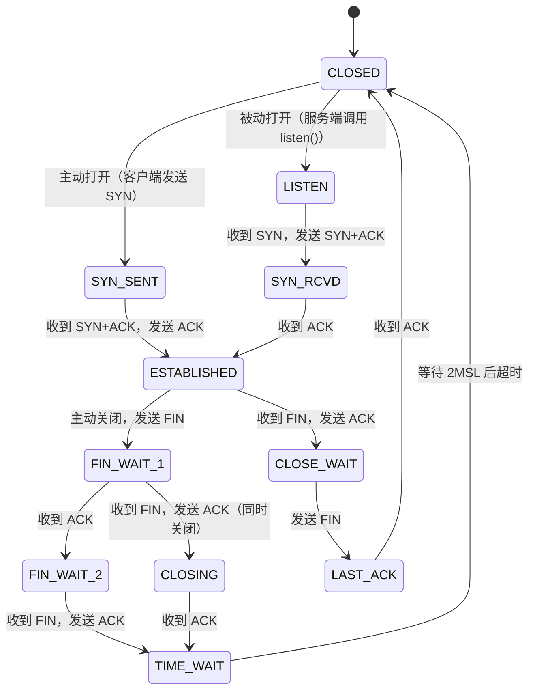

---

## 深入应用层：DNS 解析全流程

DNS 是互联网基础设施中最不引人注意、却最核心的一环。理解 DNS，能帮助你理解为什么访问国外网站慢、为什么改 hosts 文件能"翻墙"、为什么 TTL 很重要。

DNS 的基础规范定义于 1987 年的 **RFC 1034** 和 **RFC 1035**，由 P. Mockapetris 撰写。

### DNS 的层次结构

DNS 是一个全球分布式的树形数据库。域名的组织是从右到左解读的：

```
www.google.com.
              ↑ 根域（.）
         ↑ 顶级域（TLD）：com
   ↑ 二级域：google
↑ 主机名：www
```

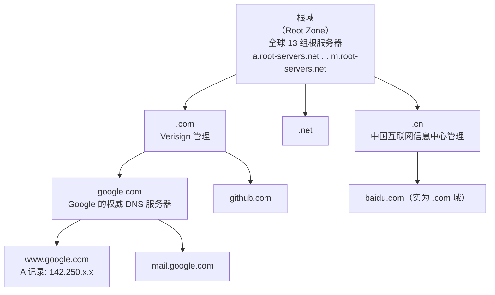

### 一次完整的 DNS 查询过程

当你输入 `www.google.com` 时，以下事情按顺序发生：

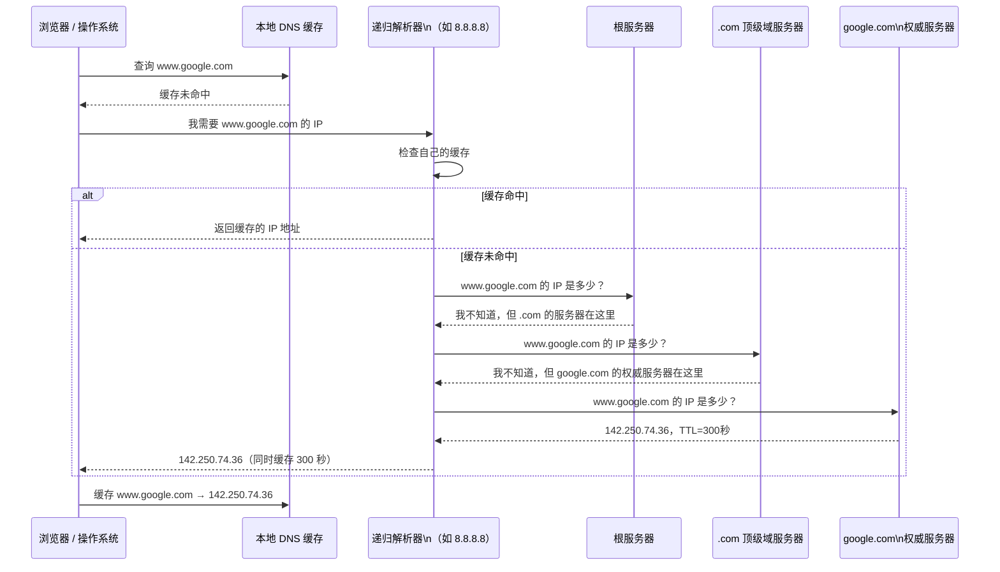

**DNS 使用 UDP 端口 53**：DNS 查询和响应的数据包通常很小，UDP 不需要握手，速度更快。当响应数据超过 512 字节（或使用 EDNS 时超过协商的上限），才会切换到 TCP 端口 53。

### 常见 DNS 记录类型

| 记录类型 | 含义 | 示例 |
|---------|------|------|
| A | 域名 → IPv4 地址 | `www.google.com → 142.250.74.36` |
| AAAA | 域名 → IPv6 地址 | `www.google.com → 2404:6800:4003::...` |
| CNAME | 域名 → 另一个域名（别名） | `www.example.com → example.com` |
| MX | 邮件服务器地址 | `google.com → smtp.google.com` |
| NS | 权威名称服务器 | `google.com → ns1.google.com` |
| TXT | 任意文本（常用于验证） | SPF 记录、域名所有权验证 |
| TTL | 缓存生存时间（秒） | `300`（5 分钟后缓存失效） |

---

## 数据封装与解封装：完整流程

现在把所有知识串联起来，看一个具体场景：**你的浏览器向 `www.google.com` 发出一个 HTTP GET 请求**。

### 发送端：自上而下封装

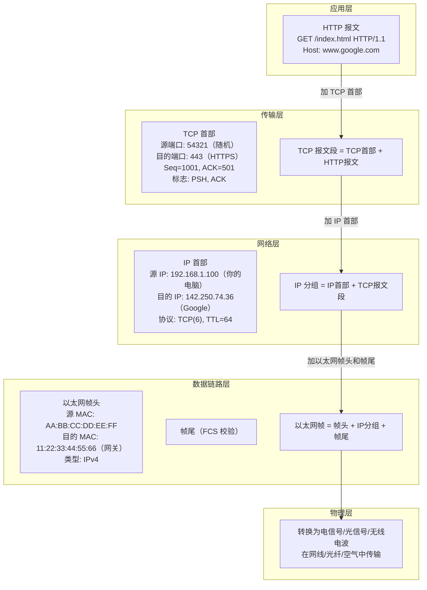

### 数据在网络中的旅途

注意：**数据从你的电脑到 Google 服务器，不是直接到达的，要经过多个路由器。**

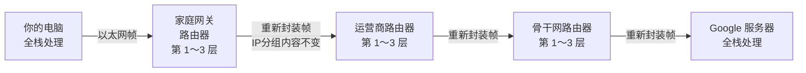

**路由器只处理到第 3 层（网络层）**：路由器不关心这个 IP 分组里装的是 HTTP 还是 DNS，也不关心这个 TCP 连接属于哪个进程。它只读取 IP 首部里的目的 IP 地址，查路由表，决定从哪个出口转发，然后重新封装成新的以太网帧发出去。

每经过一个路由器：IP 分组内容不变（TTL 字段减 1），以太网帧会被拆开重新封装（更新 MAC 地址）。

### 接收端：自下而上解封装

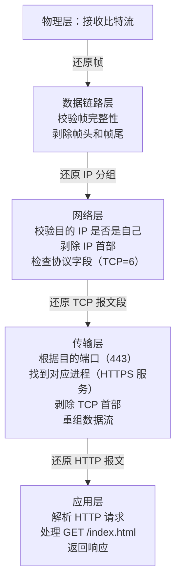

---

## 各层协议完整汇总

### 应用层常见协议

| 协议 | 传输层 | 端口 | 主要用途 | 安全版本 |
|------|--------|------|---------|---------|
| HTTP | TCP | 80 | Web 内容传输 | HTTPS（443） |
| FTP | TCP | 20/21 | 文件传输（明文） | SFTP / FTPS |
| SMTP | TCP | 25 / 587 | 电子邮件发送 | SMTPS（465） |
| POP3 | TCP | 110 | 邮件接收（下载后可删服务端副本） | POP3S（995） |
| IMAP | TCP | 143 | 邮件接收（多端同步，功能更强） | IMAPS（993） |
| DNS | UDP（主）/ TCP | 53 | 域名解析 | DoH / DoT |
| SSH | TCP | 22 | 加密远程登录与文件传输 | — （本身已加密） |
| Telnet | TCP | 23 | 远程登录（明文，已基本废弃） | 替换为 SSH |
| DHCP | UDP | 67/68 | 自动分配 IP 地址 | — |
| RTP | UDP（主）/ TCP | 动态 | 实时音视频传输（直播/通话） | SRTP |
| SNMP | UDP | 161 | 网络设备监控与管理 | SNMPv3 |

> 注意：SMTP 只负责**发送**邮件，接收邮件使用 POP3 或 IMAP。POP3 和 IMAP 的区别在于：POP3 将邮件下载到本地后可以从服务器删除，不支持多端同步；IMAP 在服务器端维护邮件状态，多个设备看到的是同一份数据，是现代电子邮件客户端的主流选择。

### 传输层协议对比

| 特性 | TCP | UDP |
|------|-----|-----|
| 连接方式 | 面向连接（三次握手） | 无连接 |
| 可靠性 | 可靠（确认+重传） | 不可靠（尽力而为） |
| 数据顺序 | 保证有序 | 不保证 |
| 首部开销 | 20～60 字节 | 8 字节 |
| 流量控制 | 有（滑动窗口） | 无 |
| 拥塞控制 | 有（慢启动等） | 无 |
| 传输效率 | 相对较低 | 高 |
| 适用场景 | 文件传输、网页、邮件 | 视频直播、DNS、游戏 |

### 网络层协议

| 协议 | 全称 | 核心作用 |
|------|------|---------|
| IP（IPv4 / IPv6） | 网际协议 | 逻辑寻址，定义数据包格式，跨网络路由 |
| ARP | 地址解析协议 | 将 IP 地址解析为 MAC 物理地址 |
| ICMP | 互联网控制报文协议 | 网络错误与状态消息（`ping` 的底层） |
| NAT | 网络地址转换 | 局域网私有 IP ↔ 公网 IP 的映射 |
| OSPF | 开放最短路径优先 | 内部路由协议，Dijkstra 最短路径算法 |
| RIP | 路由信息协议 | 内部路由协议，距离向量算法，最大 15 跳 |
| BGP | 边界网关协议 | 自治系统间路由，互联网骨干路由基础 |

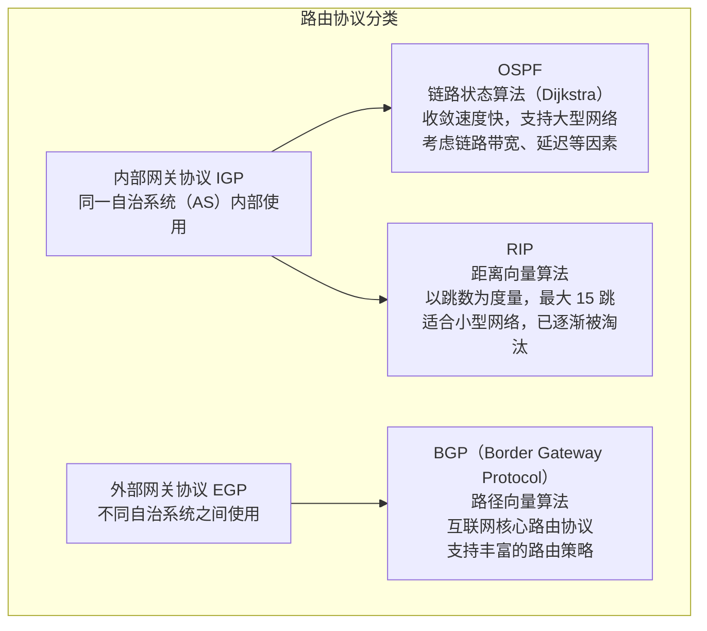

---

## 参考资料

**书籍**

1. James F. Kurose, Keith W. Ross. *Computer Networking: A Top-Down Approach*, 8th Edition. Pearson, 2021. — 五层协议模型，第 1 章与第 3 章
2. 谢希仁. *计算机网络*，第 8 版. 电子工业出版社，2021.
3. Andrew S. Tanenbaum, David J. Wetherall. *Computer Networks*, 5th Edition. Pearson, 2011.
4. W. Richard Stevens. *TCP/IP Illustrated, Volume 1: The Protocols*. Addison-Wesley, 1994. — TCP/IP 协议最权威的工程参考

**RFC 标准文档**

5. J. Postel. *Transmission Control Protocol*. **RFC 793**, IETF, September 1981. https://datatracker.ietf.org/doc/html/rfc793 — TCP 三次握手的原始规范
6. J. Postel. *User Datagram Protocol*. **RFC 768**, IETF, August 1980. https://datatracker.ietf.org/doc/html/rfc768
7. J. Postel. *Internet Protocol*. **RFC 791**, IETF, September 1981. https://datatracker.ietf.org/doc/html/rfc791
8. J. Postel. *Internet Control Message Protocol*. **RFC 792**, IETF, September 1981. https://datatracker.ietf.org/doc/html/rfc792
9. D. Plummer. *An Ethernet Address Resolution Protocol*. **RFC 826**, IETF, November 1982. https://datatracker.ietf.org/doc/html/rfc826
10. P. Mockapetris. *Domain Names — Concepts and Facilities*. **RFC 1034**, IETF, November 1987. https://datatracker.ietf.org/doc/html/rfc1034 — DNS 体系结构规范
11. P. Mockapetris. *Domain Names — Implementation and Specification*. **RFC 1035**, IETF, November 1987. https://datatracker.ietf.org/doc/html/rfc1035
12. J. Moy. *OSPF Version 2*. **RFC 2328**, IETF, April 1998. https://datatracker.ietf.org/doc/html/rfc2328
13. Y. Rekhter et al. *A Border Gateway Protocol 4 (BGP-4)*. **RFC 4271**, IETF, January 2006. https://datatracker.ietf.org/doc/html/rfc4271
14. V. Cerf, R. Kahn. *A Protocol for Packet Network Interconnection*. IEEE Transactions on Communications, May 1974. — TCP/IP 的奠基论文
15. ISO/IEC 7498-1:1994. *Information technology — Open Systems Interconnection — Basic Reference Model*. https://www.iso.org/standard/20269.html
