# 懂这 14 个概念，AI 开发不再靠猜

*最后更新：2026 年 3 月。面向希望系统了解 AI 工程基础的读者，从语言模型本身到工程应用层逐层拆解。所有数据均来自原始文档或论文，文末附参考来源。*

---

## 目录

- [LLM — 大语言模型](#llm--大语言模型)
- [Transformer — 驱动 LLM 的架构](#transformer--驱动-llm-的架构)
- [Token — 模型的最小处理单元](#token--模型的最小处理单元)
- [Context 与 Context Window — 模型的工作记忆](#context-与-context-window--模型的工作记忆)
- [Prompt — 与模型对话的语言](#prompt--与模型对话的语言)
- [Tool / Function Calling — 模型的手脚](#tool--function-calling--模型的手脚)
- [MCP — 工具接入的统一标准](#mcp--工具接入的统一标准)
- [Agent — 自主行动的 AI](#agent--自主行动的-ai)
- [Skills — Agent 的说明书](#skills--agent-的说明书)
- [多模态 — 不止于文字](#多模态--不止于文字)
- [RAG — 给模型装上外部记忆](#rag--给模型装上外部记忆)
- [Embedding — 意义的数学表达](#embedding--意义的数学表达)
- [Temperature 与采样 — 控制模型的创造力](#temperature-与采样--控制模型的创造力)
- [幻觉 — 模型最大的陷阱](#幻觉--模型最大的陷阱)
- [参考资料](#参考资料)

---

## LLM — 大语言模型

LLM（Large Language Model，大语言模型）是在海量文本数据上训练的神经网络模型，核心任务是：给定一段文本，预测下一个 Token 最可能是什么。

这个目标听起来简单，但在足够大的模型规模和足够多的训练数据下，会涌现出推理、翻译、编程、总结等几乎覆盖所有文字类任务的能力。这种现象被称为**涌现能力（Emergent Abilities）**，在 Wei et al.（2022）的论文《Emergent Abilities of Large Language Models》中被系统研究。

### 截至 2026 年 3 月的主流模型

| 模型 | 开发方 | Context Window | 特点 |
|------|-------|---------------|------|
| GPT-5 / GPT-5.4 | OpenAI | 400K tokens | 当前 OpenAI 旗舰，推理与编码双强 |
| o3 / o4-mini | OpenAI | 200K tokens | o 系列推理模型，擅长数学与科学 |
| GPT-4.1 | OpenAI | 1M tokens | 高性价比，指令遵循强 |
| Claude Opus 4.6 | Anthropic | 1M tokens | 旗舰级，长上下文性能出色 |
| Claude Sonnet 4.6 | Anthropic | 1M tokens | 接近 Opus 性能，价格为 Opus 的 60% |
| Gemini 2.5 Pro | Google DeepMind | 1M tokens | 编码与多模态推理领先 |
| Gemini 3.1 Pro | Google DeepMind | 1M tokens | 最新一代，已取代 2.5 系列 |
| Llama 3.3 | Meta | 128K tokens | 开源，可本地部署 |
| DeepSeek-V3 | 深度求索 | 128K tokens | 高性价比，MoE 架构，开源 |

> 数据来源：OpenAI API 文档（2025～2026）、Anthropic 官方发布公告（2026）、Google DeepMind Gemini 模型页面（2026）

---

## Transformer — 驱动 LLM 的架构

几乎所有现代 LLM 的底层架构都是 **Transformer**，出自 2017 年 Google 的论文：

> *Attention Is All You Need*
> Vaswani et al., Google Brain / Google Research, NeurIPS 2017

论文提出的核心机制是 **Self-Attention（自注意力）**：模型在处理一个词时，会同时"看"序列中所有其他词并计算相关性权重，而不是像 RNN 那样只能逐词顺序处理。这使得 Transformer 天然支持并行训练，可以扩展到数千亿参数。

### 简化架构

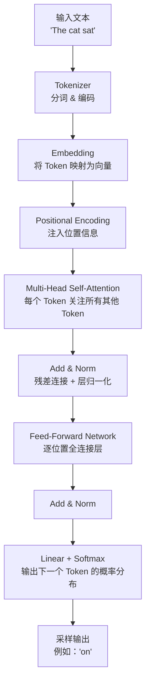

E1→E4 的结构称为一个 Transformer Block，在实际模型中会堆叠几十乃至上百层。

### Self-Attention 的直觉

以句子 `The animal didn't cross the street because it was too tired` 为例：模型在处理 `it` 时，Self-Attention 会自动将较高权重分配给 `animal` 而非 `street`，从而正确理解代词指向。这正是 Transformer 擅长捕捉长距离语义依赖的原因。

---

## Token — 模型的最小处理单元

模型不直接处理字符或完整单词，而是处理 **Token**。Tokenizer（分词器）负责将原始文本切分为 Token，并映射到整数 ID；解码时再将整数 ID 还原为文本。

### 分词的基本规律

根据 OpenAI 的官方说明，英文文本中 **1000 个 Token 大约对应 750 个英文单词**，即 1 个 Token 约等于 0.75 个英文单词，换算过来 1 个英文单词平均消耗约 1.3 个 Token。常见词可能恰好是 1 个 Token，罕见词或长词则会被拆成多个 Token。中文每个汉字通常对应 **1～2 个 Token**，具体取决于分词器实现。

### Token 的完整流程

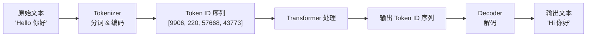

### 实际 Token 计数参考

| 输入内容 | 约消耗 Token 数 |
|---------|--------------|
| `Hello world` | 2 |
| `你好世界` | 4～6 |
| `Supercalifragilistic`（罕见长词） | 6 |
| `def calculate():` | 5 |
| 1000 个英文单词的文章 | ~1300 |
| 1000 个中文字的文章 | ~1500～2000 |

可以在 [OpenAI Tokenizer 工具](https://platform.openai.com/tokenizer) 中直观看到任意文本的分词结果。

---

## Context 与 Context Window — 模型的工作记忆

### Context

**Context（上下文）** 是模型在生成回复时能"看到"的所有内容，包括 System Prompt、历史对话、用户输入、工具返回结果等。

一个关键认知前提：**模型没有跨会话的持久记忆**。每次 API 请求，模型只能看到本次传入的 Context，上一次会话的内容如果不显式传入就完全不存在。

### Context Window

**Context Window（上下文窗口）** 是模型单次能处理的最大 Token 数量上限，同时涵盖输入（Prompt）和输出（Completion）。

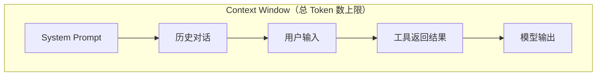

### 主流模型 Context Window 对比（2026 年）

| 模型 | Context Window | 备注 |
|------|---------------|------|
| Claude Opus 4.6 | 1M tokens | 标准价格，无长上下文溢价 |
| Claude Sonnet 4.6 | 1M tokens | 标准价格，无长上下文溢价 |
| GPT-4.1 | 1M tokens | OpenAI API，2025 年 4 月发布 |
| Gemini 2.5 Pro | 1M tokens（2M 实验性） | Google AI Studio / Vertex AI |
| GPT-5 | 400K tokens | 旗舰推理，128K 最大输出 |
| o3 / o4-mini | 200K tokens | OpenAI 推理模型 |
| Llama 3.3 70B | 128K tokens | Meta 开源 |

> 数据来源：Anthropic 官方发布公告（2026-02）、OpenAI API 文档（2025-04）、Google DeepMind Gemini 模型页面

Anthropic 在 Claude Opus 4.6 和 Sonnet 4.6 发布时明确宣布，标准价格适用于完整的 1M token 窗口，不再有长上下文溢价——相比 Gemini 和 GPT-5 系列在超出一定阈值后收取更高费率的做法，这是一个显著的差异化策略。

---

## Prompt — 与模型对话的语言

**Prompt** 是发送给模型的完整输入，通常由三类角色（Role）组成：

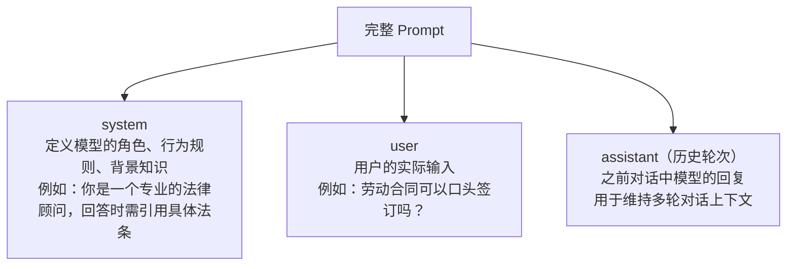

### Chain-of-Thought（思维链）

在提示中要求模型逐步推导，可以显著提升推理类任务的准确率：

> *Chain-of-Thought Prompting Elicits Reasoning in Large Language Models*
> Wei et al., Google Research, NeurIPS 2022

```
不加 CoT：
用户：一个班有 30 人，其中 40% 是女生，女生中 25% 戴眼镜，戴眼镜的女生有多少人？
模型：3 人（错误）

加 CoT：
用户：一个班有 30 人，其中 40% 是女生，女生中 25% 戴眼镜，请一步步计算。
模型：女生人数 = 30 × 40% = 12 人。戴眼镜的女生 = 12 × 25% = 3 人。答案：3 人。
```

### Few-Shot（少样本示例）

在 Prompt 中提供 2～5 个示例，引导模型按特定格式或风格输出，无需微调模型权重：

> *Language Models are Few-Shot Learners*（GPT-3 论文）
> Brown et al., OpenAI, NeurIPS 2020

```
System：以下是情感分析任务。
示例："今天天气真好" -> 正面
示例："服务太差了" -> 负面
示例："还行吧" -> 中性

User："这家餐厅的菜真的绝了！"
Assistant：正面
```

---

## Tool / Function Calling — 模型的手脚

LLM 本身只能处理文本，无法直接访问外部系统。Tool 机制让模型可以调用外部 API、执行代码、读写文件、查询数据库等。

### 工作流程

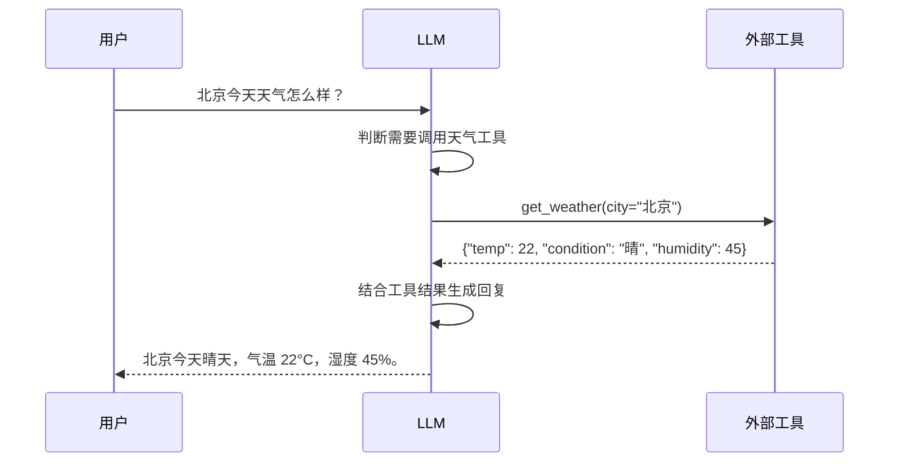

### 工具定义示例

OpenAI 与 Anthropic 的工具描述格式基本一致，均为 JSON Schema：

```json
{
  "name": "get_weather",
  "description": "获取指定城市的当前天气信息",
  "parameters": {
    "type": "object",
    "properties": {
      "city": {
        "type": "string",
        "description": "城市名称，例如：北京、上海"
      }
    },
    "required": ["city"]
  }
}
```

OpenAI 将此功能称为 Function Calling，Anthropic 称为 Tool Use，两者概念相同，格式略有差异。

---

## MCP — 工具接入的统一标准

### 背景：工具接入的碎片化问题

MCP 出现之前，每个 AI 应用都需要为每个外部工具单独写集成代码，形成 M × N 的集成组合——M 个 AI 应用乘以 N 个工具。

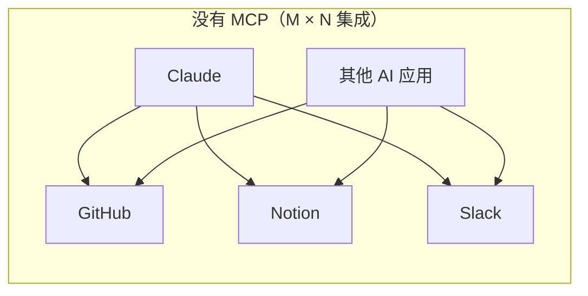

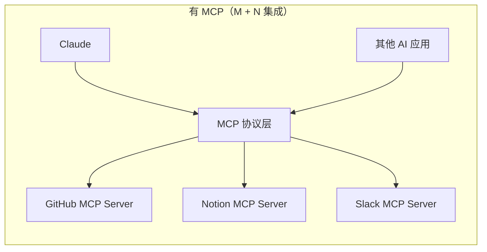

### MCP 是什么

**MCP（Model Context Protocol，模型上下文协议）** 由 Anthropic 于 2024 年 11 月开源发布，定义了 LLM 应用与外部工具、数据源之间的标准通信格式。

> *MCP is an open protocol that standardizes how applications provide context to LLMs.*
> Anthropic MCP 官方文档，2024

### MCP 架构

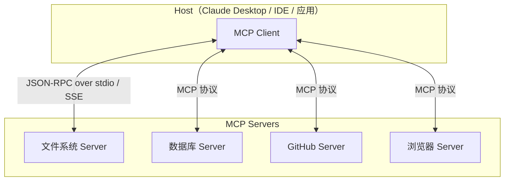

MCP Server 对外暴露三类能力：Tools（模型可调用的函数）、Resources（模型可读取的数据）、Prompts（预定义的提示词模板）。

规范与 SDK 已在 GitHub 开源：https://github.com/modelcontextprotocol

---

## Agent — 自主行动的 AI

**Agent（智能体）** 是能够自主感知环境、制定计划、调用工具，并循环执行直到完成目标的 AI 系统。与普通单次问答不同，Agent 遵循一个感知 → 思考 → 行动的循环。

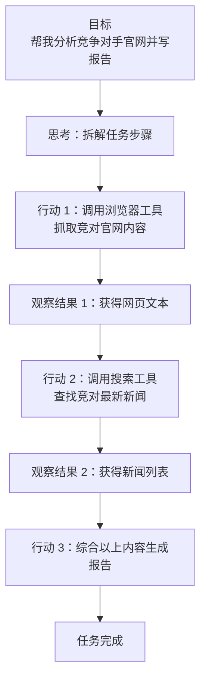

### ReAct 框架

目前主流的 Agent 推理范式是 **ReAct（Reasoning + Acting）**，在每步中交替进行推理（Thought）和行动（Action），并观察结果（Observation）：

> *ReAct: Synergizing Reasoning and Acting in Language Models*
> Yao et al., Princeton / Google Research, ICLR 2023

```
Thought: 我需要先了解用户提到公司的最新营收数据
Action:   search("Apple Q3 2024 revenue")
Observation: 苹果 2024 年 Q3 营收为 857 亿美元...

Thought: 已有数据，继续获取对比方数据
Action:   search("Microsoft Q3 2024 revenue")
Observation: 微软 2024 年 Q3 营收为 647 亿美元...

Thought: 数据收集完毕，开始撰写分析
Action:   finish("苹果 Q3 营收 857 亿美元，同比增长 5%；微软...")
```

### 多 Agent 协作

复杂任务可以拆给多个专职 Agent 并行处理，由一个 Orchestrator 统筹：

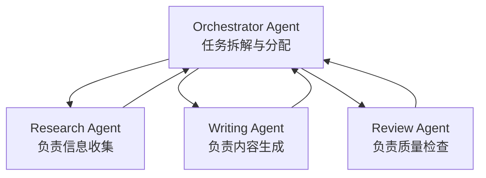

Anthropic 在 Claude 的 API 文档中明确描述了多 Agent 系统的构建方式，包括每个子 Agent 拥有独立的上下文和工具权限。Claude Code 中的 `agent team` 功能（随 Opus 4.6 一同发布）正是这一架构的产品化体现。

---

## Skills — Agent 的说明书

**Skills（技能文档）** 是专门写给 Agent 的操作手册，指导 Agent 在面对特定类型任务时如何处理。

### 核心结构

```
Skill
├── name         技能名称（短标识符，用于索引）
├── description  功能描述（决定 Agent 是否加载此 Skill）
└── content      详细操作步骤、示例、注意事项
```

### 延迟加载机制

大模型的上下文只会加载 `name` 和 `description`，不会加载 `content`。只有在任务匹配到某个 Skill 的描述时，才将其 `content` 注入上下文执行。

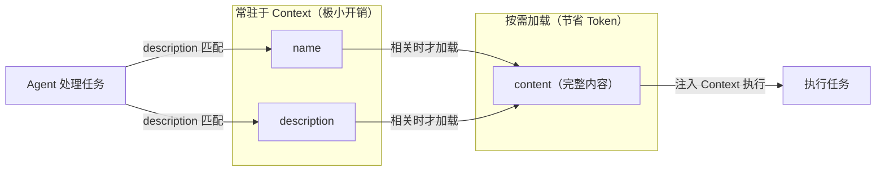

这样设计的目的是节省 Context Window——如果同时加载所有 Skill 的完整内容，会迅速消耗大量 Token 配额，并干扰模型对当前任务的专注度。

---

## 多模态 — 不止于文字

**多模态（Multimodal）** 指模型能够同时理解和生成多种类型的数据，而不仅限于文本。

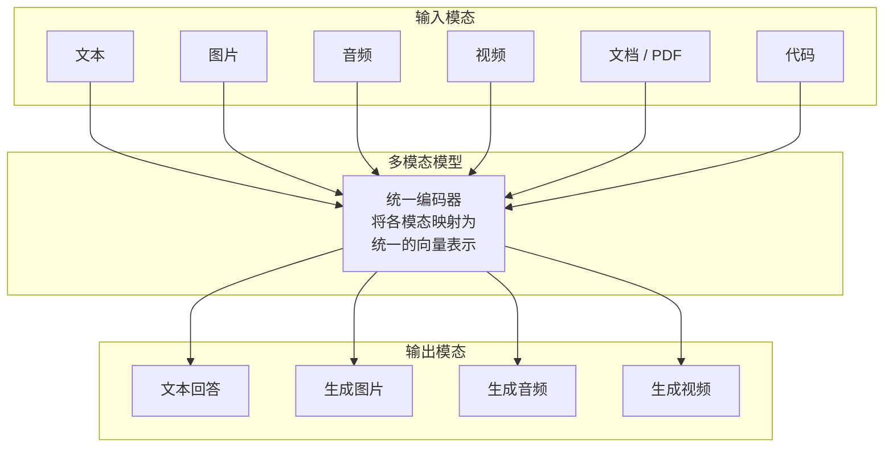

### 各模态代表模型（2025～2026）

| 能力 | 代表模型 | 说明 |
|------|---------|------|
| 图像理解 | GPT-5、Claude Opus 4.6、Gemini 2.5 Pro | 识别图片内容、OCR、图表解析 |
| 图像生成 | GPT-image-1（OpenAI）、Imagen 3（Google） | 文字生成图片，支持图片编辑 |
| 语音识别 | Whisper（OpenAI）、gpt-4o-transcribe | 音频转文字 |
| 语音合成 | OpenAI TTS、Gemini 2.5 Flash TTS、ElevenLabs | 文字转语音 |
| 视频理解 | Gemini 2.5 Pro、GPT-5 | 理解视频内容 |
| 视频生成 | Sora（OpenAI）、Veo 3（Google） | 文字生成视频 |

> *Robust Speech Recognition via Large-Scale Weak Supervision*（Whisper 论文）
> Radford et al., OpenAI, ICML 2023

---

## RAG — 给模型装上外部记忆

LLM 有两个天然局限：训练数据有截止日期，无法知道最新信息；Context Window 有限，无法将所有私有文档塞入上下文。**RAG（Retrieval-Augmented Generation，检索增强生成）** 是目前解决这两个问题的主流工程方案。

> *Retrieval-Augmented Generation for Knowledge-Intensive NLP Tasks*
> Lewis et al., Facebook AI Research, NeurIPS 2020

### RAG 工作流程

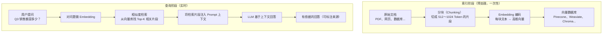

### 有无 RAG 的效果对比

| 维度 | 无 RAG | 有 RAG |
|------|-------|-------|
| 知识来源 | 仅训练数据 | 训练数据 + 实时检索 |
| 私有数据访问 | 不支持 | 支持检索私有文档 |
| 知识时效 | 受截止日期限制 | 可实时更新 |
| 回答可溯源 | 难以验证 | 可标注原文来源 |

上下文窗口的扩大（如 Claude 4.6 的 1M tokens）并不能完全取代 RAG。当文档总量远超窗口大小，或需要精确检索特定段落时，RAG 仍然是更高效的选择。

---

## Embedding — 意义的数学表达

**Embedding（嵌入）** 是将文本映射为高维向量的技术，语义相似的文本在向量空间中距离更近。

```
"猫"    → [0.21, -0.45, 0.88, ...]   （1536 维向量）
"猫咪"  → [0.22, -0.43, 0.86, ...]   （与上面非常接近）
"汽车"  → [-0.67, 0.31, -0.12, ...]  （与上面差距很大）
```

两个向量之间通常用**余弦相似度**衡量语义相近程度，值域 [-1, 1]，越接近 1 表示语义越相似：

$$\text{similarity}(A, B) = \frac{A \cdot B}{|A| \cdot |B|}$$

Embedding 是 RAG、语义搜索、推荐系统等应用场景的技术基础。常用的 Embedding 模型包括 OpenAI `text-embedding-3-large`、Google `text-embedding-004`、开源的 BGE 系列等。

---

## Temperature 与采样 — 控制模型的创造力

### Temperature

**Temperature** 控制模型输出的随机程度，取值通常在 [0, 2] 之间：

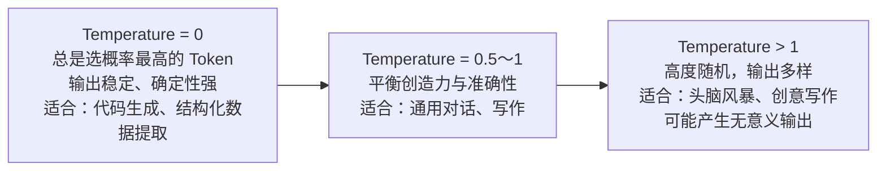

### Top-P（核采样）

**Top-P（Nucleus Sampling）** 只从累计概率达到 P 的候选 Token 中采样，是另一种控制随机性的参数。

> *The Curious Case of Neural Text Degeneration*
> Holtzman et al., University of Washington, ICLR 2020

| 参数组合 | 推荐场景 |
|---------|---------|
| `temperature=0` | 代码生成、数据提取、填表 |
| `temperature=0.7, top_p=0.9` | 通用对话、问答 |
| `temperature=1.0, top_p=0.95` | 创意写作、头脑风暴 |

推理模型（如 OpenAI o3、Claude 4.6 的 extended thinking 模式）通常不直接暴露 Temperature 参数，而是通过 `thinking budget`（Anthropic）或内置推理控制来调节输出质量与速度的权衡。

---

## 幻觉 — 模型最大的陷阱

**幻觉（Hallucination）** 指模型生成看起来合理但实际上是错误或捏造的内容——如不存在的论文引用、虚假的历史事件、错误的代码逻辑。

根本原因：LLM 的训练目标是预测"下一个 Token 最可能是什么"，而非"是否真实"。模型并不区分"知道的事"和"听起来合理的事"。

### 幻觉的分类

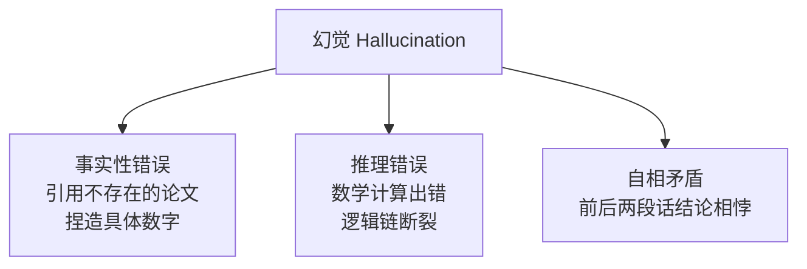

### 缓解策略

| 策略 | 原理 |
|------|------|
| RAG | 让模型基于检索到的真实文档回答，而非凭训练记忆 |
| 降低 Temperature | 减少随机性，倾向选择概率最高的 Token |
| 要求引用来源 | 在 Prompt 中要求模型标注信息出处，便于核查 |
| Self-Consistency | 多次采样，取一致性最高的答案 |
| RLHF / RLAIF | 通过人类或 AI 反馈进行强化学习微调，降低错误输出概率 |

> *Survey of Hallucination in Natural Language Generation*
> Ji et al., ACM Computing Surveys, 2023

---

## 参考资料

**论文**

1. Vaswani et al. *Attention Is All You Need*. NeurIPS 2017. https://arxiv.org/abs/1706.03762
2. Brown et al. *Language Models are Few-Shot Learners* (GPT-3). NeurIPS 2020. https://arxiv.org/abs/2005.14165
3. Wei et al. *Chain-of-Thought Prompting Elicits Reasoning in Large Language Models*. NeurIPS 2022. https://arxiv.org/abs/2201.11903
4. Wei et al. *Emergent Abilities of Large Language Models*. TMLR 2022. https://arxiv.org/abs/2206.07682
5. Yao et al. *ReAct: Synergizing Reasoning and Acting in Language Models*. ICLR 2023. https://arxiv.org/abs/2210.03629
6. Lewis et al. *Retrieval-Augmented Generation for Knowledge-Intensive NLP Tasks*. NeurIPS 2020. https://arxiv.org/abs/2005.11401
7. Radford et al. *Robust Speech Recognition via Large-Scale Weak Supervision* (Whisper). ICML 2023. https://arxiv.org/abs/2212.04356
8. Holtzman et al. *The Curious Case of Neural Text Degeneration*. ICLR 2020. https://arxiv.org/abs/1904.09751
9. Ji et al. *Survey of Hallucination in Natural Language Generation*. ACM Computing Surveys 2023. https://arxiv.org/abs/2202.03629

**官方文档**

10. Anthropic. *Introducing Claude Opus 4.6*. 2026-02. https://www.anthropic.com/news/claude-opus-4-6
11. Anthropic. *Introducing Claude Sonnet 4.6*. 2026-02. https://www.anthropic.com/news/claude-sonnet-4-6
12. Anthropic. *Models overview*. https://docs.anthropic.com/en/docs/about-claude/models/overview
13. OpenAI. *Models*. https://platform.openai.com/docs/models
14. OpenAI. *Introducing OpenAI o3 and o4-mini*. 2025-04. https://openai.com/index/introducing-o3-and-o4-mini/
15. OpenAI. *Tokenizer tool*. https://platform.openai.com/tokenizer
16. Google DeepMind. *Gemini 2.5: Our newest Gemini model with thinking*. 2025-03. https://blog.google/technology/google-deepmind/gemini-model-thinking-updates-march-2025/
17. Google. *Gemini API Release notes*. https://ai.google.dev/gemini-api/docs/changelog
18. Anthropic. *Model Context Protocol*. https://github.com/modelcontextprotocol
