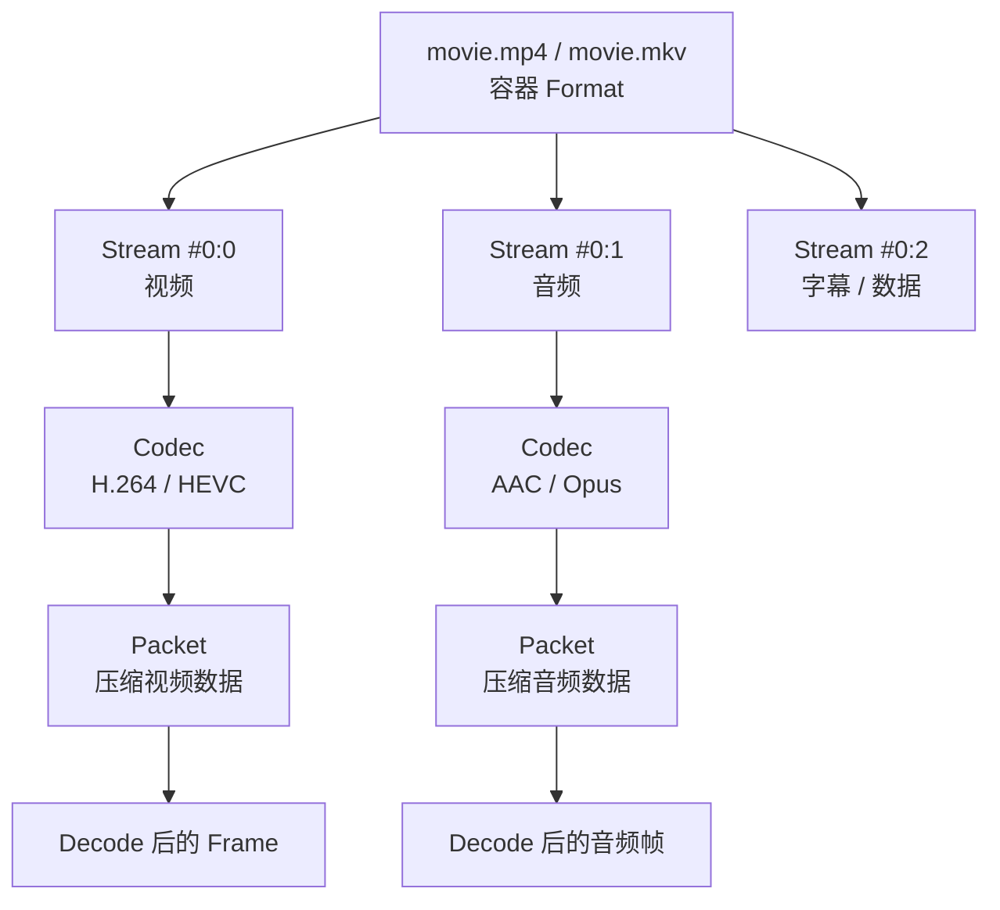

把一个视频文件先看成“一个容器，里面装着多条媒体流”。理解这句话，就能读懂大多数 FFmpeg 命令。

## 容器、编码和 Stream



图中从上到下是“文件里有什么”，从 `Packet` 到 `Frame` 则是“处理时发生了什么”。容器负责组织和索引，Codec 负责压缩规则，Stream 是容器里的媒体轨道；三者不能用文件后缀互相替代。

| 概念 | 作用 | 例子 |
| --- | --- | --- |
| 容器（container/format） | 组织、索引和保存多条流 | MP4、MKV、MOV、MPEG-TS |
| 编码（codec） | 压缩一条视频或音频流的方式 | H.264、H.265、AV1、AAC、Opus |
| Stream | 容器中的一条连续媒体数据 | 视频、音频、字幕 |

`.mp4` 是容器名，不等于 H.264；同一个 H.264 视频也可以放在 MP4 或 MKV 中。改文件名后缀不会改容器：

```powershell
Rename-Item input.mkv renamed.mp4
```

这只是改名。真正的换容器要让 FFmpeg 读取并写出新文件：

```powershell
ffmpeg -i input.mkv -c copy output.mp4
```

若目标容器不支持某条输入流，复制会失败；那时需要调整流、转码或选择另一个容器。

## 视频先看四个属性

| 属性 | 例子 | 先怎样理解 |
| --- | --- | --- |
| 编码 | `h264`、`hevc` | 播放器需要有对应解码能力 |
| 分辨率 | `1920x1080` | 每帧的宽和高，不能单独代表画质 |
| 帧率 | `30000/1001`、`25` | 每秒的帧节奏；分数不要先四舍五入 |
| 像素格式 | `yuv420p` | 每个像素如何存储，影响兼容性和色彩 |

```powershell
ffprobe -v error -select_streams v:0 -show_entries stream=codec_name,width,height,pix_fmt,r_frame_rate,avg_frame_rate -of json input.mp4
```

`r_frame_rate` 和 `avg_frame_rate` 用途不同，不能只拿其中一个当作所有视频的“真实 FPS”。遇到可变帧率时，进一步检查帧时间戳。

## 音频先看四个属性

| 属性 | 例子 | 先怎样理解 |
| --- | --- | --- |
| 编码 | `aac`、`opus`、`mp3` | 决定解码和目标容器兼容性 |
| 采样率 | `48000` | 每秒采集多少个采样点 |
| 声道数/布局 | `2`、`stereo`、`5.1` | 有几路声音以及各自位置 |
| 码率/采样格式 | `128k`、`fltp` | 压缩量和采样值的存储方式 |

```powershell
ffprobe -v error -select_streams a:0 -show_entries stream=codec_name,sample_rate,channels,channel_layout,sample_fmt,bit_rate -of json input.mp4
```

## 用 ffprobe 读全貌

人工快速查看：

```powershell
ffprobe -hide_banner input.mp4
```

程序需要稳定读取时，使用 JSON：

```powershell
ffprobe -v error -show_format -show_streams -of json input.mp4
```

这里有两个层级：

- `format` 描述整个容器，如格式名、总时长和文件大小；
- `streams` 描述每一条视频、音频、字幕或数据流。

只看视频或音频：

```powershell
ffprobe -v error -select_streams v -show_streams -of json input.mp4
ffprobe -v error -select_streams a -show_streams -of json input.mp4
```

只取少量字段：

```powershell
ffprobe -v error -show_entries "format=format_name,duration,size:stream=index,codec_type,codec_name,width,height,sample_rate,channels" -of json input.mp4
```

`-select_streams` 过滤要查看的流，`-show_entries` 过滤要显示的字段，`-of json` 选择输出格式；三者不是同一个功能。

## Stream 编号怎么读

日志中的 `Stream #0:1` 表示“第 0 个输入中的全局流索引 1”。常用选择写法是：

| 写法 | 含义 |
| --- | --- |
| `0:v:0` | 第 0 个输入匹配到的第一条视频流 |
| `0:a:0` | 第 0 个输入匹配到的第一条音频流 |
| `0:s:0` | 第 0 个输入匹配到的第一条字幕流 |
| `0:2` | 第 0 个输入中全局索引为 2 的流 |

不要假设 `0:0` 永远是视频、`0:1` 永远是音频。先用 `ffprobe` 看 `index` 和 `codec_type`，再决定后续映射；`-map` 会在第 04 篇介绍。

## 时长和时间：先知道边界

容器可能给出总时长：

```powershell
ffprobe -v error -show_entries "format=start_time,duration:stream=index,time_base,start_time,duration" -of json input.mp4
```

实时流、管道或索引不完整时，时长可能是 `N/A`，这不单独等于文件损坏。视频的 PTS（呈现时间）和 DTS（解码时间）也可能不同，尤其在存在 B 帧时；现在只需知道时间参数不能脱离时间轴解释。精确切片和时间戳问题见第 03、05、06 篇。

## 先建立输入事实

开始处理前至少记录：

1. 容器格式和总时长是否可读；
2. 每条流的 `index`、类型和编码；
3. 视频宽高、帧率、像素格式；
4. 音频采样率、声道数和语言标签（如果有）。

这些是选择 `-c copy`、`-map`、输出容器和编码参数的依据。不要从文件后缀或一条日志猜测完整媒体结构。

## 当前阶段不用深入的内容

Packet、Frame、time base、关键帧和色彩元数据都很重要，但它们是为切片、同步、滤镜和排错服务的。先能用 `ffprobe` 读出容器和 Stream，再按第 03 篇完成任务；需要精确时间轴时回到这里补充。

依据：[ffprobe 官方文档](https://ffmpeg.org/ffprobe.html)；[FFmpeg 命令行中的媒体处理说明](https://ffmpeg.org/ffmpeg.html#Detailed-description)。
