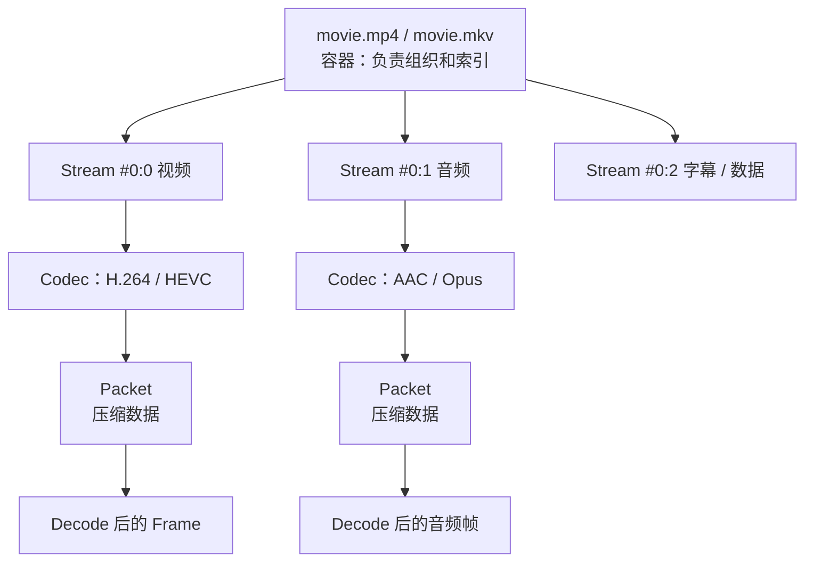

把一个视频文件先看成“一个容器，里面装着几条 Stream”。理解这句话，就能读懂大多数 FFmpeg 命令。

## 容器、编码和 Stream

```text
movie.mp4          ← 容器（Format）
├── Stream #0:0    视频轨道    编码：H.264
├── Stream #0:1    音频轨道    编码：AAC
└── Stream #0:2    字幕轨道    编码：mov_text
```



图的上半部分是“文件里有什么”，下半部分是“处理时发生了什么”。三个名字不要用文件后缀互相替代：

| 概念 | 作用 | 例子 |
| --- | --- | --- |
| 容器（container / format） | 组织、索引、保存多条流 | MP4、MKV、MOV、MPEG-TS |
| 编码（codec） | 一条视频或音频怎样压缩 | H.264、H.265、AV1、AAC、Opus |
| Stream | 容器里的一条连续媒体轨道 | 视频、音频、字幕 |

`.mp4` 是容器名，不等于 H.264。同一段 H.264 也可以放进 MP4 或 MKV。改后缀不会换容器：

```powershell
Rename-Item input.mkv renamed.mp4
```

这只是改名。真正换容器要让 FFmpeg 读出来再写进去：

```powershell
ffmpeg -i input.mkv -c copy output.mp4
```

若目标容器装不下某条输入流，复制会失败；那时再改选流、转码或换一种容器。

## 视频先看四个属性

| 属性 | 例子 | 先怎样理解 |
| --- | --- | --- |
| 编码 | `h264`、`hevc` | 播放器要有对应解码能力 |
| 分辨率 | `1920x1080` | 每帧的宽和高，不能单独代表画质 |
| 帧率 | `30000/1001`、`25` | 每秒的帧节奏；分数先不要四舍五入 |
| 像素格式 | `yuv420p` | 像素怎么存，影响兼容性和色彩 |

```powershell
ffprobe -v error -select_streams v:0 -show_entries stream=codec_name,width,height,pix_fmt,r_frame_rate,avg_frame_rate -of json input.mp4
```

这条命令在问：第一条视频流的编码、尺寸、像素格式和帧率是什么。

`r_frame_rate` 和 `avg_frame_rate` 不是同一个值。FFmpeg 源码注释里，`r_frame_rate` 是“能准确表示所有时间戳的最低帧率”的估计，并写明这只是 guess；`avg_frame_rate` 是平均帧率。不要把其中某一个当成所有视频的真实播放 FPS。遇到可变帧率，再去看帧时间戳。

## 音频先看四个属性

| 属性 | 例子 | 先怎样理解 |
| --- | --- | --- |
| 编码 | `aac`、`opus`、`mp3` | 决定解码和目标容器能不能装 |
| 采样率 | `48000` | 每秒多少个采样点 |
| 声道数 / 布局 | `2`、`stereo`、`5.1` | 有几路声音、各自在哪 |
| 码率 / 采样格式 | `128k`、`fltp` | 压缩量和采样值怎么存 |

```powershell
ffprobe -v error -select_streams a:0 -show_entries stream=codec_name,sample_rate,channels,channel_layout,sample_fmt,bit_rate -of json input.mp4
```

## 用 ffprobe 读全貌

人工快速看：

```powershell
ffprobe -hide_banner input.mp4
```

程序需要稳定读取时，用 JSON：

```powershell
ffprobe -v error -show_format -show_streams -of json input.mp4
```

这里有两层：

- `format`：整个容器，如格式名、总时长、文件大小；
- `streams`：每一条视频、音频、字幕或数据轨道。

只看视频或音频：

```powershell
ffprobe -v error -select_streams v -show_streams -of json input.mp4
ffprobe -v error -select_streams a -show_streams -of json input.mp4
```

只取少量字段：

```powershell
ffprobe -v error -show_entries "format=format_name,duration,size:stream=index,codec_type,codec_name,width,height,sample_rate,channels" -of json input.mp4
```

三个选项职责不同，不要混成一个：

```text
-select_streams   看哪些轨道
-show_entries     打印哪些字段
-of json          结果用什么格式
```

更完整的查询写法见 [FFprobe 命令查询与理解](/tutorials/t2er6pk59/)。

## Stream 编号怎么读

日志里的 `Stream #0:1` 表示“第 0 个输入里，全局索引为 1 的那条流”。后面写 `-map` 时常用：

| 写法 | 含义 |
| --- | --- |
| `0:v:0` | 第 0 个输入里匹配到的第一条视频 |
| `0:a:0` | 第 0 个输入里匹配到的第一条音频 |
| `0:s:0` | 第 0 个输入里匹配到的第一条字幕 |
| `0:2` | 第 0 个输入里全局索引为 2 的流 |

```text
文件 input.mkv
Stream #0:0  video   ←  0:v:0  也是 0:0
Stream #0:1  audio   ←  0:a:0  也是 0:1
Stream #0:2  audio   ←  0:a:1  也是 0:2
```

不要假设 `0:0` 永远是视频、`0:1` 永远是音频。先看 `index` 和 `codec_type`，再决定映射。`-map` 在第 04 篇展开。

## 时长和时间：先知道边界

```powershell
ffprobe -v error -show_entries "format=start_time,duration:stream=index,time_base,start_time,duration" -of json input.mp4
```

实时流、管道或索引不完整时，时长可能是 `N/A`，这不单独等于文件损坏。视频还可能同时有 PTS（什么时候显示）和 DTS（什么时候解码），有 B 帧时两者经常不同。现在只需记住：时间参数不能脱离时间轴解释。精确切片见第 03、05 篇，码流里的 PTS/DTS 见 [码流篇](/tutorials/tffmpeg-bitstream/)。

## 动手前先记下这些事实

1. 容器格式和总时长是否可读；
2. 每条流的 `index`、类型和编码；
3. 视频宽高、帧率、像素格式；
4. 音频采样率、声道数和语言标签（如果有）。

这些是选择 `-c copy`、`-map`、输出容器和编码参数的依据。不要从文件后缀或一条日志猜测完整结构。

Packet、Frame、time base 和关键帧都很重要，但它们是为切片、同步、滤镜和排错服务的。先能用 `ffprobe` 读出容器和 Stream，再按第 03 篇完成任务。

依据：[ffprobe 官方文档](https://ffmpeg.org/ffprobe.html)；[FFmpeg 命令行中的媒体处理说明](https://ffmpeg.org/ffmpeg.html#Detailed-description)。
