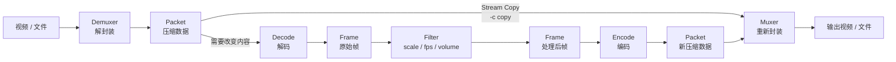

这一篇先解决最常见的文件任务。命令省略了多轨控制，默认输入结构简单；遇到多条视频、音频或字幕时，先看第 04 篇。

## 先分清：复制还是转码

视频或文件进入 FFmpeg 后，核心处理链可以画成下面这样。注意 `Filter` 的拼写：它是滤镜阶段，不是 `fliter`。



`-c copy` 复制压缩后的 Packet，不会缩放、加水印、改变声音或转换编码。只要媒体内容发生变化，对应的流就必须解码并重新编码。

| 任务目标 | 关键配置 | 实际经过的路径 |
| --- | --- | --- |
| 只换容器 | `-c copy` | Demuxer → Packet → Muxer |
| 缩放、裁剪、抽帧 | `-vf` + `-c:v` | Packet → Decode → Frame → Filter → Frame → Encode |
| 调整音量 | `-af` + `-c:a` | 音频 Packet → Decode → Filter → Encode；未改视频可 `-c:v copy` |
| 只输出某类流 | `-map`、`-an` / `-vn` | 先选择流，再对选中的流复制或编码 |

## 换容器（转封装）

```powershell
ffmpeg -i input.mkv -c copy output.mp4
```

这条命令适合输入流已被 MP4 支持的情况。若失败，先探测编码和流类型：

```powershell
ffprobe -v error -show_entries "stream=index,codec_type,codec_name:format=format_name" -of json input.mkv
```

不要把“改后缀”当成换容器；`Rename-Item` 不会修改媒体字节。

## 基本转码

```powershell
ffmpeg -i input.mkv -c:v libx264 -c:a aac output.mp4
```

视频和音频都会进入解码、编码路径。编码器名称必须出现在本机的 `ffmpeg -encoders` 中；目标容器、播放器和输入流决定是否还需要调整像素格式或音频参数。

## 缩放视频

把宽度限制为 1280，保持比例：

```powershell
ffmpeg -i input.mp4 -vf "scale=w=1280:h=-2:force_original_aspect_ratio=decrease" -c:v libx264 -c:a copy output.mkv
```

`scale` 处理解码后的画面，因此视频不能同时使用 `-c:v copy`；音频未改变时可以复制。`-2` 让滤镜按比例计算高度并取适合常见编码器的偶数值。

只想输出视频时：

```powershell
ffmpeg -i input.mp4 -vf "scale=1280:-2" -an -c:v libx264 output.mp4
```

## 截取一段视频

快速切片（不重新编码）：

```powershell
ffmpeg -ss 00:01:00 -i input.mp4 -t 00:00:30 -c copy fast-clip.mp4
```

输入前的 `-ss` 通常能快速跳到附近位置，但起点受关键帧和时间戳影响，前几帧可能不是精确切点。

精确切片（解码后重新编码）：

```powershell
ffmpeg -i input.mp4 -ss 00:01:00 -t 00:00:30 -c:v libx264 -c:a aac accurate-clip.mp4
```

精度越高通常代价越大。`-t` 表示持续时长；`-to` 表示到某个时间点停止；两者同时出现时 `-t` 优先，实践中只选一个。首尾画面和声音仍应实际播放检查。

## 提取一张图片

```powershell
ffmpeg -ss 00:00:10 -i input.mp4 -frames:v 1 -q:v 2 snapshot.jpg
```

`-frames:v 1` 只输出一帧。`-q:v` 的具体范围和含义由 JPEG 等图像编码器决定，不能当成统一的百分比画质。

## 按固定频率抽帧

先创建目录：

```powershell
New-Item -ItemType Directory -Force .\frames | Out-Null
```

每秒一张：

```powershell
ffmpeg -i input.mp4 -vf "fps=1" .\frames\frame-%05d.jpg
```

每 10 秒一张：

```powershell
ffmpeg -i input.mp4 -vf "fps=1/10" .\frames\frame-%05d.jpg
```

`%05d` 是顺序编号模板，不是原始时间戳。输入很长时先限制时长，避免一次生成过多图片。

## 提取音频

把第一条音频重新编码为 AAC：

```powershell
ffmpeg -i input.mp4 -vn -c:a aac -b:a 192k audio.m4a
```

如果源音频本来就是 AAC，且目标容器兼容，可以直接复制：

```powershell
ffmpeg -i input.mp4 -vn -c:a copy audio.m4a
```

输入有多条音频时不能依赖“第一条”的假设，应先用第 02 篇的 `ffprobe` 查看，再用第 04 篇的 `-map` 指定。

## 调整音量

音量改变了音频采样，必须重新编码：

```powershell
ffmpeg -i input.mp4 -af "volume=1.5" -c:v copy -c:a aac -b:a 128k output.mkv
```

滤镜只作用于音频，视频仍可以复制；如果目标容器不接受源视频编码，再改用视频编码器。

## 输出文件的最小验收

每个任务至少执行：

```powershell
ffprobe -v error -show_format -show_streams -of json output.mp4
ffmpeg -v error -i output.mp4 -f null -
```

第一条检查容器和流，第二条让 FFmpeg 实际解码并丢弃结果。最后用 `ffplay output.mp4` 检查画面、声音和切点。退出码、探测、完整解码和播放分别回答不同问题，不能互相替代。

## 何时进入下一篇

如果命令遇到“选错音轨”“输出缺少字幕”“两个输入合成”或“同一文件要生成多个版本”，不要继续堆参数，进入第 04 篇学习 `-map`；如果要理解滤镜链、CRF、码率和参数位置，进入第 05 篇。

依据：[FFmpeg 官方命令与转码说明](https://ffmpeg.org/ffmpeg.html)；[scale 与 fps 滤镜](https://ffmpeg.org/ffmpeg-filters.html#scale-1)。
