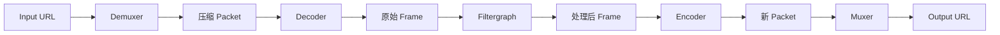
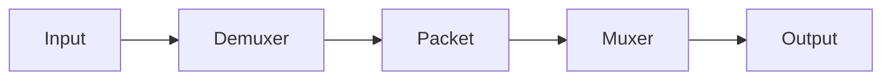
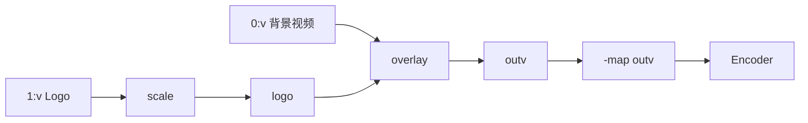

处理性能和质量损失由数据路径决定：内容不变时，压缩 Packet 直接进入新容器；内容发生变化时，Packet 解码为 Frame，再经过滤镜和编码器。

## 链路模型



| 环节 | 输入 | 输出 | 典型职责 |
| --- | --- | --- | --- |
| Demuxer | 文件、流、设备 | 各 Stream 的 Packet | 解析容器，拆出音视频和字幕 |
| Decoder | 压缩 Packet | 原始 Frame | 将 H.264、AAC 等解码 |
| Filtergraph | 原始 Frame | 处理后 Frame | 缩放、裁剪、叠加、混音、抽帧 |
| Encoder | 原始 Frame | 新的压缩 Packet | 编码为 H.264、H.265、AAC 等 |
| Muxer | 多条 Packet | 输出容器或协议 | 写入 MP4、MKV、MPEG-TS、HLS 等 |

FFmpeg 会依据输入内容和 URL 选择 Demuxer，也会依据输出扩展名或 `-f` 选择 Muxer。原始数据、管道和无扩展名 URL 经常需要显式指定格式。

## Stream Copy



```powershell
ffmpeg -i input.mkv -map 0:v:0 -map 0:a:0? -c copy output.mkv
```

Stream Copy 的约束：

- 不经过 Decoder、Filter 和 Encoder；
- 速度快，CPU 开销小；
- 不产生重新编码的画质损失；
- 不能改变分辨率、帧率、画面、声音内容或编码格式；
- 仍可能修改容器层的时间戳、元数据和封装结构；
- 目标容器必须支持被复制的编码和 Stream 类型。

`copy` 是 `-c` 的特殊值，不是一种编码器。

## Transcoding

```powershell
ffmpeg -i input.mov -map 0:v:0 -map 0:a:0? -c:v libx264 -crf 23 -preset medium -c:a aac -b:a 128k output.mp4
```

该命令会对选中的视频和音频解码并重新编码。以下变化会使相应 Stream 进入转码路径：

- 改变编码格式；
- 控制有损编码质量或码率；
- 目标播放器不支持源编码；
- 需要使用 Filter 修改内容；
- 需要统一批量输入的规格。

没有显式 `-c` 时，FFmpeg 会为输出 Stream 选择该 Muxer 注册的默认编码器；这通常意味着转码，而不是自动复制。工程命令应明确写出预期编码器。

## 混合处理

只转码需要变化的 Stream：

```powershell
ffmpeg -i input.mp4 -map 0:v:0 -map 0:a:0? -c:v libx264 -crf 23 -preset medium -c:a copy output.mkv
```

这里视频经过完整解码和编码，音频 Packet 直接复制。是否能输出为 MP4 或 MKV，取决于源音频编码是否被目标容器和目标播放器接受。

## Simple Filtergraph

单输入、单输出且媒体类型相同的滤镜图使用 `-vf` 或 `-af`：

```powershell
ffmpeg -i input.mp4 -map 0:v:0 -map 0:a:0? -vf "scale=w=1280:h=-2:force_original_aspect_ratio=decrease,fps=25" -c:v libx264 -crf 23 -c:a copy output.mkv
```

滤镜链按声明顺序处理：

```text
Decoded Video → scale → fps → Encoder
```

使用视频滤镜后不能再对该视频写 `-c:v copy`，因为滤镜处理的是解码后的 Frame。

滤镜接口：

| 滤镜 | 用途 | 示例 |
| --- | --- | --- |
| `scale` | 缩放 | `scale=1280:-2` |
| `crop` | 裁剪画面 | `crop=1280:720:0:0` |
| `fps` | 按时间戳生成目标帧率 | `fps=25` |
| `transpose` | 旋转 | `transpose=clock` |
| `volume` | 调整音量 | `volume=1.5` |
| `loudnorm` | 响度标准化 | 需要结合测量与目标参数 |

## Complex Filtergraph

多输入、多输出或跨 Stream 组合使用 `-filter_complex`。Label 用方括号表示某个滤镜输入或输出：

```powershell
ffmpeg -i background.mp4 -i logo.png -filter_complex "[1:v]scale=160:-1[logo];[0:v][logo]overlay=W-w-24:H-h-24[outv]" -map "[outv]" -map 0:a:0? -c:v libx264 -crf 23 -c:a copy output.mkv
```



该命令的输入、Label 和输出关系如下：

- `[0:v]`、`[1:v]` 引用输入 Stream；
- `[logo]`、`[outv]` 是 Filtergraph 内部 Label，不是文件名；
- 带 Label 的输出需要用 `-map "[outv]"` 加入某个输出；
- 同一个 Filter 输出若要分给两条链，应使用 `split` 或 `asplit` 显式分支。

未标记的复杂滤镜输出遵循自动映射规则，多个输出时可读性和可控性较低。工程命令应为滤镜输出添加 Label，并通过 `-map` 显式绑定。

## 质量控制与码率控制

### 恒定质量

对 `libx264` / `libx265` 的离线压缩，CRF 是常见的质量控制模式：

```powershell
ffmpeg -i input.mp4 -c:v libx264 -crf 23 -preset medium -c:a aac -b:a 128k output.mp4
```

- CRF 越小，通常质量越高、体积越大；
- `preset` 越慢，通常压缩效率越高，但编码更耗时；
- CRF 数值只在同一编码器及相近设置内有比较意义；
- “最佳 CRF”取决于内容、播放尺寸和质量目标，应通过样片评估。

### 受限码率

直播或交付规格定义了带宽上限时，可在目标码率之外加入 VBV 约束：

```powershell
ffmpeg -i input.mp4 -c:v libx264 -b:v 2500k -maxrate 3000k -bufsize 6000k -c:a aac -b:a 128k output.mp4
```

这是一条单遍的受限码率命令。`-maxrate` 与 `-bufsize` 描述编码器的码率约束模型，不保证每一瞬间输出完全相同的比特数。若目标是更接近指定的平均码率或文件体积，应使用编码器支持的两遍流程，并把音频大小和容器开销一并算入预算。

## 像素格式与兼容性

网页和普通播放器兼容场景常见：

```powershell
ffmpeg -i input.mp4 -c:v libx264 -pix_fmt yuv420p -c:a aac -movflags +faststart output.mp4
```

- `yuv420p` 常用于提高传统播放器兼容性，但不是所有任务的最佳保真选择；
- `+faststart` 将 MP4 的索引信息移动到文件前部，改善渐进下载起播，不会把普通 MP4 变成直播协议；
- HDR、10-bit、专业色彩与归档流程不能机械套用 `yuv420p`，否则可能丢失精度或元数据。

## 硬件路径

硬件解码、滤镜与编码是不同能力。`-hwaccel` 成功不代表整个流程都留在显存，也不代表某个硬件编码器存在。

构建与设备能力通过以下命令确认：

```powershell
ffmpeg -hide_banner -hwaccels
ffmpeg -hide_banner -encoders | Select-String "nvenc|qsv|amf"
```

硬件路径的评估指标包括：

- 输出画质和码率；
- CPU/GPU 使用率；
- 是否发生显存与内存之间的复制；
- 多路并发的吞吐、显存和会话限制；
- 驱动或设备不可用时的回退行为。

## 策略矩阵

| 目标 | 视频 | 音频 | 原因 |
| --- | --- | --- | --- |
| MKV 改封装为兼容的 MP4 | Copy | Copy | 内容不变且容器支持 |
| H.265 改为 H.264 | Encode | 可 Copy 或 Encode | 视频编码必须改变 |
| 缩放到 720p | Filter + Encode | 可 Copy | 视频 Frame 被修改 |
| 替换背景音乐 | 可 Copy | 视源格式决定 | 只更换音频来源 |
| 烧录字幕 | Filter + Encode | 可 Copy | 字幕像素进入视频 Frame |
| 调整响度 | 可 Copy | Filter + Encode | 音频采样被修改 |

处理策略以 Stream 为单位：发生内容变化的 Stream 进入转码路径，内容未变化且容器兼容的 Stream 保持复制。

依据：[ffmpeg 处理链路与 Filtergraph](https://ffmpeg.org/ffmpeg.html#Detailed-description)、[Filter 参数](https://ffmpeg.org/ffmpeg-filters.html)、[NVIDIA FFmpeg 硬件路径](https://docs.nvidia.com/video-technologies/video-codec-sdk/13.1/ffmpeg-with-nvidia-gpu/index.html)。CRF 与 preset 的工程对比参考 [FFmpeg Encoding and Editing Course](https://slhck.info/ffmpeg-encoding-course/)。
