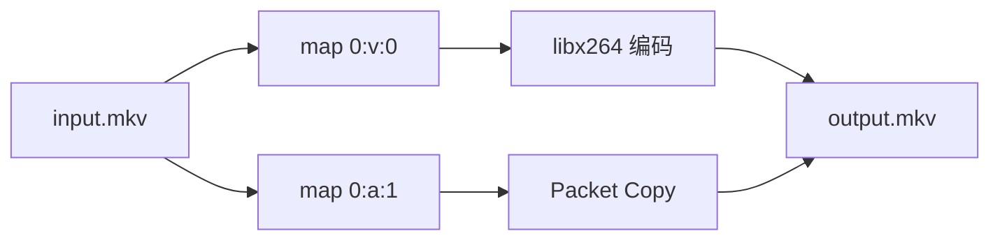

Stream Selection 只回答一个问题：哪些输入流要进入当前输出。选中以后如何复制、编码或过滤，属于 Stream Handling。

```text
-map 解决“选谁”
-c   解决“怎么处理”
```

## 自动选择规则

当前输出没有 `-map` 时，FFmpeg 会按输出格式允许的 Stream 类型自动选择。一般规则如下：

| 类型 | 自动选择 |
| --- | --- |
| Video | 分辨率最高的一条；并列时选索引更低者 |
| Audio | 声道数最多的一条；并列时选索引更低者 |
| Subtitle | 第一条与输出格式默认字幕编码器类型兼容的字幕 |
| Data / Attachment | 不自动选择 |

```powershell
ffmpeg -i input.mkv output.mp4
```

这不是“保留全部内容”。它通常只选择一条视频、一条音频，以及可能的一条兼容字幕，并使用输出格式的默认编码器处理选中的流。

自动选择适合快速试验。需要保留指定语言、全部音轨、封面或附件时，应显式映射。

## 先看清 Stream

```powershell
ffprobe -v error -show_entries stream=index,codec_type,codec_name:stream_tags=language,title -of json input.mkv
```

假设结果对应：

```text
Stream #0:0  Video     H.264
Stream #0:1  Audio     AAC   language=chi
Stream #0:2  Audio     AAC   language=eng
Stream #0:3  Subtitle  ASS   language=chi
```

不要根据扩展名或常见排列猜测 Stream 编号。

## Stream Specifier

常见写法：

| 写法 | 含义 |
| --- | --- |
| `0` | 第 0 个输入的全部 Stream |
| `0:2` | 第 0 个输入中全局索引为 2 的 Stream |
| `0:v` | 第 0 个输入的全部视频 Stream |
| `0:V` | 全部普通视频，不包括封面图等附加图片 |
| `0:v:0` | 第 0 个输入匹配到的第一条视频 Stream |
| `0:a:1` | 第 0 个输入匹配到的第二条音频 Stream |
| `0:m:language:eng` | 元数据 `language=eng` 的 Stream |

`0:2` 的末尾是全局 Stream index；`0:a:1` 的末尾是在音频匹配结果中的序号。

## 手动映射

保留第一条视频和第二条音频：

```powershell
ffmpeg -i input.mkv -map 0:v:0 -map 0:a:1 -c copy output.mkv
```

为当前输出写了 `-map` 后，普通输入 Stream 不再进行自动选择；只有明确映射的流进入该输出。复杂 Filtergraph 的未标记输出是一个需要单独注意的例外，因此复杂命令应给滤镜输出添加 Label。

## 可选映射

有些输入没有音频，普通映射会失败：

```powershell
ffmpeg -i silent.mp4 -map 0:v:0 -map 0:a:0 -c copy output.mp4
```

在 Specifier 末尾添加 `?`，表示没有匹配时忽略：

```powershell
ffmpeg -i silent.mp4 -map 0:v:0 -map 0:a:0? -c copy output.mp4
```

可选映射适合规格不完全一致的批量输入，但也可能隐藏“本应有音频却缺失”的数据问题。是否使用应由业务约束决定。

## 负映射

先映射全部，再排除某类或某条 Stream：

```powershell
ffmpeg -i input.mkv -map 0 -map -0:s -c copy output.mkv
```

排除第二条音频：

```powershell
ffmpeg -i input.mkv -map 0 -map -0:a:1 -c copy output.mkv
```

PowerShell 会把以 `-` 开头的普通参数传递给 FFmpeg，这些单行命令可直接使用。

## 禁用某类输出

| 参数 | 禁用类型 |
| --- | --- |
| `-vn` | Video |
| `-an` | Audio |
| `-sn` | Subtitle |
| `-dn` | Data |

只提取第一条音频并转为 AAC：

```powershell
ffmpeg -i input.mkv -map 0:a:0 -vn -c:a aac -b:a 192k audio.m4a
```

显式 `-map 0:a:0` 已经不会选择视频，所以这里的 `-vn` 只是额外表达意图，并非必需。

## Selection 与 Handling

```powershell
ffmpeg -i input.mkv -map 0:v:0 -map 0:a:1 -c:v libx264 -crf 23 -c:a copy output.mkv
```



- 两个 `-map` 选择视频与音频；
- `-c:v libx264` 处理已选视频；
- `-c:a copy` 处理已选音频；
- 编码器设置不会替你选择一条输入 Stream。

## 多输入合成

使用第一个输入的视频和第二个输入的音频：

```powershell
ffmpeg -i video.mp4 -i narration.wav -map 0:v:0 -map 1:a:0 -c:v copy -c:a aac -b:a 192k -shortest output.mp4
```

`-shortest` 在最短的输出 Stream 结束时结束输出。它不是音画同步修复器；如果两个输入起点或时间戳不同，应先检查时间轴。

## 按语言选择

选择英文音频和中文字幕：

```powershell
ffmpeg -i input.mkv -map 0:v:0 -map 0:a:m:language:eng -map 0:s:m:language:chi? -c copy output.mkv
```

语言标签可能缺失或写法不一致，例如 `chi`、`zho`、`zh`。批处理前先探测实际元数据，不要假设所有来源都遵循同一标签约定。

## Filtergraph Label

```powershell
ffmpeg -i input.mp4 -filter_complex "[0:v]hue=s=0[outv]" -map "[outv]" -map 0:a:0? -c:v libx264 -c:a copy output.mkv
```

```text
[0:v]        输入视频 Stream
hue=s=0      滤镜
[outv]       滤镜输出 Label
-map [outv]  把该滤镜输出加入当前输出
```

Label 不是输入 Stream 编号，也不是输出文件名。一个有 Label 的 Filter 输出应被准确映射一次；若要复用，先通过 `split` / `asplit` 生成多个输出 Pad。

```powershell
ffmpeg -i input.mp4 -filter_complex "[0:v]split=2[v1][v2]" -map "[v1]" -c:v libx264 output1.mp4 -map "[v2]" -c:v libx264 output2.mp4
```

## 多输出命令

选项以输出文件为边界。下面为两个输出分别设置映射与编码：

```powershell
ffmpeg -i input.mkv -map 0:v:0 -c:v libx264 -an video.mp4 -map 0:a:0 -c:a libmp3lame -vn audio.mp3
```

应按以下方式阅读：

```text
input.mkv
├── [map 0:v:0, libx264, an] → video.mp4
└── [map 0:a:0, libmp3lame, vn] → audio.mp3
```

不要把第一个输出的 `-map`、`-c` 或 `-t` 想当然地延续到第二个输出。

## 映射检查清单

执行前逐项确认：

1. 输入编号是否从 0 开始，并与 `-i` 顺序一致？
2. 使用的是全局 Stream index，还是某类型内的序号？
3. 所需语言与标题元数据是否真实存在？
4. 某个缺失 Stream 应该失败，还是应该用 `?` 忽略？
5. 每个输出是否有自己的 `-map` 和 `-c`？
6. Filtergraph 的每个 Label 是否被正确消费？
7. 目标容器是否支持所选 Stream 与编码？

这份清单比依赖 FFmpeg 自动选择更适合可维护的工程命令。
