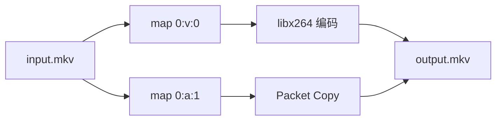

一个容器可能包含多条视频、不同语言的音轨和字幕。`-map` 决定进入当前输出的 Stream；`copy`、编码器和滤镜属于选中后的处理策略。

```text
-map 负责 Stream Selection
-c   负责 Stream Handling
```

## 自动选择

当前输出没有 `-map` 时，FFmpeg 按输出格式允许的 Stream 类型执行自动选择。当前文档版本对应的默认规则如下：

| 类型 | 自动选择 |
| --- | --- |
| Video | 分辨率最高的一条；并列时选索引更低者 |
| Audio | 声道数最多的一条；并列时选索引更低者 |
| Subtitle | 第一条与输出格式默认字幕编码器类型兼容的字幕 |
| Data / Attachment | 不自动选择 |

```powershell
ffmpeg -i input.mkv output.mp4
```

该命令不会保留全部输入内容。通常只产生一条视频、一条音频和一条兼容字幕，并使用输出格式注册的默认编码器处理选中 Stream。

自动选择适用于输出结构不作固定要求的场景。指定语言、全部音轨、封面或附件时，应改用显式映射。

## Stream 事实

```powershell
ffprobe -v error -show_entries stream=index,codec_type,codec_name:stream_tags=language,title -of json input.mkv
```

示例输入结构：

```text
Stream #0:0  Video     H.264
Stream #0:1  Audio     AAC   language=chi
Stream #0:2  Audio     AAC   language=eng
Stream #0:3  Subtitle  ASS   language=chi
```

Stream 编号应来自探测结果，不能根据扩展名或常见排列推断。

## Stream Specifier

常见写法：

| 写法 | 含义 |
| --- | --- |
| `0` | 第 0 个输入的全部 Stream |
| `0:2` | 第 0 个输入中全局索引为 2 的 Stream |
| `0:v` | 第 0 个输入的全部视频 Stream |
| `0:V` | 全部普通视频，不包括封面图等附加图片 |
| `0:v:0` | 第 0 个输入匹配到的第一条视频 Stream |
| `0:a:1` | 第 0 个输入匹配到的第二条音频 Stream |
| `0:m:language:eng` | 元数据 `language=eng` 的 Stream |

`0:2` 的末尾是全局 Stream index；`0:a:1` 的末尾是在音频匹配结果中的序号。

## 显式映射

保留第一条视频和第二条音频：

```powershell
ffmpeg -i input.mkv -map 0:v:0 -map 0:a:1 -c copy output.mkv
```

为当前输出指定 `-map` 后，普通输入 Stream 不再自动选择，只有显式映射的 Stream 进入该输出。复杂 Filtergraph 的未标记输出遵循独立规则，因此复杂命令应为滤镜输出添加 Label。

## 可选映射与失败策略

有些输入没有音频，普通映射会失败：

```powershell
ffmpeg -i silent.mp4 -map 0:v:0 -map 0:a:0 -c copy output.mp4
```

在 Specifier 末尾添加 `?`，表示没有匹配时忽略：

```powershell
ffmpeg -i silent.mp4 -map 0:v:0 -map 0:a:0? -c copy output.mp4
```

可选映射适合规格不完全一致的批量输入；它也会把“本应存在但缺失”的音频转化为静默成功。是否使用应由业务失败策略决定。

## 负映射

将全部 Stream 纳入后，排除某类或某条 Stream：

```powershell
ffmpeg -i input.mkv -map 0 -map -0:s -c copy output.mkv
```

排除第二条音频：

```powershell
ffmpeg -i input.mkv -map 0 -map -0:a:1 -c copy output.mkv
```

上述单行命令中的 `-map -0:s` 等参数会原样传递给 FFmpeg。

## 禁用 Stream 类型

| 参数 | 禁用类型 |
| --- | --- |
| `-vn` | Video |
| `-an` | Audio |
| `-sn` | Subtitle |
| `-dn` | Data |

只提取第一条音频并转为 AAC：

```powershell
ffmpeg -i input.mkv -map 0:a:0 -vn -c:a aac -b:a 192k audio.m4a
```

显式 `-map 0:a:0` 已经排除了视频；此处的 `-vn` 仅用于表达输出意图，并非必需。

## Selection 与 Handling 的边界

```powershell
ffmpeg -i input.mkv -map 0:v:0 -map 0:a:1 -c:v libx264 -crf 23 -c:a copy output.mkv
```



- 两个 `-map` 分别选择视频与音频；
- `-c:v libx264` 处理已选视频；
- `-c:a copy` 处理已选音频；
- 编码器设置不参与输入 Stream 的选择。

## 多输入

输入 0 提供视频，输入 1 提供音频：

```powershell
ffmpeg -i video.mp4 -i narration.wav -map 0:v:0 -map 1:a:0 -c:v copy -c:a aac -b:a 192k -shortest output.mp4
```

`-shortest` 在最短输出 Stream 结束时终止任务。它不调整音画同步；两个输入的起点或时间戳不一致时，应由时间轴策略处理。

## 按语言元数据选择

选择英文音频和中文字幕：

```powershell
ffmpeg -i input.mkv -map 0:v:0 -map 0:a:m:language:eng -map 0:s:m:language:chi? -c copy output.mkv
```

语言标签可能缺失或存在 `chi`、`zho`、`zh` 等差异。批处理应把实际标签作为输入事实，不得假设所有来源采用同一约定。

## Filtergraph 输出 Label

```powershell
ffmpeg -i input.mp4 -filter_complex "[0:v]hue=s=0[outv]" -map "[outv]" -map 0:a:0? -c:v libx264 -c:a copy output.mkv
```

```text
[0:v]        输入视频 Stream
hue=s=0      滤镜
[outv]       滤镜输出 Label
-map [outv]  把该滤镜输出加入当前输出
```

Label 不是输入 Stream 编号，也不是输出文件名。有 Label 的 Filter 输出应准确映射一次；复用时通过 `split` / `asplit` 显式生成多个输出 Pad。

```powershell
ffmpeg -i input.mp4 -filter_complex "[0:v]split=2[v1][v2]" -map "[v1]" -c:v libx264 output1.mp4 -map "[v2]" -c:v libx264 output2.mp4
```

## 多输出

选项以输出文件为边界。下面为两个输出分别设置映射与编码：

```powershell
ffmpeg -i input.mkv -map 0:v:0 -c:v libx264 -an video.mp4 -map 0:a:0 -c:a libmp3lame -vn audio.mp3
```

其输出边界如下：

```text
input.mkv
├── [map 0:v:0, libx264, an] → video.mp4
└── [map 0:a:0, libmp3lame, vn] → audio.mp3
```

第一个输出的 `-map`、`-c` 和 `-t` 不会隐式延续到第二个输出。

## 批处理约束

批处理记录应包含输入编号、全局索引、类型内序号、语言标签和输出容器。缺失音轨的失败或忽略策略由业务规则定义。多输出命令分别检查每个输出的 `-map`、`-c` 和容器兼容性；带 Label 的 Filtergraph 输出必须准确映射一次。

依据：[ffmpeg Stream selection](https://ffmpeg.org/ffmpeg.html#Stream-selection)。自动选择规则可能随版本演进；依赖默认选择的脚本在 FFmpeg 升级后需要回归验证。
