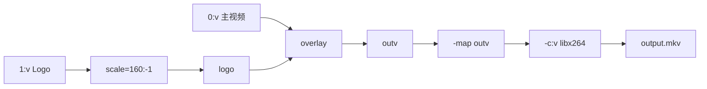

前四篇已经能完成文件任务并选择流。这一篇回答两个更深入的问题：参数究竟作用于哪个输入/输出，以及为什么一个小改动会让 FFmpeg 从复制变成转码。

## 命令的文件边界

官方命令可以简化为：

```text
ffmpeg [全局选项] [输入选项] -i 输入 ... [输出选项] 输出 ...
```

```powershell
ffmpeg -hide_banner -ss 00:01:00 -i input.mp4 -map 0:v:0 -map 0:a:0? -t 00:00:30 -c:v libx264 -crf 23 -c:a aac output.mp4
```

| 片段 | 作用 |
| --- | --- |
| `-hide_banner` | 全局选项，隐藏版本横幅 |
| `-ss ... -i input.mp4` | 输入选项，定位输入 |
| `-map ...` | 当前输出选择哪些流 |
| `-t ...` | 当前输出的持续时长 |
| `-c:v`、`-crf`、`-c:a` | 当前输出各流的处理方式 |
| `output.mp4` | 输出 URL，结束这一组输出选项 |

多输入、多输出时，选项要放在对应的 `-i` 或输出文件附近。不要把一组输出参数写在两个输出之间，然后假设它们都会生效。

## `-ss`、`-t` 和 `-to`

输入前定位：

```powershell
ffmpeg -ss 00:01:00 -i input.mp4 -t 30 -c copy fast-clip.mp4
```

通常启动更快，但复制模式的切点受关键帧和时间戳影响。输出前定位：

```powershell
ffmpeg -i input.mp4 -ss 00:01:00 -t 30 -c:v libx264 -c:a aac accurate-clip.mp4
```

需要解码并丢弃目标时间之前的内容，通常更适合精确切点，但会增加处理量。`-t` 表示持续时长，`-to` 表示到时间轴中的位置停止；两者同时出现时 `-t` 优先，实践中只选一个。

## 复制、滤镜和编码链路


- `-c copy` 走 Packet → Muxer，不经过解码器和滤镜；
- 改编码、缩放、裁剪、水印、调音量或改变采样率时，相关流走 Decode → Filter（可选）→ Encode；
- 一个输出可以混合两种路径，例如视频重编码、音频复制。

参数放置位置可以按“边界”检查：全局选项影响整个进程；输入选项放在对应的 `-i` 前；`-map`、滤镜、编码器和时长属于紧随其后的输出。多输出命令要为每个输出重新写一组配置。

## 常用视频参数

| 参数 | 用途 | 入门记法 |
| --- | --- | --- |
| `-c:v` | 视频编码器或 `copy` | `libx264` 是常见 H.264 软件编码器，先查本机构建 |
| `-vf` | 单输入视频滤镜链 | `-vf "scale=1280:-2"` |
| `-crf` | 编码器相关的恒定质量控制 | 数值越小通常质量越高、文件越大 |
| `-preset` | 速度与压缩效率取舍 | 慢一些通常更省体积，不直接代表画质 |
| `-b:v` | 目标视频码率 | 适合有带宽/体积规格的任务 |
| `-pix_fmt` | 输出像素格式 | `yuv420p` 常见但不是所有任务的最佳选择 |
| `-r` | 输出帧率处理 | 会影响丢帧/补帧，先理解 `fps` 滤镜再使用 |

离线压缩的一个起点：

```powershell
ffmpeg -i input.mp4 -c:v libx264 -crf 23 -preset medium -c:a aac -b:a 128k output.mp4
```

CRF 不是百分比画质，也不能跨编码器直接比较。没有“所有视频都正确”的数值，应以目标尺寸、内容和播放器实际试听/观看为准。

有明确带宽上限时，可以给编码器码率约束：

```powershell
ffmpeg -i input.mp4 -c:v libx264 -b:v 2500k -maxrate 3000k -bufsize 6000k -c:a aac -b:a 128k output.mp4
```

`-maxrate` 和 `-bufsize` 描述约束模型，不保证每一秒输出完全相同的比特数；平均码率和最终文件大小还受音频、容器和内容影响。

## 常用音频参数

| 参数 | 用途 | 示例 |
| --- | --- | --- |
| `-c:a` | 音频编码器或 `copy` | `-c:a aac` |
| `-b:a` | 音频码率 | `-b:a 128k` |
| `-ar` | 输出采样率 | `-ar 48000` |
| `-ac` | 输出声道数 | `-ac 2` |
| `-af` | 音频滤镜 | `-af "volume=1.5"` |
| `-an` | 禁止输出音频 | 只生成无声视频 |

改变音量、采样率或声道会改变音频采样，不能再对该音频使用 `-c:a copy`。

## 滤镜：从简单到组合

单输入、单输出的常见滤镜：

```powershell
ffmpeg -i input.mp4 -vf "scale=1280:-2,fps=25" -c:v libx264 -c:a copy output.mkv
```

滤镜按从左到右处理：先 `scale`，再 `fps`。视频经过滤镜后必须编码；未改变的音频仍可复制。

多个输入或多个输出使用 `-filter_complex`，并给滤镜输出加 Label：

```powershell
ffmpeg -i input.mp4 -i logo.png -filter_complex "[1:v]scale=160:-1[logo];[0:v][logo]overlay=W-w-24:H-h-24[outv]" -map "[outv]" -map 0:a:0? -c:v libx264 -c:a copy output.mkv
```

`[0:v]`、`[1:v]` 是输入流，`[logo]`、`[outv]` 是滤镜图中的临时 Label，不是文件名。Label 输出必须通过 `-map` 放进输出。



这里的 `logo` 和 `outv` 只是滤镜图内部的接线标签；没有 `-map "[outv]"`，滤镜生成的结果不会自动进入输出文件。

## 输出容器和兼容性

网页渐进下载常见的 MP4 写法：

```powershell
ffmpeg -i input.mov -c:v libx264 -pix_fmt yuv420p -c:a aac -b:a 128k -movflags +faststart output.mp4
```

`+faststart` 会移动 MP4 索引，改善普通文件的渐进起播；它不会把文件变成直播协议。`yuv420p` 常见于兼容场景，但 HDR、10-bit 和专业色彩流程不能机械套用。

需要原始数据、管道或无扩展名 URL 时才考虑显式 `-f`；普通 MP4/MKV 通常让 FFmpeg 自动探测容器即可。

## 程序调用时的两个实用选项

禁止后台任务等待标准输入：

```powershell
ffmpeg -nostdin -i input.mp4 -c copy output.mkv
```

输出机器可读的键值进度（不要解析人类日志中的 `frame=`）：

```powershell
ffmpeg -nostdin -i input.mp4 -c:v libx264 -c:a aac -progress pipe:1 -nostats output.mp4
```

程序仍要读取退出码、stderr，设置超时并在取消时清理进程；`-progress` 不是任务成功的替代证明。

## 需要时再查的高级参数

`-copyts`、`-fps_mode`、硬件解码/编码、原始视频输入和协议私有选项都依赖具体任务。遇到它们时，先运行组件帮助：

```powershell
ffmpeg -hide_banner -h encoder=libx264
ffmpeg -hide_banner -h filter=scale
ffmpeg -hide_banner -h demuxer=rtsp
```

不要把某个硬件编码器、协议选项或旧式 `-vsync` 当成所有 FFmpeg 构建都通用的参数。

依据：[FFmpeg 选项与命令结构](https://ffmpeg.org/ffmpeg.html#Options)；[滤镜官方文档](https://ffmpeg.org/ffmpeg-filters.html)；[编码器能力以当前构建为准](https://ffmpeg.org/ffmpeg.html#toc-Video-Encoders)。
