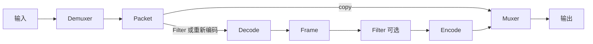
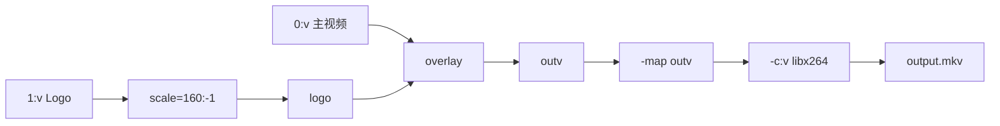

前四篇已经能完成文件任务并选择流。这一篇回答两个更深入的问题：参数究竟作用于哪个输入/输出，以及为什么加一个小滤镜，FFmpeg 就不能再 `-c copy`。

## 把命令看成有栅栏的几段

官方骨架：

```text
ffmpeg [全局选项] [输入选项] -i 输入 ... [输出选项] 输出 ...
```

`-i` 和输出文件名就是栅栏。选项写在哪一段，就作用在哪一边：

```text
ffmpeg  -hide_banner   -ss 00:01:00 -i input.mp4   -t 30 -c:v libx264   output.mp4
        └ 全局 ─┘      └ 输入选项 ─┘ └ 输入 ─┘     └ 输出选项 ──────┘   └ 输出 ┘
```

```powershell
ffmpeg -hide_banner -ss 00:01:00 -i input.mp4 -map 0:v:0 -map 0:a:0? -t 00:00:30 -c:v libx264 -crf 23 -c:a aac output.mp4
```

| 片段 | 作用范围 |
| --- | --- |
| `-hide_banner` | 全局，隐藏版本横幅 |
| `-ss ... -i input.mp4` | 这个输入的定位 |
| `-map ...` | 当前输出挑选哪些流 |
| `-t ...` | 当前输出写多久 |
| `-c:v`、`-crf`、`-c:a` | 当前输出各流怎么处理 |
| `output.mp4` | 这组输出选项到此结束 |

多输入、多输出时，选项要贴着对应的 `-i` 或输出文件。不要把一组输出参数写在两个输出文件之间，然后假设两边都会生效。

## `-ss`、`-t` 和 `-to`

切片的两种位置和第 03 篇相同，这里只把官方语义收成一张表：

| 写法 | 官方行为 | 适合 |
| --- | --- | --- |
| `-ss` 在 `-i` 前 + `-c copy` | 输入 seek 到目标前最近的 seek point，多出来的数据会保留 | 快速粗切 |
| `-ss` 在 `-i` 前 + 转码 | 默认 `-accurate_seek` 会把多出来的那段解码后丢掉 | 较快且切点较准 |
| `-ss` 在 `-i` 后 | 输出选项：解码并丢弃到目标时间戳 | 通常最精确，也最慢 |
| `-t` | 持续时长（输入或输出选项，看写在 `-i` 哪一侧） | 切 30 秒 |
| `-to` | 停在时间轴的某个位置（同样分输入/输出） | 切到 1:30 |

官方规定 `-t` 和 `-to` 互斥，且 `-t` 优先；实践中只选一个。

```powershell
ffmpeg -ss 00:01:00 -i input.mp4 -t 30 -c copy fast-clip.mp4
ffmpeg -i input.mp4 -ss 00:01:00 -t 30 -c:v libx264 -c:a aac accurate-clip.mp4
```

## 复制、滤镜和编码为什么不能混在同一条流上



- `-c copy` 走 Packet → Muxer，不经过 Decoder 和 Filter；
- 改编码、缩放、裁剪、水印、调音量或改采样率时，相关流走 Decode → Filter（可选）→ Encode；
- 一个输出可以两条路混用，例如视频重编码、音频复制。

Filter 处理的是 Decode 之后的 Frame。所以同一条视频一旦进了 `scale`，就不能再 `-c:v copy`。这就是常见报错 `Filtering and streamcopy cannot be used together` 的原因。

## 常用视频参数

| 参数 | 用途 | 入门记法 |
| --- | --- | --- |
| `-c:v` | 视频编码器或 `copy` | `libx264` 是常见 H.264 软件编码器，先查本机构建 |
| `-vf` | 单路 Video Filterchain | `-vf "scale=1280:-2"` |
| `-crf` | 编码器相关的恒定质量 | 数值越小通常质量越高、文件越大 |
| `-preset` | 速度和压缩效率 | 慢一些通常更省体积，不直接等于画质 |
| `-b:v` | 目标视频码率 | 适合有带宽或体积上限的任务 |
| `-pix_fmt` | 输出像素格式 | `yuv420p` 常见，但不是所有任务的最佳选择 |
| `-r` | 输出帧率相关处理 | 会影响丢帧/补帧，先理解 `fps` 滤镜再使用 |

离线压缩的一个起点（libx264 / x264 的默认 CRF 是 23；FFmpeg 里该选项显示 default -1，表示沿用 x264 默认值）：

```powershell
ffmpeg -i input.mp4 -c:v libx264 -crf 23 -preset medium -c:a aac -b:a 128k output.mp4
```

```text
libx264 CRF 可以先这样记：
  18  很接近源，文件更大
  23  常见起点
  28  更小、更糊
CRF 不是 23% 画质，也不能拿去和 libx265、libsvtav1 直接比数字。
```

有明确带宽上限时，给编码器码率约束：

```powershell
ffmpeg -i input.mp4 -c:v libx264 -b:v 2500k -maxrate 3000k -bufsize 6000k -c:a aac -b:a 128k output.mp4
```

`-maxrate` 和 `-bufsize` 描述缓冲约束，不保证每一秒比特数完全相同。最终体积还受音频、容器和内容影响。需要限制文件大小时，不要把 `-fs` 当成画质旋钮，它可能在任意位置截断输出。

## 常用音频参数

| 参数 | 用途 | 示例 |
| --- | --- | --- |
| `-c:a` | 音频编码器或 `copy` | `-c:a aac` |
| `-b:a` | 音频码率 | `-b:a 128k` |
| `-ar` | 输出采样率 | `-ar 48000` |
| `-ac` | 输出声道数 | `-ac 2` |
| `-af` | 单路 Audio Filterchain | `-af "volume=1.5"` |
| `-an` | 禁止输出音频 | 只生成无声视频 |

改变音量、采样率或声道会改变音频采样，不能再对该音频使用 `-c:a copy`。

## Filter：从 Filterchain 到 Filtergraph

单输入、单输出的常见滤镜：

```powershell
ffmpeg -i input.mp4 -vf "scale=1280:-2,fps=25" -c:v libx264 -c:a copy output.mkv
```

逗号表示从左到右：先 `scale`，再 `fps`。视频经过滤镜后必须编码；没改的音频仍可复制。

多个输入或多个输出用 `-filter_complex`，并给中间结果起名字（Label）：

```powershell
ffmpeg -i input.mp4 -i logo.png -filter_complex "[1:v]scale=160:-1[logo];[0:v][logo]overlay=W-w-24:H-h-24[outv]" -map "[outv]" -map 0:a:0? -c:v libx264 -c:a copy output.mkv
```

```text
[1:v]  第二个输入的视频
[logo] Filtergraph 内部的 Label，不是文件名
[outv] 合成结果，必须再 -map 才能进输出文件
```



没有 `-map "[outv]"`，滤镜生成的画面不会自动进入文件。更完整的 Filtergraph 读法见 [FFmpeg Filters](/tutorials/tffmpeg-filters/)。

## 输出容器和兼容性

网页渐进下载常见的 MP4 写法：

```powershell
ffmpeg -i input.mov -c:v libx264 -pix_fmt yuv420p -c:a aac -b:a 128k -movflags +faststart output.mp4
```

`+faststart` 把 MP4 的索引（`moov`）移到文件前面，方便普通文件边下边播；它不会把文件变成直播协议，也不会把 H.265 自动变成 H.264。`yuv420p` 常见于 8-bit SDR 兼容场景，HDR / 10-bit 不能机械套用。

普通 MP4 / MKV 通常让 FFmpeg 按扩展名选择容器。需要原始数据、管道或无扩展名 URL 时，再显式写 `-f`。

## 程序调用时的两个实用选项

禁止后台任务等待标准输入：

```powershell
ffmpeg -nostdin -i input.mp4 -c copy output.mkv
```

输出机器可读进度（不要去解析人类日志里的 `frame=`）：

```powershell
ffmpeg -nostdin -i input.mp4 -c:v libx264 -c:a aac -progress pipe:1 -nostats output.mp4
```

程序仍要读退出码和 stderr，设置超时，取消时清理进程。`-progress` 不是任务成功的替代证明。

## 需要时再查的高级参数

`-copyts`、`-fps_mode`、硬件编解码、原始视频输入和协议私有选项都依赖具体任务。遇到它们时，先问当前构建：

```powershell
ffmpeg -hide_banner -h encoder=libx264
ffmpeg -hide_banner -h filter=scale
ffmpeg -hide_banner -h demuxer=rtsp
```

不要把某个硬件编码器、协议选项或旧式 `-vsync` 当成所有 FFmpeg 构建都通用的参数。

依据：[FFmpeg 选项与命令结构](https://ffmpeg.org/ffmpeg.html#Options)；[滤镜官方文档](https://ffmpeg.org/ffmpeg-filters.html)；[编码器能力以当前构建为准](https://ffmpeg.org/ffmpeg.html#toc-Video-Encoders)。
