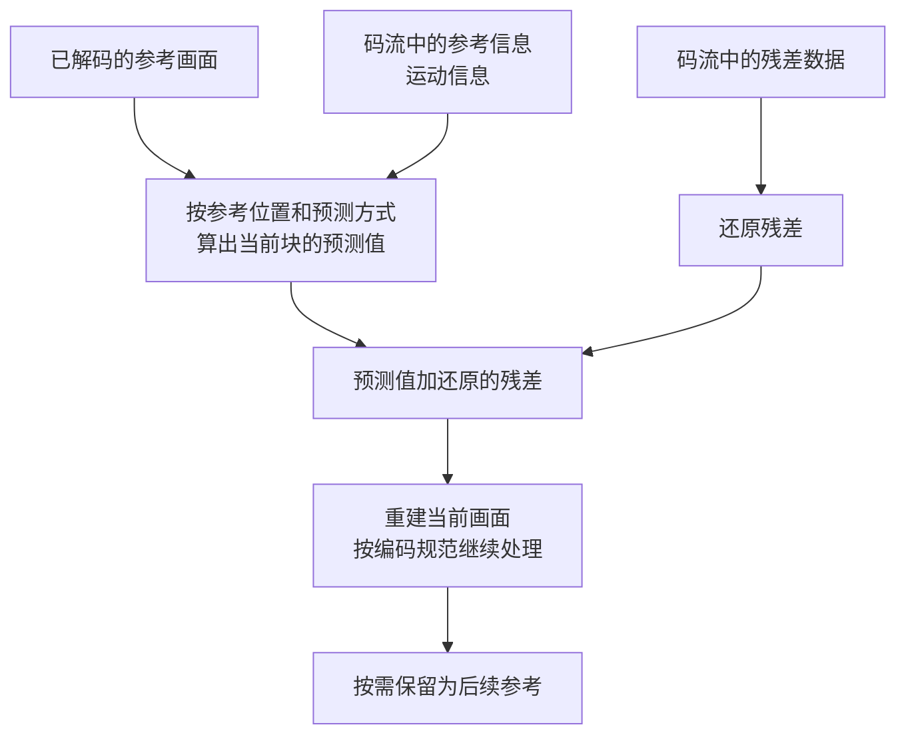

摄像头拍下一个人走过门口，手机播放这段视频。中间至少发生三件事：摄像头把光线变成画面，编码器把画面压缩成数据，播放器把数据还原并按时间显示。

从这里开始，分四篇看懂这条过程。这一篇只讲画面和压缩；后面依次讲[编码与格式](/tutorials/tffmpeg-codecs/)、[网络与直播传输](/tutorials/tffmpeg-transport/)、[丢包与播放异常](/tutorials/tffmpeg-playback/)。可以直接从本篇阅读，不需要先学 FFmpeg 命令。

## 一帧是什么，视频又多了什么

暂停视频时，屏幕上留下的一幅画面，就是我们通常说的一帧（Frame）。先以常见的逐行视频为例：1920×1080 表示一幅画面横向有 1920 个像素位置，纵向有 1080 行。每个位置都有描述亮度、颜色的数值。

视频还要告诉播放器**每幅画面什么时候显示**。一段恒定 25 FPS 的视频，每秒显示 25 帧，相邻画面的显示时间相差 40 毫秒。

```text
显示时间       0 ms         40 ms        80 ms       120 ms
画面         [●····]      [·●···]      [··●··]      [···●·]
                 小球的位置随时间改变，看起来就在移动
```

这是四幅独立画面的示意。显示时每幅都要有完整的像素结果；**保存或传输时，却不一定把每幅的所有像素重新写一遍**。压缩就是从这里节省数据的。

声音有自己的采样和时间轴。播放器让同一时刻的声音与画面对齐，才不会出现嘴已经张开、声音稍后才到的情况。视频文件还可能带字幕、轨道信息和索引。

### 像素不一定按红、绿、蓝存

RGB 用红、绿、蓝三个分量描述颜色。视频处理中也常见 Y′CbCr：Y′ 主要表示亮度信息，Cb、Cr 表示色差信息；FFmpeg 的很多像素格式名沿用 `yuv`，例如 `yuv420p`。

在常见的 8-bit `yuv420p` 中，亮度平面保存完整分辨率，两个色度平面各是半宽、半高。对宽高为偶数的画面，紧密存放时平均每个像素占 1.5 字节。`NV12` 也常用于 4:2:0，但把两种色度交错存放，内存布局与 `yuv420p` 不同。

这里先认识这个区别，后面解释绿屏时会用到：**数据里的颜色数值正确，读取它们的位置或排列错误，照样会显示出错误颜色。** 10-bit 是分量精度，4:2:0 是色度采样方式，两者也要分别看。

## 为什么需要压缩

假设每个像素用 8-bit RGB、三个字节表示，一段 1920×1080、25 FPS 的原始视频，不考虑额外开销：

```text
一帧：1920 × 1080 × 3 = 6,220,800 字节
一秒：6,220,800 × 25 = 155,520,000 字节
约 155.52 MB/s，也就是 1.244 Gbit/s
```

这是未压缩 RGB 的计算例子，不能拿来当摄像头实际码率。使用紧密存放的 8-bit 4:2:0 原始数据，数据量会更小，但仍然很大。

相邻画面通常有大量重复内容：门口背景没变，只有人向前走了几步。编码器利用这些重复，还会用有损压缩减少细节精度，才把数据降到适合存储和传输的规模。

码率是每秒的数据量。例如平均视频码率 4 Mbit/s，60 秒的视频数据约为 `4 × 60 ÷ 8 = 30 MB`，还没算音频、容器和网络开销。帧率描述画面节奏，码率描述数据量；提高帧率并不自动增加细节清晰度。

## 压缩先处理画面中的一小块

编码器会把画面分成块，对不同区域选择合适的方法。大片静止的墙面、移动的人、树叶和噪点，重复程度不同，所需数据也不同。

预测（Prediction）是按照双方约定的规则，先算出一块近似画面。有两种主要来源：

| 预测来源 | 怎么取得近似画面 | 例子 |
| --- | --- | --- |
| 帧内预测（Intra prediction） | 利用同一幅画面中已经还原的邻近像素 | 墙面左侧与上侧都接近灰色，当前块可能也接近灰色 |
| 帧间预测（Inter prediction） | 利用已经解码、保留作参考的其他画面 | 上一幅画面里的小球，现在移到了右侧 |

编码器还要传递预测方式、参考位置以及预测没表达好的部分。解码器按这些信息还原画面。它不需要识别“这是一个人”或理解物体的真实运动。

## 小球往右移动，下一帧怎么还原

假设第一幅画面已经解码并保存在内存中。第二幅里，小球向右移动了一些。

```text
参考画面：[··●·····]
当前画面：[···●····]

编码器寻找相似的图像块：
“当前这一块，可以从参考画面那个位置取过来。”
```

描述取样位置偏移的信息叫运动向量（Motion Vector）。它描述图像块之间的对应关系，不保证等于物体真正移动的距离或方向；镜头移动、光照变化也会影响匹配。

### 只有移动信息还不够

小球可能变亮、转动，或者露出原先被挡住的背景。预测画面与实际画面之间仍有差别，这个差值叫残差（Residual）。

下面用单个亮度数值演示加减关系，实际编码按块处理：

```text
预测值             100
当前原始值         107
原始残差           107 - 100 = 7

如果压缩后还原的残差是 6：
解码后的值         100 + 6 = 106
```

差值通常还会经过变换、量化和编码。变换把块内的变化换一种方式表达；量化降低数值精度，是常见有损压缩的来源；最后再用较少的比特表示结果。所以还原值可能接近原值，却不完全相等。



编码器内部也会重建画面，用与解码器一致的参考结果预测后续画面。这样在数据完整、实现正确的情况下，双方不会因为各自拿着不同版本的上一帧而越算越偏。

新露出的背景如果找不到好参考，可以用帧内方式编码。即使是依赖其他画面的帧，也可以有一些块采用帧内预测。

### 编码预测和“丢了以后补一下”有什么区别

正常编码时，预测方法和残差都来自编码数据，解码器有明确依据。丢包后，如果一部分依据没到，播放器可能重复上一帧或用附近区域暂时填补，称为错误隐藏（Error concealment）。这只能减轻突兀感，无法保证找回真实内容。

电视或播放软件的运动插帧又是另一件事：在已有画面之间估算额外画面，提高显示帧率。它也不等于恢复丢失的原始编码数据。

## 现在再看 I、P、B 三个名字

I、P、B 是常见的图像编码类型简称。理解预测以后，它们就有了具体含义：

| 常见称呼 | 名称 | 当前画面怎样重建 |
| --- | --- | --- |
| I 帧 | Intra-coded picture | 使用帧内方式，不依赖其他画面的像素作帧间预测 |
| P 帧 | Predictive-coded picture | 可以使用一组参考列表做帧间预测，也可以包含帧内编码的块 |
| B 帧 | Bi-predictive-coded picture | 可以使用两组参考列表，按块选择单向或双向预测，也可以使用帧内方式 |

入门时，可以把 I 理解为“从当前画面内部来构建”，P 理解为“允许参考已还原的其他画面”，B 理解为“参考选择更灵活”。规范中的类型细分到 Slice 等结构，这张表按常见的整帧称呼讲解。

I 帧仍是压缩数据，不是一张未压缩图片；P 帧也不只是两张图直接相减。B 帧允许组合参考，但不要求每个块都同时使用显示时间上一前一后的两幅画面。P/B 都可能参考不止紧邻的前一帧，某些 B 帧还会被其他帧参考。

## B 帧为什么能参考“后面的画面”

假设小球在三幅画面中的位置依次是 0、1、2。中间画面可以利用两端的已知画面做预测。但播放器要先拿到并解码两端，才能还原中间。

```text
显示顺序： I0 → B1 → P2
解码顺序： I0 → P2 → B1

先解码 I0
再解码参考 I0 的 P2
最后利用 I0、P2 解码 B1
显示时仍按 I0、B1、P2 排列
```

这是只有三幅画面的参考关系示意，不代表所有编码器的排列。所谓“未来帧”是相对于显示时间而言；当它被拿来参考时，解码器已经得到了它。直播编码器需要等足够的画面到来，这类重排就会增加等待。

为此常见两种时间戳：**PTS**（Presentation Time Stamp）表示什么时候显示，**DTS**（Decoding Time Stamp）表示什么时候解码。它们的单位由时间基准决定，工具输出的 `_time` 字段通常换算成秒。

关闭 B 帧可以减少某些重排等待，但端到端延迟还包括采集、编码预分析、网络、缓冲和显示，不能只靠这一项判断。

## 中途打开直播，为什么可能要等一会儿

假设发送端正在连续发出 `I → P → P → P…`。新观众刚好从某个 P 帧开始接收，而这个 P 帧需要的参考画面早就发完了。收到完整的当前帧数据，仍可能缺少重建它的依据。

编码器因此需要提供合适的重新开始位置。这里再引入三个常见名字：

| 名字 | 用途 | 需要注意什么 |
| --- | --- | --- |
| GOP（Group of Pictures） | 描述一组图像及其编码组织 | 实际参考关系由编码器决定，不一定固定为一串 `IBBP` |
| 关键帧（Keyframe） | 文件或工具标记的访问入口 | 标记含义要结合编码格式看 |
| IDR（Instantaneous Decoding Refresh） | H.264/H.265 中一种明确的解码刷新点 | 解码后续画面时，不再依赖 IDR 之前的参考画面 |

I 帧描述画面内部的编码方式，IDR 还约束后续的参考关系。因此不能把任何 I 帧都当成可靠的重新开始点。H.265 还有 CRA 等随机访问类型，它们对起播画面与参考关系有不同规则。


如果设备每 2 秒提供一次可用的 IDR，新观众恰好错过它，可能等接近 2 秒。这是假设配置已到、网络正常、后续 IDR 完整的例子；有缓存或主动请求刷新机制时，等待也可能更短。

缩短刷新间隔通常方便起播和错误恢复，但可能增加码率或降低同一码率下的压缩效率。长 GOP、开放 GOP、帧内刷新等策略会改变这个权衡，不能只看到一个 GOP 数字就断定首帧等待时间。

## 用一段短视频观察这些名字

下面的命令只用来观察前面讲过的概念。在一个新的空目录中打开 PowerShell，先确认 FFmpeg 构建有 `libx264`：

```powershell
ffmpeg -hide_banner -encoders 2>&1 | Select-String "libx264"
```

生成 3 秒、每秒 25 帧的测试视频：

```powershell
ffmpeg -n -hide_banner -f lavfi -i "testsrc2=size=320x180:rate=25" -t 3 -an -c:v libx264 -pix_fmt yuv420p -g 25 -bf 2 -x264-params "keyint=25:min-keyint=25:scenecut=0:open-gop=0:b-adapt=0" frames-demo.mp4
```

`testsrc2` 是产生测试画面的 Filter source；`-t 3` 限制输出时长；`libx264` 负责 H.264 编码；`-g 25` 和 `keyint=25` 把最大关键帧间隔设成 25；其余 x264 选项用于减少场景切换和自适应排列对这个演示的影响。`-bf 2` 允许最多两个连续 B 帧，并不要求所有视频都这样配置。`-n` 防止覆盖已有文件。

查看解码后的帧类型和显示时间：

```powershell
ffprobe -v error -select_streams v:0 -show_frames -show_entries frame=best_effort_timestamp_time,pict_type,key_frame -of json frames-demo.mp4
```

`pict_type` 显示 I/P/B，`key_frame` 是工具给出的关键帧标志；`best_effort_timestamp_time` 是解码器估计的显示时间。沿时间看这些记录，再回看前面的参考关系，就能理解同一段视频为什么会有不同帧类型。

查看压缩数据包的解码时间与显示时间：

```powershell
ffprobe -v error -select_streams v:0 -show_packets -show_entries packet=pts_time,dts_time,size,flags -of json frames-demo.mp4
```

这次看的 Packet 是 FFmpeg 读取到的压缩数据包，还没进入网络分包这一层。带 B 帧的样本中可以看到 PTS 与 DTS 的差异；开头负的 DTS 可能是重排时间的表达，不单独表示损坏。`size` 是该包的字节数，也不等于原始一帧的像素大小。

最后完整解码，并用播放器人工观察：

```powershell
ffmpeg -v error -i frames-demo.mp4 -map 0:v:0 -f null -
ffplay frames-demo.mp4
```

第一条不保存画面，用来检查解码日志；第二条显示视频。能正常解码并不代表已经测试了真实网络的丢包表现。

下一篇：[H.264、H.265、MP4 和 GB 分别是什么](/tutorials/tffmpeg-codecs/)。

## 资料来源

- [ITU-T H.264](https://www.itu.int/rec/T-REC-H.264)、[ITU-T H.265](https://www.itu.int/rec/T-REC-H.265)：图像编码、预测、参考画面与随机访问定义。
- [RFC 7798 §1.1](https://www.rfc-editor.org/rfc/rfc7798#section-1.1)：H.264/HEVC 的共同设计、预测加残差、编码块和改进说明。
- [FFmpeg 像素格式定义（n7.1.1）](https://github.com/FFmpeg/FFmpeg/blob/n7.1.1/libavutil/pixfmt.h)、[libx264 选项](https://ffmpeg.org/ffmpeg-codecs.html#libx264_002c-libx264rgb)、[ffprobe](https://ffmpeg.org/ffprobe.html)。

小球、亮度加减和数据量计算是教学示意；不是实际码流逐字节记录。命令以 FFmpeg 7.1.1 与 libx264 为本地验证基线。
