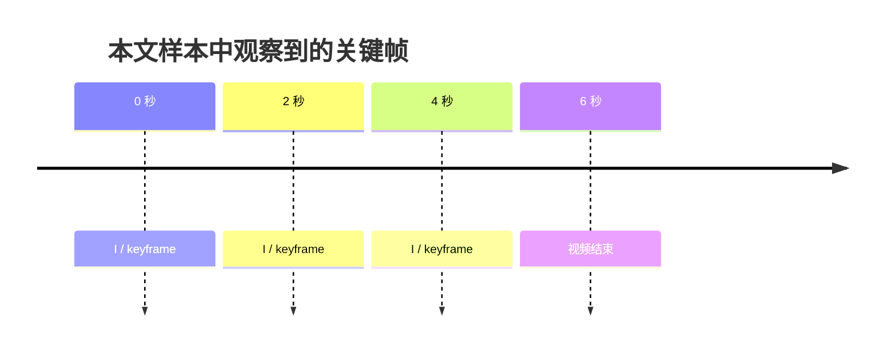
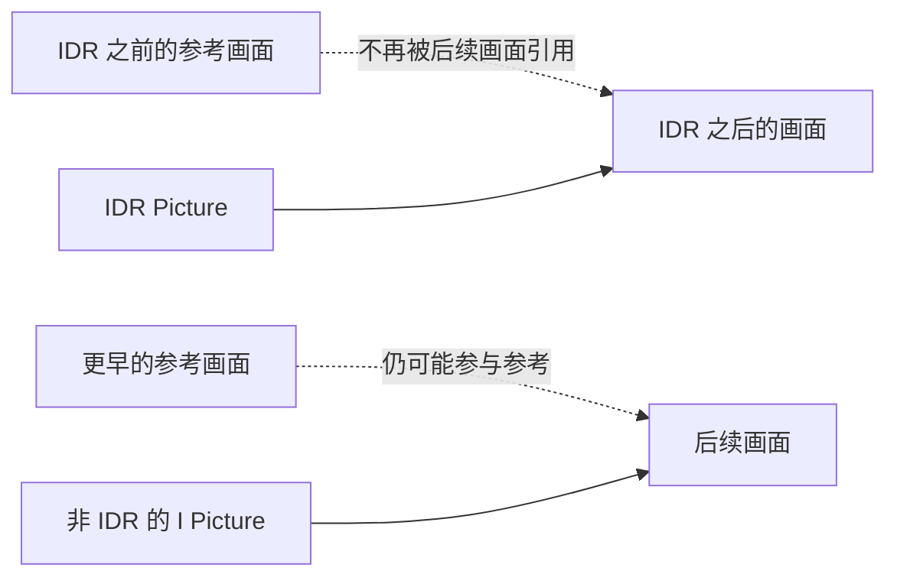
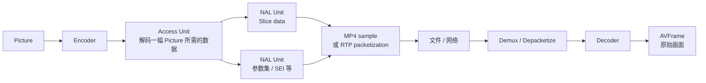
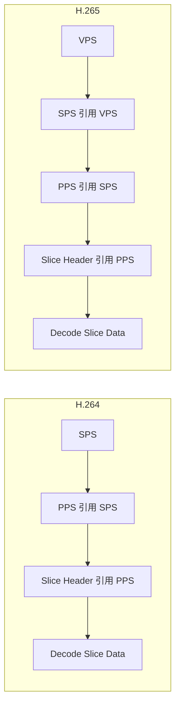
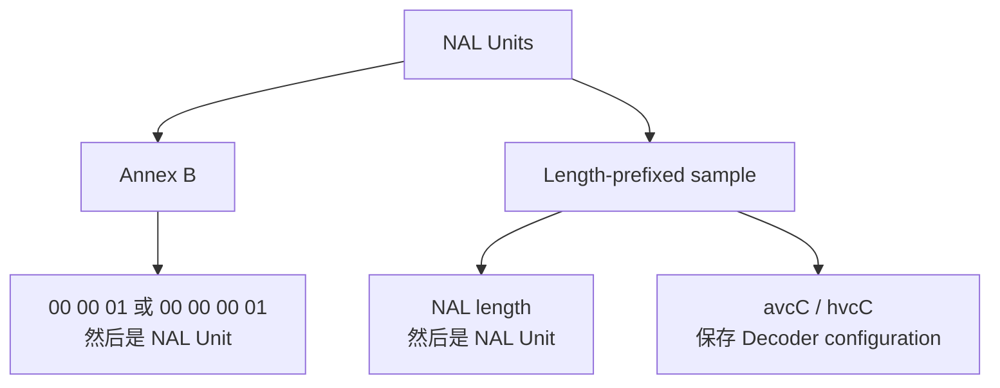
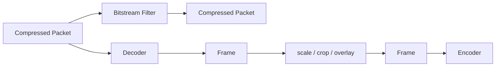
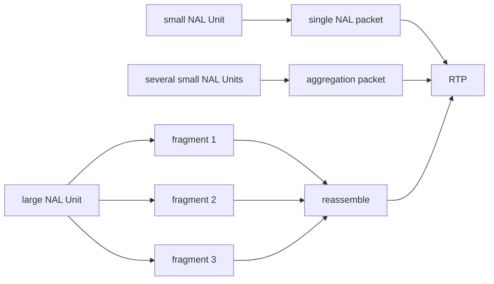
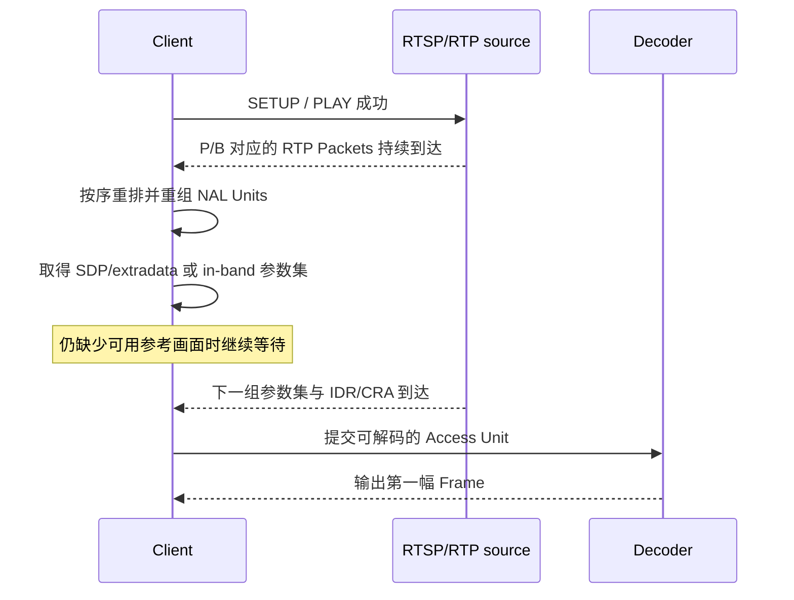

摄像头已经连接，RTP 包也在不断增加，画面却迟迟不出现。等了两秒，第一帧突然来了。

这两秒里，播放器不是在“发呆”。它可能已经收到许多数据，只是还缺少三样东西中的某一样：完整的 NAL Unit、解释码流所需的参数集，或者一个可以重新开始解码的随机访问点。

这一篇不从标准里的字段表开始。我们先生成一段只有 6 秒的视频，亲眼看见关键帧、解码顺序和 NAL Unit，再回到 RTSP 黑屏问题。后面的每个名词都会落到同一段样本上。

## 先做出这段 6 秒视频

先确认本机有 H.264 Encoder 和后面要用的 Bitstream Filter：

```powershell
ffmpeg -hide_banner -encoders 2>&1 | Select-String "libx264|libx265"
ffmpeg -hide_banner -bsfs 2>&1 | Select-String "h264_mp4toannexb|hevc_mp4toannexb|trace_headers|filter_units"
```

生成一段 640×360、25 FPS 的测试视频。这里把最大 GOP size 设为 50，并关闭 scene cut，目的是让关键帧尽量稳定地出现在 0、2、4 秒附近：

```powershell
ffmpeg -y -f lavfi -i "testsrc2=size=640x360:rate=25:duration=6" -an -c:v libx264 -g 50 -keyint_min 50 -sc_threshold 0 -pix_fmt yuv420p .\h264-gop.mp4
```

现在先别急着研究二进制。问视频一个简单的问题：哪些画面被 FFmpeg 标记为 keyframe？

```powershell
ffprobe -v error -select_streams v:0 -skip_frame nokey -show_frames -show_entries "frame=best_effort_timestamp_time,key_frame,pict_type" -of compact .\h264-gop.mp4
```

在本文使用的 FFmpeg 7.1.1 与 libx264 上，可以看到三个 I Picture：

```text
0.000000  I  key_frame=1
2.000000  I  key_frame=1
4.000000  I  key_frame=1
```

不同版本的附加输出可能略有差异，真正值得观察的是时间点：这段视频大约每 2 秒出现一次新的随机访问机会。刚才命令里的 `-g 50`，第一次从一个抽象参数变成了可以观察的现象。

## 一幅画面为什么不能独立保存

640×360 的测试视频看起来很小。如果把 1920×1080、RGB24、25 FPS 的视频原样保存，数据量大约是：

```text
一帧：1920 × 1080 × 3 ≈ 6.22 MB
一秒：6.22 MB × 25 ≈ 155 MB/s ≈ 1.24 Gbit/s
```

连续画面中，大部分像素其实没有剧烈变化。视频编码会同时利用两类重复：一幅画面内部相邻区域的相似，以及前后画面之间的相似。


日常所说的 I、P、B，可以先这样理解：

- I Picture 主要靠自身信息还原，不需要用其他 Picture 的样本预测当前画面；
- P Picture 可以引用之前已经解码的参考画面；
- B Picture 可以利用前后参考画面，通常压得更小，但会带来重排和额外等待。

因此，文件中的数据顺序不一定就是观看顺序。再看样本开头的几个 Packet：

```powershell
ffprobe -v error -select_streams v:0 -read_intervals "%+#8" -show_packets -show_entries "packet=pts_time,dts_time,flags" -of csv=p=0 .\h264-gop.mp4
```

本文样本的前四行是：

```text
0.000000,-0.080000,K__
0.080000,-0.040000,___
0.040000, 0.000000,___
0.160000, 0.040000,___
```

第一列是 PTS，决定“什么时候呈现”；第二列是 DTS，决定“什么时候送去解码”。`0.08` 秒的 Packet 比 `0.04` 秒的 Packet 更早进入解码器，正是因为后者可能要引用前者。只要时间轴关系合理，PTS 与 DTS 不相等不是文件损坏。

可以把这个过程简化为：

```text
观看顺序：I0  B1  B2  P3
解码顺序：I0  P3  B1  B2
```

## GOP 像沿途的“重新上车点”

GOP 是 Group of Pictures。工程上常用它描述从一个随机访问点延伸出去的预测结构，以及相邻随机访问点的距离。



假设客户端在 2.6 秒加入直播。它已经错过 2 秒附近的起点，随后收到的 P/B Picture 又可能依赖更早的参考画面。即使网络一切正常，它也可能要等到 4 秒附近，才有机会从完整状态开始解码。

这解释了一个常见取舍：

| GOP 较长 | GOP 较短 |
| --- | --- |
| 通常压缩效率更好 | 通常更容易快速起播和 Seek |
| 中途加入可能等得更久 | 随机访问点带来更多码率开销 |
| 丢失参考画面后影响可能持续更久 | 更快遇到新的恢复机会 |

不过，`-g 50` 只是在控制最大关键帧间隔，不是“标准保证每 50 帧必然出现一个 IDR”的声明。Scene cut、forced keyframe、open GOP 和 Encoder 自身策略都会影响实际结果，所以最后仍要用 `ffprobe` 看输出，而不是只看编码命令。

### I Picture 还不等于 IDR

I 描述的是画面使用 intra prediction；IDR 描述的是解码参考关系的一次刷新。



所以，“它是 I Picture”不能自动推出“任何 Decoder 都能从这里无条件开始”。`ffprobe` 的 `key_frame=1` 也是 FFmpeg 根据 Codec 与 Container 给出的关键帧标记，不能在所有情况下直接翻译成某个确定的 NAL unit type。

H.265 把随机访问画面分得更细。常见的 IRAP 包括 IDR 和 CRA：IDR 会进行更彻底的解码刷新；CRA 允许更灵活的 open GOP，随机从 CRA 开始时，要按规则丢弃与之前画面相关的某些 leading pictures。普通排障先记住“CRA 可以用于随机访问，但不是换了名字的 IDR”就够了。

## 现在打开压缩数据这只盒子

到这里，我们一直在谈 Picture。但文件和网络上传输的不是一张张原始画面，而是压缩后的 NAL Units。

下面这张图沿着同一份视频数据，从屏幕一路走到网络，再走回解码后的 Frame：



几个经常被混用的名字，在这里各有自己的位置：

| 名称 | 可以怎样理解 | 它不保证什么 |
| --- | --- | --- |
| Picture | 编码标准中的一幅图像 | 不保证只含一个 Slice |
| Slice | Picture 的一部分编码数据，可相对独立解析 | 不等于完整 Picture |
| NAL Unit | H.264/H.265 码流的基本封装单元 | 不等于 RTP Packet |
| Access Unit | 与一幅 coded Picture 对应的一组 NAL Units | 不保证只有一个 NAL Unit |
| `AVPacket` | FFmpeg 传递的压缩数据对象 | 不应依赖它与 NAL Unit 永远一一对应 |
| `AVFrame` | Decoder 输出的原始音视频数据对象 | 已经不是压缩码流 |

最容易写错的等式有两个：

```text
1 Frame  = 1 NAL Unit     ×
1 Packet = 1 NAL Unit     ×
```

一幅 Picture 可以被切成多个 Slice NAL Units；一个存储 Sample、RTP Packet 或 `AVPacket` 如何承载 NAL Units，还取决于封装、分包和解析过程。

## 用 trace_headers 看见 NAL Unit

不用手算二进制，FFmpeg 的 `trace_headers` 就能把码流语法打印出来：

```powershell
ffmpeg -hide_banner -loglevel verbose -i .\h264-gop.mp4 -map 0:v:0 -c:v copy -bsf:v trace_headers -f null - 2>&1 | Select-String "Sequence Parameter Set|Picture Parameter Set|nal_unit_type|slice_type"
```

输出很长，但第一次只寻找下面几类内容：

```text
Sequence Parameter Set
nal_unit_type ... = 7
Picture Parameter Set
nal_unit_type ... = 8
nal_unit_type ... = 6
nal_unit_type ... = 5
nal_unit_type ... = 1
```

它们分别对应 SPS、PPS、SEI、IDR Slice 和普通 non-IDR Slice。我们刚才看到的 I/P/B Picture，到了码流内部，变成了 Slice Header 与 Slice Data；Decoder 还会在旁边遇到参数集和其他辅助信息。

### H.264 的 1-byte NAL Header

H.264 基础 NAL Unit Header 占 1 byte：

```text
bit 7         bits 6..5       bits 4..0
+-----------+---------------+----------------+
| forbidden | nal_ref_idc   | nal_unit_type  |
| zero bit  |               |                |
+-----------+---------------+----------------+
    1 bit        2 bits           5 bits
```

排障时最常遇到这些 type：

| Type | 内容 | Decoder 用它做什么 |
| ---: | --- | --- |
| 1 | non-IDR coded Slice | 解码普通 Picture 的 Slice |
| 5 | IDR coded Slice | 从 IDR 随机访问点建立新参考链 |
| 6 | SEI | 携带补充增强信息，不是画面主体 |
| 7 | SPS | 取得 sequence 级解码参数 |
| 8 | PPS | 取得 Picture/Slice 使用的参数 |
| 9 | AUD | 可选地帮助标识 Access Unit 边界 |

例如 Annex B 码流中的 `00 00 00 01 67`，前四个 byte 是边界标记，`0x67` 才是 NAL Header。`0x67` 的低 5 bit 是 7，所以它是 SPS。相同方法可以读出常见的 `0x68` 为 PPS、`0x65` 为 IDR Slice。

但不要把 `SPS → PPS → IDR` 当作所有 Encoder 必须遵守的固定开场顺序。本文样本转成 Annex B 后，开头第一个 NAL Unit 就可能是 type 6 的 SEI。码流要按实际语法解析，不能靠背一个十六进制模板判断完整性。

## 参数集是解码器的“说明书”

Slice Data 像压缩后的正文，参数集则告诉 Decoder 应该怎样解释这份正文。



- SPS 保存 sequence 级信息，例如 Profile、Level、coded picture size、chroma format、bit depth、POC 和部分 VUI 信息；
- PPS 保存更接近 Picture 与 Slice 使用的配置，Slice Header 会通过 ID 引用 PPS；
- H.265 还增加 VPS，用来描述 layer、sub-layer 等更高层视频参数，SPS 会引用它。

参数集没有必要每帧重复。它们可以出现在码流内部，也可以作为 Container、SDP 或 FFmpeg 所说的 `extradata` 放在带外位置。于是，在某一个 `AVPacket` 中没搜到 SPS/PPS，不能单独证明码流有问题；Decoder 在处理 Slice 前是否已经拿到正确参数集，才是关键。

### 故意删掉 SPS/PPS，会发生什么

先把 MP4 中的 H.264 取成 Annex B 码流：

```powershell
ffmpeg -y -i .\h264-gop.mp4 -map 0:v:0 -c:v copy -an -bsf:v h264_mp4toannexb .\h264-gop.h264
```

然后做一个只用于学习的“破坏实验”，从副本中删掉 type 7 和 type 8：

```powershell
ffmpeg -y -f h264 -i .\h264-gop.h264 -map 0:v:0 -c:v copy -bsf:v "filter_units=remove_types=7|8" .\without-parameter-sets.h264
```

尝试解码损坏的副本：

```powershell
ffmpeg -hide_banner -v error -f h264 -i .\without-parameter-sets.h264 -f null -
```

这次错误不再抽象：

```text
non-existing PPS 0 referenced
decode_slice_header error
no frame!
```

Slice 明明还在，Decoder 却不知道怎样解释它，所以连一幅 `AVFrame` 都交不出来。这时去修改 RGB 转换、CUDA、TensorRT 或 AI 模型没有意义——问题还没有走到那些层级。

这个实验还有一个容易忽略的细节：有些损坏输入即使打印了大量解码错误，FFmpeg 进程仍可能以 0 结束。做媒体程序不能只检查 exit code，还要按任务需要处理 Decoder 日志、实际输出帧数和时间连续性。

## 为什么 MP4 里不一定找得到 Start Code

刚才使用 `h264_mp4toannexb`，是因为 NAL Unit 的内容相同，边界写法却可以不同。



### Annex B：用 Start Code 找边界

Annex B 使用 `00 00 01` 形式的 start code prefix；常见的 `00 00 00 01` 可以理解为前面多了一个 `zero_byte`。Raw `.h264`、`.h265` 以及 MPEG-TS 等场景中经常使用这种表示。

```powershell
Format-Hex -Path .\h264-gop.h264 | Select-Object -First 12
```

在十六进制输出中看到 `00 00 00 01`，只说明找到了一个 Annex B 边界。它后面的 Header 才告诉我们 NAL type，后续是否还有参数集和完整 Slice 仍要继续解析。

NAL payload 里如果也偶然出现 `00 00 01`，会破坏边界判断。因此编码时会按规则插入 `0x03` emulation prevention byte，把 RBSP 转成 EBSP；解析时再移除。这个细节解释了为什么不能随意编辑 NAL payload 中看似“多余”的 `03`。

### MP4：先写长度，再写 NAL Unit

MP4 sample 中的 H.264/H.265 通常是 length-prefixed：

```text
[NAL length][NAL data][NAL length][NAL data] ...
```

H.264 的 Decoder configuration 通常在 `avcC` box，H.265 对应 `hvcC`。配置中可以保存参数集和 NAL length size；length field 常见为 4 bytes，但解析器应读取配置，而不是写死 4。

因此，直接在 MP4 文件中搜索 `00 00 00 01`，然后得出“里面没有 NAL Unit”的结论，是把 Container 写法和 Codec 内容混在了一起。

### Bitstream Filter 只改压缩数据的表示

从 MP4 取出 Annex B H.264：

```powershell
ffmpeg -i .\input.mp4 -map 0:v:0 -c:v copy -an -bsf:v h264_mp4toannexb .\output.h264
```

H.265 使用对应的 Filter：

```powershell
ffmpeg -i .\input-hevc.mp4 -map 0:v:0 -c:v copy -an -bsf:v hevc_mp4toannexb .\output.h265
```

Bitstream Filter 工作在压缩 Packet 上，不需要先解码：



所以 `h264_mp4toannexb` 可以和 `-c:v copy` 同时使用；它改变 NAL Unit 的边界表示，并处理相关 extradata，但不会缩放画面，也不会产生一次新的有损编码。`scale`、`crop`、`overlay` 操作的则是解码后的 Frame，必须重新 Encode。

MPEG-TS 和 raw H.264/H.265 等输出格式中，FFmpeg 可能自动插入对应的 `mp4toannexb` Filter。排障命令显式写出它，通常更容易看懂数据究竟发生了什么变化。

## H.265 不是把 H.264 的 type 表换一遍

有了 H.264 这条实验线，再看 H.265 会轻松很多。先生成同样时长的样本：

```powershell
ffmpeg -y -f lavfi -i "testsrc2=size=640x360:rate=25:duration=6" -an -c:v libx265 -g 50 -x265-params "min-keyint=50:scenecut=0" -pix_fmt yuv420p .\h265-gop.mp4
```

查看它的 Header：

```powershell
ffmpeg -hide_banner -loglevel verbose -i .\h265-gop.mp4 -map 0:v:0 -c:v copy -bsf:v trace_headers -f null - 2>&1 | Select-String "Video Parameter Set|Sequence Parameter Set|Picture Parameter Set|nal_unit_type|slice_type"
```

两种 Codec 的工程差异可以先收在这张表里：

| | H.264 / AVC | H.265 / HEVC |
| --- | --- | --- |
| 基础 NAL Header | 1 byte | 2 bytes |
| NAL type 位数 | 5 bit | 6 bit |
| 参数集 | SPS、PPS | VPS、SPS、PPS |
| 常见随机访问 | IDR type 5 | IDR type 19/20、CRA type 21 |
| MP4 配置 | `avcC` | `hvcC` |
| 转 Annex B | `h264_mp4toannexb` | `hevc_mp4toannexb` |

HEVC 基础 NAL Header 的结构是：

```text
+---+---------------+--------------+-----------------------+
| F | nal_unit_type | nuh_layer_id | nuh_temporal_id_plus1 |
+---+---------------+--------------+-----------------------+
  1       6 bits          6 bits             3 bits
```

常见类型包括 VPS 32、SPS 33、PPS 34、AUD 35、prefix/suffix SEI 39/40。HEVC 的 `nal_unit_type` 要从第一个 Header byte 取 `(byte0 >> 1) & 0x3F`；不能把 H.264 的 `byte & 0x1F` 原样套过来。`nuh_temporal_id_plus1` 的合法值也不能为 0。

## 回到开头：RTSP 已连接，为什么仍然没有首帧

RTSP 负责建立和控制会话，视频通常通过 RTP 传输。一个较小的 NAL Unit 可以放进单个 RTP Packet，多个 NAL Units 可以聚合，过大的 NAL Unit 也可以拆成多个 Fragmentation Units。



H.264 中常见 STAP-A 与 FU-A，HEVC 中对应的机制通常称为 AP 与 FU。这里真正重要的不是缩写，而是层级：

```text
UDP datagram ≠ RTP Packet ≠ NAL Unit ≠ Access Unit ≠ AVPacket ≠ AVFrame
```

现在把一个客户端在 2.6 秒加入本文样本的过程完整走一遍：



这条链上的每一步都可能让画面停住：

1. RTSP authentication 或 SETUP 失败，媒体根本没建立；
2. RTP sequence 有丢失或乱序，FU 无法重组为完整 NAL Unit；
3. Slice 已经到达，但 Decoder 没从 SDP、extradata 或 in-band 数据取得 VPS/SPS/PPS；
4. 参数集已经有了，但客户端加入得太晚，还在等待合适的 IDR/CRA；
5. Decoder 已经输出 Frame，问题才可能进入色彩转换、GPU upload、渲染或 AI inference。

所以至少应该分别记录四个时间点：RTSP PLAY 成功、首个 RTP 到达、首个完整 Access Unit 提交、首个 `AVFrame` 输出。只记录“连接成功”会把网络层的成功误当成视频已经可用。

### H.264/H.265 参数集可能从哪里来

| 位置 | 常见情况 | 排查方式 |
| --- | --- | --- |
| 码流内部 | SPS/PPS 或 VPS/SPS/PPS 在随机访问点附近重复发送 | 用 `trace_headers` 或抓取 Annex B 检查 |
| RTSP SDP | H.264 可通过 `sprop-parameter-sets`，HEVC 有相应 VPS/SPS/PPS 属性 | 保存并检查 DESCRIBE 返回的 SDP |
| MP4 配置 | `avcC` / `hvcC` 中的 Decoder configuration | 用 MP4 box 工具或 FFmpeg extradata 路径检查 |
| FFmpeg Codec Parameters | Demuxer/Parser 提供的 `extradata` | 在打开 Decoder 前记录 codecpar 与 extradata size |

“某个 RTP Packet 中没有 SPS”本身不是错误；真正的问题是 Decoder 在需要它时有没有一份与当前 Slice ID 匹配的参数集。

## 看到这些现象，下一步查哪里

| 现象 | 先回答的问题 | 暂时不要先改什么 |
| --- | --- | --- |
| RTSP 已 PLAY，却一直没有首帧 | RTP 是否连续、NAL 是否重组完整、参数集和 IDR/CRA 是否到齐 | AI 模型参数 |
| 每次都要等 3～4 秒才起播 | 实际 IRAP/keyframe interval 是多少，客户端在 GOP 的哪里加入 | 盲目加大播放 Buffer |
| `non-existing PPS referenced` | PPS 从 SDP、extradata 还是 in-band 来，Slice 引用的 ID 是否存在 | 端口和 TensorRT |
| `missing picture in access unit` | 丢包、分片重组、Access Unit 边界和时间戳是否完整 | 只改文件扩展名 |
| MP4 中搜不到 Start Code | 它是否使用 `avcC`/`hvcC` 与 length prefix | 判断文件没有 H.264/H.265 |
| Raw `.h264` 播放失败 | 是否真是 Annex B，是否带 SPS/PPS，Codec 是否识别正确 | 反复换播放器 |
| PTS 与 DTS 不相等 | 是否存在 B Picture 重排，时间戳是否仍然单调可解码 | 直接把 PTS 复制给 DTS |
| 花屏一阵后恢复 | 是否丢失参考 Picture，恢复是否恰好发生在下一个 IDR/CRA | 只看平均带宽 |

遇到真实摄像头问题时，可以用下面的顺序逐层收窄：

```text
RTSP 会话
  ↓
RTP sequence / loss / reorder
  ↓
NAL fragment reassembly
  ↓
VPS / SPS / PPS
  ↓
IDR / CRA 与参考关系
  ↓
Decoder 是否输出 AVFrame
  ↓
渲染、GPU、AI inference
```

顺序的价值在于：只要 Decoder 还没有输出 Frame，后面的模块就不可能是“没有首帧”的根因。

## 最后再看一次这段 6 秒视频

我们从一条生成命令开始，已经可以回答这些问题：

1. 为什么 25 FPS、`-g 50` 大约每 2 秒给出一次新的随机访问机会？
2. 为什么样本中的 PTS 和 DTS 顺序不同，却仍然可以正常播放？
3. 为什么一个 Picture、NAL Unit、RTP Packet 和 `AVPacket` 不能画等号？
4. 为什么删掉 SPS/PPS 后 Slice 还在，Decoder 却报告 `no frame`？
5. 为什么把 MP4 复制成 raw H.264 时需要处理 length prefix 与 Annex B，而不是只改扩展名？
6. 为什么 RTSP PLAY 成功只能说明会话已建立，不能说明首个 `AVFrame` 已经产生？

最后让原始样本完整解码一次：

```powershell
ffmpeg -v error -i .\h264-gop.mp4 -f null -
ffmpeg -v error -i .\h265-gop.mp4 -f null -
```

无错误完成说明这两个本地样本可以被当前软件 Decoder 读完；它不等于特定摄像机、硬件 Decoder 或生产网络也已经通过。到了真实链路，仍要沿着 RTSP、RTP、NAL、参数集、随机访问点和 Decoder 输出逐层观察。

相关阅读：[FFprobe 命令查询与理解](/tutorials/t2er6pk59/)、[案例学习：常见任务与面试题](/tutorials/t19hdgc9e/)。

本文中的码流语义与命令参考 [ITU-T H.264](https://www.itu.int/rec/T-REC-H.264)、[ITU-T H.265](https://www.itu.int/rec/T-REC-H.265)、[RFC 6184：H.264 RTP Payload Format](https://www.rfc-editor.org/rfc/rfc6184)、[RFC 7798：HEVC RTP Payload Format](https://www.rfc-editor.org/rfc/rfc7798)、[FFmpeg Bitstream Filters Documentation](https://ffmpeg.org/ffmpeg-bitstream-filters.html) 与 [ffprobe Documentation](https://ffmpeg.org/ffprobe.html)。
