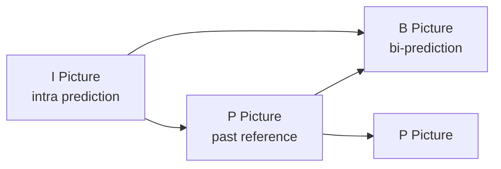
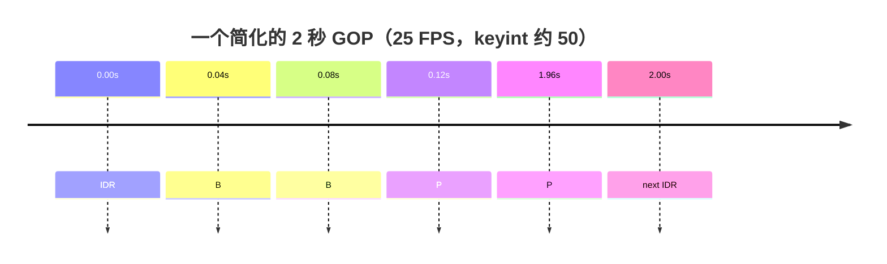
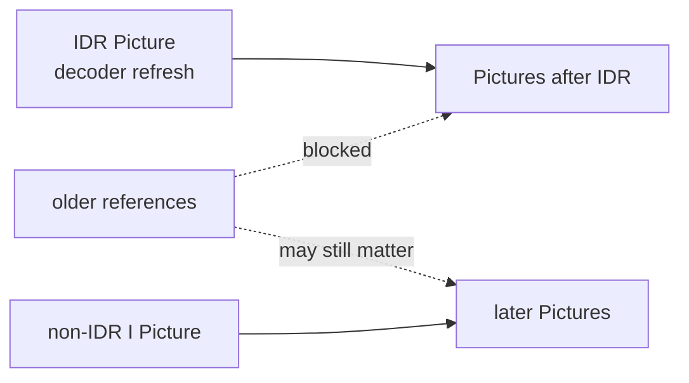
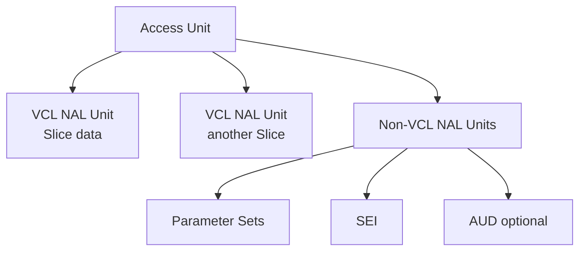
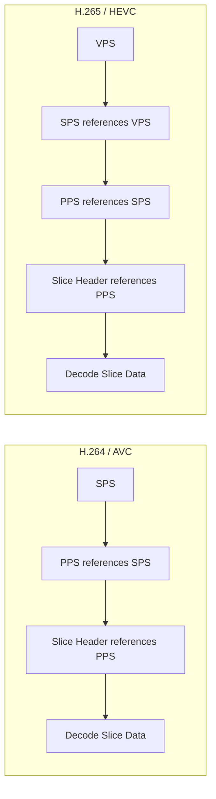
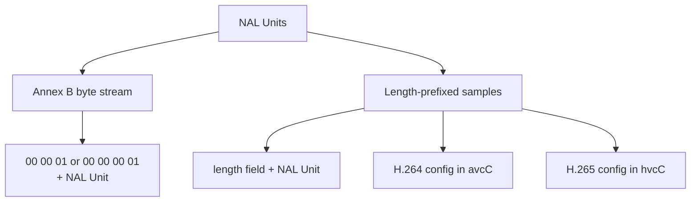
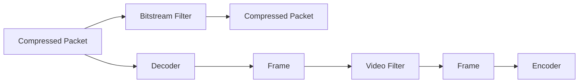
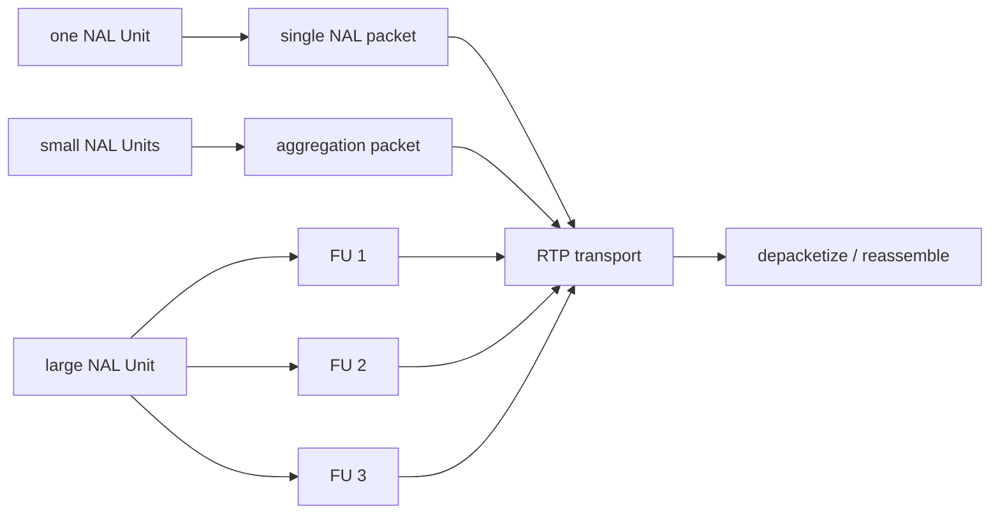

RTSP 已经连接成功，RTP Packet 也在持续到达，播放器为什么还会黑几秒？把 MP4 里的 H.264 用 `-c:v copy` 取出来，为什么另一个程序又说找不到 Start Code？

这类问题很容易被笼统地归为“网络不稳”或“Codec 不兼容”。真正缺少的往往是一张 Bitstream 地图：画面怎样变成压缩数据，Decoder 从哪里取得参数，Container 和 RTP 又怎样包装 NAL Unit。

本文不试图复述 H.264、H.265 标准。目标只有一个：看到黑屏、花屏、`missing PPS` 或漫长的首帧等待时，知道问题卡在了哪一层，以及下一条命令该查什么。

## 一张图先把层级摆正

先从摄像头到 AI inference 的完整链路看起：


图里的名词不能随意互换：

| 层级 | 它是什么 | 不要把它当成 |
| --- | --- | --- |
| Picture | 编码标准中的一幅图像 | 一个固定大小的数据块 |
| Slice | Picture 的一部分编码数据 | 完整 Picture |
| NAL Unit | H.264/H.265 Bitstream 的基本封装单元 | RTP Packet 或 `AVPacket` |
| Access Unit | 解码一幅 Picture 所需的一组 NAL Units | 永远只有一个 NAL Unit |
| `AVPacket` | FFmpeg 在 Demux/Decode 边界传递的压缩数据 | 标准规定的 NAL Unit |
| `AVFrame` | FFmpeg Decode 后的原始 Frame | 压缩 Bitstream |
| MP4 / MPEG-TS | Container | Video Codec |
| RTP | 实时媒体的传输包装 | RTSP 本身 |

最值得先记住的是：`1 Frame = 1 NAL Unit` 和 `1 AVPacket = 1 NAL Unit` 都不成立。一个 Picture 可以有多个 Slice NAL Units；一个 Packet 里也可能装一个或多个 NAL Units，具体取决于 Container、Demuxer、Parser 和 Bitstream 表示方式。

## Picture 为什么需要 I、P、B

1920×1080、RGB24、25 FPS 的原始视频，每帧约为：

```text
1920 × 1080 × 3 ≈ 6.22 MB
6.22 MB × 25 ≈ 155 MB/s ≈ 1.24 Gbit/s
```

Encoder 会同时利用空间冗余和时间冗余：同一幅 Picture 内，相邻区域经常相似；连续 Picture 之间，大部分内容也没有变化。I、P、B 描述的正是不同的预测方式。



- I Picture 使用 intra prediction，不依赖其他 Picture 的样本进行画面预测；
- P Picture 可以参考先前已经 Decode 的 Picture；
- B Picture 可以使用双向预测，压缩效率通常更高，也带来了 reorder 与额外 latency。

日常说“I/P/B Frame”很方便，不过标准语义比这更细：Slice Header 中存在 slice type，一幅 Picture 还可能包含多个 Slice。做工程排查时可以继续使用 I/P/B 这个直观叫法，但不要据此推导出“一个 Frame 只有一个 Slice”或“I 就一定能安全随机接入”。

### Display order 和 Decode order

有 B Picture 时，Decoder 可能要先拿到后面的 reference，才能还原中间的 B Picture：

```text
Display order: I0  B1  B2  P3
Decode order:  I0  P3  B1  B2
```

因此 Packet 的 PTS 与 DTS 可能不同：PTS 决定何时呈现，DTS 决定何时 Decode。看到二者不相等，不应立刻判定文件损坏。

## GOP 决定“多久能重新站稳”

GOP 是 Group of Pictures。工程上常用它描述一段 Picture 的预测结构与随机访问间隔：



`25 FPS`、最大 keyframe interval 为 `50` 时，两个周期性随机访问点大约相隔 2 秒。FFmpeg 使用 libx264 时，`-g 50` 设置最大 GOP size；scene cut、forced keyframe、open GOP 等设置仍可能影响实际结构，所以 `-g 50` 不是“标准保证每 50 帧必有一个 IDR”的同义句。

GOP 越长，bitrate 往往更省，但中途加入和丢包恢复可能等得更久。GOP 越短，随机访问与切片更方便，参数集和 intra picture 也会带来更多开销。直播、监控和 HLS 通常要在 bandwidth、compression efficiency、join latency 与 recovery time 之间取舍。

### I Picture 不等于 IDR

I 描述 Picture 内部的预测方式；IDR 描述 Decoder refresh 与后续 reference 的边界。H.264 的 IDR 到来后，后续 Picture 不再引用 IDR 之前的 reference picture。



所以任意 I Picture 都不应机械地当作 IDR。`ffprobe` 的 `key_frame=1` 是 FFmpeg 层面的 keyframe 标记，也不能在所有 Codec 和 Container 中直接翻译成某个确定的 NAL unit type。

H.265/HEVC 把随机访问分得更细，常见 IRAP picture 包括：

| HEVC NAL unit type | 名称 | 工程含义 |
| ---: | --- | --- |
| 19 | `IDR_W_RADL` | IDR，允许关联 RADL picture |
| 20 | `IDR_N_LP` | IDR，不带 leading picture |
| 21 | `CRA_NUT` | Clean Random Access，常见于更灵活的 open GOP |

CRA 可以作为随机访问点，但从 CRA 开始 Decode 时，CRA 之前关联的 RASL picture 需要按随机访问规则处理。它不是“换了名字的 IDR”。对于普通监控排障，先区分 IDR 与 CRA 已经足够；涉及精确切片和拼接时，再深入 RADL、RASL 和 recovery point。

## NAL Unit 里面装着什么

NAL 是 Network Abstraction Layer。它把 Video Coding Layer 产生的数据组织成相对适合存储和传输的单元。



VCL NAL Units 承载 Slice data。Non-VCL NAL Units 则携带 parameter set、SEI、Access Unit Delimiter 等信息。一个 Access Unit 通常对应一幅 coded Picture 所需的 NAL Units，但并不要求每个 Access Unit 都重新携带 VPS/SPS/PPS，也不要求一定出现 AUD。

### H.264 NAL Unit Header

H.264 基础 NAL Unit Header 是 1 byte：

```text
bit 7         bits 6..5       bits 4..0
+-----------+---------------+----------------+
| forbidden | nal_ref_idc   | nal_unit_type  |
| zero bit  |               |                |
+-----------+---------------+----------------+
    1 bit        2 bits           5 bits
```

常见 `nal_unit_type`：

| Type | 名称 | 用途 |
| ---: | --- | --- |
| 1 | non-IDR coded Slice | 普通 VCL data |
| 5 | IDR coded Slice | IDR Picture 的 Slice |
| 6 | SEI | Supplemental Enhancement Information |
| 7 | SPS | Sequence Parameter Set |
| 8 | PPS | Picture Parameter Set |
| 9 | AUD | Access Unit Delimiter |

在 Annex B Bitstream 中看到：

```text
00 00 00 01 67 ...
```

前四个 byte 是 Start Code，`0x67` 才是 NAL Unit Header。它的低 5 bit 为 `00111`，也就是 type 7：SPS。相同方法可读出常见的 `0x68` 为 PPS，`0x65` 为 IDR Slice；不过实际 Bitstream 还可能包含 AUD、SEI 或多个 Slice，不应假定所有 Encoder 都按这三项固定排列。

### H.265 NAL Unit Header

HEVC 基础 NAL Unit Header 是 2 bytes：

```text
+---+---------------+--------------+-----------------------+
| F | nal_unit_type | nuh_layer_id | nuh_temporal_id_plus1 |
+---+---------------+--------------+-----------------------+
  1       6 bits          6 bits             3 bits
```

常见类型如下：

| Type | 名称 | Type | 名称 |
| ---: | --- | ---: | --- |
| 19 | `IDR_W_RADL` | 32 | VPS |
| 20 | `IDR_N_LP` | 33 | SPS |
| 21 | `CRA_NUT` | 34 | PPS |
| 35 | AUD | 39 / 40 | prefix / suffix SEI |

`nuh_temporal_id_plus1` 不能为 0。H.264 用 Header byte 的低 5 bit 取 NAL type；HEVC 的 type 占 6 bit，可由第一个 Header byte 的 `(byte0 >> 1) & 0x3F` 取得，不能把 `byte & 0x1F` 的 H.264 写法直接套过来。

## VPS、SPS、PPS 是 Decoder 的上下文

Parameter Set 不包含一幅完整画面，却决定 Slice 应怎样解释。



- SPS 描述 sequence 级信息，例如 profile/level、coded picture size、chroma format、bit depth、POC 与 VUI 等；
- PPS 保存更接近 Picture/Slice 使用的配置，并由 Slice Header 通过 ID 引用；
- HEVC 的 VPS 位于更高层，承载 layer、sub-layer 等视频参数，SPS 会引用 VPS。

Parameter Set 不一定每帧重复。它可能在 Bitstream 的随机访问点附近周期性出现，也可能放在 MP4 的 decoder configuration record、RTSP 的 SDP 或其他 extradata 中。因此，在某一个 `AVPacket` 里没找到 SPS/PPS，并不能单独证明输入错误。

但 Decoder 在开始处理对应 Slice 前，必须已经拿到正确的 Parameter Set。缺失或引用错位时常见日志包括：

```text
non-existing PPS referenced
missing picture in access unit
decode_slice_header error
could not find codec parameters
```

这时 Decoder 连 Picture 都还没有交出来，继续调整 YOLO、TensorRT 或 RGB resize 不会解决上游问题。

## Annex B 与 avcC/hvcC：内容相同，边界写法不同

NAL Unit 的 Codec 内容可以相同，但怎样标出每个 NAL Unit 的边界并不只有一种方式。



### Annex B

Annex B 使用 3-byte `start_code_prefix_one_3bytes`（`00 00 01`）分隔 NAL Units。常见的 `00 00 00 01` 是前面的 `zero_byte` 加上这个 3-byte prefix，常见于 `.h264`、`.h265` elementary stream 和 MPEG-TS 等场景：

```text
00 00 00 01 67 ...  H.264 SPS
00 00 00 01 68 ...  H.264 PPS
00 00 00 01 65 ...  H.264 IDR Slice
```

为了避免 NAL payload 内部偶然形成 Start Code 等保留字节模式，Encoder 会把 RBSP 转为 EBSP：连续两个 `00` 后，若下一 byte 位于 `00`～`03`，便插入 `0x03` emulation prevention byte。这个过程作用于 NAL payload，不包含 NAL Unit Header；解析 RBSP 时再按规范移除。只想排查 FFmpeg 媒体链路时，不要手工改这些 byte。

### MP4 中常见的 length prefix

MP4 sample 内的 H.264/H.265 通常使用 length-prefixed NAL Units：

```text
[NAL length][NAL data][NAL length][NAL data]...
```

H.264 decoder configuration 通常记录在 `avcC` box，HEVC 对应 `hvcC`，其中可以提供 Parameter Set 和 NAL length size 等信息；length field 常见为 4 bytes，但应读取 configuration record 中的实际配置。不同 sample entry（如 `avc1/avc3`、`hvc1/hev1`）对 Parameter Set 的携带约束也不同。这也是为什么不能在 MP4 文件里盲搜 `00 00 00 01`，然后断言“没有 NAL Unit”。Container 的 box、sample 与 Codec Bitstream 是不同层。

### Bitstream Filter 不会重新 Encode

从 MP4 提取 Annex B H.264：

```powershell
ffmpeg -i .\input.mp4 -map 0:v:0 -c:v copy -an -bsf:v h264_mp4toannexb .\output.h264
```

HEVC 对应：

```powershell
ffmpeg -i .\input-hevc.mp4 -map 0:v:0 -c:v copy -an -bsf:v hevc_mp4toannexb .\output.h265
```

`h264_mp4toannexb` 和 `hevc_mp4toannexb` 修改压缩 Bitstream 的表示，并把相关 extradata 转成 Annex B Parameter Sets；它们不经过 Decode → Frame → Encode，所以可以和 `-c:v copy` 一起使用。某些 output format（例如 MPEG-TS 和 raw H.264/H.265）会由 FFmpeg 自动插入相应 Bitstream Filter，显式写出则更便于解释和排查。

普通 Video Filter 与 Bitstream Filter 的位置完全不同：



`scale`、`crop`、`overlay` 会改 Frame，因此需要重新 Encode；`h264_mp4toannexb` 只改 Bitstream packaging，不会缩放画面，也不会改变 Picture 内容。

## RTSP 中途加入时发生了什么

RTSP 主要负责建立和控制媒体会话，Video media 通常经 RTP 传输。RTP payload format 允许三种重要形态：一个 RTP Packet 携带单个 NAL Unit；多个较小 NAL Units 聚合进一个 Packet；较大 NAL Unit 拆成多个 Fragmentation Units。



所以 NAL Unit、RTP Packet、UDP datagram 与 FFmpeg `AVPacket` 分属不同层级。看到 RTP 在增长，只能证明传输层有数据；Decoder 是否已拿到完整 NAL Unit、Parameter Set 和可用随机访问点，还要继续确认。

客户端刚好在两个 IDR 之间加入时，先收到的 P/B Picture 可能依赖它从未见过的 reference：

```text
IDR ── P ── B ── P ── B ── IDR ── P
                    ↑ client joins
                    └─ may wait here ─┘
```

如果 Parameter Set 也没有通过 in-band、SDP 或其他 extradata 取得，等待会更明显。于是“RTSP SETUP/PLAY 成功”和“Decoder 已输出首个 Frame”必须分别记录。

碰到黑屏，我会按下面的顺序缩小范围：

1. RTSP handshake 与 authentication 是否成功；
2. RTP sequence 是否持续，是否出现 loss / reorder；
3. depacketization 能否重组完整 NAL Units；
4. VPS/SPS/PPS 是否在需要时可用；
5. 是否等到合适的 IDR / CRA，GOP interval 多长；
6. Decoder 是否真正输出了首个 Frame；
7. 只有 Frame 已经稳定产生后，才继续检查 color conversion、GPU upload 与 AI inference。

## 在本机做一组可重复实验

不要一开始就拿不稳定的 Camera 做实验。`testsrc2` 可以生成可控输入，让 GOP、Packet 与 NAL Header 的现象重复出现。

### 生成 H.264 与 H.265 样本

先确认 Encoder 和 Bitstream Filter：

```powershell
ffmpeg -hide_banner -encoders 2>&1 | Select-String "libx264|libx265"
ffmpeg -hide_banner -bsfs 2>&1 | Select-String "h264_mp4toannexb|hevc_mp4toannexb|trace_headers"
```

生成 8 秒、25 FPS、最大 GOP size 为 50 的 H.264：

```powershell
ffmpeg -y -f lavfi -i "testsrc2=size=1280x720:rate=25:duration=8" -an -c:v libx264 -g 50 -keyint_min 50 -sc_threshold 0 -pix_fmt yuv420p .\h264-gop.mp4
```

关闭 scene cut 是为了让教学样本更容易观察，不代表生产流也应该照搬。实际 keyframe 位置仍应从输出文件读取。

如果本机带 `libx265`，生成 HEVC 样本：

```powershell
ffmpeg -y -f lavfi -i "testsrc2=size=1280x720:rate=25:duration=8" -an -c:v libx265 -g 50 -x265-params "min-keyint=50:scenecut=0" -pix_fmt yuv420p .\h265-gop.mp4
```

### 看 Frame type 和 keyframe 位置

```powershell
ffprobe -v error -select_streams v:0 -show_frames -show_entries "frame=best_effort_timestamp_time,key_frame,pict_type" -of compact .\h264-gop.mp4
```

只看 FFmpeg 标记为 keyframe 的 Frame：

```powershell
ffprobe -v error -select_streams v:0 -skip_frame nokey -show_frames -show_entries "frame=best_effort_timestamp_time,key_frame,pict_type" -of compact .\h264-gop.mp4
```

这里能回答“FFmpeg 在哪些时间点标了 keyframe”，不能单独回答“每个 keyframe 的 NAL unit type 是多少”。后一个问题要看 Bitstream Header。

### 看 Packet 的 PTS、DTS 和 flags

```powershell
ffprobe -v error -select_streams v:0 -show_packets -show_entries "packet=pts_time,dts_time,duration_time,size,flags" -of compact .\h264-gop.mp4
```

如果 Encoder 产生了 B Picture，通常能观察到 PTS 与 DTS 的差异。`flags=K_` 表示 FFmpeg 对该 Packet 的 keyframe 标记；它同样不是一个通用的“IDR type detector”。

### 提取 Annex B 并看 Start Code

```powershell
ffmpeg -y -i .\h264-gop.mp4 -map 0:v:0 -c:v copy -an -bsf:v h264_mp4toannexb .\h264-gop.h264
Format-Hex -Path .\h264-gop.h264 | Select-Object -First 12
```

HEVC：

```powershell
ffmpeg -y -i .\h265-gop.mp4 -map 0:v:0 -c:v copy -an -bsf:v hevc_mp4toannexb .\h265-gop.h265
Format-Hex -Path .\h265-gop.h265 | Select-Object -First 12
```

看到 Start Code 只证明 Annex B boundary 存在。具体 NAL Unit 顺序由 Encoder 与配置决定，不要只凭前 12 行 hex 就判断整段 Bitstream 完整。

### 用 `trace_headers` 读语法字段

H.264：

```powershell
ffmpeg -hide_banner -loglevel verbose -i .\h264-gop.mp4 -map 0:v:0 -c:v copy -bsf:v trace_headers -f null - 2>&1 | Select-String "Sequence Parameter Set|Picture Parameter Set|nal_unit_type|slice_type"
```

HEVC：

```powershell
ffmpeg -hide_banner -loglevel verbose -i .\h265-gop.mp4 -map 0:v:0 -c:v copy -bsf:v trace_headers -f null - 2>&1 | Select-String "Video Parameter Set|Sequence Parameter Set|Picture Parameter Set|nal_unit_type|slice_type"
```

`trace_headers` 是 Bitstream Filter，当前 FFmpeg build 必须列出并支持目标 Codec。它把解析结果写到 stderr，适合学习和定位 Header，不适合直接作为高吞吐生产日志常开。

### 最后确认文件还能完整 Decode

```powershell
ffmpeg -v error -i .\h264-gop.mp4 -f null -
ffmpeg -v error -i .\h265-gop.mp4 -f null -
```

`ffprobe` 能读到 Container Header，不代表所有 Packet 都能 Decode。完整 Decode 没有报错且 process exit code 为 0，才补上了这层证据；真实播放器、RTSP transport 和硬件 Decoder 仍需在目标环境验证。

## 从现象回到正确层级

| 现象 | 更值得先查什么 | 容易走错的方向 |
| --- | --- | --- |
| RTSP 连上却没有首帧 | Parameter Set、IDR/CRA、RTP reassembly、Decoder log | 先改 AI model |
| 总要等 3～4 秒才出画面 | 实际 keyframe/IRAP interval、GOP 设置 | 只加大 player buffer |
| `missing PPS` / `non-existing PPS` | SDP/extradata/in-band PPS 与 Slice reference | 只查端口是否通 |
| MP4 中搜不到 Start Code | `avcC`/`hvcC`、length-prefixed sample | 判断 MP4 没有 H.264/H.265 |
| raw `.h264` 无法播放 | 是否正确转成 Annex B、是否带 Parameter Set | 只改扩展名 |
| PTS 与 DTS 不相等 | B Picture reorder 与 Container timeline | 直接重写时间戳 |
| MediaMTX/GStreamer/DeepStream 报 invalid NAL | Codec、Parameter Set、RTP loss/reassembly、NAL boundary | Decoder 未出帧就调 TensorRT |

把整篇收回到一条排查路径，就是：Container 或 RTP 先交出完整的压缩数据，NAL Units 再组成 Decoder 能理解的 Access Unit；正确的 Parameter Set 和随机访问点到齐后，Decoder 才能产生 Frame。AI pipeline 从 Frame 开始，前面任何一层没有成立，模型都还没有真正进入问题现场。

相关阅读：[FFprobe 命令查询与理解](/tutorials/t2er6pk59/)、[案例学习：常见任务与面试题](/tutorials/t19hdgc9e/)。

参考：[ITU-T H.264](https://www.itu.int/rec/T-REC-H.264)、[ITU-T H.265](https://www.itu.int/rec/T-REC-H.265)、[RFC 6184: RTP Payload Format for H.264](https://www.rfc-editor.org/rfc/rfc6184)、[RFC 7798: RTP Payload Format for HEVC](https://www.rfc-editor.org/rfc/rfc7798)、[FFmpeg Bitstream Filters Documentation](https://ffmpeg.org/ffmpeg-bitstream-filters.html)、[ffprobe Documentation](https://ffmpeg.org/ffprobe.html)。
