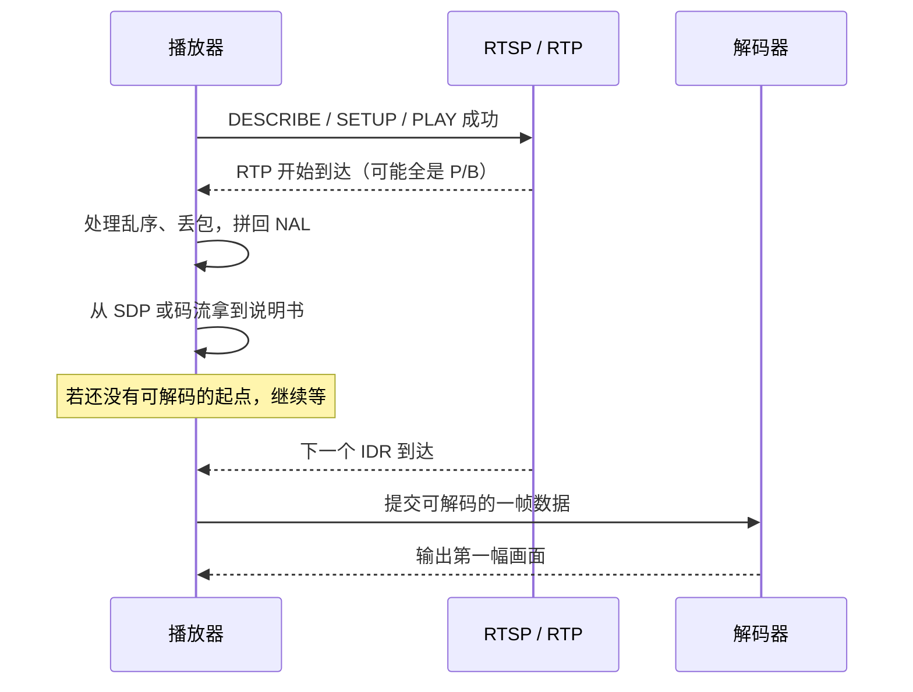

前面几篇已经能换容器、转码和切片。真正容易卡住的，往往是下面这些情况：

- 用 `-c copy` 切片，开头总是对不齐，画面还可能花一下；
- 摄像头 RTSP 已经连上，画面却黑 2～4 秒才出来；
- 日志里出现 `non-existing PPS 0 referenced`，后面全是 `no frame!`；
- 把 MP4 改成 `.h264` 后缀播不了，在 MP4 里也搜不到 `00 00 00 01`。

这四件事看起来分属切片、直播、报错和文件格式，其实问的是同一个问题：**压缩后的视频不是一张张独立图片。解码器必须在正确的时间拿到正确的几样东西，才能画出第一帧。**


解码器开始出画之前，通常缺的不是“有没有数据”，而是这三样里的某一样：

1. 一只完整的压缩信封（NAL Unit）；
2. 说明书（SPS / PPS，H.265 还要 VPS）；
3. 一个可以重新开始解码的点（常见是 IDR）。

这一篇按整套教程的习惯来：**先跑通一段 6 秒样本，再对着样本理解名词，最后用同一条链排错。** 不要先背缩写。后面每条命令都按三步读：它在问什么、每个参数做什么、输出里该看哪几个字段。

先扫一眼即将出现的名字。现在只需建立印象，后面都会在数据旁边再讲一遍：

| 名字 | 先把它理解成 | 你为什么要管它 |
| --- | --- | --- |
| 关键帧 / IDR | 可以从这里重新开始解码的点 | 决定 Seek、切片和直播起播要等多久 |
| GOP | 两个可安全起播点之间隔多远 | `-g 50`、摄像头 GOP、HLS 分片都和它有关 |
| I / P / B 帧 | 这一帧主要靠自己、靠前面、还是两边参考 | 解释花屏、重排和 PTS/DTS 为什么不同 |
| NAL Unit | 压缩数据的一只带类型标签的信封 | 文件、RTP、报错都在这层发生 |
| SPS / PPS | 解码器说明书 | `missing PPS` 就是说明书没拿到 |
| Annex B | 用 `00 00 01` 标出每只信封从哪开始 | `.h264` 文件常见这种写法 |
| Bitstream Filter | 改压缩数据的包装，不重新画画面 | 所以可以和 `-c copy` 一起用 |

建议新建一个空目录，在该目录打开 PowerShell，后面的文件都会写在这里。

## 先做出这段 6 秒视频

先确认本机有 H.264 Encoder 和后面要用的 Bitstream Filter：

```powershell
ffmpeg -hide_banner -encoders 2>&1 | Select-String "libx264|libx265"
ffmpeg -hide_banner -bsfs 2>&1 | Select-String "h264_mp4toannexb|hevc_mp4toannexb|trace_headers|filter_units"
```

这两条命令不是在处理视频。`-encoders` 列出本机能用的 Encoder，`-bsfs` 列出 Bitstream Filter。`2>&1` 把 FFmpeg 写到错误输出的日志并进流水线，`Select-String` 只留下你关心的名字。如果没有 `libx264`，先换一台构建完整的 FFmpeg，不要继续后面的实验。

接下来让 FFmpeg **自己画** 一段测试视频，不需要准备现成文件：

```powershell
ffmpeg -y -f lavfi -i "testsrc2=size=640x360:rate=25:duration=6" -an -c:v libx264 -g 50 -keyint_min 50 -sc_threshold 0 -pix_fmt yuv420p .\h264-gop.mp4
```

这条命令在做什么：生成 6 秒、25 帧/秒、640×360 的 H.264 视频，并尽量让关键帧出现在 0、2、4 秒。

| 片段 | 它在做什么 |
| --- | --- |
| `-y` | 输出已存在时直接覆盖。这是实验文件，允许覆盖 |
| `-f lavfi` | 输入不是磁盘文件，而是 FFmpeg 的滤镜虚拟源 |
| `testsrc2=...` | 内置测试画面，带时间码，方便确认“现在是第几秒” |
| `-an` | 不要音频。这篇只观察视频码流 |
| `-c:v libx264` | 用 libx264 把画面压成 H.264 |
| `-g 50` | 最多隔 50 帧给一个关键帧。25 帧/秒时约为 2 秒 |
| `-keyint_min 50` | 最小关键帧间隔也设成 50，避免中间再插关键帧 |
| `-sc_threshold 0` | 关闭“画面突变就自动插关键帧”，让间隔稳定、好看 |
| `-pix_fmt yuv420p` | 使用兼容性较好的像素格式 |
| `.\h264-gop.mp4` | 输出写到当前目录 |

成功后当前目录会出现 `h264-gop.mp4`，大约 6 秒、150 帧。现在不要去读二进制，先问它一个最实际的问题。

## 哪些时刻可以安全开始看

**这条命令在问：哪些帧被 FFmpeg 标成了关键帧？**

```powershell
ffprobe -v error -select_streams v:0 -skip_frame nokey -show_frames -show_entries "frame=best_effort_timestamp_time,key_frame,pict_type" -of compact .\h264-gop.mp4
```

| 片段 | 它在做什么 |
| --- | --- |
| `-v error` | 普通日志关掉，只留错误 |
| `-select_streams v:0` | 只看第一条视频流。编号从 0 开始 |
| `-skip_frame nokey` | 跳过非关键帧。名字容易读反：这里的 `nokey` 表示“非关键帧不要” |
| `-show_frames` | 看解码后的帧信息，不是压缩包 |
| `-show_entries "frame=..."` | 只打印时间、是否关键帧、帧类型 |
| `-of compact` | 尽量让一帧占一行 |

本文使用的 FFmpeg 7.1.1 与 libx264 会看到三个时间点：

```text
0.000000  I  key_frame=1
2.000000  I  key_frame=1
4.000000  I  key_frame=1
```

第一行后面可能还跟一串 `SEI` 附加信息，先忽略，打开码流时会再见到它。真正要带走的是：**这段视频大约每 2 秒才有一次“可以从这里重新开始看”的机会。** 刚才的 `-g 50` 第一次从参数变成了能看见的现象。

这也解释了第 03、05 篇里的切片现象：`-c copy` 通常只能从附近的关键帧开始安全解码，所以切点对不齐；HLS 的 `-hls_time 6` 同样常在关键帧处切开，分片不必恰好 6 秒。

### 为什么不能从任意一帧开始

如果每一帧都存成完整图片，1080p、25 帧/秒的原始数据大约是：

```text
一帧：1920 × 1080 × 3 ≈ 6.22 MB
一秒：6.22 MB × 25 ≈ 155 MB/s
```

一分钟接近 9 GB。真实编码不会这样做。它会利用两种重复：同一帧里相邻区域很像，前后帧的背景也常常没怎么变。

假设一个球从画面左边移到右边：

```text
第 0 帧：● · · · ·
第 1 帧：· ● · · ·
第 2 帧：· · ● · ·
```

编码器不会每帧都把背景再写一遍，而会写出三种不同职责的帧：

| 日常说法 | 人话 | 丢了会怎样 |
| --- | --- | --- |
| I 帧 | 主要靠当前画面自己的信息还原，是后面许多帧的根据地 | 后面依赖它的帧会解错 |
| P 帧 | 记录相对前面已解码画面“变了什么” | 它参考的那一帧如果没有，自己也画不对 |
| B 帧 | 可以同时参考前面和后面的画面，通常更省空间 | 常常要等后面那一帧先解码，所以会打乱顺序 |

I 帧仍然是压缩数据，不是 BMP，也不是每个像素原样保存。它只是**画面预测时不依赖其他帧**。P/B 帧则明确依赖别的帧。所以网络上已经有数据，不等于解码器已经能画出正确画面。


### GOP：两个可安全起播点之间隔多远

GOP 是 Group of Pictures。工程上用它描述：**相邻两个可随机访问点隔了多少帧、多少秒。** 它不是文件里的一种盒子，而是编码时的间隔策略。

本样本是 25 帧/秒、关键帧间隔 50 帧：

```text
50 帧 ÷ 25 帧/秒 = 2 秒

时间:  0s        2s        4s        6s
      IDR ------ IDR ------ IDR ---- 结束
      |<- 约 2 秒一个 GOP ->|
                    ↑
              若在 2.6 秒加入直播，
              只能等到 4 秒的下一个起点
```

客户端在 2.6 秒加入时，2 秒那个起点已经错过，随后收到的 P/B 帧又可能依赖更早的画面。网速正常、RTP 也在涨，画面仍可能继续黑，直到 4 秒附近的下一个起点到达。

所以 GOP 是一种取舍，不是越大越好：

| GOP 较长 | GOP 较短 |
| --- | --- |
| 完整画面重复得少，通常更省码率 | 起播、Seek、花屏恢复通常更快 |
| 中途加入可能等得更久 | 关键帧更勤，码率开销更大 |

摄像头页面上写的 “GOP=50” 只是配置。最后仍要用 `ffprobe` 看实际关键帧时间，不要只信配置数字。

### 关键帧、I 帧、IDR 不要画等号

日常说“I 帧、关键帧”便于沟通。排障时再分清一层：

- **I 帧**：这一帧主要靠自己画出来；
- **IDR**：不但自己能画出来，还切断参考关系——IDR 之后的帧，不许再去找 IDR 之前的画面；
- **`key_frame=1`**：这是 FFmpeg 给出的关键帧标记。本样本里它和 IDR 对得上，但不能在所有文件、所有编码器上直接翻译成某一个 NAL 类型。

直播起播、Seek、花屏后恢复，真正要等的通常是这种**切断参考关系**的点。H.265 里除了 IDR，还有一种 CRA，也可以当随机访问点，但规则更松；后面对照 H.265 时再看一眼即可。

这一节带走：不是每一帧都能当起点。你看到的 0、2、4 秒，就是这条样本的起播点。

## 为什么文件里的顺序和观看顺序不一样

B 帧可以参考后面的画面，所以文件里的数据顺序不一定等于观看顺序。压缩包上因此常常有两个时间戳：

- **PTS**（Presentation Timestamp）：什么时候显示给观众；
- **DTS**（Decoding Timestamp）：什么时候送进解码器。

**这条命令在问：前几个压缩包的显示时间和解码时间分别是什么？**

```powershell
ffprobe -v error -select_streams v:0 -read_intervals "%+#8" -show_packets -show_entries "packet=pts_time,dts_time,flags" -of csv=p=0 .\h264-gop.mp4
```

| 片段 | 它在做什么 |
| --- | --- |
| `-read_intervals "%+#8"` | 从开头读 8 个包。`#8` 是数量，**不是 8 秒** |
| `-show_packets` | 看压缩包，不是解码后的帧 |
| `pts_time,dts_time,flags` | 只打印显示时间、解码时间和标记 |
| `-of csv=p=0` | 逗号分隔，不打印字段名 |

本样本开头类似：

```text
0.000000,-0.080000,K__
0.080000,-0.040000,___
0.040000, 0.000000,___
0.160000, 0.040000,___
```

每一行是：PTS，DTS，标记。`K` 表示 FFmpeg 把这个包标成了 key packet。注意第二行 PTS 是 `0.08`，第三行才是 `0.04`：要先解码 0.08 秒那一帧，才能正确画出 0.04 秒那一帧。

```text
观看顺序：I   B   P
显示时间：0   0.04  0.08
解码顺序：I   P   B
```

只要时间关系合理，**PTS 和 DTS 不相等不是文件损坏。** 有 B 帧时这很正常。看到 `Non-monotonous DTS` 时，先检查切片、拼接和时间轴，不要一上来就把 PTS 复制给 DTS。

开头 DTS 出现 `-0.080000` 也常见：解码器需要提前准备参考帧，时间轴会往前留一点。不要把它单独当成“时间戳坏了”。

## 压缩数据里到底装了什么

到这里我们看到的还是“第几秒是 I 帧”。文件和网络上传输的并不是一张张图片，而是一串压缩字节。H.264 / H.265 把这串字节切成一只只带类型标签的信封，叫 **NAL Unit**（Network Abstraction Layer Unit）。

人话：信封外面写“这是说明书 / 这是关键画面 / 这是普通画面”，里面才是具体数据。

MP4 是容器，里面的 H.264 通常不按 `00 00 01` 这种直观方式摆 NAL Unit。要亲眼看见边界，需要先把视频流抽成 raw H.264：

```powershell
ffmpeg -y -i .\h264-gop.mp4 -map 0:v:0 -c:v copy -an -bsf:v h264_mp4toannexb .\h264-gop.h264
```

这条命令在做什么：不重新编码画面，只改信封边界的写法，输出 `h264-gop.h264`。

| 片段 | 它在做什么 |
| --- | --- |
| `-map 0:v:0` | 只要第 1 个输入里的第 1 路视频 |
| `-c:v copy` | 复制压缩数据，不解码、不重压 |
| `-an` | 不要音频 |
| `-bsf:v h264_mp4toannexb` | 视频 Bitstream Filter：把 MP4 的长度前缀改成 Annex B 起始码 |
| `.\h264-gop.h264` | 没有 MP4 容器的裸 H.264 文件 |

这里的 `.h264` 仍然是压缩数据，只是没有容器。改文件名后缀做不到这件事。

看文件开头的字节：

```powershell
Format-Hex -Path .\h264-gop.h264 -Count 32
```

`Format-Hex` 是 PowerShell 自带的十六进制查看工具，不是 FFmpeg 命令。若当前版本没有 `-Count`，改用 `Format-Hex -Path .\h264-gop.h264 | Select-Object -First 8`。在 `HexBytes` 里会看到类似：

```text
00 00 00 01 06 05 FF FF A9 DC 45 E9 BD E6 D9 48
```

按块读：

```text
00 00 00 01     下一只信封从这里开始（Annex B 起始码）
06              信封类型：6，SEI（补充信息，不是画面本身）
后面一串        这只信封的内容。本样本里能看到 x264 的标识文字
```

起始码还有 3 字节写法 `00 00 01`。本样本里，SEI / SPS / PPS 前面是 `00 00 00 01`，第一帧 IDR 前面则是 `00 00 01`。看见其中一种即可定位边界。

文件开头**不一定**是 SPS。本样本就是 SEI 打头，然后才是 SPS、PPS、IDR：

```text
00 00 00 01 06   SEI   类型 6
00 00 00 01 67   SPS   类型 7
00 00 00 01 68   PPS   类型 8
00 00 01    65   IDR   类型 5
00 00 00 01 41   普通 Slice  类型 1
```

`67`、`68`、`65` 是信封头的那一个字节，类型是它的低 5 位，所以 `0x67` 是类型 7，不是类型 67。不要靠背“必须以 67 开头”来判断码流对不对。

### 让 FFmpeg 把信封翻译成人能读的日志

手算十六进制只适合看开头。要确认整段码流里有哪些类型，用 `trace_headers`：

```powershell
ffmpeg -hide_banner -loglevel verbose -i .\h264-gop.mp4 -map 0:v:0 -c:v copy -bsf:v trace_headers -f null - 2>&1 | Select-String "Sequence Parameter Set|Picture Parameter Set|nal_unit_type|slice_type"
```

先从中间的竖线切开：

```text
左边：FFmpeg 读取并打印码流语法
右边：PowerShell 只留下你关心的行
```

| 片段 | 它在做什么 |
| --- | --- |
| `-loglevel verbose` | 把 Header 细节打到日志 |
| `-c:v copy` | 不重新编码，只检查已有压缩数据 |
| `-bsf:v trace_headers` | Bitstream Filter：解析并打印语法，不改画面 |
| `-f null -` | 空输出。这次只想看日志，不保存文件；`-` 是这类输出必需的占位路径 |
| `Select-String "..."` | 从大量日志里筛关键词 |

本样本能看到：

```text
Sequence Parameter Set
nal_unit_type ... = 7
Picture Parameter Set
nal_unit_type ... = 8
nal_unit_type ... = 6
nal_unit_type ... = 5
nal_unit_type ... = 1
```

排障时先记住这张小表：

| H.264 类型 | 人话 | 没有它会怎样 |
| ---: | --- | --- |
| 7 SPS | 序列级说明书：宽高、档次等 | 解码器不知道怎么解释后面的画面 |
| 8 PPS | 更靠近每一帧的说明书 | 常见报错 `non-existing PPS` |
| 5 IDR | 可重新开始解码的画面数据 | 中途加入只能继续等 |
| 1 | 普通画面数据（P/B 等） | 依赖前面的说明书和参考帧 |
| 6 SEI | 补充信息，例如编码器标识 | 通常不是出画的关键 |

一帧画面可以只装在一只信封里，也可以拆成多只。和一帧对应的那一组信封，标准里叫 Access Unit。常见文件里，一个视频 `AVPacket` 往往刚好对应一帧所需数据，但这不是所有输入都保证的一一关系。先分清职责：

```text
MP4 容器     组织视频、音频和时间信息
AVPacket     FFmpeg 在程序里传递的一包压缩数据
NAL Unit     H.264/H.265 自己的信封
Access Unit  解码出一幅画面所需的那一组信封
AVFrame      解码器交出来的原始画面
```

这些东西不能互相替代。

## 解码器为什么还要一份说明书

信封里的画面数据并不能自己说明“画面有多宽、用了哪些压缩工具”。这些相对稳定的信息如果每帧都带一份，会浪费很多空间，所以抽成参数集，靠 ID 引用。

人话：Slice 是正文，SPS / PPS 是说明书。正文第一行写着“请按 PPS 0 来读”，解码器手头必须已经有这份 PPS 0。

```text
H.264：  SPS  ←  PPS  ←  画面数据（Slice）引用 PPS
H.265：  VPS  ←  SPS  ←  PPS  ←  画面数据
```

- **SPS**（Sequence Parameter Set）：整段视频共用的说明，例如档次、宽高、色度格式；
- **PPS**（Picture Parameter Set）：更靠近一帧/一片的配置；
- **VPS**（Video Parameter Set）：H.265 多出来的更高一层说明。

说明书不必出现在每一个包里。它可能在码流内部（in-band），也可能放在 MP4 的解码配置、RTSP 的 SDP，或 FFmpeg 的 `extradata` 里。所以“我在这个包里没搜到 SPS”不等于“SPS 丢了”。真正要问的是：解码器开始读这片画面时，有没有拿到它所引用的那一份。

### 故意删掉说明书，看真实报错

从刚才的裸码流里去掉类型 7 和 8，也就是 SPS 和 PPS：

```powershell
ffmpeg -y -f h264 -i .\h264-gop.h264 -map 0:v:0 -c:v copy -bsf:v "filter_units=remove_types=7|8" .\without-parameter-sets.h264
```

| 片段 | 它在做什么 |
| --- | --- |
| `-f h264` | 明确告诉 FFmpeg：输入是裸 H.264，不要靠扩展名猜 |
| `remove_types=7` 和 `8` | Bitstream Filter 删掉类型 7、8。两个类型之间的竖线是 Filter 参数自己的语法，必须放进引号，否则 PowerShell 会当成管道 |
| `.\without-parameter-sets.h264` | 损坏副本。原始 `h264-gop.h264` 不会被改 |

再尝试解码这个副本，但不保存画面：

```powershell
ffmpeg -hide_banner -v error -f h264 -i .\without-parameter-sets.h264 -f null -
```

会看到：

```text
non-existing PPS 0 referenced
decode_slice_header error
no frame!
```

人话：画面数据还在，解码器却找不到 PPS 0，连 Slice 头都读不懂，所以交不出任何一帧。此时去调 RGB 转换、GPU、渲染或 AI 模型没有意义——问题还停在说明书这一层。

还要注意：这个损坏文件即使打出大量解码错误，FFmpeg **进程仍可能返回 0**。媒体程序不能只看退出码，还要看解码错误、实际输出帧数和时间是否连续。

这一节带走：`missing PPS` 不是“视频坏了”的万能结论，而是解码器在读画面时没有匹配的说明书。

## 同样的码流，为什么 MP4 和 .h264 长得不像

NAL 的内容可以相同，边界写法却有两种常见选择。

**Annex B**（裸 `.h264` / `.h265`、MPEG-TS 里常见）：用起始码标出下一只信封从哪开始。

```text
00 00 00 01 [信封] 00 00 01 [信封] 00 00 00 01 [信封]
```

**MP4 sample**（MP4 容器里常见）：不靠起始码，而在每个 NAL Unit 前写它有多长。

```text
[长度][信封][长度][信封]...
```

H.264 的解码配置通常放在 `avcC` 盒子里，H.265 对应 `hvcC`。这里可以保存 SPS/PPS，以及长度字段占几个字节。长度常见是 4 字节，但解析程序必须读配置，不能写死为 4。

所以：在 MP4 里搜不到 `00 00 00 01`，不能说明文件里没有 H.264。它很可能只是换了一种边界写法。反过来，把 `input.mp4` 改名为 `input.h264` 也不会自动长出起始码。

如果信封内容自己碰巧出现 `00 00 01`，解析器会误以为下一只信封开始了。编码时会按规则插入 `03` 来避免冲突。看见 payload 里“多余”的 `03`，不要手动删。

### Bitstream Filter 改包装，Filter 改画面

`h264_mp4toannexb` / `hevc_mp4toannexb` 属于 Bitstream Filter，工作在压缩数据上：


所以它可以和 `-c:v copy` 一起用：画面没有被重压，只是信封边界变了。`scale`、裁剪、水印走的是另一条路，必须解码并重新编码。两者都叫 Filter，职责完全不同。

## 直播已经连上，为什么还是没有画面

RTSP 负责建立和控制会话，视频数据通常由 RTP 带着走。NAL 的大小并不迁就网络包：小的可以一只一包，几只小的可以塞进同一包，很大的一只必须拆开。

人话：

- 一只信封可能被拆成多个 RTP 包；
- 一个 RTP 包也可能装着多只小信封；
- 大信封缺了关键一片，整只都拼不回来；
- RTP 序号在涨，只说明包在到达，不说明解码器已经拿到完整的一帧。

因此这些层级不能互换：

```text
UDP 包 ≠ RTP 包 ≠ NAL 信封 ≠ 一帧所需数据 ≠ FFmpeg 的 AVPacket ≠ 解码后的画面
```

把客户端中途加入本样本的过程走一遍：



“RTSP 连接成功”只完成了会话。画面出现之前，还要同时满足：

1. RTP 能持续到达，被拆开的大信封能拼完整；
2. 接收端能还原出完整 NAL；
3. 解码器已经拿到 Slice 引用的 VPS/SPS/PPS；
4. 等到了可随机访问的 IDR（或 H.265 的 CRA），而不是 GOP 中段的 P/B；
5. 解码器真正输出了 `AVFrame`。

如果摄像头 GOP 大约 4 秒，客户端又总在两个 IDR 之间加入，“每次黑 2～4 秒再恢复”常常不是网络断开，而是在等下一个起点。反过来，IDR 和说明书都齐了，却不断重组失败，才优先查 RTP 丢包。

说明书可能来自：

| 位置 | 常见情况 | 怎么查 |
| --- | --- | --- |
| 码流内部 | 随机访问点附近重复发送 | `trace_headers` 或看 Annex B |
| RTSP SDP | H.264 常见 `sprop-parameter-sets` | 保存 DESCRIBE 返回的 SDP |
| MP4 配置 | `avcC` / `hvcC` | 看解码配置或 FFmpeg `extradata` |
| FFmpeg `extradata` | Demuxer 整理后交给解码器 | 打开解码器前看 codecpar |

排障时分别记下这些时间点，不要只记“连接成功”：

```text
RTSP PLAY 成功
首个 RTP 到达
首个完整 NAL 拼出
说明书可用
首个可解码的 Access Unit 提交
首个 AVFrame 输出
画面真正显示
```

只有 `AVFrame` 已经持续输出，问题才进入像素格式转换、GPU、渲染或推理。

## H.264 和 H.265：同一条链，几处不能混用

I/P/B、GOP、NAL、说明书、容器和 RTP 分包，两种编码都有对应概念。H.265 不是另一个世界，但不能把 H.264 的类型表和解析方法原样套过去。

| | H.264 / AVC | H.265 / HEVC |
| --- | --- | --- |
| 信封头 | 1 字节 | 2 字节 |
| 类型所占的位 | 低 5 位 | 6 位，读法不同 |
| 说明书 | SPS、PPS | 多一层 VPS |
| 常见随机访问 | IDR 类型 5 | IDR 类型 19/20，CRA 类型 21 |
| MP4 配置 | `avcC` | `hvcC` |
| 转成 Annex B | `h264_mp4toannexb` | `hevc_mp4toannexb` |

本机有 `libx265` 时，可以生成同规格对照样本：

```powershell
ffmpeg -y -f lavfi -i "testsrc2=size=640x360:rate=25:duration=6" -an -c:v libx265 -g 50 -x265-params "min-keyint=50:scenecut=0" -pix_fmt yuv420p .\h265-gop.mp4
```

和 H.264 命令的主要差别：编码器换成 `libx265`，最小关键帧间隔和关闭 scene cut 要写进 `-x265-params`，参数之间用冒号分隔。

```powershell
ffmpeg -hide_banner -loglevel verbose -i .\h265-gop.mp4 -map 0:v:0 -c:v copy -bsf:v trace_headers -f null - 2>&1 | Select-String "Video Parameter Set|Sequence Parameter Set|Picture Parameter Set|nal_unit_type"
```

本样本里可以看到 VPS 类型 32、SPS 33、PPS 34、SEI 39，以及 IDR 类型 20。后面大量的 0 和 1 是普通帧的 Slice。

如果要自己从字节读类型：

```text
H.264：type =  header字节 & 0x1F
        例如 0x67 的低 5 位是 7，即 SPS
H.265：type = (header第一个字节 >> 1) & 0x3F
```

两套位布局不同。把 H.264 的写法复制到 H.265，会读出错误类型。普通排障优先用 `trace_headers`，不必先手写解析器。

H.265 的 CRA 可以当随机访问点，但不是换了名字的 IDR：从 CRA 中途开始时，和 CRA 之前有关的某些帧需要丢掉。直播设备如果实际发的是 CRA 而不是 IDR，起播规则会和 H.264 的直觉略有差别。

## 出问题时按这条链问

不要从一张很大的故障表里碰运气。按数据产生的顺序问五句话即可。

1. **会话有没有真正建立？** RTSP 的 DESCRIBE / SETUP / PLAY 和鉴权。这里失败时，媒体还没开始传。
2. **RTP 是否完整？** 看序号、丢包、乱序。带宽在涨，不代表被拆开的大信封已经拼好。
3. **解码器有没有说明书？** 查 SDP、码流内部和 `extradata`。出现 `non-existing PPS` 时，确认 Slice 引用的那个 ID 在不在，而不是只搜“有没有任何 PPS”。
4. **有没有等到可解码的起点？** 用 `ffprobe` 看实际关键帧间隔，对照加入时间和下一次 IDR/CRA。
5. **解码器到底有没有输出帧？** 有帧之后，才去查像素格式、GPU、渲染和模型。

| 你看见的现象 | 最先核对的层级 |
| --- | --- |
| `-c copy` 切片开头不准 | 关键帧 / GOP，不是切点参数写错这么简单 |
| HLS 分片不恰好 N 秒 | 分片通常在关键帧处切开 |
| MP4 里搜不到起始码 | 是否使用长度前缀和 `avcC` / `hvcC` |
| 裸 `.h264` 无法播放 | 是不是 Annex B，有没有 SPS/PPS |
| `non-existing PPS referenced` | 说明书来源，以及 PPS ID 是否匹配 |
| `missing picture in access unit` | 丢包、分片重组、一帧数据是否凑齐 |
| PTS 与 DTS 不同 | 是否有 B 帧重排，不要先认定时间戳损坏 |
| RTSP 连上后固定黑几秒 | 说明书是否已到，实际 IDR 间隔是多少 |
| 花屏一段时间后自动恢复 | 参考帧是否丢失，恢复是否刚好碰到新的 IDR |
| 解码器已经有帧，界面仍黑 | 像素格式、GPU、渲染，而不是继续查 RTSP 握手 |

最后让原始样本完整解码一次，确认本机软件解码器能读完：

```powershell
ffmpeg -v error -i .\h264-gop.mp4 -f null -
ffmpeg -v error -i .\h265-gop.mp4 -f null -
```

没有错误输出，只证明这两个本地样本在当前解码器上可以完整解码。它不等于某台摄像机、某条网络或某个硬件解码器已经验证通过。

## 读完后记住什么

原始画面被压成 H.264 / H.265 之后，帧和帧之间有依赖；一帧对应一组 NAL 信封，解码器必须先拿到说明书和可参考的画面，才能交出画面。这些信封放进 MP4 时常用长度前缀，写成裸文件时常用起始码，进入 RTP 后还可能再被聚合或拆开。因此：

```text
文件已打开 ≠ RTSP 已连接 ≠ RTP 已收到 ≠ 画面已解码
```

相关阅读：[FFprobe 命令查询与理解](/tutorials/t2er6pk59/)、[案例学习：常见任务与面试题](/tutorials/t19hdgc9e/)。切片切点、HLS 分片和 RTSP 拉流的命令组合，也在案例篇里。

本文中的码流语义与命令参考 [ITU-T H.264](https://www.itu.int/rec/T-REC-H.264)、[ITU-T H.265](https://www.itu.int/rec/T-REC-H.265)、[RFC 6184：H.264 RTP Payload Format](https://www.rfc-editor.org/rfc/rfc6184)、[RFC 7798：HEVC RTP Payload Format](https://www.rfc-editor.org/rfc/rfc7798)、[FFmpeg Bitstream Filters Documentation](https://ffmpeg.org/ffmpeg-bitstream-filters.html) 与 [ffprobe Documentation](https://ffmpeg.org/ffprobe.html)。本机验证基线为 FFmpeg 7.1.1 full build 与 libx264 / libx265；不同版本的日志细节可能略有差异，关键是观察关键帧时间、NAL 类型和报错层级。
