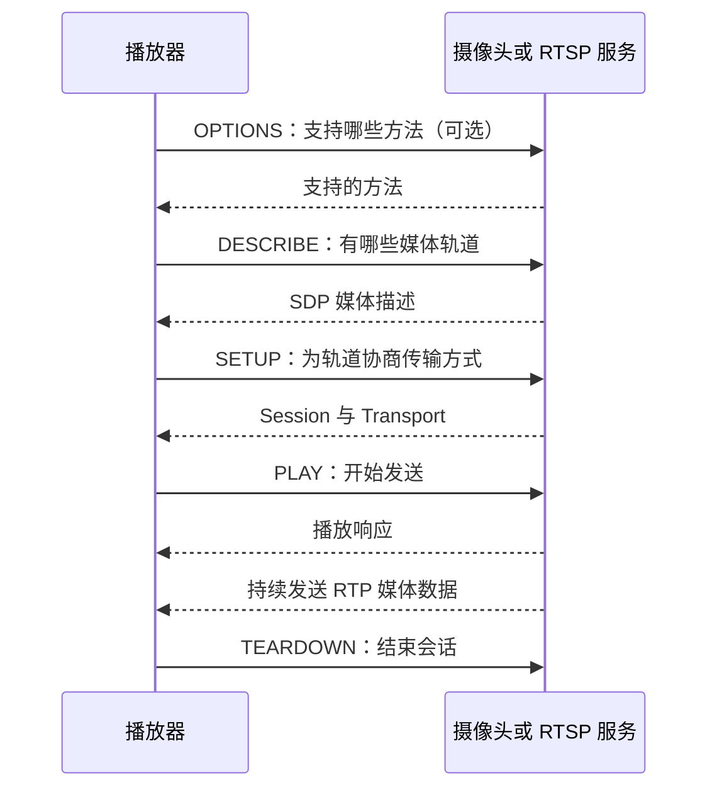
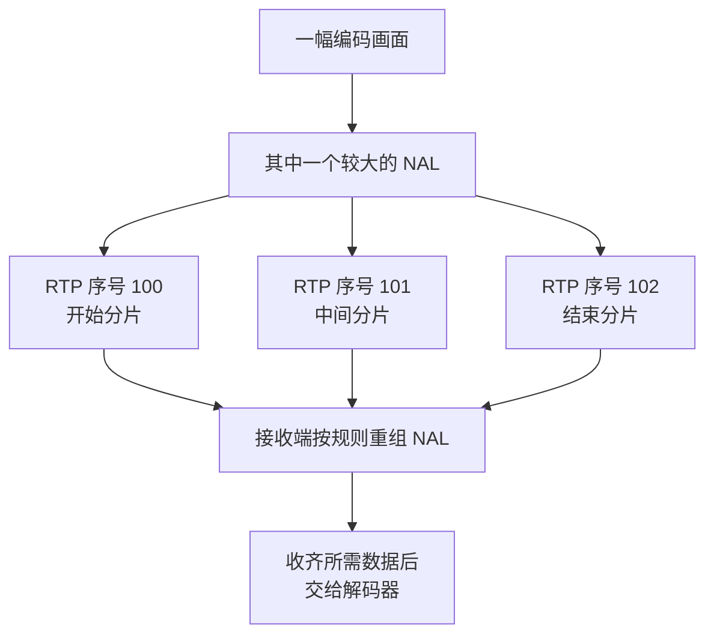
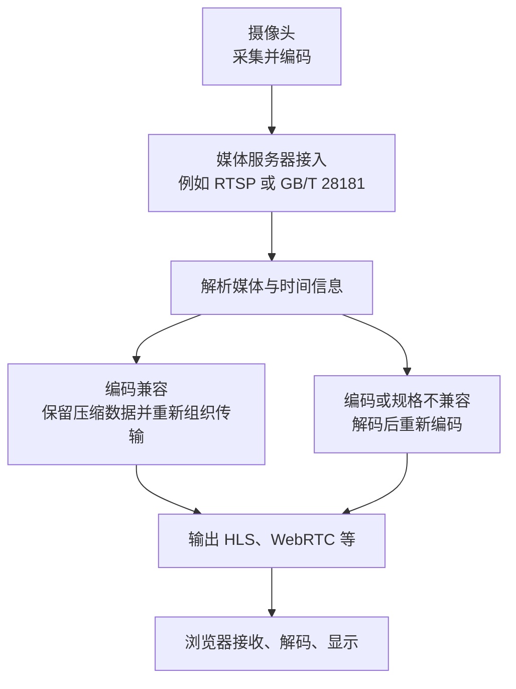

前两篇已经讲过[画面怎样压缩](/tutorials/tffmpeg-bitstream/)以及[编码数据怎样组织](/tutorials/tffmpeg-codecs/)。现在把摄像头与播放器放到两台机器上：播放器怎样找到视频，数据又怎样穿过网络？

## 打开一个 RTSP 地址，首先做了什么

RTSP（Real Time Streaming Protocol）用于建立和控制媒体会话。可以把一次会话理解为“这个客户端正在观看哪些轨道，用什么方式接收，什么时候结束”。

一个用于讲解的地址：

```text
rtsp://192.0.2.10:554/live/main
│      │          │   └─ 服务端定义的资源路径
│      │          └───── 端口；RTSP 常见默认值是 554
│      └──────────────── 主机地址
└─────────────────────── 协议名称
```

`192.0.2.10` 是文档示例地址。`/live/main` 没有通用含义：真实摄像机可能使用完全不同的路径、通道编号和查询参数。地址中也不一定能看出它发的是 H.264 还是 H.265。

实际使用时，从设备或平台取得播放地址和认证方式。不要根据另一个品牌的 URL 格式猜当前设备路径。

## RTSP 请求与响应长什么样

摄像机中常见 RTSP/1.0。请求通常是文本，结构类似“请求行＋若干头部＋可选正文”。以下是 DESCRIBE 请求的简化示意：

```text
DESCRIBE rtsp://192.0.2.10:554/live/main RTSP/1.0
CSeq: 2
Accept: application/sdp
```

`DESCRIBE` 请求媒体描述，`CSeq` 帮助把请求和响应对应起来，`Accept` 表示希望收到 SDP。服务端成功时返回 `RTSP/1.0 200 OK` 和描述正文；需要认证时也可能先返回 `401 Unauthorized`。

一次常见播放过程如下。图中省略认证重试、部分头部和保活：



多轨道通常需要分别 SETUP。服务端给出的 Session 标识用于后续会话操作。收到 PLAY 成功响应，只说明播放请求被接受，接下来仍需要检查媒体数据是否到达。

RTSP/2.0 另有规范；这里的报文示意不应直接当成所有版本、所有设备的完整抓包模板。

## SDP 告诉播放器什么

SDP（Session Description Protocol）是描述会话的文本格式。它会说明媒体类型、编码映射、时钟频率和轨道控制地址等。

下面仅摘出一条 H.264 视频轨道的几行，不是完整 SDP：

```text
m=video 0 RTP/AVP 96
a=rtpmap:96 H264/90000
a=fmtp:96 packetization-mode=1
a=control:trackID=0
```

- `m=video` 表示视频；示例中的端口 0 适用于由 RTSP SETUP 进一步协商接收端口的描述场景。
- `96` 是本次描述中使用的动态 Payload Type 编号，不能脱离 SDP 就断定“96 永远是 H.264”。
- `H264/90000` 表示 H.264，RTP 时钟每秒计 90000 个单位，**不是每秒 90000 帧**。
- `packetization-mode=1` 指定 H.264 RTP 的一种分包模式。
- `trackID=0` 是相对控制地址，客户端要按服务端提供的基地址等信息解析，不能任意拼接路径。

H.264 的 `fmtp` 中还可能带 `sprop-parameter-sets`，提供前一篇讲过的 SPS/PPS；也可以在媒体数据里取得配置。H.265 则有自己的编码映射、参数和分包规则。

## 真正的画面数据如何传过来

常见 RTSP 摄像头用 RTP（Real-time Transport Protocol）组织媒体包。一个 RTP 包可以先理解为：

```text
RTP 头部                         负载 Payload
序号、时间戳、媒体类型、来源标识  +  编码数据或编码数据的分片
```

头部帮助接收端判断先后、所属媒体和时间；负载才是后面要还原成画面的数据。对常见 H.264 直接 RTP 承载，负载按 RFC 6184 装 NAL 或其分片；国标常见的 PS over RTP 则要先解析 PS，不能套同一层拆包逻辑。

网络通常不会一口气把一幅画面的所有数据作为一个大包发出。路径允许的最大包大小称为 MTU；发送端要为各层头部留空间，并避免不必要的 IP 分片。具体包大小取决于网络与实现，不是所有视频都固定 1400 字节。

### 一幅画面、NAL 和 RTP 包不是一对一

假设一幅画面中有个较大的 Slice NAL，它需要拆成三个 RTP 包：



H.264 常见的这种分片叫 FU-A；小 NAL 也可能单独发送，或按允许的聚合方式放在一起。H.265 同样支持单 NAL、聚合与分片，但头部定义不同。

如果 101 丢了，100 和 102 不会自动拼出正确的中间内容。也不能把剩余片段直接当作完整 NAL 交给解码器。

### 序号管先后，时间戳管媒体时间

RTP 序号通常每发一个包加一，并按字段位数回绕。它帮助发现乱序、重复和缺口；需要等过重排窗口才能更可靠地区分迟到与丢失，抓包工具自身丢包也会产生缺口。

对这里的普通 H.264 视频示例，同一幅画面的多个 RTP 包使用同一采样时间戳。25 FPS 时，相邻显示画面的时间间隔对应 `90000 ÷ 25 = 3600` 个时钟单位。但有编码重排时，按发送顺序看到的 RTP 时间戳未必递增。

RTP 时间戳起点不必是 0，也不是电脑墙上时钟的毫秒数。RTCP 是配套的控制协议，常见用途包括传输统计，以及通过 Sender Report 建立 RTP 时间和公共时间之间的对应，帮助同步音视频。基础 RTP/RTCP 不保证送达；重传反馈等能力需要另外协商和实现。

## UDP 和 TCP 对观看有什么影响

两者是更下面的传输方式。在常见 RTSP 链路中，控制会话走 TCP，RTP 媒体可以另走 UDP，也可以交错放进同一条 RTSP TCP 连接。

| 媒体承载 | 接收时的特点 | 对直播的影响 |
| --- | --- | --- |
| RTP over UDP | 保留数据报边界，可能丢失、乱序、重复；UDP 自身不重传 | 可以按播放期限放弃迟到数据，但缺失可能影响解码 |
| RTP over RTSP TCP | TCP 给应用提供可靠、有序的字节流；RTP 用额外帧头标出边界 | 丢失会触发重传，后续字节可能一起等待，画面容易表现为停顿或延迟增加 |

TCP 的一次读取可能只读到半个 RTP 包，也可能包含多个包。RTSP/1.0 的 interleaved 帧用 `$`、通道号和长度等信息标出数据边界；应用必须先缓存、拆出完整帧，不能把每次 socket 读取当成一帧视频。

TCP 仍然会遇到网络丢包，只是通常由传输层重传，应用看到的是等待。它也修复不了发送前已经损坏的码流，无法补回连接建立前发出的参数或参考画面。

UDP 媒体端口不通，而 RTSP 控制端口能连上，是“PLAY 成功但没画面”的一种原因。切换 TCP 可以作为定位实验；要结合抓包、错误和延迟对比，不能把它当作通用画质修复开关。

## 接收端为什么要缓冲

包在网络里经过不同排队等待，到达间隔会忽快忽慢，这种变化叫抖动（Jitter）。接收端的抖动缓冲区会短暂等一等，把乱序包排好，再尽量按稳定节奏送出。

缓冲越大，通常越能容纳迟到，但观众看到的画面也越旧。缓冲太小，尚未到播放期限的数据可能更早被放弃。网络没有一种参数能同时承诺零等待和不丢任何迟到画面。

音视频还可能使用不同采样时钟，播放器需要转换到共同时间轴。有 B 帧时，解码器内部还会保留部分画面等待显示顺序；这与网络缓冲是两处不同的等待。

## 从摄像头到浏览器，服务器做了什么



推流是发送端主动把媒体送到服务端，例如直播软件向平台发送 RTMP；拉流是接收端发起获取，例如媒体服务器从摄像头拉 RTSP。它们描述发起获取或发送的方式，不是新的编码格式。

服务器可以把已有 H.264 数据重新包装后输出，也可以进行转码。只有真正进入解码再编码，才会产生相应的运算和有损压缩成本；协议转换不必然等于转码。

摄像机的主码流、子码流通常是同一来源的不同编码输出，可能有不同分辨率、码率、帧率甚至编码。多画面预览可以选择负担较小的子码流，查看细节再用主码流，具体以设备配置为准。

## 常见直播方式怎么选

| 名称 | 常见位置与传输内容 | 理解重点 |
| --- | --- | --- |
| RTSP + RTP | 摄像头、内网播放器与服务端接入 | 原生浏览器 `<video>` 通常不能直接打开 RTSP URL |
| HLS | HTTP 获取播放列表和媒体分段，可用 TS 或 fMP4 | 便于 CDN 分发；分段与播放器缓冲影响延迟，低延迟 HLS 需要对应服务端和播放器支持 |
| HTTP-FLV | 通过 HTTP 持续发送 FLV 媒体数据 | 网页通常需要 JS 播放库和合适的浏览器媒体接口；受编码兼容性限制 |
| RTMP | 常见于直播推送到服务端 | 需双方支持相同的编码扩展；不能假设旧 RTMP 实现支持任意新编码 |
| WebRTC | 浏览器互动、通话、实时观看 | 使用协商、连接建立和加密媒体机制；低延迟需要拥塞控制与播放策略配合 |
| SRT | 常用于跨公网的媒体贡献链路 | 基于 UDP，加密和重传等能力依实现与配置启用；留出恢复窗口就会增加等待 |

WebRTC 建连常会遇到 ICE、STUN、TURN：ICE 尝试选择可用网络路径，STUN 帮助发现地址，直接连不通时可使用 TURN 中继。这些机制解决连通性，不负责把 H.265 自动变成浏览器支持的编码。

## 延迟为什么会越播越大

端到端延迟是镜头前发生动作，到观众看到动作之间的时间。下面是便于定位的分解，并非可以独立精确相加的测量公式，各环节可能流水线重叠：

```text
采集等待 → 编码与预分析 → 发送队列 → 网络传输
         → 接收缓冲 → 解码与重排 → 显示等待
```

如果每秒收到 25 帧，但处理端每秒只能处理 20 帧，又一直排队保留全部画面，一秒就积压约 5 帧。持续几分钟后，网络没有断，看到的却是很久以前的内容。

4 Mbit/s 是平均码率，不表示每个瞬间都只需要 4 Mbit/s 带宽。较大的刷新画面、多个通道同时突发、音频和网络头部都可能造成排队。固定码率（CBR）也不等于每一帧、每一毫秒的字节数固定。

定位延迟要记录队列长度、各阶段时间和实际显示时间。跨机器比较时间前需要校时；单看 FPS 或 TCP 连通无法量出端到端延迟。

## 用 FFmpeg 查看实际 RTSP 输入

以下地址必须换成自己的测试设备地址。这里只验证探测，不会自动配置摄像头或启动 RTSP 服务：

```powershell
ffprobe -v error -rtsp_transport tcp -timeout 5000000 -show_streams -of json "rtsp://192.0.2.10:554/live/main"
```

`-rtsp_transport tcp` 选择 RTSP TCP interleaving；本地 FFmpeg 7.1.1 的 RTSP `timeout` 使用微秒，`5000000` 是 5 秒的 TCP socket I/O 超时，不是整个程序一定在 5 秒后结束。程序化调用还需要调用方设置总期限。

需要人工查看画面时：

```powershell
ffplay -rtsp_transport tcp "rtsp://192.0.2.10:554/live/main"
```

能打印编码和分辨率，说明探测得到了部分媒体信息；持续收到包、完整解码、实际显示，需要继续分别观察。[下一篇用这些层级排查花屏、黑屏、绿屏和卡顿](/tutorials/tffmpeg-playback/)。

## 资料来源

- [RFC 2326：RTSP/1.0](https://www.rfc-editor.org/rfc/rfc2326)、[RFC 7826：RTSP/2.0](https://www.rfc-editor.org/rfc/rfc7826)、[RFC 8866：SDP](https://www.rfc-editor.org/rfc/rfc8866)。
- [RFC 3550：RTP/RTCP](https://www.rfc-editor.org/rfc/rfc3550)、[RFC 6184：H.264 RTP](https://www.rfc-editor.org/rfc/rfc6184)、[RFC 7798：HEVC RTP](https://www.rfc-editor.org/rfc/rfc7798)。
- [RFC 8216：HLS](https://www.rfc-editor.org/rfc/rfc8216)、[RFC 8825：WebRTC 协议概览](https://www.rfc-editor.org/rfc/rfc8825)、[Apple HLS 文档](https://developer.apple.com/streaming/)。
- [FFmpeg RTSP 选项](https://ffmpeg.org/ffmpeg-protocols.html#rtsp)、[FFmpeg SRT 选项](https://ffmpeg.org/ffmpeg-protocols.html#srt)、[SRT 官方项目](https://github.com/Haivision/srt)、[Enhanced RTMP 规范](https://veovera.org/docs/enhanced/enhanced-rtmp-v2.html)。

地址、报文片段、分包序号和排队数字均为教学示例，不是实际设备抓包。
