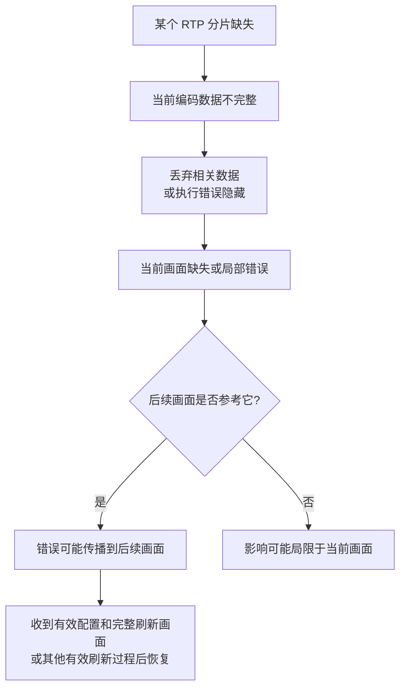
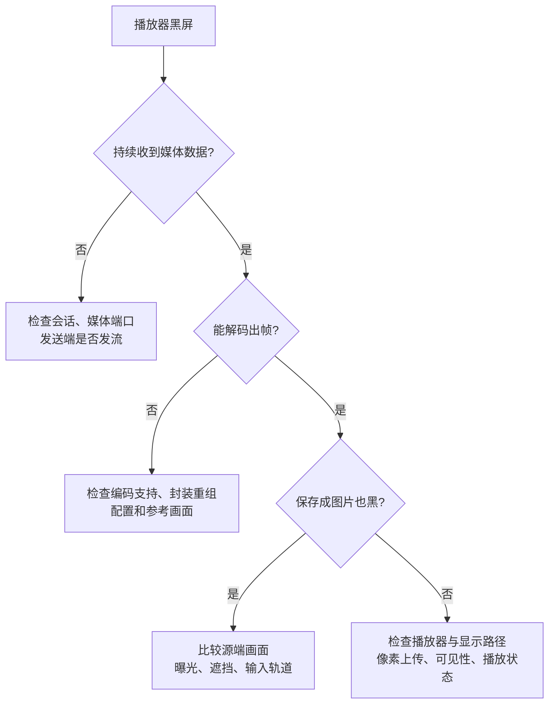

屏幕上看到花屏，能够确定的是“显示结果出了问题”。要找到原因，需要沿[上一章的媒体传输过程](/tutorials/tffmpeg-transport/)检查：画面原本是否正常、数据有没有到齐、解码器是否还原正确、播放器是否显示正确。

同一种现象可能来自不同环节。先看机制，再决定该查哪里。

这篇不用从头背到尾。先记住一条排查顺序：

```text
源画面 → 编码数据 → 网络接收 → 数据重组 → 解码画面 → 屏幕显示
```

出现问题时，保存一小段输入并离开实时网络重放，可以先把“问题已经在收到的数据里”与“只在实时播放或显示时发生”分开。后面的花屏、黑屏、绿屏和闪烁章节，都是沿这条顺序继续缩小范围。

## 丢了一个包，为什么坏了好多帧

假设正在传输一段 H.264，当前 P 帧的一部分 NAL 被拆成了三个 RTP 包。中间一个包丢失，接收端就缺少还原这部分画面的数据。

如果解码器选择用旧画面暂时填补，当前帧可能出现局部错误。后面的画面又参考了这个错误区域，错误就可能沿着参考关系传播。



所以丢一个网络包不等于只丢一整帧，也不等于必然花到下一个 I 帧。影响范围取决于丢失内容、分片位置、参考关系、解码器策略和刷新方式。

如果丢的是参数集，新加入的解码器可能连尺寸和必要配置都无法确定；如果丢的是不被后续参考的画面，影响可能短得多。B 帧也可能用作参考，不能统一当成“随便丢也没关系”。

### 接收端有哪些补救办法

| 方法 | 能做什么 | 代价或条件 |
| --- | --- | --- |
| 等待重排 | 给乱序或迟到的包一点时间 | 增加等待，超过播放期限仍可能放弃 |
| 重传 | 请求或由传输层补发缺失数据 | 必须有对应机制，且能在播放期限前赶到 |
| FEC（Forward Error Correction） | 发送额外冗余，尝试恢复一定范围的丢失 | 占用额外带宽，恢复能力有限且需要双方支持 |
| 错误隐藏 | 重复旧画面或利用已有区域减轻破损 | 只是临时估计，不保证还原真实内容 |
| 请求刷新画面 | 支持反馈的链路请求新的可用解码入口 | 发送端必须响应，并保证配置与刷新画面送达 |

这些能力不是“用了 RTP 就自动都有”。例如 WebRTC 中的反馈与恢复能力取决于协商和实现，普通 RTSP 接收端未必支持同样机制。

恢复也不一定必须重连。如果数据一直正常到达，缺少的是参考状态，获得有效刷新画面就可能恢复；频繁重连反而可能反复错过起播所需数据。

## 花屏：先区分压缩粗糙与数据损坏

常说的花屏包括彩色块、画面撕裂、局部残影等。码率太低也可能产生块状失真，但那是编码器在有限数据量下舍弃细节，和传输中缺数据是不同的问题。

| 观察 | 优先检查 |
| --- | --- |
| 场景一动就糊、树叶变成块，编码端保存的文件也一样 | 码率、量化、降噪和编码配置 |
| 接收端出现解码错误，画面突然局部破损，稍后恢复 | 数据完整性、分片重组、参考画面和刷新 |
| 切主辅码流或重连后才发生 | 新旧数据是否混在一起，配置是否更新，旧参考与队列是否清理 |
| 同一段录制在软件解码中正常，特定硬件路径异常 | 硬件能力、驱动、输出像素格式和显示处理 |

`corrupt decoded frame`、`error while decoding` 等日志能帮助确定解码阶段遇到了问题，但不能单独定位到交换机、摄像头或某个包。发送端产生坏码流、接收端拼错数据，也会导致解码报错。

## 黑屏：没有画面，与画面本身是黑色

先区分两个状态：解码器没有输出帧，或者已经输出了黑色像素。前者沿接入和解码查；后者继续比较源画面、解码结果与显示。



典型例子是 RTSP 的 DESCRIBE、PLAY 都成功，UDP 媒体却被阻断。此时能看到会话描述，仍然没有可解码的媒体数据。

另一种情况是音频在响、视频一直黑。音视频是不同轨道，声音正常只能证明音频那条路径可用。浏览器自动播放限制、播放失败、画布被遮挡，也需要从播放器状态和实际错误检查。

## 绿屏：颜色平面错了，数据也可能坏了

回到第一篇的像素格式。`yuv420p` 把 Y、U、V 放在三个平面；NV12 的 U/V 交错保存。如果应用把一种布局当成另一种读取，亮度与颜色就会错误组合。

还有一个常见概念叫 stride / linesize：内存中相邻两行起点之间的字节距离。它可能包含对齐空间，不一定等于“画面宽度×每像素字节数”。按错误行跨度读图，可能产生错色、斜纹或错位。

这些是绿屏的可能原因，但不能见绿就认定 U/V 顺序反了。编码数据损坏、硬件解码异常、缓冲区生命周期错误也可能产生绿色区域或整屏异常。

对同一份短录制，先用软件解码保存一张 PNG：

```powershell
ffmpeg -n -hwaccel none -i captured.mkv -map 0:v:0 -frames:v 1 -update 1 decoded.png
```

`captured.mkv` 是后面小实验保存的文件；也可以换成自己的视频。`-hwaccel none` 禁用输入硬件加速，`-frames:v 1` 只取一帧，`-update 1` 输出单张图片。

如果 PNG 正常而应用显示绿，继续查应用里的硬件帧转换、平面顺序、stride 和纹理上传。如果 PNG 也坏，向解码器输入、解码日志与源端回查。只检查第一帧无法代表整段视频，间歇问题还要抽取对应时间附近的画面。

色彩矩阵或全/有限范围解释错误，更常见的是偏色、发灰或亮暗不对；它们与错误的平面布局也需要分别定位。

## 闪烁：亮度变化，还是画面交替

“闪烁”需要先描述清楚：整幅忽明忽暗、出现滚动暗条、两幅画面交替，还是叠加框不停出现和消失。不同现象对应的检查方向不同。

| 现象 | 可能的机制 | 怎样对照 |
| --- | --- | --- |
| 室内画面亮度周期变化或有滚动条纹 | 灯光输出波动与曝光/读取时序相互作用 | 比较本地预览，检查快门、防频闪设置与照明；50/60 Hz 只是排查线索 |
| 人或光源进入时整体亮度跳变 | 自动曝光、增益、宽动态等调整 | 看源端是否同步发生，逐项固定相关设置做短时对比 |
| 白天/夜间反复切换黑白和彩色 | 日夜模式、红外切换阈值与现场光照 | 对照设备模式切换时间 |
| 画面在两个不同时间或通道之间跳动 | 重连旧帧回流、多输入混接、显示队列错用 | 记录来源、连接批次、PTS 和显示顺序 |
| 视频稳定，只有识别框闪烁 | 叠加结果时效、检测间隔或关联方式 | 分别观看原始视频和叠加结果，对比对应帧时间 |

照明频闪属于采集端问题，不能用更换 RTP 分包方式解决。叠加框闪烁也不能直接当成摄像头视频帧丢失。

## 卡住、跳帧和延迟增加

冻结是长时间重复显示同一幅画面；跳帧是显示时间发生跳跃；延迟增加则是画面仍在动，却越来越落后于现场。

```text
显示时间：  0.00 → 0.04 → 0.08 → 0.12     正常节奏示意
画面重复：  A    → A    → A    → D        可能在等待或重复旧帧
时间跳跃：  0.00 → 0.04 → 0.28 → 0.32     中间画面未显示
```

重复画面不一定代表网络断了：源端也可能重复输出，TCP 可能在等重传，解码器可能在等参考帧，渲染线程也可能被占用。需要把“收到包”“解码出新帧”“显示新帧”分别计数和计时。

如果处理速度持续低于输入速度，保留所有待处理画面就会积压。实时预览有时会放弃部分已经解码的旧帧以追上现场；录像则可能更重视保留完整内容。对压缩数据随意丢 P/B 帧会破坏依赖，不能把“丢旧帧”原样搬到任意处理位置。

## 用一次短录制拆开排查

以下命令在 PowerShell 中运行。准备自己的测试 RTSP 地址和一个新目录；地址可能包含凭据，分享日志前应脱敏。

### 第一步：记录媒体参数

```powershell
ffprobe -v error -rtsp_transport tcp -timeout 5000000 -show_streams -of json "rtsp://192.0.2.10:554/live/main"
```

记录编码、尺寸、像素格式和轨道。能探测到参数只表示取得了这部分信息，不足以证明持续解码正常。

### 第二步：不转码，保存 10 秒视频和接收日志

```powershell
ffmpeg -n -hide_banner -loglevel warning -rtsp_transport tcp -timeout 5000000 -i "rtsp://192.0.2.10:554/live/main" -t 10 -map 0:v:0 -c:v copy captured.mkv 2> receive.log
```

`-c:v copy` 尽量保留接收到的压缩视频，MKV 保存重封装后的结果；它不是网络抓包，不能恢复 RTP 序号、丢失分片或原始到达时间。`-t 10` 限制输出媒体时长，也不能替代调用方的墙钟超时。

中途加入本来就可能错过参考或配置。只在开头有错误、取得刷新画面后恢复，与中途反复损坏，应分开记录。

### 第三步：离开网络，完整软件解码这份录制

```powershell
ffmpeg -hide_banner -v warning -hwaccel none -i captured.mkv -map 0:v:0 -f null - 2> decode.log
```

如果每次解码同一文件都在相同位置报错，问题已经存在于这份输入或解码路径中，当前网络速度不是重放错误所必需的条件。接下来比较源端录制、其他解码器和错误附近数据。

如果文件能完整解码，而直播播放器仍异常，就重点比较实时缓冲、时间戳、硬件解码与显示过程。但录制有重封装和截取边界，可能没有保留全部实时问题，不能据此直接宣布网络无故障。

### 第四步：一次只改变一个条件

可以在设备支持时比较 TCP 与 UDP、主码流与子码流、软件与硬件解码。保持场景、持续时间等条件尽量一致，分别保存接收日志、解码日志和现象时间。

需要证明丢包时，再抓取 RTP 或查看接收统计。比较同一来源、同一会话中的序号缺口，排除乱序、回绕、重启和抓包点自身漏采。FFmpeg `-show_packets` 展示的是媒体 Packet，不是抓包替代品。

## 常见日志能说明到哪一步

| 日志或状态 | 能说明什么 | 下一步 |
| --- | --- | --- |
| `401 Unauthorized` | 该次请求需要认证或认证未通过 | 看后续是否完成认证重试，核对账号权限 |
| `404 Not Found` | 服务端没找到请求的资源 | 核对路径、通道和资源有效期 |
| `461 Unsupported Transport` | 请求的传输方式未被接受 | 看服务端支持的方式与 SETUP 协商 |
| `non-existing PPS ... referenced` | 码流引用的 PPS 当前不可用 | 查参数集来源、丢失、重连与错误拼接 |
| `Invalid data found when processing input` | 当前处理阶段无法识别或处理输入 | 结合前后日志分清错误响应、封装、编码和损坏数据 |
| `no frame!` | 对这部分输入未得到画面 | 回看更早的配置、解析或参考错误 |
| 解码退出码为 0 | 程序没有用非零退出码报告失败 | 仍检查 stderr、帧输出与实际画面 |

准备一次可复查的问题记录时，写清源地址的脱敏标识、主辅码流、编码参数、协议、异常时间、接收与解码日志、截图，以及改变一个条件后的结果。这样才能把同一时刻的画面与具体处理环节联系起来。

继续动手可看[常见任务与排障案例](/tutorials/t19hdgc9e/)；回看概念可从[视频基础一](/tutorials/tffmpeg-bitstream/)开始。

## 资料来源

- [RFC 3550：RTP 接收统计与序号](https://www.rfc-editor.org/rfc/rfc3550)、[RFC 6184：H.264 分包、解包和解码注意事项](https://www.rfc-editor.org/rfc/rfc6184)。
- [RFC 4585：RTP 反馈](https://www.rfc-editor.org/rfc/rfc4585)、[RFC 5104：编码控制反馈](https://www.rfc-editor.org/rfc/rfc5104)、[RFC 8825：WebRTC 概览](https://www.rfc-editor.org/rfc/rfc8825)。
- [FFmpeg RTSP](https://ffmpeg.org/ffmpeg-protocols.html#rtsp)、[AVFrame 的 data 与 linesize 定义](https://github.com/FFmpeg/FFmpeg/blob/n7.1.1/libavutil/frame.h)、[像素格式定义](https://github.com/FFmpeg/FFmpeg/blob/n7.1.1/libavutil/pixfmt.h)。

现象表列出用于验证的可能机制，不将某种颜色或某条日志绑定到唯一故障。真实设备的曝光、防频闪、日夜切换与硬件能力应以其说明书和实际对照为准。
