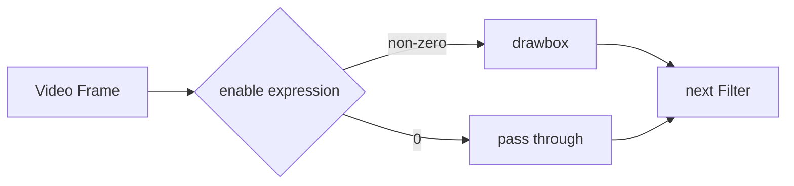
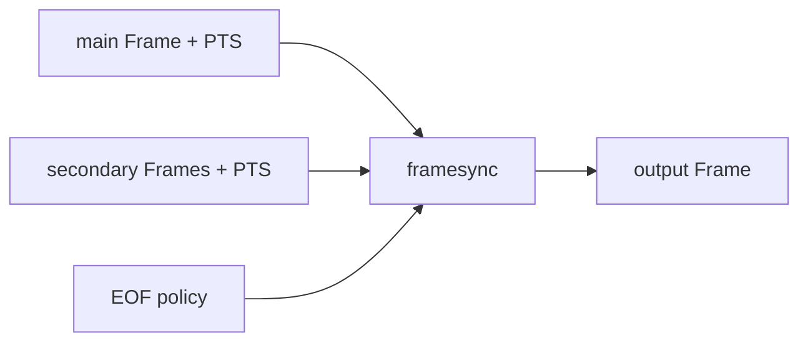

上一篇 [FFmpeg Filters：读懂 Filterchain 与 Filtergraph](/tutorials/tffmpeg-filters/) 处理的都是静态连接：命令启动时，Filtergraph 就已经确定了。但真实任务经常会变化——告警框只显示几秒，框的位置要跟着目标移动，Logo 比主视频先结束，两段声音还要平滑接在一起。

这些问题表面上都叫“动态”，在 FFmpeg 里却由不同机制负责：

- Timeline Editing 决定一个 Filter 在哪些 Frame 上生效；
- runtime command 修改已经存在的 Filter option；
- framesync 为多输入 Filter 按 PTS 选择 Frame，并处理 EOF；
- Audio Filter 处理 Audio Frame 的采样、时间、响度与组合。

把职责拆开后，复杂命令反而更容易读。这篇仍使用可直接复制到 PowerShell 的单行命令，测试素材由 `testsrc2`、`color` 和 `sine` 现场生成。

## 先认清当前 FFmpeg build

FFmpeg 的 Filter 会受版本和编译选项影响。本文命令在本机 `FFmpeg 7.1.1-full_build` 上执行过；在自己的机器上，先让程序回答“有没有”和“支持哪些 option”：

```powershell
ffmpeg -hide_banner -version
ffmpeg -hide_banner -filters
ffmpeg -hide_banner -h filter=drawbox
ffmpeg -hide_banner -h filter=overlay
ffmpeg -hide_banner -h filter=volume
```

`ffmpeg -filters` 中，前面的 `T` 表示 Filter 支持通用 Timeline，`C` 表示它能接收 command。Audio / Video 类型则显示在 `A`、`V` 以及 `A->A`、`VV->V` 这样的 input/output 形状中。

还有一种 `T` 出现在 `-h filter=<name>` 的某个 option 末尾，例如 `volume` option 的标记末尾带 `T`。它表示这个具体 option 可以在运行中修改。一个是 Filter 级别的 Timeline 能力，一个是 option 级别的 runtime 能力，不要只看到同一个字母就混为一谈。

## 用 `enable` 让 Filter 只在一段时间生效

先做一个很直观的实验：生成 8 秒测试画面，让红框只在第 2 秒到第 5 秒出现。

```powershell
ffmpeg -y -f lavfi -i "testsrc2=size=960x540:rate=30:duration=8" -vf "drawbox=x=80:y=80:w=320:h=180:color=red@0.85:t=8:enable='between(t,2,5)'" -an -c:v libx264 -pix_fmt yuv420p timeline-enable.mp4
```

`drawbox` 一直存在于 Filtergraph 中。每个 Video Frame 到达时，`enable` 表达式会被计算一次：结果非 0 就执行 `drawbox`，结果为 0 就让 Frame 原样通过。



“原样通过”很重要。`enable=0` 不会丢弃 Frame，也不会暂停 Decode，更不会减少 AI inference 次数。它只是在这一帧上绕过当前 Filter。

### 表达式中的时间从哪里来

`t` 是当前 Frame 的时间戳，单位为秒；它依赖输入 PTS。`n` 是从 0 开始的输入 Frame 序号。常见写法可以直接按英文函数名读：

| 表达式 | 实际效果 |
| --- | --- |
| `between(t,2,5)` | PTS 位于 2～5 秒时执行，包含两端 |
| `gte(t,3)` | 从第 3 秒开始执行 |
| `lt(n,60)` | 只处理前 60 个输入 Frame |
| `between(t,1,2)+between(t,4,5)` | 1～2 秒或 4～5 秒执行 |
| `lt(mod(t,10),2)` | 每 10 秒中的前 2 秒执行 |

表达式最终只判断 0 / non-zero，因此乘法可以表达 AND，加法可以表达 OR。对于 Variable Frame Rate 或时间戳不稳定的输入，优先使用 `t` 并先确认 PTS；用 `n` 推算时间只适合 Frame cadence 明确的素材。

把结果按每秒一格铺成 contact sheet，比拖动进度条更容易看出时间窗口：

```powershell
ffmpeg -y -i timeline-enable.mp4 -vf "fps=1,scale=320:-2,tile=4x2" -frames:v 1 timeline-contact-sheet.jpg
```

整秒取样刚好落在边界附近时，具体看到哪一帧会受 time base 与取样位置影响。判断 `between(t,2,5)` 时，最好结合 `showinfo` 或多取几帧，不要用一张边界截图下结论。

### 哪些事情不归 `enable` 管

`enable` 很适合定时水印、告警框、隐私遮挡和片头片尾效果，却不能完成下面这些事：

- 降低 Decode 或 AI inference 的负载；
- 在运行中创建、删除 Filtergraph 节点；
- 修改 Encoder 的 bitrate、GOP 等参数；
- 让原本不支持 Timeline 的 Filter 获得 `enable`。

若看到 `Timeline ('enable' option) not supported with filter`，先用下面的命令确认当前 build，而不是继续调整表达式：

```powershell
ffmpeg -hide_banner -filters 2>&1 | Select-String "drawbox|overlay|volume|atempo"
ffmpeg -hide_banner -h filter=drawbox
```

## 用 runtime command 改变 Filter option

`enable` 控制“做或不做”，runtime command 处理“接下来用什么值做”。例如框一直存在，但第 2 秒移动到右侧，第 4 秒又回到左侧。

```powershell
ffmpeg -y -f lavfi -i "testsrc2=size=960x540:rate=30:duration=6" -vf "sendcmd=c='2.0 drawbox@roi x 480;4.0 drawbox@roi x 120',drawbox@roi=x=40:y=180:w=240:h=160:color=red@0.85:t=8" -an -c:v libx264 -pix_fmt yuv420p runtime-command.mp4
```

这条命令里最值得拆的是下面四段：

```text
2.0      drawbox@roi      x      480
time     target           command argument
```

- `2.0` 是 command 触发的媒体时间；
- `drawbox@roi` 指向 ID 为 `roi` 的 `drawbox` Filter instance；
- `x` 是 command 名，在这里也就是要修改的 option；
- `480` 是新值。

完整状态变化为：

```text
0s ───────── 2s ───────── 4s ───────── 6s
x = 40       x = 480      x = 120
```

`filter@id` 不是 Label。Label 给 Link 命名，用于连接 Frame；`@id` 给 Filter instance 命名，用于把 command 发给准确目标。一个 Filtergraph 里出现多个 `drawbox` 时，显式 ID 能避免 command 落错位置。

只有帮助输出中带 runtime 标记的 option 才能这样修改：

```powershell
ffmpeg -hide_banner -h filter=drawbox 2>&1 | Select-String " x | y | w | h | T\."
ffmpeg -hide_banner -h filter=volume 2>&1 | Select-String "volume"
ffmpeg -hide_banner -h filter=atempo 2>&1 | Select-String "tempo"
```

### `sendcmd` 与 `asendcmd`

`sendcmd` 放在 Video Filterchain，`asendcmd` 放在 Audio Filterchain。两者都会把 Frame 继续传给下一个 Filter，本身不负责改变画面或声音。

下面让一段 440 Hz 测试音在运行中改变 tempo：

```powershell
ffmpeg -y -f lavfi -i "sine=frequency=440:sample_rate=48000:duration=6" -af "asendcmd=c='2.0 atempo@speed tempo 1.5;4.0 atempo@speed tempo 0.75',atempo@speed=1.0" -c:a pcm_s16le runtime-tempo.wav
```

command 由进入 `asendcmd` 的 Audio Frame PTS 触发。`atempo` 又会改变输出时长，所以生成文件不一定正好是输入的 6 秒；这不是 command 没有按时执行，而是 input timeline 与 output duration 不能简单画等号。

command 较多时，可以放进文件：

```text
2.0 drawbox@roi x 480;
4.0 drawbox@roi x 120;
```

然后使用 `sendcmd=f=commands.txt`，避免 PowerShell、Filtergraph 和 command syntax 三层引号挤在一起。

已经在运行的外部系统如果要持续发送 command，可以研究 `zmq` / `azmq` Filter，但前提是 FFmpeg build 启用了 ZeroMQ。它不是在命令末尾加个端口就结束了：应用还要定义 target、媒体时钟、过期策略、重连行为和失败反馈。

```powershell
ffmpeg -hide_banner -filters 2>&1 | Select-String "sendcmd|asendcmd|zmq|azmq"
```

## framesync：两路输入究竟配哪一帧

`overlay`、`hstack`、`blend` 等多输入 Filter 不能只处理“谁先从网络到达”。主输入和辅助输入可能有不同 FPS、start time、PTS、jitter 与 duration，framesync 要做的是按时间戳为主输入找到合适的辅助 Frame。

可以把主输入想成列车时刻表，辅助输入想成站台广告牌：主路 Frame 每到一个时刻，framesync 就挑一张时间合适的广告；辅助输入结束后，再决定保留最后一张、撤掉广告，还是让整趟车停下。



支持 framesync 公共 option 的 Filter，通常会提供：

| option | 默认值 | 含义 |
| --- | --- | --- |
| `eof_action` | `repeat` | secondary input 到 EOF 后执行 `repeat`、`endall` 或 `pass` |
| `shortest` | `0` | 设为 `1` 时，最短 input 结束便结束 output |
| `repeatlast` | `1` | 是否把 secondary input 的最后一帧延续到后面的时间 |
| `ts_sync_mode` | `default` | 按“nearest lower or equal”或“absolute nearest”选择 secondary Frame |

这些是 framesync 的公共 option，但并非所有多输入 Filter 都一定暴露完全相同的集合。写命令前仍应查看具体 Filter 的帮助。

### 用同一组素材比较三种 EOF 结果

主画面持续 8 秒，黄色辅助画面只持续 3 秒。先让最后一帧保持到主画面结束：

```powershell
ffmpeg -y -f lavfi -i "testsrc2=size=960x540:rate=30:duration=8" -f lavfi -i "color=c=yellow:size=220x90:rate=30:duration=3" -filter_complex "[0:v][1:v]overlay=x=20:y=20:eof_action=repeat:repeatlast=1[v]" -map "[v]" -an -c:v libx264 -pix_fmt yuv420p framesync-repeat.mp4
```

到第 3 秒时撤掉辅助画面，让主画面继续：

```powershell
ffmpeg -y -f lavfi -i "testsrc2=size=960x540:rate=30:duration=8" -f lavfi -i "color=c=yellow:size=220x90:rate=30:duration=3" -filter_complex "[0:v][1:v]overlay=x=20:y=20:eof_action=pass:repeatlast=0[v]" -map "[v]" -an -c:v libx264 -pix_fmt yuv420p framesync-pass.mp4
```

任意一路结束就让 output 结束：

```powershell
ffmpeg -y -f lavfi -i "testsrc2=size=960x540:rate=30:duration=8" -f lavfi -i "color=c=yellow:size=220x90:rate=30:duration=3" -filter_complex "[0:v][1:v]overlay=x=20:y=20:shortest=1[v]" -map "[v]" -an -c:v libx264 -pix_fmt yuv420p framesync-shortest.mp4
```

前两个 output 约 8 秒，第三个约 3 秒。PowerShell 中可以分别检查：

```powershell
ffprobe -v error -show_entries format=filename,duration -of default=nw=1 framesync-repeat.mp4
ffprobe -v error -show_entries format=filename,duration -of default=nw=1 framesync-pass.mp4
ffprobe -v error -show_entries format=filename,duration -of default=nw=1 framesync-shortest.mp4
```

这里的 Filter option `shortest=1` 与 ffmpeg output option `-shortest` 不是同一层：前者决定这个多输入 Filter 何时结束，后者根据多个 output Stream 的结束时间控制输出文件。

### `ts_sync_mode` 与因果顺序

假设主输入正在处理 PTS 为 `2.00s` 的 Frame，辅助输入附近有两帧：

```text
secondary A: 1.90s
main M:      2.00s
secondary B: 2.04s
```

`ts_sync_mode=default` 选择不晚于 main Frame 的最近一帧，也就是 A；`nearest` 选择绝对时间差最小的一帧，也就是 B。

离线特效有时更关心“时间上最接近”，但实时 AI overlay 通常还要保证因果顺序：2.04 秒才产生的检测结果不应提前画到 2.00 秒画面上。选择 `nearest` 前，要确认使用未来 Frame 是否符合业务语义。

### `setpts=PTS-STARTPTS` 不是万能同步

两个普通文件从不同 PTS 起点开始时，可以先归零再叠加：

```powershell
ffmpeg -y -i main.mp4 -i logo.mp4 -filter_complex "[0:v]setpts=PTS-STARTPTS[main];[1:v]setpts=PTS-STARTPTS[logo];[main][logo]overlay=x=20:y=20:eof_action=pass:repeatlast=0[v]" -map "[v]" -map 0:a:0? -c:v libx264 -c:a copy output.mp4
```

这对“两个文件都从各自开头播放”很合适，却不等于校准了两个实时系统。RTSP 与独立 AI 进程若在不同真实时刻启动，各自减去 STARTPTS 只会让它们都显示从 0 开始，原有时间关系反而丢失。实时链路要先定义摄像头 PTS、monotonic clock 或 wall clock 的换算方式。

## Audio Filter 从格式开始看

一段 Audio Frame 不只是“声音”。至少要关注 sample rate、sample format、channel layout 与 PTS：

| 属性 | 常见值 | 它会影响什么 |
| --- | --- | --- |
| sample rate | 16 kHz、44.1 kHz、48 kHz | 每秒样本数、可表示频带、模型输入 |
| sample format | `s16`、`s32`、`fltp` | 单个 sample 的表示方式与内存布局 |
| channel layout | `mono`、`stereo`、`5.1` | channel 数量与空间含义 |
| PTS / time base | 常以 sample rate 为基础 | 裁剪、同步、command 触发时间 |

下面按一次实际处理会经历的顺序，看看这些 Audio Filter 怎样接在一起。

### `aresample` 与 `aformat`

把 44.1 kHz 测试音转换为 48 kHz、signed 16-bit、mono：

```powershell
ffmpeg -y -f lavfi -i "sine=frequency=440:sample_rate=44100:duration=5" -af "aresample=48000,aformat=sample_fmts=s16:sample_rates=48000:channel_layouts=mono" -c:a pcm_s16le audio-format.wav
```

```powershell
ffprobe -v error -select_streams a:0 -show_entries stream=codec_name,sample_fmt,sample_rate,channels,channel_layout -of default=nw=1 audio-format.wav
```

预期能看到 `pcm_s16le`、`s16`、`48000` 与单 channel。`aresample` 重新生成目标 sample rate 的 PCM；`aformat` 约束 Filterchain 可接受的格式集合。

`asetrate` 是另一回事：它修改 sample rate 属性而不重新采样，因此通常会同时改变播放速度与音高。想做格式转换时不要拿 `asetrate` 代替 `aresample`。

### `atrim`、`asetpts` 与 `afade`

从 10 秒输入中取第 2～7 秒，并让新片段首尾各淡化 0.3 秒：

```powershell
ffmpeg -y -f lavfi -i "sine=frequency=440:sample_rate=48000:duration=10" -af "atrim=start=2:end=7,asetpts=PTS-STARTPTS,afade=t=in:st=0:d=0.3,afade=t=out:st=4.7:d=0.3" -c:a pcm_s16le audio-trim.wav
```

```text
input:    0 ───── 2 ═══════════ 7 ───── 10
atrim:            2 ═══════════ 7      PTS 起点仍接近 2s
asetpts:          0 ═══════════ 5      新片段从 0s 开始
afade:            ↑ fade in   fade out ↑
```

`atrim` 只选择 sample，不会自动把时间戳移到 0；`asetpts=PTS-STARTPTS` 才负责建立新 timeline。这也是很多“明明截了 5 秒，合成时却从第 2 秒才出现”的原因。

### `amix` 与 `acrossfade`

两路声音同时播放，用 `amix`：

```powershell
ffmpeg -y -f lavfi -i "sine=frequency=440:sample_rate=48000:duration=5" -f lavfi -i "sine=frequency=880:sample_rate=48000:duration=5" -filter_complex "[0:a][1:a]amix=inputs=2:duration=longest:weights='1 0.25':normalize=0[a]" -map "[a]" -c:a pcm_s16le audio-mix.wav
```

前一段结束时渐变到后一段，用 `acrossfade`：

```powershell
ffmpeg -y -f lavfi -i "sine=frequency=440:sample_rate=48000:duration=5" -f lavfi -i "sine=frequency=880:sample_rate=48000:duration=5" -filter_complex "[0:a][1:a]acrossfade=d=1:c1=tri:c2=tri[a]" -map "[a]" -c:a pcm_s16le audio-crossfade.wav
```

两条 5 秒输入经过 1 秒 `acrossfade` 后，output 约为 9 秒，因为尾部和头部有 1 秒重叠。`amix` 的 output 约 5 秒，两路声音在同一个时间段内相加。

`amerge` 也接收多路音频，却不是另一个 `amix`：`amix` 混合 sample，`amerge` 把不同 input 的 channel 合并成更大的 channel layout。

### 语音清理不要从“大力降噪”开始

会议录音、摄像头拾音或 ASR 前处理，可以从一条保守的 Filterchain 试听：

```powershell
ffmpeg -y -i input.wav -af "highpass=f=80,lowpass=f=8000,afftdn=nr=12:nf=-50,loudnorm=I=-16:LRA=11:TP=-1.5" -c:a pcm_s16le voice-clean.wav
```

信号依次经过：

```text
Audio Frame → highpass → lowpass → afftdn → loudnorm → Encoder
```

`80 Hz` 与 `8000 Hz` 只是语音试听的起点，不是所有人声的标准答案。高低频边界切得太狠会让声音发薄、发闷；`afftdn` 的降噪强度过大容易出现水声和金属感。

这里的 `loudnorm` 单遍处理适合试听和快速整理。需要符合交付响度目标时，通常先跑测量，再把 `input_i`、`input_lra`、`input_tp`、`input_thresh` 等测量值带入第二遍。响度标准化也不是简单把 peak 拉到某个值，它关注 EBU R128 的 integrated loudness、loudness range 与 true peak。

为常见 ASR 模型准备 16 kHz mono PCM，可以写成：

```powershell
ffmpeg -y -i input.wav -vn -af "aresample=16000,aformat=sample_fmts=s16:sample_rates=16000:channel_layouts=mono" -c:a pcm_s16le model-input.wav
```

不过模型真正需要 16 kHz 还是 48 kHz、integer PCM 还是 float、文件还是 raw samples，最终由模型 input contract 决定。

### 先分析，再决定怎样处理

查找超过 0.5 秒、低于 -40 dB 的 silence：

```powershell
ffmpeg -hide_banner -i input.wav -af "silencedetect=noise=-40dB:d=0.5" -f null -
```

观察 peak、RMS 等统计：

```powershell
ffmpeg -hide_banner -i input.wav -af "astats=metadata=1:reset=1" -f null -
```

分析 EBU R128 loudness：

```powershell
ffmpeg -hide_banner -i input.wav -filter_complex "ebur128=framelog=verbose" -f null -
```

这些 Filter 把结果写到 log 或 metadata，不会自动产出一份“处理好的声音”。先观察 silence、peak、RMS 与 loudness，再决定 threshold、gain 和 noise reduction，往往比套一条万能 Filterchain 更可靠。

## 放进 RTSP 与 AI 链路时

文件例子里的 PTS 连续、输入有限、错误也容易重放；实时链路没有这么温和。我会把下面几件事分别处理：

- inference sampling 由抽帧或节流逻辑负责，不能用 `enable` 冒充；
- runtime command 只能改已存在且支持 command 的 option，不能重建 Filtergraph；
- Video Frame、AI result 与 overlay 要共享可换算的时间语义，不能只按网络 arrival order；
- AI result 到达太晚时，要明确 drop、hold-last 还是 remove-overlay；
- RTSP reconnect 后 PTS 可能跳变或重新起算，旧 command 与旧检测结果不能继续套到新 Frame；
- Audio Stream 经过任何 Audio Filter 后都需要重新 Encode，不能继续 `-c:a copy`。

这也是为什么一个离线 `sendcmd` demo 跑通，并不能证明实时检测框已经同步。实时系统还需要记录 camera ID、Frame ID / PTS、result age、reconnect generation 与实际 overlay 的对应关系。

## 怎样确认结果不是“看起来跑完了”

先检查 duration 与 Stream 属性：

```powershell
ffprobe -v error -show_entries format=duration -of default=nw=1 timeline-enable.mp4
ffprobe -v error -show_entries format=duration -of default=nw=1 framesync-pass.mp4
ffprobe -v error -select_streams a:0 -show_entries stream=sample_fmt,sample_rate,channels,channel_layout -of default=nw=1 audio-format.wav
```

再让 FFmpeg 完整 Decode：

```powershell
ffmpeg -v error -i runtime-command.mp4 -f null -
ffmpeg -v error -i audio-crossfade.wav -f null -
```

最后播放并实际看、实际听：

```powershell
ffplay -autoexit timeline-enable.mp4
ffplay -autoexit runtime-command.mp4
ffplay -autoexit audio-crossfade.wav
```

如果结果不对，可以沿着现象回到对应机制：

| 现象 | 优先检查 |
| --- | --- |
| `enable` 报不支持 | Filter 是否带 Timeline 标记 |
| runtime command 没有变化 | option 的 `T` 标记、target `@id`、command time |
| Logo 在 EOF 后一直冻结 | `eof_action` 与 `repeatlast` |
| 两路画面看似慢半拍 | PTS、time base、start time 与 `ts_sync_mode` |
| `atrim` 后合成起点仍偏移 | 是否需要 `asetpts=PTS-STARTPTS` |
| `amix` 后出现 clipping | weights、`normalize` 与输入 gain |
| 降噪后发闷或有金属感 | frequency cutoff 与 noise reduction 是否过强 |

几组测试文件放在一起听和看，差异会比参数表直观得多：`timeline-enable.mp4` 看开关，`runtime-command.mp4` 看位置变化，三个 `framesync-*.mp4` 比较 EOF，`audio-mix.wav` 与 `audio-crossfade.wav` 则分别听“同时叠加”和“前后衔接”。等这些行为都能解释清楚，再替换成真实文件或 RTSP，排查范围会小很多。

参考：[FFmpeg Filters Documentation](https://ffmpeg.org/ffmpeg-filters.html)、[FFmpeg CLI Documentation](https://ffmpeg.org/ffmpeg.html)。
