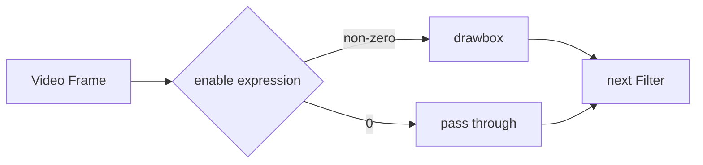
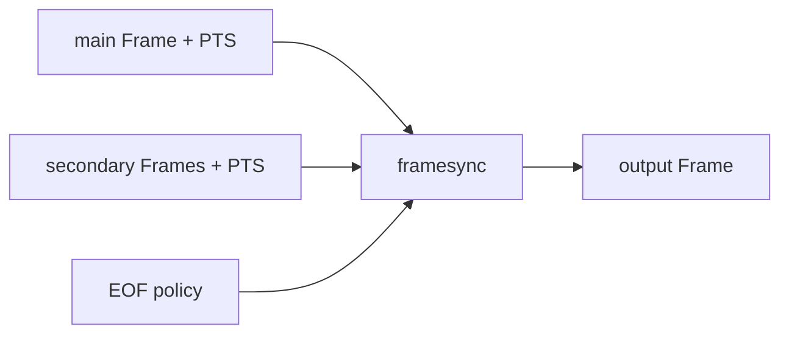

上一篇介绍了 [Filter、Filterchain 与 Filtergraph](/tutorials/tffmpeg-filters/)，以及 Link Label 如何标识连接。这一篇沿用这些术语，用测试画面和测试音观察红框按时出现、坐标变化、辅助输入结束，以及音频裁剪和混合。

这些行为分别由四种机制控制：

- Timeline editing 通过 `enable` 决定 Filter 在哪些 Frame 上生效；
- runtime command 修改已经存在的 Filter 的选项；
- framesync 为多输入 Filter 按 PTS 选择帧，并处理 EOF；
- 音频 Filter 处理音频帧的采样、时间、响度与组合。

命令使用 PowerShell 写法，素材由 `testsrc2`、`color` 和 `sine` 生成。含 `-y` 的演示会覆盖同名文件，请在空目录里运行。

| 要观察的行为 | 阅读位置 | 对照文件 |
| --- | --- | --- |
| 红框何时出现 | enable | `timeline-enable.mp4` |
| 红框位置变化 | runtime command | `runtime-command.mp4` |
| 辅助输入先结束 | framesync | 三个 `framesync-*.mp4` |
| 两路声音叠加或衔接 | amix / acrossfade | `audio-mix.wav`、`audio-crossfade.wav` |

## 检查当前构建的 Filter 能力

Filter 的可用选项取决于版本和构建。本文以 `FFmpeg 7.1.1-full_build` 为命令基线；运行前检查当前机器：

```powershell
ffmpeg -hide_banner -version
ffmpeg -hide_banner -filters
ffmpeg -hide_banner -h filter=drawbox
ffmpeg -hide_banner -h filter=overlay
ffmpeg -hide_banner -h filter=volume
```

`ffmpeg -filters` 中，前面的 `T` 表示 Filter 支持通用 Timeline，`C` 表示它能接收命令。Audio / Video 类型则显示在 `A`、`V` 以及 `A->A`、`VV->V` 这样的输入/输出形状中。

还有一种 `T` 出现在 `-h filter=<name>` 的某个选项末尾，例如 `volume` 选项的标记末尾带 `T`。它表示这个具体选项可以在运行中修改。一个是 Filter 级别的 Timeline 能力，一个是选项级别的 runtime 能力，不要只看到同一个字母就混为一谈。

## 用 enable 控制生效时间

先做一个很直观的实验：生成 8 秒测试画面，让红框只在第 2 秒到第 5 秒出现。

```powershell
ffmpeg -y -f lavfi -i "testsrc2=size=960x540:rate=30:duration=8" -vf "drawbox=x=80:y=80:w=320:h=180:color=red@0.85:t=8:enable='between(t,2,5)'" -an -c:v libx264 -pix_fmt yuv420p timeline-enable.mp4
```

`drawbox` 一直存在于 Filtergraph 中。每个视频帧到达时，`enable` 表达式会被计算一次：结果非 0 就执行 `drawbox`，结果为 0 就让 Frame 原样通过。



`enable=0` 让这一帧绕过当前 Filter，仍会传给后面的节点；它不会丢帧或暂停解码。

### 表达式中的时间从哪里来

`t` 是当前帧的时间戳，单位为秒；它依赖输入 PTS。`n` 是从 0 开始的输入帧序号。常见写法可以直接按英文函数名读：

| 表达式 | 实际效果 |
| --- | --- |
| `between(t,2,5)` | PTS 位于 2～5 秒时执行，包含两端 |
| `gte(t,3)` | 从第 3 秒开始执行 |
| `lt(n,60)` | 只处理前 60 个输入 Frame |
| `between(t,1,2)+between(t,4,5)` | 1～2 秒或 4～5 秒执行 |
| `lt(mod(t,10),2)` | 每 10 秒中的前 2 秒执行 |

上面的比较函数返回 0 或 1，对这些结果可以用乘法表示“同时满足”、加法表示“任一满足”。按秒控制时使用 `t`，并确认输入时间戳有效；可变帧率素材不能只用帧号 `n` 推算时间。时间戳未知时，`t` 为 `NAN`。

把结果每秒抽一帧，排成一张对照图：

```powershell
ffmpeg -y -i timeline-enable.mp4 -vf "fps=1,scale=320:-2,tile=4x2" -frames:v 1 -update 1 timeline-contact-sheet.jpg
```

<figure>
  
  <figcaption>由上面的两条命令在 FFmpeg 7.1.1 生成。从左到右、从上到下排列每秒抽取的一帧，可对照红框出现和消失的位置。</figcaption>
</figure>

边界附近具体抽到哪一帧受时间基与取样位置影响。核对 `between(t,2,5)` 的边界时，可配合 `showinfo` 查看帧时间戳。

### 哪些事情不归 `enable` 管

`enable` 很适合定时水印、告警框、隐私遮挡和片头片尾效果，却不能完成下面这些事：

- 暂停输入解码，或控制外部 AI 任务的采样频率；
- 在运行中创建、删除 Filtergraph 中的节点；
- 修改编码器的码率、GOP 等参数；
- 让原本不支持 Timeline 的 Filter 获得 `enable`。

若看到 `Timeline ('enable' option) not supported with filter`，先用下面的命令确认当前构建，而不是继续调整表达式：

```powershell
ffmpeg -hide_banner -filters 2>&1 | Select-String "drawbox|overlay|volume|atempo"
ffmpeg -hide_banner -h filter=drawbox
```

## 用运行时命令修改 Filter 参数

保持 Filter 启用时，也可以修改它支持的运行时选项。例如让红框一直存在，第 2 秒移到右侧，第 4 秒移回左侧。

```powershell
ffmpeg -y -f lavfi -i "testsrc2=size=960x540:rate=30:duration=6" -vf "sendcmd=c='2.0 drawbox@roi x 480;4.0 drawbox@roi x 120',drawbox@roi=x=40:y=180:w=240:h=160:color=red@0.85:t=8" -an -c:v libx264 -pix_fmt yuv420p runtime-command.mp4
```

单条指令由触发时间、目标、命令和参数组成：

```text
2.0      drawbox@roi      x      480
time     target           command argument
```

- `2.0` 是命令触发的媒体时间；
- `drawbox@roi` 指向 ID 为 `roi` 的 `drawbox` Filter 实例；
- `x` 是命令名，在这里也就是要修改的选项；
- `480` 是新值。

完整状态变化为：

```text
0s ───────── 2s ───────── 4s ───────── 6s
x = 40       x = 480      x = 120
```

`filter@id` 中的 `@id` 标识 Filter 实例，runtime command 可以用它指定目标。Link Label 则标识 Filter 之间的连接。一个 Filtergraph 里出现多个 `drawbox` 时，显式 ID 能区分要修改哪个实例。

只有帮助输出中带 runtime 标记的选项才能这样修改：

```powershell
ffmpeg -hide_banner -h filter=drawbox 2>&1 | Select-String " x | y | w | h | T\."
ffmpeg -hide_banner -h filter=volume 2>&1 | Select-String "volume"
ffmpeg -hide_banner -h filter=atempo 2>&1 | Select-String "tempo"
```

### `sendcmd` 与 `asendcmd`

`sendcmd` 放在 Video Filterchain，`asendcmd` 放在 Audio Filterchain。两者都会把 Frame 继续传给下一个 Filter，本身不负责改变画面或声音。

下面让一段 440 Hz 测试音在运行中改变 tempo：

```powershell
ffmpeg -y -f lavfi -i "sine=frequency=440:sample_rate=48000:duration=6" -af "asendcmd=c='2.0 atempo@speed tempo 1.5;4.0 atempo@speed tempo 0.75',atempo@speed=1.0" -c:a pcm_s16le runtime-tempo.wav
```

命令由进入 `asendcmd` 的音频帧 PTS 触发。`atempo` 会改变播放速度和输出时长，所以输入的第 2 秒不一定对应输出的第 2 秒；检查命令触发时要看它所在位置的时间轴。

命令较多时，可以放进文件：

```text
2.0 drawbox@roi x 480;
4.0 drawbox@roi x 120;
```

然后使用 `sendcmd=f=commands.txt`，减少 PowerShell、Filtergraph 和命令语法之间的转义。

外部程序持续发送命令时，可以使用 `zmq` / `azmq` Filter，前提是构建启用了 ZeroMQ。应用仍要处理命令目标、媒体时间、过期、重连和失败反馈。

```powershell
ffmpeg -hide_banner -filters 2>&1 | Select-String "sendcmd|asendcmd|zmq|azmq"
```

## framesync：两路输入究竟配哪一帧

`overlay`、`hstack`、`blend` 等多输入 Filter 需要按时间戳配对。输入可能具有不同帧率、起点和时长；以 `overlay` 为例，framesync 为主输入选择时间合适的辅助帧，并处理输入结束的情况。

例如给视频叠一块黄色区域：主视频每到一个时间点，都要选择一帧黄色画面。黄色输入先结束时，可以保留它的最后一帧、移除覆盖层，或结束整个 Filter 输出。



支持 framesync 公共选项的 Filter，通常会提供：

| 选项 | 默认值 | 含义 |
| --- | --- | --- |
| `eof_action` | `repeat` | 辅助输入结束后，重复最后一帧、结束全部或放行主输入 |
| `shortest` | `0` | 设为 `1` 时，最短输入结束便结束 Filter 输出 |
| `repeatlast` | `1` | 是否延续辅助输入的最后一帧 |
| `ts_sync_mode` | `default` | 选择不晚于主帧的最近帧，或绝对时间差最小的帧 |

这些是 framesync 的公共选项，但并非所有多输入 Filter 都一定暴露完全相同的集合。写命令前仍应查看具体 Filter 的帮助。

### 用同一组素材比较三种 EOF 结果

主画面持续 8 秒，黄色辅助画面只持续 3 秒。先让最后一帧保持到主画面结束：

```powershell
ffmpeg -y -f lavfi -i "testsrc2=size=960x540:rate=30:duration=8" -f lavfi -i "color=c=yellow:size=220x90:rate=30:duration=3" -filter_complex "[0:v][1:v]overlay=x=20:y=20:eof_action=repeat:repeatlast=1[v]" -map "[v]" -an -c:v libx264 -pix_fmt yuv420p framesync-repeat.mp4
```

到第 3 秒时撤掉辅助画面，让主画面继续：

```powershell
ffmpeg -y -f lavfi -i "testsrc2=size=960x540:rate=30:duration=8" -f lavfi -i "color=c=yellow:size=220x90:rate=30:duration=3" -filter_complex "[0:v][1:v]overlay=x=20:y=20:eof_action=pass:repeatlast=0[v]" -map "[v]" -an -c:v libx264 -pix_fmt yuv420p framesync-pass.mp4
```

任意一路结束就让输出结束：

```powershell
ffmpeg -y -f lavfi -i "testsrc2=size=960x540:rate=30:duration=8" -f lavfi -i "color=c=yellow:size=220x90:rate=30:duration=3" -filter_complex "[0:v][1:v]overlay=x=20:y=20:shortest=1[v]" -map "[v]" -an -c:v libx264 -pix_fmt yuv420p framesync-shortest.mp4
```

前两个输出约 8 秒，第三个约 3 秒。PowerShell 中可以分别检查：

```powershell
ffprobe -v error -show_entries format=filename,duration -of default=nw=1 framesync-repeat.mp4
ffprobe -v error -show_entries format=filename,duration -of default=nw=1 framesync-pass.mp4
ffprobe -v error -show_entries format=filename,duration -of default=nw=1 framesync-shortest.mp4
```

这里的 Filter 选项 `shortest=1` 与 ffmpeg 输出选项 `-shortest` 不是同一层：前者决定这个多输入 Filter 何时结束，后者根据多个输出流的结束时间控制输出文件。

### `ts_sync_mode` 与因果顺序

假设主输入正在处理 PTS 为 `2.00s` 的帧，辅助输入附近有两帧：

```text
secondary A: 1.90s
main M:      2.00s
secondary B: 2.04s
```

`ts_sync_mode=default` 选择不晚于主帧的最近一帧，也就是 A；`nearest` 选择绝对时间差最小的一帧，也就是 B。

如果辅助画面表达的是检测结果，应检查结果对应哪一帧。例如，将 2.04 秒画面的结果叠到 2.00 秒画面，未必符合任务要求。这里比较的是媒体时间戳，不是结果到达网络的时刻。

### 用 setpts 调整起点

两个普通文件从不同 PTS 起点开始时，可以先归零再叠加：

```powershell
ffmpeg -y -i main.mp4 -i logo.mp4 -filter_complex "[0:v]setpts=PTS-STARTPTS[main];[1:v]setpts=PTS-STARTPTS[logo];[main][logo]overlay=x=20:y=20:eof_action=pass:repeatlast=0[v]" -map "[v]" -an -c:v libx264 output.mp4
```

本例只输出视频，用来观察两个画面各自从零开始。若还要保留声音，必须一并考虑音频起点与原有偏移，不能只归零视频后直接复制音轨。两个实时源各自减去 STARTPTS 也不能校准时钟；它会去掉原有起点，未必保留真实的先后关系。

## 音频：从格式转换到裁剪、混合

处理音频帧时，需要核对采样率、采样格式、声道布局与 PTS：

| 属性 | 常见值 | 它会影响什么 |
| --- | --- | --- |
| sample rate | 16 kHz、44.1 kHz、48 kHz | 每秒样本数、可表示频带、模型输入 |
| sample format | `s16`、`s32`、`fltp` | 单个 sample 的表示方式与内存布局 |
| channel layout | `mono`、`stereo`、`5.1` | channel 数量与空间含义 |
| PTS / time base | 常以 sample rate 为基础 | 裁剪、同步、command 触发时间 |

下面按一次实际处理会经历的顺序，看看这些音频 Filter 怎样接在一起。

### `aresample` 与 `aformat`

把 44.1 kHz 测试音转换为 48 kHz、signed 16-bit、mono：

```powershell
ffmpeg -y -f lavfi -i "sine=frequency=440:sample_rate=44100:duration=5" -af "aresample=48000,aformat=sample_fmts=s16:sample_rates=48000:channel_layouts=mono" -c:a pcm_s16le audio-format.wav
```

```powershell
ffprobe -v error -select_streams a:0 -show_entries stream=codec_name,sample_fmt,sample_rate,channels,channel_layout -of default=nw=1 audio-format.wav
```

预期能看到 `pcm_s16le`、`s16`、`48000` 与单声道。`aresample` 重新生成目标采样率的 PCM；`aformat` 约束 Filterchain 可接受的格式集合。

`asetrate` 是另一回事：它修改采样率属性而不重新采样，因此通常会同时改变播放速度与音高。想做格式转换时不要拿 `asetrate` 代替 `aresample`。

### `atrim`、`asetpts` 与 `afade`

从 10 秒输入中取第 2～7 秒，并让新片段首尾各淡化 0.3 秒：

```powershell
ffmpeg -y -f lavfi -i "sine=frequency=440:sample_rate=48000:duration=10" -af "atrim=start=2:end=7,asetpts=PTS-STARTPTS,afade=t=in:st=0:d=0.3,afade=t=out:st=4.7:d=0.3" -c:a pcm_s16le audio-trim.wav
```

```text
input:    0 ───── 2 ═══════════ 7 ───── 10
atrim:            2 ═══════════ 7      PTS 起点仍接近 2s
asetpts:          0 ═══════════ 5      新片段从 0s 开始
afade:            ↑ fade in   fade out ↑
```

`atrim` 只选择采样点，保留原时间戳；`asetpts=PTS-STARTPTS` 再将保留下来的片段移到零点。上图按此命令示意裁剪后的时间关系。

### `amix` 与 `acrossfade`

两路声音同时播放，用 `amix`：

```powershell
ffmpeg -y -f lavfi -i "sine=frequency=440:sample_rate=48000:duration=5" -f lavfi -i "sine=frequency=880:sample_rate=48000:duration=5" -filter_complex "[0:a][1:a]amix=inputs=2:duration=longest:weights='1 0.25':normalize=0[a]" -map "[a]" -c:a pcm_s16le audio-mix.wav
```

前一段结束时渐变到后一段，用 `acrossfade`：

```powershell
ffmpeg -y -f lavfi -i "sine=frequency=440:sample_rate=48000:duration=5" -f lavfi -i "sine=frequency=880:sample_rate=48000:duration=5" -filter_complex "[0:a][1:a]acrossfade=d=1:c1=tri:c2=tri[a]" -map "[a]" -c:a pcm_s16le audio-crossfade.wav
```

两条 5 秒输入经过 1 秒 `acrossfade` 后，输出约为 9 秒，因为尾部和头部有 1 秒重叠。`amix` 的输出约 5 秒，两路声音在同一个时间段内相加。

`amerge` 也接收多路音频，却不是另一个 `amix`：`amix` 混合采样点，`amerge` 把不同输入的声道合并成更大的声道布局。

### 频率过滤、降噪与响度

下面沿用一组演示参数，说明四个 Filter 的连接顺序。这些数值没有代表某类录音的最佳设置，应先分别试听各环节再决定是否组合：

```powershell
ffmpeg -y -i input.wav -af "highpass=f=80,lowpass=f=8000,afftdn=nr=12:nf=-50,loudnorm=I=-16:LRA=11:TP=-1.5" -c:a pcm_s16le voice-clean.wav
```

信号依次经过：

```text
Audio Frame → highpass → lowpass → afftdn → loudnorm → Encoder
```

`highpass`、`lowpass` 分别衰减低频和高频，`afftdn` 做 FFT 降噪，`loudnorm` 做响度标准化。这里的 `80`、`8000`、`12`、`-50` 都是演示值，不能由它们推断降噪效果或模型识别效果。

`loudnorm` 支持单遍和双遍处理。双遍时，先用同样的前置处理和响度目标测量：

```powershell
ffmpeg -hide_banner -i input.wav -af "highpass=f=80,lowpass=f=8000,afftdn=nr=12:nf=-50,loudnorm=I=-16:LRA=11:TP=-1.5:print_format=json" -f null -
```

测量 JSON 的字段名与第二遍的选项名不同：

| 第一遍 JSON 字段 | 第二遍 loudnorm 选项 |
| --- | --- |
| `input_i` | `measured_I` |
| `input_lra` | `measured_LRA` |
| `input_tp` | `measured_TP` |
| `input_thresh` | `measured_thresh` |
| `target_offset` | `offset` |

将实际测量值填回同一处理链，不能直接把 `input_i=` 当成 Filter 选项。即使指定 `linear=true`，不满足官方列出的响度范围或真峰值条件时，仍会退回动态模式。动态模式为检测真峰值可能升采样到 192 kHz；输出采样率有要求时，要显式设置 `-ar` 或后接 `aresample`。详见 [loudnorm 官方选项](https://ffmpeg.org/ffmpeg-filters.html#loudnorm)。

如果下游明确要求 16 kHz、单声道、16-bit PCM WAV，可以写成：

```powershell
ffmpeg -y -i input.wav -vn -af "aresample=16000,aformat=sample_fmts=s16:sample_rates=16000:channel_layouts=mono" -c:a pcm_s16le model-input.wav
```

采样率、整数或浮点表示、文件或原始采样点，都应以模型的输入要求为准。

### 先分析，再决定怎样处理

查找超过 0.5 秒、低于 -40 dB 的 silence：

```powershell
ffmpeg -hide_banner -i input.wav -af "silencedetect=noise=-40dB:d=0.5" -f null -
```

观察 peak、RMS 等统计：

```powershell
ffmpeg -hide_banner -i input.wav -af "astats=metadata=1:reset=1" -f null -
```

分析 EBU R128 loudness：

```powershell
ffmpeg -hide_banner -i input.wav -filter_complex "ebur128=framelog=verbose" -f null -
```

这几条命令将分析结果写到日志或元数据，输出由 null 丢弃。根据静音区间、峰值、RMS 和响度测量，再选择阈值、增益和降噪参数。

## 放进 RTSP 与 AI 链路时

上面的测试源具有明确时长和连续时间戳。替换成实时输入后，还要考虑采样、延迟与重连：

- 外部推理任务的采样频率由抽帧或节流逻辑负责；
- 运行时命令只能修改已存在且支持命令的选项；
- 视频帧、检测结果与叠加画面需要可对应的时间戳，不能只按到达顺序配对；
- 结果迟到时，应用决定丢弃、保持旧结果或移除覆盖层；
- RTSP 重连后 PTS 可能跳变或重新起算，应区分重连前后的命令和结果；
- 写出经过音频 Filter 处理的结果时，需要编码，不能使用 `-c:a copy`。

排查实时叠加时，可记录摄像头、帧 ID / PTS、结果延迟和重连批次，再与实际显示对应。本地文件实验只能验证这些 Filter 行为。

## 检查时长、格式和实际效果

先检查 duration 与 Stream 属性：

```powershell
ffprobe -v error -show_entries format=duration -of default=nw=1 timeline-enable.mp4
ffprobe -v error -show_entries format=duration -of default=nw=1 framesync-pass.mp4
ffprobe -v error -select_streams a:0 -show_entries stream=sample_fmt,sample_rate,channels,channel_layout -of default=nw=1 audio-format.wav
```

再让 FFmpeg 完整解码：

```powershell
ffmpeg -v error -i runtime-command.mp4 -f null -
ffmpeg -v error -i audio-crossfade.wav -f null -
```

最后播放并实际看、实际听：

```powershell
ffplay -autoexit timeline-enable.mp4
ffplay -autoexit runtime-command.mp4
ffplay -autoexit audio-crossfade.wav
```

如果结果不对，可以沿着现象回到对应机制：

| 现象 | 优先检查 |
| --- | --- |
| `enable` 报不支持 | Filter 是否带 Timeline 标记 |
| runtime command 没有变化 | option 的 `T` 标记、target `@id`、command time |
| Logo 在 EOF 后一直冻结 | `eof_action` 与 `repeatlast` |
| 两路画面看似慢半拍 | PTS、time base、start time 与 `ts_sync_mode` |
| `atrim` 后合成起点仍偏移 | 是否需要 `asetpts=PTS-STARTPTS` |
| `amix` 后出现 clipping | weights、`normalize` 与输入 gain |
| 降噪后发闷或有金属感 | frequency cutoff 与 noise reduction 是否过强 |

参考：[Timeline editing](https://ffmpeg.org/ffmpeg-filters.html#Timeline-editing)、[运行时命令](https://ffmpeg.org/ffmpeg-filters.html#Changing-options-at-runtime-with-a-command)、[framesync](https://ffmpeg.org/ffmpeg-filters.html#Options-for-filters-with-several-inputs-_0028framesync_0029)、[sendcmd / asendcmd](https://ffmpeg.org/ffmpeg-filters.html#sendcmd_002c-asendcmd)、[音频 Filter](https://ffmpeg.org/ffmpeg-filters.html#Audio-Filters)。
