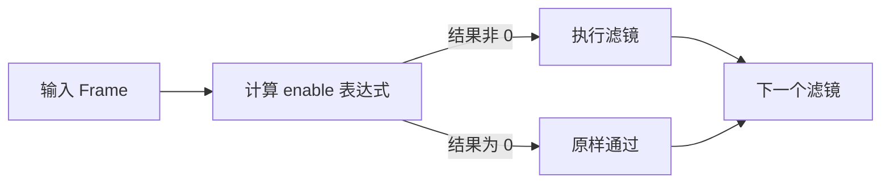
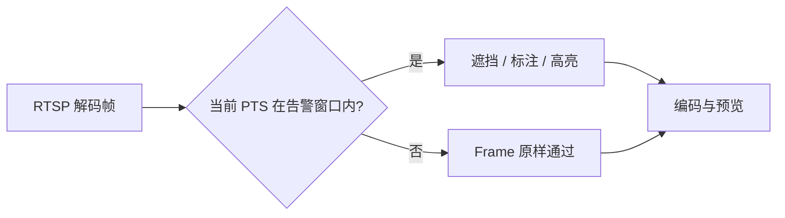
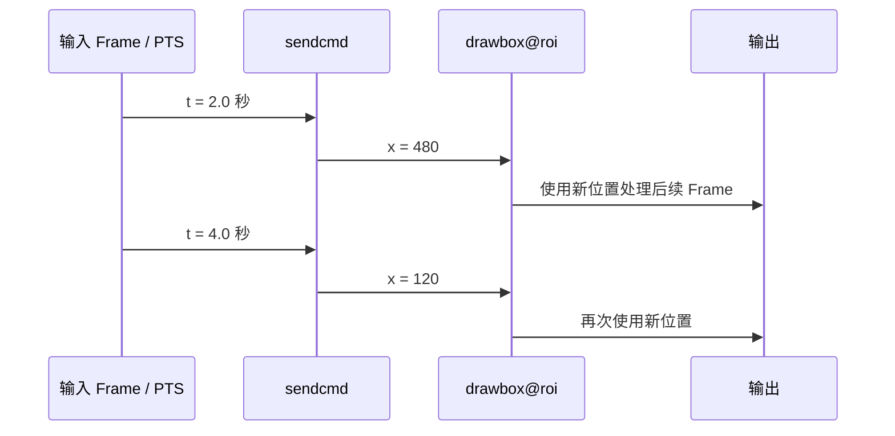
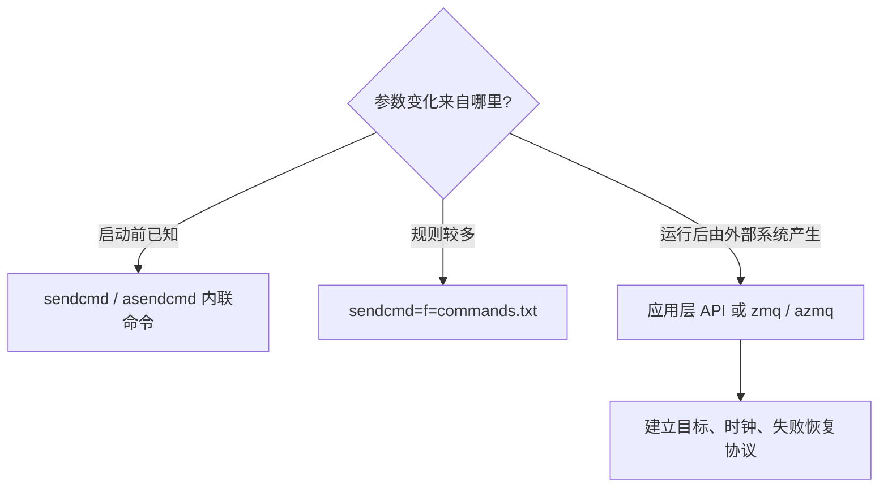
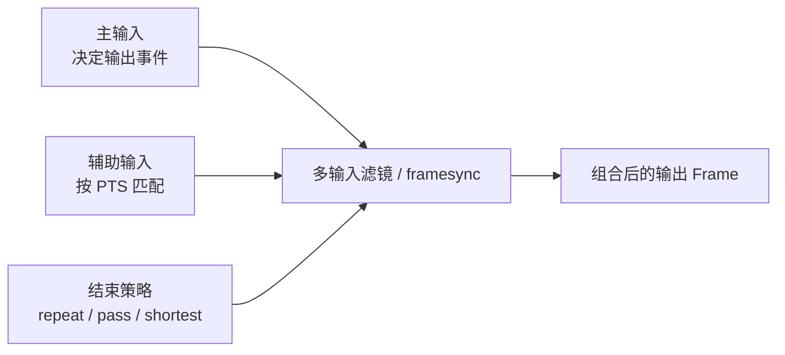
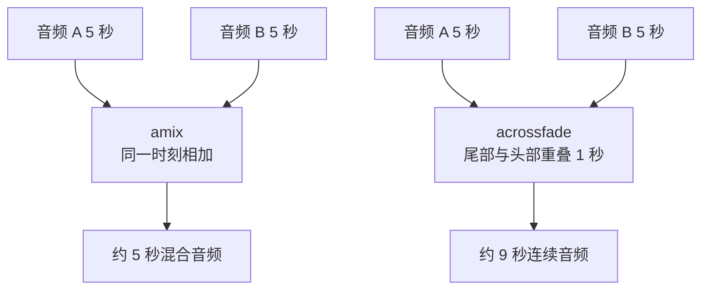
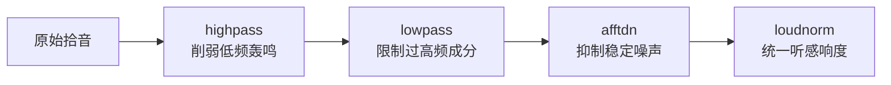
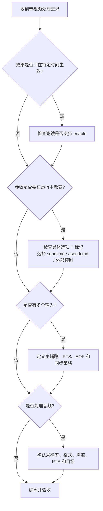

这篇只讲 [FFmpeg Filters 官方文档第 5～8 章](https://ffmpeg.org/ffmpeg-filters.html) 的核心内容，并把“参数字典”改造成一条能真正跑通的学习路线。

先纠正一个容易混淆的地方：`scale`、`crop`、`fps`、`format`、`overlay` 等具体视频滤镜属于官方文档的 **Video Filters** 章节，并不是第 5～8 章的章节标题。官方当前第 5～8 章分别是：

| 官方章节 | 核心问题 | 学完后的能力 |
| --- | --- | --- |
| 5. Timeline editing | 滤镜在什么时间生效？ | 用 `enable` 表达式按时间、帧号控制效果 |
| 6. Changing options at runtime | 运行中怎样修改参数？ | 用 `sendcmd` / `asendcmd` 给指定滤镜实例发送命令 |
| 7. Framesync | 多输入滤镜怎样对齐帧？ | 正确处理主路、辅路、PTS 与输入结束策略 |
| 8. Audio Filters | 音频应怎样处理？ | 完成格式统一、裁剪、混音、降噪、响度和检测 |


> **核心边界：** Filter 处理的是解码后的音视频 Frame。只要使用视频或音频滤镜，对应流就不能再使用 `-c:v copy` 或 `-c:a copy`。

## 开始前：用当前机器的能力说话

FFmpeg 的滤镜和参数会随版本、编译选项变化。本文命令按 Windows PowerShell 编写，并在本机 `FFmpeg 7.1.1-full_build` 上验证；其他环境先运行：

```powershell
ffmpeg -hide_banner -version
ffmpeg -hide_banner -filters
ffmpeg -hide_banner -h filter=drawbox
ffmpeg -hide_banner -h filter=overlay
ffmpeg -hide_banner -h filter=volume
```

`ffmpeg -filters` 的标记要这样读：

| 标记 | 含义 | 与本文的关系 |
| --- | --- | --- |
| `T` | 支持通用时间线 `enable` | 第 5 章 |
| `S` | 支持 slice threading | 与运行时改参数无关 |
| `C` | 支持命令 | 第 6 章 |
| `A` / `V` | 音频 / 视频输入输出 | 判断流类型 |
| `N` | 输入或输出数量动态 | 常见于 `amix` 等多输入滤镜 |

另一个 `T` 会出现在 `ffmpeg -h filter=<name>` 的**具体选项**末尾，它表示该选项可在运行时修改。例如本机 `drawbox` 的 `x`、`y` 和 `volume` 的 `volume` 选项带有 `T`。

下面的案例使用 `testsrc2`、`color` 和 `sine` 自动生成测试素材，不依赖外部文件。确认结果时可用：

```powershell
ffplay -autoexit 输出文件.mp4
ffprobe -v error -show_entries format=duration -of default=nw=1 输出文件.mp4
```

## 5. Timeline editing：让滤镜只在需要时工作

### 5.1 先建立正确心智模型

支持时间线的滤镜拥有通用选项 `enable=<表达式>`。每个输入 Frame 到达时，FFmpeg 都会计算一次表达式：



注意“原样通过”不等于“丢弃”。`enable=0` 只是暂时绕过滤镜，Frame 仍会继续向后传递。

通用表达式变量只有少数几个：

| 变量 | 含义 | 使用建议 |
| --- | --- | --- |
| `t` | 当前 Frame 的时间戳，单位为秒；未知时为 `NAN` | 最常用，适合有可靠 PTS 的输入 |
| `n` | 输入 Frame 序号，从 0 开始 | 适合固定帧率的离线素材 |
| `w`、`h` | 视频输入宽度、高度 | 可用于与画面尺寸有关的条件 |
| `pos` | Frame 在文件中的位置 | 已废弃，不要用于新方案 |

常用表达式可以读成自然语言：

| 表达式 | 自然语言 |
| --- | --- |
| `between(t,2,5)` | 第 2 秒到第 5 秒期间启用，包含边界 |
| `gte(t,3)` | 从第 3 秒开始启用 |
| `lt(n,60)` | 只处理前 60 帧 |
| `between(t,1,2)+between(t,4,5)` | 1～2 秒或 4～5 秒启用 |
| `lt(mod(t,10),2)` | 每 10 秒中的前 2 秒启用 |

表达式最终只看“是否为 0”，所以多个条件可以用乘法表示“并且”，用加法表示“或者”。

### 5.2 第一个实验：红框只出现 3 秒

下面生成一段 8 秒测试视频，红框只在第 2～5 秒出现：

```powershell
ffmpeg -y -f lavfi -i "testsrc2=size=960x540:rate=30:duration=8" -vf "drawbox=x=120:y=100:w=360:h=240:color=red@0.85:t=8:enable='between(t,2,5)'" -an -c:v libx264 -pix_fmt yuv420p timeline-enable.mp4
```

```text
时间       0s          2s                   5s          8s
画面       原样         显示红色检测框         原样
           ├───────────┼────────────────────┼───────────┤
enable     0           1                    0
```

想把结果一眼铺开，可以再生成一张每秒一格的联系表：

```powershell
ffmpeg -y -i timeline-enable.mp4 -vf "fps=1,scale=320:-2,tile=4x2" -frames:v 1 timeline-contact-sheet.jpg
```

预期第 3～6 格附近能看到红框，其余格没有红框。取样点落在整秒上，边界帧是否显示会受时间基和取样位置影响，因此不要只凭某一张边界截图判断表达式错误。

### 5.3 `enable` 最适合与不适合做什么

适合：

- 在固定时间段显示水印、告警框或隐私遮挡；
- 在片头、片尾启用淡入淡出或颜色效果；
- 根据 PTS 对离线视频分段应用效果；
- 暂时绕过支持时间线的滤镜，而不拆分整条 Filtergraph。

不适合：

- 降低 AI 推理频率：禁用滤镜时 Frame 仍然通过；
- 动态创建或删除 Filtergraph 节点；
- 控制编码器码率、GOP 等非滤镜参数；
- 给不支持时间线的滤镜强行添加 `enable`。

判断某个滤镜能否使用 `enable`：

```powershell
ffmpeg -hide_banner -filters 2>&1 | Select-String "drawbox|overlay|volume|atempo"
ffmpeg -hide_banner -h filter=drawbox
```

如果帮助信息没有时间线支持说明，运行时可能看到 `Timeline ('enable' option) not supported with filter`。这不是转义问题，而是滤镜能力边界。

### 5.4 RTSP 与 AI 场景中的真实用法



`enable` 可以控制“某个视觉效果是否生效”，但它不是 AI 调度器。若目标是把 25 FPS 降为 2 FPS 送入模型，应在推理链路使用明确的抽帧或节流策略；若目标是只在告警期间画框，才适合使用时间线或运行时命令。

## 6. Changing options at runtime：运行中修改滤镜参数

### 6.1 `enable` 与运行时命令不是一回事

| 能力 | `enable` | 运行时命令 |
| --- | --- | --- |
| 控制什么 | 整个滤镜执行或绕过 | 某个可变选项的新值 |
| 判断时机 | 通常每个 Frame 计算 | 命令事件到达时执行 |
| 典型用途 | 2～5 秒显示框 | 2 秒时把框移动到另一区域 |
| 是否要求支持 | 滤镜支持 Timeline | 选项带运行时标记 `T`，滤镜支持命令 |

官方第 6 章的规则很短但很重要：只有帮助输出中标记为 `T` 的选项才能在运行中修改；通常“命令名就是选项名，参数就是新值”。

```powershell
ffmpeg -hide_banner -h filter=drawbox 2>&1 | Select-String " x | y | w | h | T\."
ffmpeg -hide_banner -h filter=atempo 2>&1 | Select-String "tempo"
ffmpeg -hide_banner -h filter=volume 2>&1 | Select-String "volume"
```

### 6.2 命令是怎样找到目标滤镜的

给滤镜实例命名时使用 `filter@id`。例如 `drawbox@roi=...` 表示一个名为 `roi` 的 `drawbox` 实例。



`sendcmd` 用在视频链，`asendcmd` 用在音频链。它们是透传滤镜，必须放在对应类型的滤镜链中。

### 6.3 实验：让检测框在运行中移动

```powershell
ffmpeg -y -f lavfi -i "testsrc2=size=960x540:rate=30:duration=6" -vf "sendcmd=c='2.0 drawbox@roi x 480;4.0 drawbox@roi x 120',drawbox@roi=x=40:y=180:w=240:h=160:color=red@0.85:t=8" -an -c:v libx264 -pix_fmt yuv420p runtime-command.mp4
```

这条命令的状态变化是：

```text
0～2 秒：x = 40
2～4 秒：x = 480
4～6 秒：x = 120
```

命令语法可以抽象为：

```text
时间点  目标滤镜实例  命令名  新值
2.0     drawbox@roi   x       480
```

当一个 Filtergraph 中有多个同类滤镜时，应始终使用 `@id` 精确定位，避免命令发给错误实例。

### 6.4 音频实验：处理中途改变语速

```powershell
ffmpeg -y -f lavfi -i "sine=frequency=440:sample_rate=48000:duration=6" -af "asendcmd=c='2.0 atempo@speed tempo 1.5;4.0 atempo@speed tempo 0.75',atempo@speed=1.0" -c:a pcm_s16le runtime-tempo.wav
```

命令事件由进入 `asendcmd` 的音频 Frame 时间戳触发。`atempo` 改变时长，所以输出时间轴不一定与输入的 6 秒完全相同。

### 6.5 内联命令、命令文件与实时外部控制



- `sendcmd` / `asendcmd` 适合按媒体时间轴执行已经确定的计划；
- 命令较多时应放入文件，避免命令行出现多层引号与转义；
- `zmq` / `azmq` 可接收进程外命令，但依赖 FFmpeg 构建时启用 ZeroMQ；
- AI 每帧检测结果是外部实时数据，不能假设一条启动时写死的 `sendcmd` 就能持续接收它。

先检查当前构建：

```powershell
ffmpeg -hide_banner -filters 2>&1 | Select-String "sendcmd|asendcmd|zmq|azmq"
```

在生产系统中，最难的通常不是“把 x 改成多少”，而是让检测结果和视频 Frame 使用同一个时间语义。至少要定义：摄像头标识、Frame PTS 或帧序号、目标滤镜实例、命令过期策略，以及 FFmpeg 重连后是否重放状态。

## 7. Framesync：多输入滤镜如何选中同一时刻的帧

### 7.1 为什么多输入不能只看“谁先到”

`overlay`、`hstack` 等滤镜要同时消费多路输入。两路流的帧率、开始时间、网络抖动和结束时间可能不同，因此 FFmpeg 必须按时间戳选择组合帧。



可以把主输入想成“列车时刻表”，辅助输入想成“站台广告牌”：每次主路 Frame 到站，framesync 根据时间戳挑选一张合适的辅助 Frame，再决定辅助流结束后继续保留、撤下还是让全车停运。

### 7.2 四个公共选项必须记住

这些选项只适用于支持公共 framesync 选项的多输入滤镜，而且必须写成 `key=value`，不能依赖省略名称的短写法。

| 选项 | 可选值 / 默认值 | 作用 |
| --- | --- | --- |
| `eof_action` | `repeat` / `endall` / `pass`，默认 `repeat` | 辅助输入 EOF 后采取什么动作 |
| `shortest` | `0` 或 `1`，默认 `0` | 为 `1` 时，最短输入结束就结束输出 |
| `repeatlast` | `0` 或 `1`，默认 `1` | 是否把辅助输入最后一帧延长到主输入后续时间 |
| `ts_sync_mode` | `default` 或 `nearest`，默认 `default` | 怎样按时间戳挑选辅助 Frame |

`eof_action` 的三个值：

- `repeat`：重复辅助输入最后一帧；
- `endall`：结束所有输入对应的输出；
- `pass`：辅助输入结束后只让主输入通过。

为了让意图明确，实际命令中建议同时显式设置 `eof_action`、`repeatlast` 或 `shortest`，不要把行为寄托在不同版本的默认组合上。

### 7.3 三组对照实验：Logo 结束后怎么办

主视频持续 8 秒，黄色辅助画面只持续 3 秒。

#### 策略 A：保持最后一帧

```powershell
ffmpeg -y -f lavfi -i "testsrc2=size=960x540:rate=30:duration=8" -f lavfi -i "color=c=yellow:size=220x90:rate=30:duration=3" -filter_complex "[0:v][1:v]overlay=x=20:y=20:eof_action=repeat:repeatlast=1[v]" -map "[v]" -an -c:v libx264 -pix_fmt yuv420p framesync-repeat.mp4
```

结果：黄色块在第 3 秒后仍保持到主视频结束。

#### 策略 B：辅助输入结束后只保留主画面

```powershell
ffmpeg -y -f lavfi -i "testsrc2=size=960x540:rate=30:duration=8" -f lavfi -i "color=c=yellow:size=220x90:rate=30:duration=3" -filter_complex "[0:v][1:v]overlay=x=20:y=20:eof_action=pass:repeatlast=0[v]" -map "[v]" -an -c:v libx264 -pix_fmt yuv420p framesync-pass.mp4
```

结果：第 3 秒后黄色块消失，主视频继续到第 8 秒。

#### 策略 C：任一路结束就停止

```powershell
ffmpeg -y -f lavfi -i "testsrc2=size=960x540:rate=30:duration=8" -f lavfi -i "color=c=yellow:size=220x90:rate=30:duration=3" -filter_complex "[0:v][1:v]overlay=x=20:y=20:shortest=1[v]" -map "[v]" -an -c:v libx264 -pix_fmt yuv420p framesync-shortest.mp4
```

结果：输出约 3 秒结束。可用同一条命令对比三者时长：

```powershell
ffprobe -v error -show_entries format=filename,duration -of csv=p=0 framesync-repeat.mp4 framesync-pass.mp4 framesync-shortest.mp4
```

部分 ffprobe 版本不接受一次传入多个普通文件；遇到这种情况就分别执行三次。

### 7.4 `ts_sync_mode`：选过去的帧，还是时间上最近的帧

假设主输入在 `2.00s` 需要组合，辅助输入附近有两帧：

```text
辅助 Frame A：PTS = 1.90s
主路 Frame M：PTS = 2.00s
辅助 Frame B：PTS = 2.04s
```

| 模式 | 选择结果 | 语义 |
| --- | --- | --- |
| `default` | A（1.90s） | 选择不晚于主 Frame 的最近一帧 |
| `nearest` | B（2.04s） | 选择绝对时间差最小的一帧 |

实时 AI 标注通常更重视因果性：不能让 2.04 秒产生的结果“提前”画到 2.00 秒画面上，因此默认模式通常更容易解释。离线合成追求几何上的最近时间时，才考虑 `nearest`。

### 7.5 PTS 是 framesync 的事实来源

文件合成时，两路素材起点不一致，可先归零：

```powershell
ffmpeg -y -i main.mp4 -i logo.mp4 -filter_complex "[0:v]setpts=PTS-STARTPTS[main];[1:v]setpts=PTS-STARTPTS[logo];[main][logo]overlay=20:20:eof_action=pass:repeatlast=0[v]" -map "[v]" -map 0:a? -c:v libx264 -c:a copy output.mp4
```

但在 RTSP 或跨进程 AI 链路中，不要不加分析地把两路时间戳分别归零：两路在不同时间启动时，“各自从 0 开始”并不代表同一个真实时刻。应先明确它们使用摄像头 PTS、服务端单调时钟还是墙上时钟，再决定怎样换算。

还要区分两个同名概念：

- 滤镜内部 `shortest=1`：控制当前多输入滤镜何时结束；
- ffmpeg 输出选项 `-shortest`：控制输出文件在最短输出流结束时停止。

它们所在层级不同，不能互相替代。

## 8. Audio Filters：从 PCM Frame 到可用音频

官方第 8 章是一个很大的音频滤镜字典。学习时不应从 `aap` 开始逐个背诵，而应先掌握下面五类问题。


### 8.1 音频 Frame 的四个关键属性

| 属性 | 例子 | 影响 |
| --- | --- | --- |
| 采样率 | 16 kHz、44.1 kHz、48 kHz | 每秒采样数，影响频带与模型输入契约 |
| 采样格式 | `s16`、`s32`、`fltp` | 单个样本的数值类型和内存布局 |
| 声道布局 | `mono`、`stereo`、`5.1` | 声道数量与空间含义 |
| PTS / time base | 以采样率为基础的时间戳 | 决定同步、裁剪和命令触发时机 |

选择滤镜时先问“我要改变哪一个属性或哪一种听感”，不要只看滤镜名字。

### 8.2 高频滤镜地图

| 目标 | 首选滤镜 | 核心认识 |
| --- | --- | --- |
| 改采样率 | `aresample` | 真正重采样 PCM 数据 |
| 限定格式集合 | `aformat` | 约束采样格式、采样率和声道布局 |
| 调音量 | `volume` | 线性倍数或 dB 表达式 |
| 截取时间 | `atrim` | 截掉范围外样本，但不会自动把 PTS 归零 |
| 重置时间戳 | `asetpts` | 常与 `atrim` 配对使用 |
| 淡入淡出 | `afade` | 平滑进入或离开，减少突变 |
| 改语速 | `atempo` | 改速度，适合语音或节目处理 |
| 高通 / 低通 | `highpass` / `lowpass` | 去除目标频带外成分 |
| FFT 降噪 | `afftdn` | 按噪声地板和降噪强度抑制噪声 |
| 响度标准化 | `loudnorm` | 依据 EBU R128 控制综合响度、LRA 和真峰值 |
| 混音 | `amix` | 多路音频相加到一条音频流 |
| 交叉淡化 | `acrossfade` | 前一段淡出、后一段淡入并衔接 |
| 静音检测 | `silencedetect` | 输出静音开始、结束等日志或元数据 |
| 统计分析 | `astats` / `ebur128` | 观察峰值、RMS 或 EBU R128 指标 |

### 8.3 实验一：统一为 48 kHz、16 位、单声道

```powershell
ffmpeg -y -f lavfi -i "sine=frequency=440:sample_rate=44100:duration=5" -af "aresample=48000,aformat=sample_fmts=s16:sample_rates=48000:channel_layouts=mono" -c:a pcm_s16le audio-format.wav
```

验收实际输出，而不是只看命令是否退出：

```powershell
ffprobe -v error -select_streams a:0 -show_entries stream=codec_name,sample_fmt,sample_rate,channels,channel_layout -of default=nw=1 audio-format.wav
```

预期可见 `pcm_s16le`、`s16`、`48000`、单声道。

不要把 `asetrate` 当成 `aresample`：`asetrate` 只改变采样率标记而不重采样 PCM，通常会同时改变播放速度和音高；`aresample` 才是在目标采样率上重建样本。

### 8.4 实验二：裁剪后必须重新整理时间轴

截取输入的第 2～7 秒，得到 5 秒音频，并在新片段头尾做 0.3 秒淡入淡出：

```powershell
ffmpeg -y -f lavfi -i "sine=frequency=440:sample_rate=48000:duration=10" -af "atrim=start=2:end=7,asetpts=PTS-STARTPTS,afade=t=in:st=0:d=0.3,afade=t=out:st=4.7:d=0.3" -c:a pcm_s16le audio-trim.wav
```

处理关系如下：

```text
原始时间轴：0────────2════════════7────────10
atrim 后：           2════════════7      PTS 仍从约 2 秒开始
asetpts 后：         0════════════5      新片段从 0 开始
afade 后：           渐入          渐出
```

`atrim` 负责选样本，`asetpts=PTS-STARTPTS` 负责重建新片段的起点，两者职责不能混淆。

### 8.5 实验三：两路音频是“混合”还是“衔接”

同时播放两路声音使用 `amix`：

```powershell
ffmpeg -y -f lavfi -i "sine=frequency=440:sample_rate=48000:duration=5" -f lavfi -i "sine=frequency=880:sample_rate=48000:duration=5" -filter_complex "[0:a][1:a]amix=inputs=2:duration=longest:weights='1 0.25':normalize=0[a]" -map "[a]" -c:a pcm_s16le audio-mix.wav
```

先播放第一段，再平滑进入第二段使用 `acrossfade`：

```powershell
ffmpeg -y -f lavfi -i "sine=frequency=440:sample_rate=48000:duration=5" -f lavfi -i "sine=frequency=880:sample_rate=48000:duration=5" -filter_complex "[0:a][1:a]acrossfade=d=1:c1=tri:c2=tri[a]" -map "[a]" -c:a pcm_s16le audio-crossfade.wav
```



`amerge` 与 `amix` 也不要混淆：`amix` 把多路信号混到输出声道中；`amerge` 主要把不同输入的声道合并成更大的声道布局。

### 8.6 实战链：语音清理与响度统一

对会议、摄像头拾音或语音识别前处理，可以从一个保守链路开始：

```powershell
ffmpeg -y -i input.wav -af "highpass=f=80,lowpass=f=8000,afftdn=nr=12:nf=-50,loudnorm=I=-16:LRA=11:TP=-1.5" -c:a pcm_s16le voice-clean.wav
```



这不是任何录音都适用的“万能参数”：

- `80 Hz` 和 `8000 Hz` 只是常见语音起点，必须结合人声、设备和用途试听；
- 降噪过强会产生水声、金属感，`nr` 越大不代表效果越好；
- `loudnorm` 单遍适合学习和快速处理，严格交付通常先测量，再把测量值带入第二遍；
- AI 模型常要求 16 kHz 单声道 PCM，但最终参数必须服从模型输入契约。

面向常见语音模型的格式准备可写成：

```powershell
ffmpeg -y -i input.wav -vn -af "aresample=16000,aformat=sample_fmts=s16:sample_rates=16000:channel_layouts=mono" -c:a pcm_s16le model-input.wav
```

### 8.7 先检测，再决定是否处理

检测静音区间：

```powershell
ffmpeg -hide_banner -i input.wav -af "silencedetect=noise=-40dB:d=0.5" -f null -
```

查看短窗口内的音频统计：

```powershell
ffmpeg -hide_banner -i input.wav -af "astats=metadata=1:reset=1" -f null -
```

分析 EBU R128 响度：

```powershell
ffmpeg -hide_banner -i input.wav -filter_complex "ebur128=framelog=verbose" -f null -
```

这些命令输出的是日志和指标，不会自动修复音频。检测与处理应分开：先确认问题是否真实存在，再选滤镜和参数。

## 把第 5～8 章连成一个工程判断流程



### RTSP + AI 平台最值得记住的五条

1. `enable` 控制滤镜效果，不等于控制推理帧率，也不会自动丢 Frame。
2. 运行时命令只能修改滤镜明确支持的选项，不能随意改变 Filtergraph 拓扑。
3. 多输入组合按 PTS 同步，不按网络到达先后；先定义时间语义，再谈画框对齐。
4. AI 结果作为辅助流时，要明确结果过期后是保持最后一帧、撤下标注，还是结束输出。
5. 音频滤镜处理 PCM Frame；一旦处理就需要重新编码，不能继续 `-c:a copy`。

## 验收：不要只看“命令没报错”

### 结构验收

```powershell
ffprobe -v error -show_streams -show_format timeline-enable.mp4
ffprobe -v error -show_entries format=duration -of default=nw=1 framesync-pass.mp4
ffprobe -v error -select_streams a:0 -show_entries stream=sample_fmt,sample_rate,channels,channel_layout -of default=nw=1 audio-format.wav
```

### 完整解码验收

```powershell
ffmpeg -v error -i runtime-command.mp4 -f null -
ffmpeg -v error -i voice-clean.wav -f null -
```

### 人工感知验收

```powershell
ffplay -autoexit timeline-enable.mp4
ffplay -autoexit runtime-command.mp4
ffplay -autoexit audio-crossfade.wav
```

| 现象 | 优先检查 |
| --- | --- |
| `enable` 报不支持 | `ffmpeg -filters` 中是否有 Timeline 标记 |
| 运行时命令无变化 | 具体选项是否带 `T`、目标 `@id` 是否一致 |
| Logo 一直冻结在画面 | `eof_action` 与 `repeatlast` 是否仍用默认值 |
| 两路画面错位 | 两路 PTS、time base、起始时间是否属于同一时间语义 |
| 裁剪音频后起点不为 0 | 是否在 `atrim` 后加入 `asetpts=PTS-STARTPTS` |
| 声音爆音或削波 | `volume` / `amix` 增益和 `normalize` 设置是否合理 |
| 降噪后声音发闷 | 降噪强度、频带边界是否过度 |

## 最小学习闭环

如果只做一轮练习，按下面顺序即可：

1. 跑 `timeline-enable.mp4`，亲眼看到 `enable` 的开和关；
2. 跑 `runtime-command.mp4`，理解参数在同一进程内发生变化；
3. 对比三个 `framesync-*.mp4`，确认辅助输入 EOF 的三种结果；
4. 跑 `audio-format.wav`，用 ffprobe 验证采样率、格式和声道；
5. 跑 `audio-mix.wav` 与 `audio-crossfade.wav`，听出“同时混合”和“前后衔接”的区别；
6. 最后再把同一思路迁移到真实文件或 RTSP，并保留 PTS、重连和模型输入契约的验证。

完成这六步，你掌握的不是几个孤立参数，而是官方第 5～8 章真正共同的核心：**按时间决策、在运行中改变、按时间戳对齐，并对音频 Frame 做可验证的处理。**
