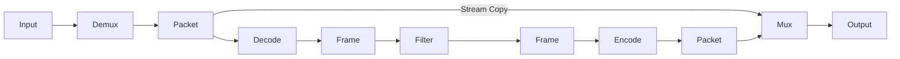
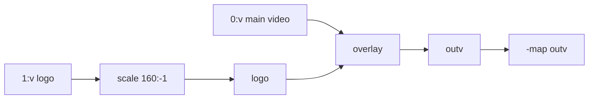

Filter 是 FFmpeg 中处理画面或声音的节点。`scale` 改尺寸，`fps` 改帧率，`overlay` 把两路画面叠起来。将这些 Filter 连成命令时，需要说明帧从哪里来、经过哪些处理、结果写到哪里。

这篇从一条短命令开始，逐步走到多输入 Filtergraph。文中的示例都按 Windows PowerShell 单行命令编写，`input.mp4`、`logo.png` 和 `output.mp4` 替换成自己的路径即可。

## 先跑一条 Filterchain

把视频宽度设为 1280，高度按比例计算，并输出 25 FPS。输入宽度不足 1280 时也会放大：

```powershell
ffmpeg -i input.mp4 -vf "scale=w=1280:h=-2,fps=25" -c:v libx264 -crf 23 -preset medium -c:a copy output.mp4
```

视频经过缩放和帧率处理后重新编码，音频使用 Stream Copy。复制的前提是 MP4 支持源音频编码，否则需要改用兼容编码器或容器。

`-vf` 后面的内容在本例中是一条 Video Filterchain，从左向右读：

```text
Decoded Video Frame → scale → fps → Encoder
```

- `scale=w=1280:h=-2` 把宽度设为 1280，高度按原比例计算并取偶数；
- `,` 把两个 Filter 串在同一条 Filterchain 中；
- `fps=25` 重新安排输出帧，使输出成为 25 FPS；
- `-c:v libx264` 对处理后的帧重新编码；
- 音频流没有经过 Filter，因此这里尝试用 `-c:a copy` 保留原始音频包。


## Filter 工作在什么位置

FFmpeg 从容器中解封装出压缩的 Packet，解码器再把 Packet 还原成帧。Filter 接触的是解码后的帧，不是压缩 Packet。



这也解释了一个常见报错：

```text
Filtering and streamcopy cannot be used together
```

同一条视频流一旦经过 `scale`、`crop`、`fps`、`drawbox` 或 `overlay`，就不能再使用 `-c:v copy`。音频流如果完全没改，仍有机会单独使用 `-c:a copy`；反过来也一样。

## Filter、Filterchain、Filtergraph

这三个名称很相似，但对应三个层级。

| 名称 | 在命令中的样子 | 它表达的内容 |
| --- | --- | --- |
| Filter | `scale=w=1280:h=-2` | 一个处理节点 |
| Filterchain | `scale=1280:-2,fps=25` | 用逗号连接的一条处理路径 |
| Filtergraph | `[0:v]split[a][b];...` | 由一条或多条 Filterchain 组成的完整连接图 |

每个 Filter 可以有 Input Pad 和 Output Pad，用于接收、输出 Frame；Pad 之间的连接称为 Link。方括号中的名字称为 Link Label，例如 `[main]`、`[logo]`、`[outv]`，用于标识连接的两端。本文保留这些官方术语，中文说明只解释它们的作用。

`scale` 通常一路输入、一路输出；`split` 将一路分成多路；`overlay` 接收两路，合成一路。出现分支或合并后，用 Link Label 标明连接，便于核对各路 Frame 的去向。

### 四种符号怎样读

```text
[0:v]scale=w=1280:h=-2,fps=25[base];[base][1:v]overlay=x=W-w-24:y=H-h-24[outv]
```

按分隔符拆开。Link Label 标识连接，不能像普通变量一样任意重复读取；需要分出多路时使用 `split`：

```text
:   同一个 Filter 里的不同 option     scale=w=1280:h=-2
,   同一条链上前后相接               scale,...,fps
;   这条链结束，下一条开始           ...[base];[base]...
[]  给中间结果起名字                 [base]、[outv]
```

于是上面的内容可以读成：从第一个输入取视频流，经过 `scale` 和 `fps` 后命名为 `[base]`；再把 `[base]` 与第二个输入的视频交给 `overlay`，结果叫 `[outv]`。

### 参数按位置传入，或写出名称

下面两种写法都很常见：

```text
crop=1280:720:0:0
crop=w=1280:h=720:x=0:y=0
```

第一种按位置传参，第二种写出参数名。不同 Filter 的参数顺序不同，显式名称便于核对尺寸和坐标。

当前 FFmpeg 构建实际支持什么，以本机帮助为准：

```powershell
ffmpeg -hide_banner -h filter=scale
ffmpeg -hide_banner -h filter=crop
ffmpeg -hide_banner -h filter=overlay
```

## `-vf`、`-af` 与 `-filter_complex`

选择入口时只看连接形状，不需要把简单任务写成复杂图。

| 参数 | 适合的连接 | 例子 |
| --- | --- | --- |
| `-vf` | 一个视频输入、一个视频输出的 Simple Filtergraph | 缩放、裁剪、改 FPS |
| `-af` | 一个音频输入、一个音频输出的 Simple Filtergraph | 调音量、重采样、淡入淡出 |
| `-filter_complex` / `-lavfi` | 多输入、分支、合并或多输出 | Logo、画中画、分屏、混音 |
| `-f lavfi -i` | 使用 Libavfilter virtual input device | `testsrc2`、`color`、`sine` |

`-lavfi <graph_description>` 是 `-filter_complex` 的别名；`-f lavfi -i "..."` 则通过 libavfilter 虚拟输入设备生成测试画面或声音：

```powershell
ffmpeg -y -f lavfi -i "testsrc2=size=1280x720:rate=25:duration=5" -c:v libx264 -pix_fmt yuv420p test.mp4
```

## 几个常用 Video Filter

### `scale`：固定宽度与固定画布

```powershell
ffmpeg -i input.mp4 -vf "scale=w=1280:h=-2" -c:v libx264 -crf 23 -preset medium -c:a copy output.mp4
```

`h=-2` 按比例计算高度，并使高度能被 2 整除。例如 640×360 的方形像素素材会变成 1280×720；这条命令会放大小视频。

如果需求是固定 1280×720 并用黑边补齐，单独一个 `scale` 不够：

```powershell
ffmpeg -i input.mp4 -vf "scale=w=1280:h=720:force_original_aspect_ratio=decrease:force_divisible_by=2,pad=w=1280:h=720:x=(ow-iw)/2:y=(oh-ih)/2:color=black" -c:v libx264 -crf 23 -preset medium -c:a copy output.mp4
```

`scale` 先保持比例装进 1280×720 的尺寸框，`force_divisible_by=2` 使缩放尺寸为偶数，`pad` 再居中补黑边。`decrease` 相对的是给定的尺寸框，不是原视频尺寸，因此不保证只缩小。这个例子按方形像素素材理解；非方形像素还要检查 `sample_aspect_ratio` 和显示比例。

```text
原画面 → 等比缩放 → 放到固定画布中央
                   ┌─────────────────┐
                   │      黑边       │
                   │    缩放画面     │
                   │      黑边       │
                   └─────────────────┘
```

### `crop`：从 Frame 中取一块区域

从画面中心裁出 1280×720：

```powershell
ffmpeg -i input.mp4 -vf "crop=w=1280:h=720:x=(iw-1280)/2:y=(ih-720)/2" -c:v libx264 -crf 23 -preset medium -c:a copy output.mp4
```

`iw`、`ih` 是输入宽度和高度。如果原视频小于目标尺寸，这条命令会失败。面对来源不固定的素材，可以先用 `ffprobe` 看宽高，再决定是先 `scale` 还是直接 `crop`。

### `fps`：改变输出 Frame 的节奏

```powershell
ffmpeg -i input.mp4 -vf "fps=fps=25" -c:v libx264 -crf 23 -preset medium -c:a copy output.mp4
```

`fps` 会通过丢弃或复制帧形成目标恒定 FPS。它不是“给文件标签改成 25”，也不等于编码器的 `-r` 在所有位置都具有相同语义。只在交付规格、播放器或后续算法明确要求时改变 FPS。

### `format`：约束 Pixel Format

```powershell
ffmpeg -i input.mp4 -vf "format=pix_fmts=yuv420p" -c:v libx264 -crf 23 -preset medium -c:a aac -b:a 128k output.mp4
```

`yuv420p` 对普通 8-bit SDR 网页视频兼容性较好，但不是 HDR、10-bit 和专业调色的万能答案。遇到这些素材，还要一起确认 bit depth、color primaries、transfer characteristics 和播放器能力。

### `drawbox`：在画面上加一层标记

```powershell
ffmpeg -i input.mp4 -vf "drawbox=x=20:y=20:w=320:h=180:color=red@0.7:t=4" -c:v libx264 -crf 23 -preset medium -c:a copy output.mp4
```

这里的 `t=4` 表示边框厚度为 4 像素。只在特定时间段显示红框用 `enable`；运行中改变坐标可用运行时命令，下一篇有对应例子。

## 两个常用 Audio Filter

把音量放大 1.5 倍：

```powershell
ffmpeg -i input.mp4 -af "volume=1.5" -c:v copy -c:a aac -b:a 128k output.mkv
```

把采样率转换为 48 kHz：

```powershell
ffmpeg -i input.mp4 -vn -af "aresample=48000" -c:a pcm_s16le output.wav
```

`volume` 与 `aresample` 都处理解码后的音频帧，所以音频流需要重新编码；它们不会让未参与处理的视频流自动重新编码。

## 从 Logo 叠加读懂 `-filter_complex`

现在给主视频右下角加一张 Logo，并把 Logo 宽度缩到 160：

```powershell
ffmpeg -i input.mp4 -i logo.png -filter_complex "[1:v]scale=w=160:h=-1[logo];[0:v][logo]overlay=x=W-w-24:y=H-h-24[outv]" -map "[outv]" -map 0:a:0? -c:v libx264 -crf 23 -preset medium -c:a copy output.mkv
```



沿着连接读一遍就不难了：

1. `-i input.mp4` 是输入 0，`-i logo.png` 是输入 1；
2. `[1:v]` 取输入 1 的第一条视频流；
3. `scale` 的输出命名为 `[logo]`；
4. `overlay` 的第一个输入是主画面，第二个输入是覆盖层；
5. 合成结果命名为 `[outv]`，再由 `-map "[outv]"` 送进输出文件；
6. `-map 0:a:0?` 尝试带上输入 0 的第一条音频流，末尾 `?` 表示没有音频时不要报错。

把 `x`、`y` 写成名称更不容易读错。`W`、`H` 是主画面尺寸，`w`、`h` 是覆盖层尺寸，所以 `W-w-24:H-h-24` 就是距右边、下边各 24 像素。

本例使用 `overlay` 默认的 `eof_action=repeat` 和 `repeatlast=1`，辅助图片结束后会继续使用最后一帧，直至主视频结束。带 Link Label 的输出 `[outv]` 必须映射且仅映射一次；没有 Link Label 的 Complex Filtergraph 输出会自动加入第一个输出文件。更多结束策略见下一篇的 framesync 部分。

## 一个分支 Filtergraph

下面这个例子把输入一分为二：上半部分经过 `crop` 和 `vflip`，再覆盖到原画面的下半部分。

```powershell
ffmpeg -i input.mp4 -filter_complex "[0:v]split[main][tmp];[tmp]crop=w=iw:h=ih/2:x=0:y=0,vflip[flip];[main][flip]overlay=x=0:y=H/2[outv]" -map "[outv]" -map 0:a:0? -c:v libx264 -crf 23 -preset medium -c:a aac -b:a 128k output.mp4
```

把长字符串按分号拆开，会得到三条 Filterchain：

```text
[0:v]split[main][tmp]
[tmp]crop=...,vflip[flip]
[main][flip]overlay=...[outv]
```

`split` 分出两路：一路保留原画面，另一路裁出上半幅并翻转；最后在 `overlay` 处合并。

## PowerShell 的字符串与转义

Filtergraph 已经有自己的逗号、冒号、分号和方括号，外面还套着 PowerShell 字符串。描述稍长时，可以把路径和 Filtergraph 放进变量：

```powershell
$sourcePath = ".\input.mp4"
$logoPath = ".\logo.png"
$outputPath = ".\output.mkv"
$filterGraph = "[1:v]scale=w=160:h=-1[logo];[0:v][logo]overlay=x=W-w-24:y=H-h-24[outv]"
ffmpeg -i $sourcePath -i $logoPath -filter_complex $filterGraph -map "[outv]" -map 0:a:0? -c:v libx264 -crf 23 -preset medium -c:a copy $outputPath
```

路径含空格时让变量保存完整字符串即可。不要把 Bash 教程里的反斜杠续行原样复制到 PowerShell。

`drawtext` 会再引入文字、字体路径和更多转义。长文案优先使用 `textfile=`，字体位置用 `fontfile=` 明确指定，并先查看当前构建的帮助：

```powershell
ffmpeg -hide_banner -h filter=drawtext
```

## Filter 处理后怎样编码

Filtergraph 决定 Frame 怎样变化，Encoder 决定处理后的 Frame 怎样压缩。

```powershell
ffmpeg -i input.mp4 -vf "scale=w=1280:h=-2" -c:v libx264 -crf 23 -preset medium -c:a aac -b:a 128k output.mp4
```

- `libx264` 是视频编码器；当前构建未必都带有它，可用 `ffmpeg -encoders` 查询；
- `-crf 23` 是 x264 常见的质量起点，不是 23% 画质，也不能原样套到每种编码器；
- `-preset medium` 主要权衡编码速度与压缩效率；
- `-c:a aac -b:a 128k` 为音频流选择 AAC 与目标码率。

查看当前机器的 Filter 和编码器：

```powershell
ffmpeg -hide_banner -filters 2>&1 | Select-String "scale|crop|fps|overlay|drawtext|volume"
ffmpeg -hide_banner -encoders 2>&1 | Select-String "libx264|libx265|aac|libopus"
```

## 检查尺寸、解码和播放效果

先用 `ffprobe` 看容器和 Stream 参数：

```powershell
ffprobe -v error -show_entries "format=format_name,duration:stream=index,codec_type,codec_name,width,height,pix_fmt,avg_frame_rate" -of json output.mp4
```

再完整解码一遍，同时检查错误日志和退出码：

```powershell
ffmpeg -v error -i output.mp4 -map 0:v? -map 0:a? -f null -
```

最后实际播放，因为结构正确不代表比例、位置、音量和观感一定正确：

```powershell
ffplay -autoexit output.mp4
```

遇到错误时，下面几个检查方向通常比反复改引号更快：

| 现象 | 先看哪里 |
| --- | --- |
| `No such filter` | 用 `-filters` 与 `-h filter=name` 查拼写和 build 能力 |
| Stream Copy 与 Filter 冲突 | 对经过 Filter 的 Stream 选择 Encoder |
| `Cannot find a matching stream` | input index、Stream specifier、Label 和 `-map` |
| `Filtergraph ... not connected` | 是否有未连接的 Pad 或拼错的 Label |
| `Invalid argument` | option 范围、Filtergraph 分隔符和 PowerShell 字符串 |
| 可以播放但规格不对 | 用 `ffprobe` 对照 width、height、FPS、Pixel Format 与 Codec |

调试长 Filterchain 时，先只保留第一个 Filter，确认输出后逐个接回去。每次只改变一个环节，便于核对尺寸、像素格式、时间戳或编码器报错。

继续阅读：[FFmpeg Filters 进阶：Timeline、framesync 与 Audio](/tutorials/tffmpeg-filters-2/)。

参考：[Filtergraph syntax](https://ffmpeg.org/ffmpeg-filters.html#Filtergraph-syntax)、[scale](https://ffmpeg.org/ffmpeg-filters.html#scale)、[overlay](https://ffmpeg.org/ffmpeg-filters.html#overlay)、[Complex filtergraphs 的输出映射](https://ffmpeg.org/ffmpeg.html#Complex-filtergraphs-1)。
