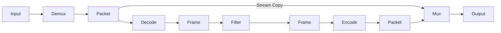
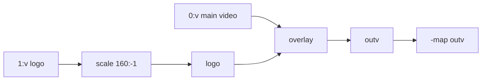

第一次写 `-vf "scale=1280:-2,fps=25"` 时，它看起来很像一串普通参数。直到要叠加 Logo，我把第二个输入、分号、Label 和 `-map` 全塞进同一条命令，才发现真正需要理解的不是某个 Filter，而是 Frame 怎样在 Filtergraph 里流动。

这篇从一条短命令开始，逐步走到多输入 Filtergraph。文中的示例都按 Windows PowerShell 单行命令编写，`input.mp4`、`logo.png` 和 `output.mp4` 替换成自己的路径即可。

## 先跑一条 Filterchain

把视频宽度缩到 1280，保持原比例，并输出 25 FPS：

```powershell
ffmpeg -i input.mp4 -vf "scale=w=1280:h=-2,fps=25" -c:v libx264 -crf 23 -preset medium -c:a copy output.mp4
```

`-vf` 后面的内容是一条 Video Filterchain，从左向右读：

```text
Decoded Video Frame → scale → fps → Encoder
```

- `scale=w=1280:h=-2` 把宽度设为 1280，高度按原比例计算并取偶数；
- `,` 把两个 Filter 串在同一条 Filterchain 中；
- `fps=25` 重新安排输出 Frame，使输出成为 25 FPS；
- `-c:v libx264` 对处理后的 Frame 重新 Encode；
- Audio Stream 没有经过 Filter，因此这里尝试用 `-c:a copy` 保留原始 Audio Packet。

最后一句特意用了“尝试”。Stream Copy 能否成功还取决于输出 Container 是否接受原来的 Codec；例如把某些音频直接复制进 MP4，Container 与 Codec 不兼容时仍会失败。

## Filter 工作在什么位置

FFmpeg 从 Container 中 Demux 出压缩的 Packet，Decoder 再把 Packet 还原成 Frame。Filter 接触的是 Decode 后的 Frame，不是压缩 Packet。



这也解释了一个常见报错：

```text
Filtering and streamcopy cannot be used together
```

同一条 Video Stream 一旦经过 `scale`、`crop`、`fps`、`drawbox` 或 `overlay`，就不能再使用 `-c:v copy`。Audio Stream 如果完全没改，仍有机会单独使用 `-c:a copy`；反过来也一样。

## Filter、Filterchain、Filtergraph

这三个名称很相似，但对应三个层级。

| 名称 | 在命令中的样子 | 它表达的内容 |
| --- | --- | --- |
| Filter | `scale=w=1280:h=-2` | 一个处理节点 |
| Filterchain | `scale=1280:-2,fps=25` | 用逗号连接的一条处理路径 |
| Filtergraph | `[0:v]split[a][b];...` | 由一条或多条 Filterchain 组成的完整连接图 |

Filter 有 Input Pad 和 Output Pad，两个 Pad 之间的连接叫 Link。`[main]`、`[logo]`、`[outv]` 这类 Label 是 Link 的名字，用来说明某段 Frame 接下来要去哪里。

普通 `scale` 通常是 1 input / 1 output，`split` 是 1 input / N outputs，`overlay` 则是 2 inputs / 1 output。出现分支、合并或多个输入后，仅靠从左到右的默认连接很容易看错，这时 Label 就有用了。

### 四种符号怎样读

```text
[0:v]scale=w=1280:h=-2,fps=25[base];[base][1:v]overlay=x=W-w-24:y=H-h-24[outv]
```

不用急着背，按停顿位置拆开：

- `:` 分隔同一个 Filter 的不同 option；
- `,` 连接同一条 Filterchain 上前后相邻的 Filter；
- `;` 结束当前 Filterchain，开始另一条；
- `[name]` 给 Link 加 Label。

于是上面的内容可以读成：从第一个输入取 Video Stream，经过 `scale` 和 `fps` 后命名为 `[base]`；再把 `[base]` 与第二个输入的视频交给 `overlay`，结果叫 `[outv]`。

### option 尽量写名字

下面两种写法都很常见：

```text
crop=1280:720:0:0
crop=w=1280:h=720:x=0:y=0
```

第一种短，第二种更适合博客、脚本和半年后的自己。不同 Filter 的 option 顺序并不相同，排查问题时显式名称也更容易看出传错了哪个值。

当前 FFmpeg build 实际支持什么，以本机帮助为准：

```powershell
ffmpeg -hide_banner -h filter=scale
ffmpeg -hide_banner -h filter=crop
ffmpeg -hide_banner -h filter=overlay
```

## `-vf`、`-af` 与 `-filter_complex`

选择入口时只看连接形状，不需要把简单任务写成复杂图。

| 参数 | 适合的连接 | 例子 |
| --- | --- | --- |
| `-vf` | 单路 Video Filterchain | 缩放、裁剪、改 FPS |
| `-af` | 单路 Audio Filterchain | 调音量、重采样、淡入淡出 |
| `-filter_complex` / `-lavfi` | 多输入、分支、合并或多输出 | Logo、画中画、分屏、混音 |
| `-f lavfi -i` | 使用 Libavfilter virtual input device | `testsrc2`、`color`、`sine` |

CLI option `-lavfi <graph_description>` 是 `-filter_complex` 的 alias；`-f lavfi -i "..."` 则是另一条路径，它让 Libavfilter virtual input device 生成测试画面或声音：

```powershell
ffmpeg -y -f lavfi -i "testsrc2=size=1280x720:rate=25:duration=5" -c:v libx264 -pix_fmt yuv420p test.mp4
```

## 几个常用 Video Filter

### `scale`：把画面装进目标尺寸

```powershell
ffmpeg -i input.mp4 -vf "scale=w=1280:h=-2:force_original_aspect_ratio=decrease" -c:v libx264 -crf 23 -preset medium -c:a copy output.mp4
```

`h=-2` 会按比例计算高度，并让结果能被 2 整除。`force_original_aspect_ratio=decrease` 表示只把画面放进 1280 宽的限制框，不为了凑尺寸而拉伸。

如果需求是固定 1280×720 并用黑边补齐，单独一个 `scale` 不够：

```powershell
ffmpeg -i input.mp4 -vf "scale=w=1280:h=720:force_original_aspect_ratio=decrease,pad=w=1280:h=720:x=(ow-iw)/2:y=(oh-ih)/2:color=black" -c:v libx264 -crf 23 -preset medium -c:a copy output.mp4
```

这里 `scale` 负责“放进去”，`pad` 负责“补到固定画布”。这比强行把任意比例拉成 16:9 更稳妥。

### `crop`：从 Frame 中取一块区域

从画面中心裁出 1280×720：

```powershell
ffmpeg -i input.mp4 -vf "crop=w=1280:h=720:x=(iw-1280)/2:y=(ih-720)/2" -c:v libx264 -crf 23 -preset medium -c:a copy output.mp4
```

`iw`、`ih` 是 input width / input height。如果原视频小于目标尺寸，这条命令会失败。面对来源不固定的素材，可以先用 `ffprobe` 看宽高，再决定是先 `scale` 还是直接 `crop`。

### `fps`：改变输出 Frame 的节奏

```powershell
ffmpeg -i input.mp4 -vf "fps=fps=25" -c:v libx264 -crf 23 -preset medium -c:a copy output.mp4
```

`fps` 会通过丢弃或复制 Frame 形成目标恒定 FPS。它不是“给文件标签改成 25”，也不等于编码器的 `-r` 在所有位置都具有相同语义。只在交付规格、播放器或后续算法明确要求时改变 FPS。

### `format`：约束 Pixel Format

```powershell
ffmpeg -i input.mp4 -vf "format=pix_fmts=yuv420p" -c:v libx264 -crf 23 -preset medium -c:a aac -b:a 128k output.mp4
```

`yuv420p` 对普通 8-bit SDR 网页视频兼容性较好，但不是 HDR、10-bit 和专业调色的万能答案。遇到这些素材，还要一起确认 bit depth、color primaries、transfer characteristics 和播放器能力。

### `drawbox`：在画面上加一层标记

```powershell
ffmpeg -i input.mp4 -vf "drawbox=x=20:y=20:w=320:h=180:color=red@0.7:t=4" -c:v libx264 -crf 23 -preset medium -c:a copy output.mp4
```

这里的 `t=4` 是边框 thickness，不是 time。若只想让框在一段时间内出现，需要使用 `enable`；动态移动框则要用 runtime command，下一篇会单独展开。

## 两个常用 Audio Filter

把音量放大 1.5 倍：

```powershell
ffmpeg -i input.mp4 -af "volume=1.5" -c:v copy -c:a aac -b:a 128k output.mkv
```

把采样率转换为 48 kHz：

```powershell
ffmpeg -i input.mp4 -vn -af "aresample=48000" -c:a pcm_s16le output.wav
```

`volume` 与 `aresample` 都处理 Decode 后的 Audio Frame，所以 Audio Stream 需要重新 Encode；它们不会让未参与处理的 Video Stream 自动重新 Encode。

## 从 Logo 叠加读懂 `-filter_complex`

现在给主视频右下角加一张 Logo，并把 Logo 宽度缩到 160：

```powershell
ffmpeg -i input.mp4 -i logo.png -filter_complex "[1:v]scale=w=160:h=-1[logo];[0:v][logo]overlay=x=W-w-24:y=H-h-24[outv]" -map "[outv]" -map 0:a:0? -c:v libx264 -crf 23 -preset medium -c:a copy output.mkv
```



沿着 Link 读一遍就不难了：

1. `-i input.mp4` 是 input 0，`-i logo.png` 是 input 1；
2. `[1:v]` 取 input 1 的第一条 Video Stream；
3. `scale` 的输出命名为 `[logo]`；
4. `overlay` 的第一个 input 是主画面，第二个 input 是覆盖层；
5. 合成结果命名为 `[outv]`，再由 `-map "[outv]"` 送进输出文件；
6. `-map 0:a:0?` 尝试带上 input 0 的第一条 Audio Stream，末尾 `?` 表示没有音频时不要报错。

我更喜欢把 `x`、`y` 写成名称。`W`、`H` 是 main input 的尺寸，`w`、`h` 是 overlay input 的尺寸，所以 `W-w-24:H-h-24` 就是距右边、下边各 24 像素。

静态图片在不同 FFmpeg build、Container 和结束策略下可能出现时长问题。需要让输出严格跟随主视频时，可以为图片输入使用 `-loop 1`，并明确输出时长或 `shortest` 语义；多输入的 EOF 行为会在下一篇的 framesync 部分说明。

## 一个分支 Filtergraph

下面这个例子把输入一分为二：上半部分经过 `crop` 和 `vflip`，再覆盖到原画面的下半部分。

```powershell
ffmpeg -i input.mp4 -filter_complex "[0:v]split[main][tmp];[tmp]crop=w=iw:h=ih/2:x=0:y=0,vflip[flip];[main][flip]overlay=x=0:y=H/2[outv]" -map "[outv]" -map 0:a:0? -c:v libx264 -crf 23 -preset medium -c:a aac -b:a 128k output.mp4
```

把长字符串按分号拆开，会得到三条 Filterchain：

```text
[0:v]split[main][tmp]
[tmp]crop=...,vflip[flip]
[main][flip]overlay=...[outv]
```

如果只盯着完整命令，这段很拥挤；如果把每个 Label 当成临时变量，它其实只是“复制一份 → 处理副本 → 合回主画面”。

## PowerShell 中怎样少受转义折磨

Filtergraph 已经有自己的逗号、冒号、分号和方括号，外面还套着 PowerShell 字符串。图稍长时，我会先把路径和 Filtergraph 放进变量：

```powershell
$sourcePath = ".\input.mp4"
$logoPath = ".\logo.png"
$outputPath = ".\output.mkv"
$filterGraph = "[1:v]scale=w=160:h=-1[logo];[0:v][logo]overlay=x=W-w-24:y=H-h-24[outv]"
ffmpeg -i $sourcePath -i $logoPath -filter_complex $filterGraph -map "[outv]" -map 0:a:0? -c:v libx264 -crf 23 -preset medium -c:a copy $outputPath
```

路径含空格时让变量保存完整字符串即可。不要把 Bash 教程里的反斜杠续行原样复制到 PowerShell。

`drawtext` 会再引入文字、字体路径和更多转义。长文案优先使用 `textfile=`，字体位置用 `fontfile=` 明确指定，并先查看当前 build 的帮助：

```powershell
ffmpeg -hide_banner -h filter=drawtext
```

## Encode 参数仍然是另一件事

Filtergraph 决定 Frame 怎样变化，Encoder 决定处理后的 Frame 怎样压缩。两部分不要混在一起理解。

```powershell
ffmpeg -i input.mp4 -vf "scale=w=1280:h=-2" -c:v libx264 -crf 23 -preset medium -c:a aac -b:a 128k output.mp4
```

- `libx264` 是 Video Encoder；当前 build 未必都带有它，可用 `ffmpeg -encoders` 查询；
- `-crf 23` 是 x264 常见的质量起点，不是 23% 画质，也不能原样套到每种 Encoder；
- `-preset medium` 主要权衡编码速度与压缩效率；
- `-c:a aac -b:a 128k` 为 Audio Stream 选择 AAC 与目标 bitrate。

查看当前机器的 Filter 和 Encoder：

```powershell
ffmpeg -hide_banner -filters 2>&1 | Select-String "scale|crop|fps|overlay|drawtext|volume"
ffmpeg -hide_banner -encoders 2>&1 | Select-String "libx264|libx265|aac|libopus"
```

## 命令跑完后，我会再看三件事

先用 `ffprobe` 看 Container 和 Stream 参数：

```powershell
ffprobe -v error -show_entries "format=format_name,duration:stream=index,codec_type,codec_name,width,height,pix_fmt,avg_frame_rate" -of json output.mp4
```

再完整 Decode 一遍。没有输出并且 exit code 为 0，才表示 Decoder 没发现错误：

```powershell
ffmpeg -v error -i output.mp4 -map 0:v? -map 0:a? -f null -
```

最后实际播放，因为结构正确不代表比例、位置、音量和观感一定正确：

```powershell
ffplay -autoexit output.mp4
```

遇到错误时，下面几个检查方向通常比反复改引号更快：

| 现象 | 先看哪里 |
| --- | --- |
| `No such filter` | 用 `-filters` 与 `-h filter=name` 查拼写和 build 能力 |
| Stream Copy 与 Filter 冲突 | 对经过 Filter 的 Stream 选择 Encoder |
| `Cannot find a matching stream` | input index、Stream specifier、Label 和 `-map` |
| `Filtergraph ... not connected` | 是否有未连接的 Pad 或拼错的 Label |
| `Invalid argument` | option 范围、Filtergraph 分隔符和 PowerShell 字符串 |
| 可以播放但规格不对 | 用 `ffprobe` 对照 width、height、FPS、Pixel Format 与 Codec |

调试长 Filterchain 时，我通常只留第一个 Filter，跑通后再一个个接回去。这样很快就能定位是 Frame 尺寸、Pixel Format、时间戳，还是 Encoder 在拒绝输入。

继续阅读：[FFmpeg Filters 进阶：Timeline、framesync 与 Audio](/tutorials/tffmpeg-filters-2/)。

参考：[FFmpeg Filters Documentation](https://ffmpeg.org/ffmpeg-filters.html)、[FFmpeg CLI Documentation](https://ffmpeg.org/ffmpeg.html)。
