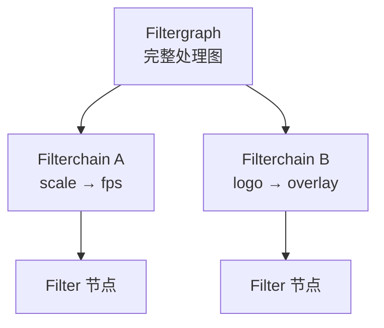
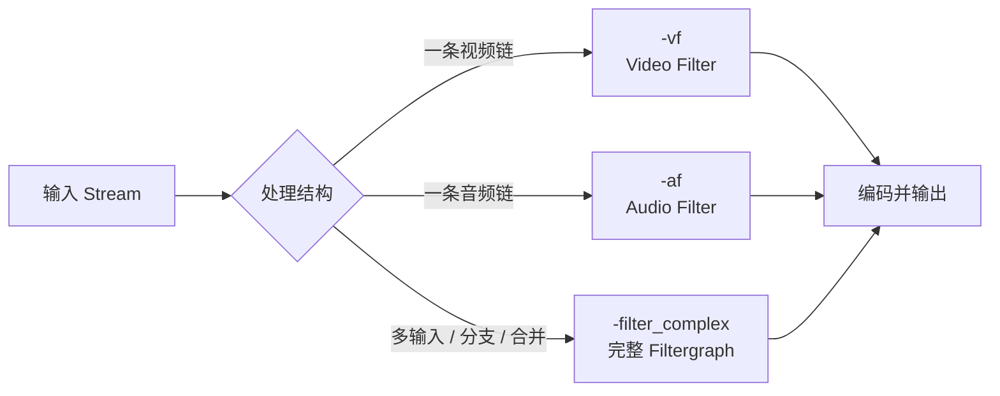
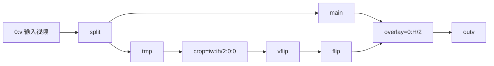
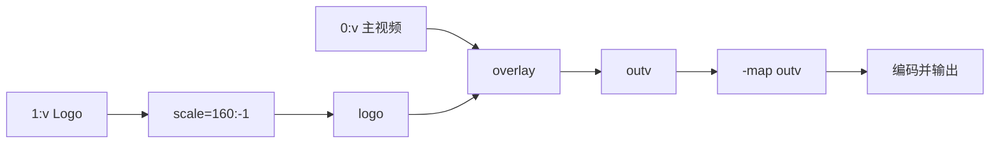

FFmpeg Filters 处理的是**已经解码出来的 Frame**。因此这篇不按官方手册把几百个滤镜逐个罗列，而是围绕四个问题组织内容：

1. Filter、Filterchain、Filtergraph 分别是什么；
2. `-vf`、`-af` 和 `-filter_complex` 应该怎样选择；
3. `,`、`;`、`:`、`[label]` 怎样把滤镜连接起来；
4. 怎样用 PowerShell 写出可复制、可验证的命令。

文中的 `input.mp4`、`output.mp4`、`logo.png` 都是占位符。Windows 示例使用 PowerShell 单行命令，不使用 Bash 的反斜杠续行。

## 先看完整处理链

滤镜位于解码和编码之间。内容不变时可以复制压缩 Packet；只要缩放、裁剪、叠加、抽帧或调音量，相关 Stream 就必须进入 Decode → Filter → Encode：


| 处理目标 | 是否经过 Filter | 常见配置 |
| --- | --- | --- |
| 只换容器 | 否 | `-c copy` |
| 缩放、裁剪、翻转 | 是 | `-vf` + `-c:v` |
| 抽帧、改变帧率 | 是 | `-vf "fps=..."` + `-c:v` 或图片输出 |
| 叠加 Logo、画框 | 是 | `-filter_complex` + `-map` |
| 调整音量、采样率 | 是 | `-af` + `-c:a` |

`Filter` 的英文拼写是 Filter，不是 `fliter`。`-c:v copy` 与视频滤镜互相冲突，因为复制模式没有提供可供滤镜处理的原始 Frame。

## 三个概念先分清

| 概念 | 含义 | 例子 |
| --- | --- | --- |
| Filter | 一个处理节点，有输入/输出 Pad | `scale`、`crop`、`overlay` |
| Filterchain | 用逗号串起来的一条线性链 | `scale=1280:-2,fps=25` |
| Filtergraph | 包含分支、合并或多输入的完整有向图 | `split` + `overlay` |



简单的单路处理只需要 Filterchain；出现 Logo、画中画、分屏、分支或两个输入时，才需要完整 Filtergraph。

### 一个 Filter 的语法

常见形式是：

```text
[输入 Label]filter_name=参数[输出 Label]
```

最小例子：

```text
scale=1280:-2
```

带输入和输出 Label 的例子：

```text
[main]scale=w=1280:h=-2[scaled]
```

`[main]` 和 `[scaled]` 是 Filtergraph 内部的连接名，不是文件名，也不是编码器。

### `,`、`;`、`:` 和 `[]`

| 符号 | 作用 | 示例 |
| --- | --- | --- |
| `:` | 同一个 Filter 的参数分隔符 | `scale=1280:-2` |
| `,` | 同一条 Filterchain 中串联 Filter | `scale=1280:-2,fps=25` |
| `;` | 分隔不同 Filterchain | `split[a][b];[b]crop=...` |
| `[name]` | 给输入/输出 Link 命名 | `[main]`、`[outv]` |


因此 `scale=1280:-2,fps=25` 表示先缩放，再把帧率处理为 25；它不是两个互相独立的命令。

### 参数写法

滤镜通常同时支持按位置传参和按名称传参：

```text
crop=1280:720:0:0
crop=w=1280:h=720:x=0:y=0
```

按位置传参较短，但必须记住官方参数顺序；按名称传参更适合教程、脚本和后期维护。参数名和可接受范围必须以当前构建的帮助为准：

```powershell
ffmpeg -hide_banner -h filter=scale
ffmpeg -hide_banner -h filter=crop
ffmpeg -hide_banner -h filter=overlay
```

## 选择正确的入口参数



| 参数 | 适用场景 | 典型例子 | 注意 |
| --- | --- | --- | --- |
| `-vf` | 单输入、单视频输出链 | `-vf "scale=1280:-2,fps=25"` | 不能和该视频流的 `-c:v copy` 同时使用 |
| `-af` | 单输入、单音频输出链 | `-af "volume=1.5"` | 改变采样后需要重新编码音频 |
| `-filter_complex` | 多输入、分支、合并、多输出 | `"[1:v]scale=160:-1[logo];..."` | 生成的 Label 通常要显式 `-map` |
| `-lavfi` | 把独立的 Filtergraph 当作输入 | `-f lavfi -i "color=c=black:s=1280x720"` | 适合测试图案或虚拟源，不是普通文件处理首选 |

通用模板：

```powershell
ffmpeg -i input.mp4 -vf "FILTER_CHAIN" -c:v libx264 -c:a copy output.mp4
```

如果音频也被 `-af` 改动：

```powershell
ffmpeg -i input.mp4 -vf "VIDEO_CHAIN" -af "AUDIO_CHAIN" -c:v libx264 -c:a aac -b:a 128k output.mp4
```

## 常用视频 Filter：按任务选择

### 缩放 `scale`

保持比例，把宽度限制为 1280，并让高度自动计算为适合编码器的偶数：

```powershell
ffmpeg -i input.mp4 -vf "scale=w=1280:h=-2:force_original_aspect_ratio=decrease" -c:v libx264 -c:a copy output.mp4
```

要点：

- `scale` 处理的是解码后的 Frame；
- `h=-2` 表示按比例计算高度并取偶数；
- `force_original_aspect_ratio=decrease` 避免放大超过目标框；
- 未改变的音频仍可以使用 `-c:a copy`。

### 裁剪 `crop`

从中心裁剪为 1280×720：

```powershell
ffmpeg -i input.mp4 -vf "crop=w=1280:h=720:x=(iw-1280)/2:y=(ih-720)/2" -c:v libx264 -c:a copy output.mp4
```

`iw`、`ih` 分别代表输入宽高。裁剪尺寸不能超过实际输入，否则会出现无效参数或得到不符合预期的画面。

### 帧率 `fps`

每秒输出 25 帧：

```powershell
ffmpeg -i input.mp4 -vf "fps=25" -c:v libx264 -c:a copy output.mp4
```

`fps` 会改变帧序列，不能把它和 `-c:v copy` 组合。不要仅为“显示一个 FPS 数字”就加 `fps`；先确认目标设备或输出规格确实需要改帧率。

### 像素格式 `format`

为常见网页播放器输出 8-bit 4:2:0：

```powershell
ffmpeg -i input.mp4 -vf "format=yuv420p" -c:v libx264 -c:a aac -b:a 128k output.mp4
```

`yuv420p` 是常见兼容选择，不代表所有 HDR、10-bit 或专业色彩任务都应该强制使用它。涉及 HDR、色彩矩阵或位深时，先确认播放器和交付规格。

### 翻转和旋转

```powershell
ffmpeg -i input.mp4 -vf "hflip" -c:v libx264 -c:a copy output.mp4
ffmpeg -i input.mp4 -vf "vflip" -c:v libx264 -c:a copy output.mp4
ffmpeg -i input.mp4 -vf "transpose=1" -c:v libx264 -c:a copy output.mp4
```

`transpose=1` 是顺时针旋转 90 度的常见写法。旋转后应检查输出宽高、方向元数据和实际播放器表现。

### 画框 `drawbox`

在左上角绘制一个半透明红框：

```powershell
ffmpeg -i input.mp4 -vf "drawbox=x=20:y=20:w=320:h=180:color=red@0.7:t=4" -c:v libx264 -c:a copy output.mp4
```

这类绘制操作属于视频内容变化，必须重新编码视频。

## 常用音频 Filter

### 调整音量 `volume`

音量放大 1.5 倍，视频保持复制：

```powershell
ffmpeg -i input.mp4 -af "volume=1.5" -c:v copy -c:a aac -b:a 128k output.mkv
```

### 重采样 `aresample`

统一到 48 kHz：

```powershell
ffmpeg -i input.mp4 -vn -af "aresample=48000" -c:a aac -ar 48000 output.m4a
```

音频 Filter 会让音频进入解码和编码路径；它不会强制视频也重新编码。输出容器是否支持复制的视频编码仍需单独确认。

## Filterchain：把一条链写清楚

将视频缩放、改帧率、统一像素格式：

```powershell
ffmpeg -i input.mp4 -vf "scale=w=1280:h=-2,fps=25,format=yuv420p" -c:v libx264 -crf 23 -preset medium -c:a copy output.mp4
```

等价的结构是：

```text
输入 Frame
  ↓
scale
  ↓
fps
  ↓
format
  ↓
输出 Frame
```

调试时先拆成一个 Filter，再逐个加入下一个 Filter。这样可以判断错误来自尺寸、帧率、像素格式还是编码器，而不是一次修改整条长命令。

## Filtergraph：分支、合并和多个输入

### 官方 split / crop / vflip / overlay 结构



对应的 PowerShell 单行命令：

```powershell
ffmpeg -i input.mp4 -filter_complex "[0:v]split[main][tmp];[tmp]crop=iw:ih/2:0:0,vflip[flip];[main][flip]overlay=0:H/2[outv]" -map "[outv]" -map 0:a:0? -c:v libx264 -c:a aac -b:a 128k output.mp4
```

按三条 Filterchain 读取：

```text
[0:v]split[main][tmp]
[tmp]crop=...,vflip[flip]
[main][flip]overlay=...[outv]
```

- `split`：一条输入，产生 `main` 和 `tmp` 两路输出；
- `crop,vflip`：逗号表示同一条链中连续处理 `tmp`；
- `overlay`：需要两路输入，输出一条合成画面；
- `[outv]`：滤镜结果的 Label，通过 `-map "[outv]"` 放入输出。

### Logo 叠加

视频来自输入 0，Logo 来自输入 1：



命令：

```powershell
ffmpeg -i input.mp4 -i logo.png -filter_complex "[1:v]scale=160:-1[logo];[0:v][logo]overlay=W-w-24:H-h-24[outv]" -map "[outv]" -map 0:a:0? -c:v libx264 -c:a copy output.mkv
```

这个例子体现了三个边界：输入编号由 `-i` 顺序决定；滤镜内部 Label 只负责接线；输出流仍然需要 `-map` 和编码配置。

### Label、Pad 和 Link

更准确地说：

- Input Pad 是 Filter 接收数据的端口；
- Output Pad 是 Filter 产生数据的端口；
- Link 是两个 Pad 之间的连接；
- `[main]`、`[tmp]`、`[outv]` 是给 Link 起的名字。

普通的 `scale` 常见为 1 入 1 出；`split` 是 1 入多出；`overlay` 是 2 入 1 出。出现分支或合并时，用 Label 明确表达连接关系，比依赖自动连接更容易检查。

Source Filter 没有输入、自己产生媒体，例如 `-f lavfi -i "testsrc=size=1280x720:rate=25"`；Sink Filter 没有输出，例如把结果送往统计或丢弃。初学阶段只需知道这两个边界，不要把它们与普通文件输入混为一谈。

## PowerShell 写法和转义边界

Filtergraph 至少涉及三层字符规则：Filter 参数、Filtergraph 语法、PowerShell 字符串。建议先把图保存到变量，再传给 FFmpeg：

```powershell
$sourcePath = ".\input.mp4"
$outputPath = ".\output.mp4"
$filterGraph = "scale=w=1280:h=-2,fps=25,format=yuv420p"
ffmpeg -i $sourcePath -vf $filterGraph -c:v libx264 -c:a copy $outputPath
```

包含 Label 时：

```powershell
$filterGraph = "[1:v]scale=160:-1[logo];[0:v][logo]overlay=W-w-24:H-h-24[outv]"
ffmpeg -i .\input.mp4 -i .\logo.png -filter_complex $filterGraph -map "[outv]" -map 0:a:0? -c:v libx264 -c:a copy .\output.mkv
```

注意事项：

- 路径包含空格时加引号，例如 `"D:\Media Files\input.mp4"`；
- PowerShell 示例不要复制 Bash 的 `\` 换行；
- `drawtext` 的文字、冒号、逗号和字体路径会触发多层转义，复杂文案优先使用 `textfile=` 和 `fontfile=`；
- 先用 `ffmpeg -hide_banner -h filter=drawtext` 查看当前构建支持的参数，不要直接照抄旧版本的转义写法。

## 质量、编码和输出约束

滤镜完成后仍然要决定输出编码。常见的起点：

```powershell
ffmpeg -i input.mp4 -vf "scale=w=1280:h=-2" -c:v libx264 -crf 23 -preset medium -c:a aac -b:a 128k output.mp4
```

| 配置 | 作用 | 不要误解为 |
| --- | --- | --- |
| `-c:v libx264` | 选择视频编码器 | 所有机器都一定安装了它 |
| `-crf 23` | 编码器相关的恒定质量起点 | 百分比画质或跨编码器通用标准 |
| `-preset medium` | 速度与压缩效率取舍 | 直接决定画质 |
| `-pix_fmt yuv420p` | 指定像素格式 | HDR/10-bit 场景的通用答案 |
| `-c:a copy` | 复制未改变的音频 Packet | 能修复不兼容的音频编码 |

先确认当前构建的能力：

```powershell
ffmpeg -hide_banner -filters 2>&1 | Select-String "scale|crop|fps|overlay|drawtext|volume"
ffmpeg -hide_banner -encoders 2>&1 | Select-String "libx264|libx265|aac|libopus"
```

## 验收和故障定位

只看到进度条结束，不能证明滤镜结果正确。至少完成结构、解码和播放三层检查：

```powershell
ffprobe -v error -show_entries "format=format_name,duration:stream=index,codec_type,codec_name,width,height,pix_fmt,avg_frame_rate" -of json output.mp4
ffmpeg -v error -i output.mp4 -map 0:v? -map 0:a? -f null -
ffplay output.mp4
```

| 现象 | 优先检查 |
| --- | --- |
| `No such filter` | `ffmpeg -filters` 和 `-h filter=name`，确认构建和拼写 |
| `Filtering and streamcopy cannot be used together` | 移除该流的 `-c copy`，或移除 Filter |
| `Cannot find a matching stream` | 输入编号、类型、Label 和 `-map` 是否对应 |
| `Filtergraph ... not connected` | 是否有未使用的输出 Pad，Label 是否拼错 |
| `Invalid argument` | 参数范围、冒号/分号、PowerShell 引号和路径转义 |
| 输出能播放但规格不对 | `ffprobe` 检查尺寸、帧率、像素格式和音频编码 |

```mermaid
flowchart TD
  A[滤镜命令失败或结果异常] --> B{滤镜存在?}
  B -->|否| B1[检查 -filters / -h filter=name]
  B -->|是| C{输入流正确?}
  C -->|否| C1[ffprobe + -map + Label]
  C -->|是| D{图是否连通?}
  D -->|否| D1[检查 , ; : 和 [label]]
  D -->|是| E{输出是否完整?}
  E -->|否| E1[检查编码器、容器和完整解码]
  E -->|是| F[ffprobe + ffplay 验收]
```

排错时一次只改变一个变量：先运行 `scale`，再加入 `fps`，最后再加入 `overlay` 或文字。这样才能把 Filtergraph 错误与输入、编码器和播放器问题分开。

## 一页速查

### 语法速查

```text
scale=1280:-2                 # 一个 Filter
scale=1280:-2,fps=25          # 一个 Filterchain
[0:v]split[a][b];[b]crop=...  # 多条 Filterchain
[in]scale=1280:-2[out]        # 用 Label 接线
```

### 命令模板

```powershell
# 单视频链
ffmpeg -i input.mp4 -vf "FILTER_CHAIN" -c:v libx264 -c:a copy output.mp4

# 单音频链
ffmpeg -i input.mp4 -af "AUDIO_CHAIN" -c:v copy -c:a aac output.mkv

# 多输入或分支
ffmpeg -i input.mp4 -i logo.png -filter_complex "FILTER_GRAPH" -map "[outv]" -map 0:a:0? -c:v libx264 -c:a copy output.mkv
```

### 学习边界

先掌握 `scale`、`crop`、`fps`、`format`、`volume`、`split`、`overlay` 和 `-map`。遇到 `drawtext`、时间戳、framesync、硬件滤镜、CUDA、OpenCL 或 Vulkan 时，再按当前 FFmpeg 版本的官方文档和组件帮助深入，不要把某个构建的参数当成所有机器通用。

依据：[FFmpeg Filters 官方文档](https://ffmpeg.org/ffmpeg-filters.html)、[FFmpeg 命令行官方文档](https://ffmpeg.org/ffmpeg.html)、[FFmpeg 格式与协议文档](https://ffmpeg.org/ffmpeg-formats.html)。
