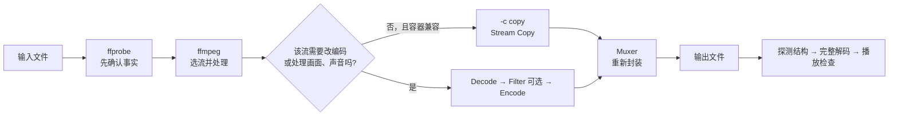

这套教程既讲 FFmpeg 的常见操作，也讲视频本身怎样组成、压缩和传输。可以按眼前的问题选择入口。

## 先用一张图把名词放对位置

FFmpeg 文档难读，往往不是某个词本身太难，而是不同层的词同时出现。先只看这条从画面到播放器的路径：

```text
原始画面 Frame
    ↓ 编码器按 H.264 / H.265 等规则压缩
Packet（携带编码码流）
    ↓ 写入容器，或者按传输协议分包
MP4 / MKV 文件，或者 RTP 等实时媒体数据
    ↓ 从容器取出，或者从网络分片重组
Packet
    ↓ 解码
解码画面 Frame
    ↓ Filter 处理或播放器显示
```

这些词各自只回答一种问题：

| 名词 | 它回答的问题 | 它不是什么 |
| --- | --- | --- |
| Frame | 某个时间点的画面或音频数据是什么 | 不是网络包 |
| H.264 / H.265 | 画面怎样压缩、怎样解码 | 不是文件容器，也不是网络协议 |
| MP4 / MKV | 音视频、字幕和时间信息怎样装在文件里 | 不是视频编码 |
| Packet | FFmpeg 读到的一段压缩数据 | 不保证等于一帧，也不等于一个 RTP 包 |
| RTSP | 客户端怎样申请和控制一次实时播放 | 通常不直接承载画面像素 |
| RTP | 实时媒体怎样分包、编号和标记时间 | 不负责决定画面采用 H.264 还是 H.265 |
| Filter | 解码后怎样处理画面或声音 | 不能和 `-c copy` 同时修改同一条流的内容 |

第一次阅读不需要记住 NAL、SPS、PPS、DTS、time base 等缩写。先知道它们属于哪一层，等文章用到时再展开。

## 从哪里开始读

**想先理解视频原理，不熟悉 I/P/B、RTSP 等缩写：** 从下面四篇连续阅读，不需要先学转码命令。

| 顺序 | 文章 | 从什么问题讲起 |
| --- | --- | --- |
| 一 | [I、P、B 帧究竟是什么](/tutorials/tffmpeg-bitstream/) | 原始画面怎样变成编码数据，解码器又怎样得到完整画面 |
| 二 | [H.264、H.265、MP4 和 GB 分别是什么](/tutorials/tffmpeg-codecs/) | 编码、容器与协议怎么区分，H.265+、裸码流、NAL 和参数集是什么 |
| 三 | [RTSP、网络分包与直播传输](/tutorials/tffmpeg-transport/) | 地址和请求长什么样，网络传的是什么，服务器怎样送到浏览器 |
| 四 | [丢包、花屏、黑屏、绿屏与闪烁](/tutorials/tffmpeg-playback/) | 为什么一个包影响多帧，怎样区分传输、解码、采集与显示问题 |

**想马上处理文件：** 从[先跑通 FFmpeg](/tutorials/tffmpeg-guide/)开始，学习查看、换容器、转码和选轨；已有明确任务可以查[案例篇](/tutorials/t19hdgc9e/)。

本系列保留 `Filter`、`Filterchain`、`Filtergraph`、`Bitstream Filter` 等 FFmpeg 原文术语，并在首次讲解时说明作用。例如 `Filter` 是处理画面或声音的节点，`scale` 用于缩放，`overlay` 用于叠加。

## 先看懂总流程

先用 `ffprobe` 确认输入，再按输出要求选择流和处理方式。下面是文件处理的常见流程；复制或转码的选择针对每条流，视频和音频可以采用不同方式。



| 图中节点 | 你需要确认的内容 |
| --- | --- |
| `ffprobe` | 容器、轨道、编码、时长是否可读 |
| `-map` | 输出需要哪些视频、音频、字幕 |
| `-c copy` | 内容不变时复制压缩包，避免无意义转码 |
| `Filter` | 缩放、裁剪、抽帧、叠加、调音量 |
| `Muxer` | 目标容器能不能装选中的流 |
| 验收 | 退出码、结构探测、完整解码、播放器分别检查 |

## 建议阅读顺序

下面列出完整目录，顺序与章节导航一致。工具入门的前五篇可以连续阅读；视频基础四篇也可以单独作为起点。

| 顺序 | 文档 | 这一篇解决的问题 |
| --- | --- | --- |
| 01 | [先跑通 FFmpeg](/tutorials/tffmpeg-guide/) | 三个程序分别做什么，第一条命令怎么写 |
| 02 | [看懂媒体文件](/tutorials/t1vdqkiht/) | 容器、编码、Stream 和常见音视频属性 |
| 03 | [完成常见文件任务](/tutorials/t2qx7heah/) | 换容器、转码、缩放、截取、抽图、提取音频 |
| 04 | [选择需要的媒体流](/tutorials/t6loukxpw/) | 多轨时如何准确选择视频、音频和字幕 |
| 05 | [理解参数、Filter 与质量](/tutorials/t17xaopev/) | 参数写在哪、何时必须转码、CRF 和码率 |
| 06 | [Filterchain 与 Filtergraph](/tutorials/tffmpeg-filters/) | Filter、Pad、Link Label 与分支 |
| 07 | [Timeline editing、framesync 与 Audio Filters](/tutorials/tffmpeg-filters-2/) | enable、runtime command、多输入同步和音频处理 |
| 08 | [FFprobe 查询手册](/tutorials/t2er6pk59/) | 容器、流、Packet、Frame 和 JSON，随用随查 |
| 09 | [视频基础一：I、P、B 帧究竟是什么](/tutorials/tffmpeg-bitstream/) | 原始画面、编码数据、预测、残差、显示顺序与起播 |
| 10 | [视频基础二：编码与格式](/tutorials/tffmpeg-codecs/) | H.264/H.265、厂商名称、容器、NAL、参数集与 GB |
| 11 | [视频基础三：网络与直播](/tutorials/tffmpeg-transport/) | RTSP/SDP/RTP、UDP/TCP、直播方式和延迟 |
| 12 | [视频基础四：播放异常](/tutorials/tffmpeg-playback/) | 丢包传播、花屏、黑屏、绿屏、闪烁和卡顿 |
| 13 | [常见任务与排障案例](/tutorials/t19hdgc9e/) | 转码、切片、拼接、HLS 与 RTSP |

## 开始前：确认工具

```powershell
ffmpeg -version
ffprobe -version
ffplay -version
```

`ffmpeg` 处理和输出，`ffprobe` 读取信息，`ffplay` 人工预览。编码器、Filter 和协议以执行机器为准：

```powershell
ffmpeg -hide_banner -encoders 2>&1 | Select-String "libx264|libx265|aac"
ffmpeg -hide_banner -filters 2>&1 | Select-String "scale|fps|overlay"
```

找不到命令时，从 [FFmpeg 官方下载页](https://ffmpeg.org/download.html) 查看 Windows 构建入口，将解压后的 `bin` 目录加入 PATH，再打开终端检查版本。可用组件以当前构建为准。

## 本教程的命令约定

- 示例是 PowerShell 单行命令，不使用 Bash 的 `\` 续行符。
- 路径含空格时用引号，例如 `"D:\Media Files\input.mp4"`。
- 示例默认不使用 `-y` 覆盖文件；确认目标后再显式添加。实验目录里的样本文件除外。
- 批处理或服务调用应额外处理超时、取消、并发、磁盘空间和凭据脱敏。
- 退出码为 0 只说明进程没有报告失败；结构、完整解码和目标播放器仍需单独检查。

## 依据与边界

命令语义依据 [FFmpeg CLI](https://ffmpeg.org/ffmpeg.html)、[ffprobe](https://ffmpeg.org/ffprobe.html)、[Filters](https://ffmpeg.org/ffmpeg-filters.html)、[Formats](https://ffmpeg.org/ffmpeg-formats.html) 和 [Protocols](https://ffmpeg.org/ffmpeg-protocols.html)。官网在线文档随开发版本更新；本轮按 [FFmpeg n7.1.1 官方文档源码](https://github.com/FFmpeg/FFmpeg/tree/n7.1.1/doc) 核对，并使用本机 7.1.1 full build 检查代表性命令。

文中的命令是依据上述选项组合的演示，示意结构会单独注明；它们不是官方逐字示例，也不是生产运行记录。码流定义另附 ITU-T 和 IETF 规范来源。

文档只提供学习和本地命令基线，不声称已经验证任何特定摄像机、生产服务器或浏览器链路。涉及 RTSP、HLS 和自动化时，请按最后的案例学习篇重新检查。
