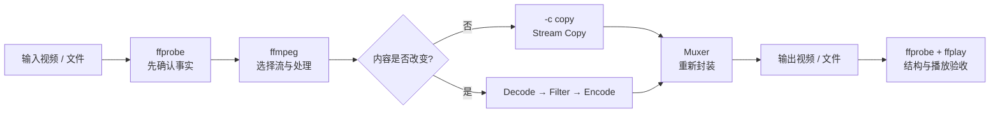

这是一套按“先跑通，再理解，再排错”编排的 FFmpeg 教程。命令都按 Windows PowerShell 编写，`input.mp4`、`output.mp4` 和地址只是占位符。

## 先看懂总流程

下面这张图是整套教程的共同地图：先用 `ffprobe` 获取输入事实，再让 `ffmpeg` 选择流并决定走复制还是转码，最后用探测、完整解码和播放器完成验收。



| 图中节点 | 你需要配置或确认的内容 |
| --- | --- |
| `ffprobe` | 容器、Stream、编码、时长和时间轴是否可读 |
| `-map` | 输出需要哪些视频、音频、字幕或数据流 |
| `-c copy` | 内容不变时复制压缩 Packet，避免无意义转码 |
| `Filter` | 缩放、裁剪、抽帧、叠加或调音量等内容变化 |
| `Muxer` | 目标容器是否能承载选中的流 |
| 验收 | 退出码、结构探测、完整解码和目标播放器分别检查 |

## 建议阅读顺序

不要一开始背参数。先用第 01 篇跑通一条命令，再用第 02 篇看懂输入，最后按任务进入后续文章。

| 顺序 | 文档 | 这一篇解决的问题 |
| --- | --- | --- |
| 01 | [先跑通 FFmpeg](/tutorials/tffmpeg-guide/) | FFmpeg、ffprobe、ffplay 分别做什么，第一条命令怎么写 |
| 02 | [看懂媒体文件](/tutorials/t1vdqkiht/) | 容器、编码、Stream 和常见音视频属性是什么 |
| 随查 | [FFprobe 命令查询与理解](/tutorials/t2er6pk59/) | 查询容器、流、字段、Packet、Frame 和 JSON 输出 |
| 03 | [完成常见文件任务](/tutorials/t2qx7heah/) | 换容器、转码、缩放、截取、抽图和提取音频 |
| 04 | [选择需要的媒体流](/tutorials/t6loukxpw/) | 多轨输入时如何准确选择视频、音频和字幕 |
| 05 | [理解参数、滤镜与质量](/tutorials/t17xaopev/) | 参数放置位置、复制与转码的区别，以及质量控制 |
| 深入 | [FFmpeg Filters：从 Filter 到 Filtergraph](/tutorials/tffmpeg-filters/) | 滤镜语法、Filterchain、Filtergraph、Label 与常用处理链 |
| 最后 | [案例学习：常见任务与面试题](/tutorials/t19hdgc9e/) | 把探测、选流、转码、滤镜、封装和验收组合成可复用案例 |

## 开始前：确认工具

在 PowerShell 中确认命令可用：

```powershell
ffmpeg -version
ffprobe -version
ffplay -version
```

`ffmpeg` 负责处理和输出媒体，`ffprobe` 负责读取媒体信息，`ffplay` 用于人工播放预览。三者版本和构建能力可能不同；编码器、滤镜和协议以执行机器的实际输出为准：

```powershell
ffmpeg -hide_banner -encoders 2>&1 | Select-String "libx264|libx265|aac"
ffmpeg -hide_banner -filters 2>&1 | Select-String "scale|fps|overlay"
```

如果提示“不是内部或外部命令”，先安装 FFmpeg 并把 `bin` 目录加入 PATH；不要把一个机器上的编码器名称直接当成所有机器都支持。

## 第一条可验证的命令

有一个输入文件后，先查看它：

```powershell
ffprobe -hide_banner input.mp4
```

只想快速转成另一个容器时，可以复制原有媒体流：

```powershell
ffmpeg -i input.mp4 -c copy output.mkv
```

`-c copy` 不重新编码，所以速度快且不会产生二次编码损失；它要求目标容器能够承载输入流。需要改变编码或画面时，才进入转码：

```powershell
ffmpeg -i input.mp4 -c:v libx264 -c:a aac output.mp4
```

每次处理后都用 `ffprobe` 检查输出，不要只看命令是否结束：

```powershell
ffprobe -v error -show_format -show_streams -of json output.mp4
```

## 本教程的命令约定

- 示例是 PowerShell 单行命令，不使用 Bash 的 `\` 续行符。
- 路径含空格时用引号，例如 `"D:\Media Files\input.mp4"`。
- 示例默认不使用 `-y` 覆盖文件；确认目标后再显式添加。
- 批处理或服务调用应额外处理超时、取消、并发、磁盘空间和凭据脱敏。
- 退出码为 0 只说明进程没有报告失败；结构、完整解码和目标播放器仍需单独检查。

## 依据与边界

命令语义以 [FFmpeg 官方命令文档](https://ffmpeg.org/ffmpeg.html)、[ffprobe 官方文档](https://ffmpeg.org/ffprobe.html)、[滤镜文档](https://ffmpeg.org/ffmpeg-filters.html)、[格式文档](https://ffmpeg.org/ffmpeg-formats.html) 和 [协议文档](https://ffmpeg.org/ffmpeg-protocols.html) 为准。本机当前验证基线为 FFmpeg 7.1.1 full build；不同版本或发行包的可用组件可能不同。

文档只提供学习和本地命令基线，不声称已经验证任何特定摄像机、生产服务器或浏览器链路。涉及 RTSP、HLS 和自动化时，请按最后的案例学习篇重新检查。
