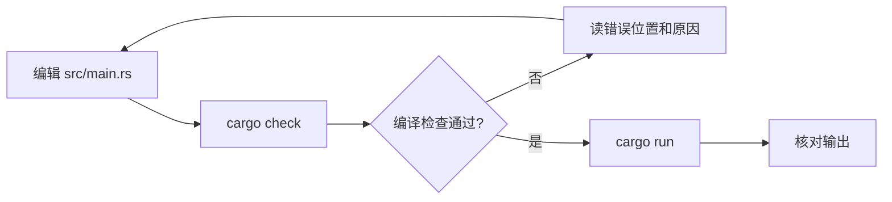

这套教程面向刚开始使用 Rust 的读者。先运行短程序，再看值怎样传递、函数怎样借用数据，最后把这些知识用到猜数游戏和多文件项目中。

## 创建第一个项目

从 [Rust 官方安装页](https://www.rust-lang.org/tools/install) 安装 rustup。Windows 使用 MSVC toolchain 时，还需要安装程序提示的 Visual Studio C++ build tools。安装后重新打开 PowerShell，检查工具是否可用：

```powershell
rustc --version
cargo --version
rustup show active-toolchain
```

`rustc` 是编译器，Cargo 负责项目构建、依赖和测试，rustup 管理 toolchain。接着在自己的练习目录创建项目：

```powershell
cargo new rust_basics --edition 2024
cd rust_basics
cargo run
```

终端应输出 `Hello, world!`。先认清这几个文件：

```text
rust_basics/
├── Cargo.toml     项目名称、edition、依赖等配置
├── Cargo.lock     Cargo 解析出的依赖版本
├── src/
│   └── main.rs    程序入口
└── target/        构建产生的文件
```

后续标有完整 `fn main()` 的独立示例，都可以替换 `src/main.rs` 后运行；不要把多段 `main` 连在同一个文件里。多文件示例会逐一标明路径。



`cargo check` 检查代码而不生成最终可执行文件；`cargo run` 构建并运行。需要调试时，先看最前面一条错误及其标出的代码位置。

## 按这个顺序阅读

| 顺序 | 文章 | 从中学会什么 |
| --- | --- | --- |
| 01 | [格式化打印](/tutorials/tylt69vzg/) | 把变量写到终端，理解占位符与 Display / Debug |
| 02 | [变量与数据类型](/tutorials/t1x5qwiyv/) | let、mut、shadowing、数字、char、tuple 和 array |
| 03 | [函数与控制流程](/tutorials/twvk8ssj9/) | 表达式、返回值、if、loop、while 和 for |
| 04 | [Ownership：move、Copy 与 Clone](/tutorials/t11152xm6/) | 值交给谁，什么时候还能继续使用 |
| 05 | [References 与 Borrowing](/tutorials/tjuxkauef/) | 用 &T、&mut T 和 slice 访问已有数据 |
| 06 | [struct 与字段](/tutorials/t1oueten0/) | 定义数据、更新字段、编写 method |
| 07 | [enum 与模式匹配](/tutorials/tqwzzd1nt/) | variant、Option、match、if let 和 let...else |
| 08 | [猜数游戏](/tutorials/tm2xc7pm5/) | 把输入、解析、比较和循环连起来 |
| 09 | [Package、Crate 与 Module](/tutorials/t1wp1yyjm/) | 拆分文件，控制可见性，组织路径 |
| 10 | [用 Fibonacci 练习测试](/tutorials/t14jimtph/) | 返回 Option、检查溢出、运行 cargo test |
| 11 | [用 AI 辅助学习 Rust](/tutorials/totomy1tn/) | 给出可核验的问题，结合官方资料与编译器检查回答 |

Ownership 与 Borrowing 可以对照阅读：前者解释值的归属，后者解释如何在不转移归属的情况下使用值。猜数游戏用到了前七篇内容，放在基础概念之后练习。

## 术语、示例与文档版本

保留 `Ownership`、`Borrowing`、`move`、`Copy`、`Clone`、`trait`、`crate`、`module` 等官方名称。第一次出现时解释作用，后面继续使用同一个名称，方便回到英文文档查询。

本轮以 **Rust 1.92.0、edition 2024** 为示例核验基线，不将其称为当前最新版本。参考 [The Rust Programming Language](https://doc.rust-lang.org/1.92.0/book/)、[Rust Reference](https://doc.rust-lang.org/1.92.0/reference/)、[标准库](https://doc.rust-lang.org/1.92.0/std/) 和 [Cargo Book](https://doc.rust-lang.org/1.92.0/cargo/)。各篇附对应章节。

示例根据官方规则和本目录原有材料整理，属于教学改写；流程图描述代码关系，不代表实际机器内存布局。标为“预期编译失败”的反例用于观察编译器约束。猜数游戏单独固定第三方 `rand` 的版本，其他基础示例不需要第三方依赖。
