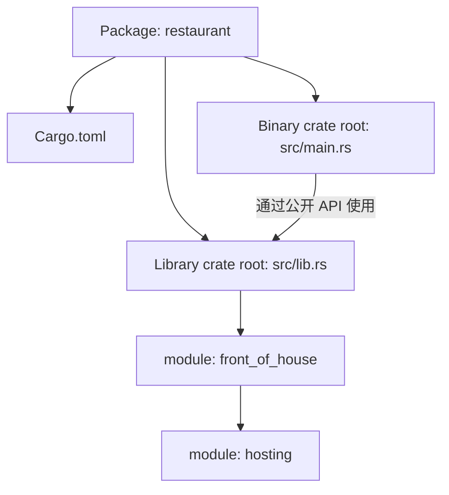

前面的程序都能放进 `main.rs`。代码变多后，可以把可复用逻辑放进 library crate，再用 module 分组。先分清 Cargo 管的项目单位与 Rust 编译的单位。

## Package、Crate、Module 的关系

| 名称 | 作用 | 本篇例子 |
| --- | --- | --- |
| Package | Cargo 组织构建与依赖的单位，有 `Cargo.toml` | `restaurant` |
| Crate | Rust 的编译单元，可为 binary 或 library | `src/main.rs` 与 `src/lib.rs` 分别作为 root |
| Module | crate 内的组织和可见性边界 | `front_of_house`、`hosting` |
| Path | 定位 item 的名称序列 | `crate::front_of_house::hosting` |

一个 Package 可以有多个 binary target，最多一个 library target，至少包含一个 crate。测试、示例等 Cargo target 也有相应构建规则；这里先学习常见的 binary / library 布局。



crate root 是编译器建立 module tree 的起点。library 不需要程序入口 `main`；普通 binary 示例需要入口。两者即使在同一个 Package 中，也仍是两个 crate，不能互相直接访问私有 item。

## 先在一个文件中声明 module

这个独立程序可以作为 `src/main.rs` 运行：

```rust
mod front_of_house {
    pub mod hosting {
        pub fn add_to_waitlist() -> &'static str {
            "added to waitlist"
        }
    }
}

use crate::front_of_house::hosting;

fn main() {
    assert_eq!(hosting::add_to_waitlist(), "added to waitlist");
    println!("{}", hosting::add_to_waitlist());
}
```

这里没有多个文件，但已经有 module tree：

```text
crate
├── front_of_house
│   └── hosting
│       └── add_to_waitlist
└── main
```

`mod` 声明 module，`use` 把已有路径对应的名字引入当前 scope。`use` 不负责加载文件，也不会绕过 privacy。

`&'static str` 表示引用在 `'static` lifetime 内有效；这里返回字符串字面量，因此不需要分配 `String`。

## Path 与 privacy

| 写法 | 从哪里找 |
| --- | --- |
| `crate::...` | 当前 crate 的 root |
| `self::...` | 当前 module |
| `super::...` | 父 module |
| `std::...` | 以已引入的 crate 名定位，例如标准库 |

在 edition 2024 中，本篇按这些路径规则编写。普通 module、函数和 struct 字段默认 private；private item 可由定义它的 module 及其子 module 访问。public item 能否从某处通过一条路径访问，还取决于路径中祖先 module 的可见性。

上例中，root 的 `main` 可以访问 root 内定义的 `front_of_house`；但要继续进入其内部的 `hosting` 并调用函数，需要把后两者公开。`pub mod hosting` 不会自动把 `hosting` 内的函数也变为 public。

`pub struct` 的字段仍默认 private。`pub enum` 的 variant 默认 public，`pub trait` 中的 associated item 也默认 public；“一切都默认私有”会遗漏这些例外。只需 crate 内共享时，可以使用 `pub(crate)`。

## 拆为 library 与 binary

新建另一个练习项目：

```powershell
cargo new restaurant --edition 2024
cd restaurant
```

按下面路径创建或替换文件。四段代码属于同一个项目，不是四个独立程序。

`src/lib.rs`：

```rust
mod front_of_house;

pub use crate::front_of_house::hosting;

pub fn eat_at_restaurant() -> &'static str {
    hosting::add_to_waitlist()
}
```

`src/front_of_house.rs`：

```rust
pub mod hosting;
```

`src/front_of_house/hosting.rs`：

```rust
pub fn add_to_waitlist() -> &'static str {
    "added to waitlist"
}
```

`src/main.rs`：

```rust
fn main() {
    assert_eq!(restaurant::eat_at_restaurant(), "added to waitlist");
    println!("{}", restaurant::hosting::add_to_waitlist());
}
```

最后的目录应是：

```text
restaurant/
├── Cargo.toml
└── src/
    ├── main.rs
    ├── lib.rs
    ├── front_of_house.rs
    └── front_of_house/
        └── hosting.rs
```

```powershell
cargo check
cargo run
```

输出应包含 `added to waitlist`。binary 通过 `restaurant::` 调用 library；若在 `main.rs` 写 `crate::hosting`，这个 `crate` 指的是 binary 自己，不会自动指向 `lib.rs`。

### mod 文件的查找规则

在 `src/lib.rs` 写 `mod front_of_house;`，通常对应 `src/front_of_house.rs` 或 `src/front_of_house/mod.rs`，两者不能同时作为该 module 的定义。在 `front_of_house.rs` 声明 `mod hosting;`，子 module 可放在 `front_of_house/hosting.rs`。

`mod.rs` 写法仍受支持；本篇统一采用同名 `.rs` 文件。文件拆分不改变 module tree。没有 `mod` 声明，仅在目录中新增一个 `.rs` 文件，不会自动把它加入普通 module tree。

### pub use：re-export

library 中的 `front_of_house` 保持 private，`pub use ...::hosting` 将 `hosting` 重新导出到 root。调用者因此可以写 `restaurant::hosting::...`，不必经由内部路径。

### use 的 scope 与别名

root 中写了 `use`，子 module 不能直接假定该名字已经进入自己的 scope；可以在子 module 内重新 `use`，或通过 `super::`、`crate::` 访问适当路径。

同名类型可以用 `as` 区分：

```rust
use std::fmt;
use std::io::Result as IoResult;

fn format_result() -> fmt::Result {
    Ok(())
}

fn io_result() -> IoResult<()> {
    Ok(())
}

fn main() {
    assert!(format_result().is_ok());
    assert!(io_result().is_ok());
}
```

引入函数的父 module，通常能让调用处保留来源；直接引入函数本身也合法，这是组织风格而非编译要求。Package 名含 `-` 时，Rust 路径中的 library crate 名通常用 `_`；本篇使用 `restaurant` 避免把命名转换与 module 规则混在一起。

参考：[Packages and Crates](https://doc.rust-lang.org/1.92.0/book/ch07-01-packages-and-crates.html)、[Defining Modules](https://doc.rust-lang.org/1.92.0/book/ch07-02-defining-modules-to-control-scope-and-privacy.html)、[use](https://doc.rust-lang.org/1.92.0/book/ch07-04-bringing-paths-into-scope-with-the-use-keyword.html)、[Separating Modules into Different Files](https://doc.rust-lang.org/1.92.0/book/ch07-05-separating-modules-into-different-files.html)、[Visibility and Privacy](https://doc.rust-lang.org/1.92.0/reference/visibility-and-privacy.html)、[Cargo Targets](https://doc.rust-lang.org/1.92.0/cargo/reference/cargo-targets.html)。
