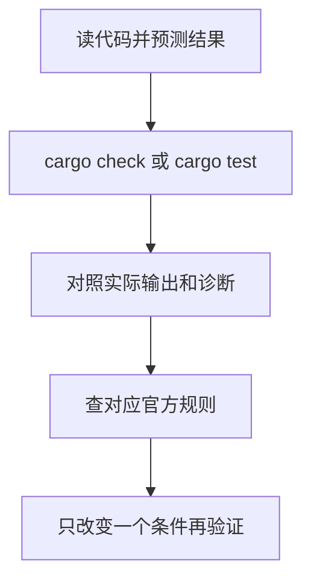

原来的提示词要求一次生成变量、函数、Ownership、泛型、trait、lifetime 等主题的全部 `.rs` 文件。用作主题清单可以，但学习时可以每次只取一个问题：先判断代码会怎样，再运行，最后对照解释。

## 一次讨论一个概念

下面是基于原有提示词整理的提问模板，属于学习建议，不是 Rust 官方规则：

```text
我正在按 Rust 官方 Book 学习，使用 Rust 1.92.0、edition 2024。
这次只学习 References 与 Borrowing，已经学过 Ownership 和 move。

请保留 Rust 官方术语、关键字、trait 名和错误信息，用中文解释它们的作用。
先用一个完整、可独立运行的 main.rs 说明 &T，再说明 &mut T。
给出与代码对应的引用关系图，注明图是逻辑关系，不是实际内存地址。
每个示例说明预期结果；无法编译的反例请单独标出，并说明违反了哪条规则。
引用对应官方章节或标准库页面。没有实际执行时，不要声称已经验证。
最后给一个只改一处代码的小练习，先不要给答案。
```

把版本、已学内容和本次主题换成自己的情况。变量、函数、控制流程、Ownership、struct、enum 可以按本教程顺序学习；集合、错误处理、泛型、trait、lifetime 再沿 Book 对应章节继续，不必一次要求全部展开。

## 出错时带上复现信息

```text
下面是完整代码、Cargo.toml 中的依赖、rustc --version 输出和编译器的原始报错。
请指出第一处错误对应的规则，并给出最小修改。
不要用大量 clone、unsafe 或删除业务逻辑来回避问题。
请区分：编译器已经指出的事实、对程序意图的推测、尚未执行的建议。
```

错误码可以配合 `rustc --explain E0382` 查询。调用第三方 crate 时，同时核对 `Cargo.lock` 中的版本与该版本 API 文档。

## 用工具检查回答



```powershell
cargo check
cargo run
cargo test
rustc --explain E0382
```

编译通过不代表解释准确。例如 `String::clone` 会复制文本，但据此推断所有 `Clone` 都是 deep copy 就不成立。遇到这类泛化结论，直接查具体类型或 trait 文档。

参考：[The Rust Programming Language](https://doc.rust-lang.org/1.92.0/book/)、[Rust Compiler Error Index](https://doc.rust-lang.org/1.92.0/error_codes/error-index.html)、[Clone](https://doc.rust-lang.org/1.92.0/std/clone/trait.Clone.html)。
