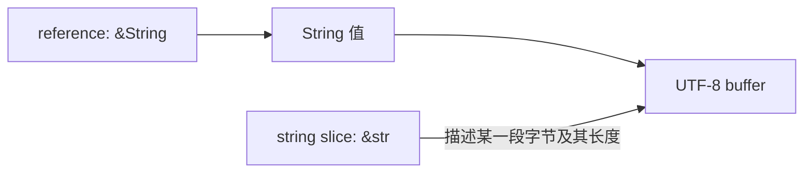
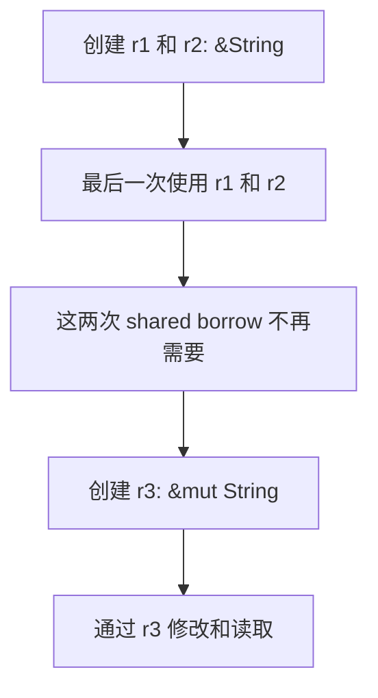

上一篇的函数接收 `String`，拿到了它的 Ownership。只读长度时，可以传 reference：函数访问数据，但不接管这个 `String`。

## 从 &String 到 &str

```rust
fn length_of_string(text: &String) -> usize {
    text.len()
}

fn length_of_text(text: &str) -> usize {
    text.len()
}

fn main() {
    let text = String::from("hello");
    assert_eq!(length_of_string(&text), 5);
    assert_eq!(length_of_text(&text), 5);
    assert_eq!(length_of_text("中文"), 6);
    println!("{text}");
}
```

`&text` 创建 shared reference，创建引用这个动作称为 Borrowing。函数返回后，调用者仍然拥有 `text`。

`&String` 借用整个 `String` 值；`&str` 是 string slice，描述一段 UTF-8 文本。`&String` 可以通过 deref coercion 转成 `&str`，因此只读文本内容的函数通常接收 `&str`，这样也能接收字符串字面量。



这是引用关系图。`&str` 不拥有 buffer，也不会因为借用结束就释放原 `String`。

## &mut T：借用期间修改值

```rust
fn append_world(text: &mut String) {
    text.push_str(", world");
}

fn main() {
    let mut text = String::from("hello");
    append_world(&mut text);
    assert_eq!(text, "hello, world");
}
```

对这个局部变量，`mut` 允许修改值，`&mut text` 创建 mutable reference，函数签名说明它允许修改传入的 `String`。`&mut T` 允许修改，不代表函数一定会修改。

普通 `&String` 不能调用需要可变借用的 `push_str`。更一般地，`&T` 称为 shared reference；`Cell`、`RefCell`、锁等 interior mutability 类型可以在共享引用下提供受规则约束的修改能力，所以不要把“任何 &T 都绝对不能修改内部数据”当成完整定义。

## Borrowing 的重叠范围

对于同一份数据，基础规则是：可同时有多个 shared reference，或有独占访问的 mutable reference；不能在它们的使用范围重叠时混用。

下面预期编译失败，错误 E0499：第二次 mutable borrow 发生后，程序还要使用第一次借用。

```rust compile_fail
fn main() {
    let mut text = String::from("hello");
    let r1 = &mut text;
    let r2 = &mut text;
    println!("{r1} {r2}");
}
```

把最后一次使用放到下一次借用之前，就可以继续：

```rust
fn main() {
    let mut text = String::from("hello");
    let r1 = &text;
    let r2 = &text;
    println!("{r1} {r2}");

    let r3 = &mut text;
    r3.push('!');
    println!("{r3}");
}
```



在这种直线代码里，借用可以在引用最后一次使用后结束，不必等到花括号结尾。变量的词法 scope 与借用所需的 lifetime 不应混为一谈；存在分支、循环或带析构逻辑的类型时，还要由 Borrow checker 分析实际使用关系。

这些规则适用于单线程代码，也参与保证并发访问安全。safe Rust 在依赖正确的 unsafe 实现这一前提下防止 data race；它不保证没有死锁或业务上的 race condition。

## 返回引用时，数据必须继续有效

下面预期编译失败，诊断会涉及返回引用的 lifetime 或局部变量：

```rust compile_fail
fn dangle() -> &String {
    let text = String::from("hello");
    &text
}

fn main() {}
```

`text` 在函数结束时被清理，调用者无法继续使用它的引用。补一个 lifetime 标注也不能延长局部值的存活时间。可以返回拥有数据的 `String`，也可以返回从参数借来的有效引用：

```rust
fn make_text() -> String {
    String::from("hello")
}

fn first_word(text: &str) -> &str {
    for (index, byte) in text.bytes().enumerate() {
        if byte == b' ' {
            return &text[..index];
        }
    }
    text
}

fn main() {
    let text = make_text();
    assert_eq!(first_word(&text), "hello");
    assert_eq!(first_word("hello world"), "hello");
}
```

`first_word` 返回输入文本的一部分。这里的 lifetime elision 规则将返回引用与唯一的输入引用关联。返回 `&String` 或 `&str` 本身没有问题，问题在于它指向的数据是否活得足够久。

这个函数只寻找 ASCII 空格。索引来自空格字节的位置，因此切分点是合法 UTF-8 边界；它不是完整的自然语言分词器。任意按字节截取 `&text[..index]` 则可能切到多字节字符中间并 panic。

## 解引用 *：看清层级，不自动 move 中间值

原有的 `Box` 练习可以直接运行：

```rust
fn main() {
    let x = Box::new(0);
    let y = Box::new(&x);
    let value = ***y;
    assert_eq!(value, 0);
    assert_eq!(*x, 0);
}
```

```text
y: Box<&Box<i32>>
  *y   → &Box<i32>
  **y  → Box<i32> 所在的位置
  ***y → i32 所在的位置
```

`*` 产生的可以是 place expression，也就是一个存储位置。连续解引用不会强制把每个中间值都 move 出来；最终读取的是实现了 `Copy` 的 `i32`，所以 `let value = ***y` 合法。单独写 `let moved = **y` 则试图从共享引用后面 move 出 `Box<i32>`，会被拒绝。

`Box` 是拥有 Heap 分配的 smart pointer，这里只用来观察层级。若只需引用整数，也可用 `x.as_ref()` 获得 `&i32`，无需让读者绕过多层 `Box`。

参考：[References and Borrowing](https://doc.rust-lang.org/1.92.0/book/ch04-02-references-and-borrowing.html)、[The Slice Type](https://doc.rust-lang.org/1.92.0/book/ch04-03-slices.html)、[Dereference operator](https://doc.rust-lang.org/1.92.0/reference/expressions/operator-expr.html#the-dereference-operator)。
