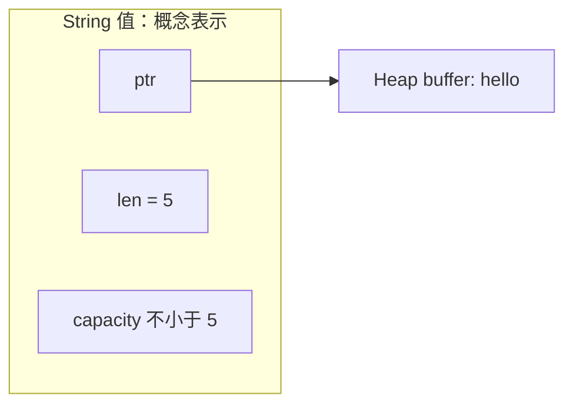
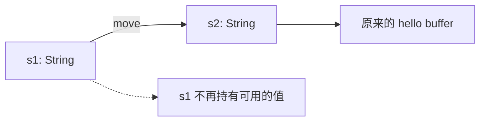

下面两组赋值看起来一样，但赋值之后，原变量能否继续用并不一样：

```rust
fn main() {
    let x = 5;
    let y = x;
    println!("{x} {y}");

    let s1 = String::from("hello");
    let s2 = s1;
    println!("{s2}");
}
```

`x` 和 `y` 都能使用，`s1` 的值却已经 move 到 `s2`。原因是 `i32` 实现了 `Copy`，`String` 没有。先把这个差别放在眼前，再看它与内存管理的关系。

## owner 与 scope

Book 用三条规则介绍 Ownership：每个值都有 owner；同一时刻只有一个 owner；owner 离开 scope 时，值被 dropped。这里先讨论普通局部变量；共享所有权由 `Rc`、`Arc` 等类型提供，不在本篇展开。

```rust
fn main() {
    {
        let mut text = String::from("hello");
        text.push_str(", world!");
        println!("{text}");
    }
    // text 的 scope 已结束，不能再通过这个名字使用它。
}
```

在这个正常退出 scope 的例子中，`String` 的清理逻辑释放其拥有的缓冲区。Borrow checker 在编译期检查使用规则；内存分配和清理仍是运行时工作，不能把它概括成“内存管理完全没有运行时成本”。

## Stack 与 Heap：用 String 看关系

Stack 按后进先出的方式管理存储；Heap 的存储由 allocator 分配。`String` 的值包含指针、长度和容量，其文本缓冲区存放在 Heap 中。



图中只画逻辑关系，没有规定字段在内存中的排列。局部 `String` 值可以用 Stack 上的描述信息加 Heap buffer 来理解，但编译器可能优化它的存储；也可以把整个 `String` 放进其他 Heap 分配中。类型大小固定，不等于它必定存放在 Stack。

字符串字面量 `"hello"` 的类型是 `&str`，内容位于程序的静态存储中。`String::from("hello")` 则创建拥有缓冲区的字符串；要通过局部变量修改它，还需 `let mut`。

## move：转移使用和清理的责任

对 `String` 执行 `let s2 = s1;` 不会克隆文本缓冲区。它把值的 Ownership 转给 `s2`，`s1` 不能再被当作仍持有那个值来使用。



下面预期编译失败，错误为 E0382，诊断中会指出 `borrow of moved value`：

```rust compile_fail
fn main() {
    let s1 = String::from("hello");
    let s2 = s1;
    println!("{s1} {s2}");
}
```

如果两个普通 `String` 都负责释放同一个缓冲区，就可能重复释放。move 使旧绑定失效，避免出现这种重复清理。这里描述的是语言语义，不要求编译器实际生成一次内存搬运指令。

## Clone：明确请求另一个值

如果两个变量都需要各自拥有文本，可以调用 `String::clone`：

```rust
fn main() {
    let s1 = String::from("hello");
    let mut s2 = s1.clone();
    s2.push('!');
    assert_eq!(s1, "hello");
    assert_eq!(s2, "hello!");
}
```

这个例子里两个 `String` 有独立的内容，修改 `s2` 不影响 `s1`。但 **Clone 不等于所有类型都做 deep copy**：行为由类型的 `Clone` 实现决定。比如 `Rc`、`Arc` 的 clone 会共享底层数据。看到 `.clone()` 后，应查当前类型的语义和成本。

## Copy：赋值后原值仍可使用

`Copy` 允许隐式的按位复制，行为不能像 `Clone` 那样自定义。常见实现包括整数、浮点、`bool`、`char`，以及元素均为 `Copy` 的 tuple 和 array。

```rust
fn main() {
    let point = (3, 4);
    let other = point;
    assert_eq!(point, other);

    let values = [1, 2, 3];
    let copied = values;
    assert_eq!(values, copied);
}
```

不能根据“在 Stack 上”来判断是否 `Copy`。`String` 自身大小固定，却不实现 `Copy`；自定义 `struct` 也不会仅因字段都可复制就自动获得 `Copy`。实现 `Drop` 的类型不能同时实现 `Copy`。

| 写法 | 对这个值发生什么 | 原值还能用吗 |
| --- | --- | --- |
| `let y = x`，`x: i32` | Copy | 能 |
| `let s2 = s1`，`s1: String` | move | 不能继续用被移走的值 |
| `let s2 = s1.clone()` | 调用 String 的 Clone 实现 | 能 |
| `let r = &s1` | Borrowing | Ownership 保留，后续使用受借用规则约束 |

## 函数参数和返回值也遵循这些规则

```rust
fn calculate_length(text: String) -> (String, usize) {
    let length = text.len();
    (text, length)
}

fn make_text() -> String {
    String::from("hello")
}

fn main() {
    let s1 = make_text();
    let (s2, bytes) = calculate_length(s1);
    assert_eq!(bytes, 5);
    println!("{s2}: {bytes} bytes");
}
```

`s1` move 到参数 `text`，`text` 再随返回的 tuple 交给调用者。如果函数消费了 `String` 而没有返回它，正常离开函数时就会清理这个值。`len()` 返回字节数，不是显示字符数。

为了只算长度，却要把字符串传进去再返回，接口就多了一层交接。下一篇的 [References 与 Borrowing](/tutorials/tjuxkauef/) 会把参数改成引用，让调用者保留 Ownership。

参考：[What Is Ownership?](https://doc.rust-lang.org/1.92.0/book/ch04-01-what-is-ownership.html)、[Copy](https://doc.rust-lang.org/1.92.0/std/marker/trait.Copy.html)、[Clone](https://doc.rust-lang.org/1.92.0/std/clone/trait.Clone.html)、[String representation](https://doc.rust-lang.org/1.92.0/std/string/struct.String.html#representation)。
