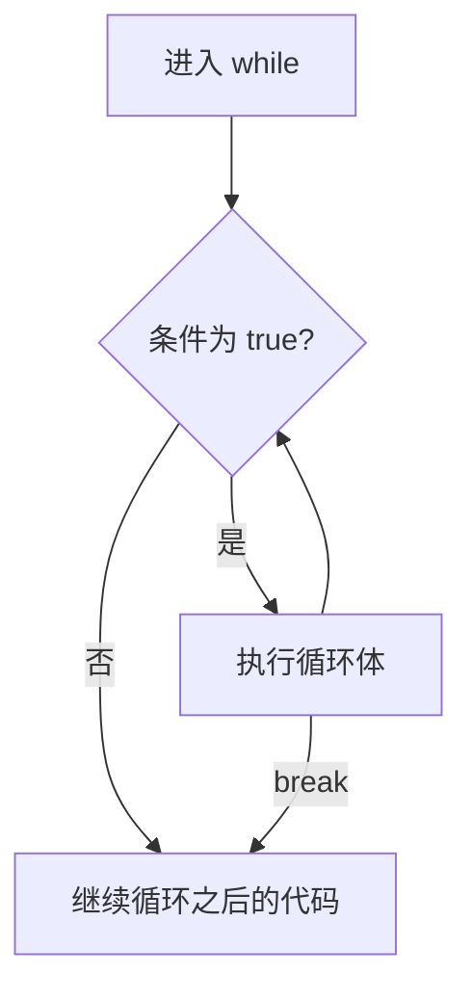

有了变量和类型，就可以根据条件执行代码。本篇先补上函数与表达式：`if` 和 `loop` 都能产生值，理解这一点后，带返回值的分支就容易读了。

## 函数与表达式

```rust
fn plus_one(x: i32) -> i32 {
    x + 1
}

fn main() {
    let result = plus_one(5);
    assert_eq!(result, 6);
    println!("result={result}");
}
```

`fn` 定义函数，`x: i32` 标注参数类型，`-> i32` 标注返回类型。函数调用时把 `5` 传给 `x`。

函数体最后的 `x + 1` 没有分号，它的值就是返回值。加上分号后，它成为 expression statement，这个函数体会隐式得到 `()`，与声明的 `i32` 不一致。需要提前结束函数时，可以写 `return 值;`。

## if：条件是 bool

```rust
fn main() {
    let number = 3;
    if number < 5 {
        println!("less than five");
    } else {
        println!("five or greater");
    }

    let label = if number % 2 == 0 { "even" } else { "odd" };
    assert_eq!(label, "odd");
}
```

条件为 `true` 时执行第一个分支，否则执行 `else`。`if` 还可以产生一个值：这里的两个分支都产生 `&str`，结果绑定给 `label`。

下面预期编译失败，错误类型为 E0308：整数不能直接当作条件。

```rust compile_fail
fn main() {
    let number = 3;
    if number {
        println!("nonzero");
    }
}
```

要判断非零，写 `number != 0`。同样，`if condition { 5 } else { "six" }` 无法为结果确定兼容类型。基础示例中让各分支返回同类值即可；`return`、`panic!` 等不继续执行的分支涉及 never type，不需要为它们补一个普通返回值。

### else if 按顺序检查

```rust
fn main() {
    let number = 6;
    let divisor = if number % 4 == 0 {
        4
    } else if number % 3 == 0 {
        3
    } else if number % 2 == 0 {
        2
    } else {
        1
    };
    assert_eq!(divisor, 3);
}
```

6 同时能被 3 和 2 整除，但只有第一个成立的分支会执行。后面的条件不会继续检查。

## 三种循环怎样选择

| 构造 | 什么时候继续 | 常见用途 |
| --- | --- | --- |
| `loop` | 循环体没有让控制流退出 | 重复读输入，直到满足退出条件 |
| `while` | 每轮开始时条件为 `true` | 根据状态重复操作 |
| `for` | iterator 还能给出下一个元素 | 遍历 array、range 等 |



图中 `break` 会直接退出循环，不再检查下一轮条件。

### loop、break 与 continue

```rust
fn main() {
    let mut n = 0;
    let result = loop {
        n += 1;
        if n % 2 == 0 {
            continue;
        }
        println!("odd n={n}");
        if n == 5 {
            break n;
        }
    };
    assert_eq!(result, 5);
}
```

程序依次打印 1、3、5。`continue` 跳过本轮剩余代码，`break n` 退出 `loop` 并把 `n` 作为结果。增量写在 `continue` 前，否则某些写法会反复跳过更新，无法前进。

没有退出路径的 `loop` 会一直执行，或通过 `return`、panic 等离开。`break 值` 可用于 `loop`，不能用来让普通 `while`、`for` 返回一个非 unit 值。

### 用 label 指定退出哪层

```rust
fn main() {
    let mut found = (0, 0);
    'rows: for row in 1..=3 {
        for column in 1..=3 {
            if row * column == 6 {
                found = (row, column);
                break 'rows;
            }
        }
    }
    assert_eq!(found, (2, 3));
}
```

普通 `break` 退出最内层循环；`break 'rows` 退出指定的外层循环。`continue 'rows` 会开始指定循环的下一轮。`return` 则退出当前函数，作用范围不同。

### while：每轮先判断

```rust
fn main() {
    let mut number = 3;
    while number != 0 {
        println!("{number}!");
        number -= 1;
    }
    println!("LIFTOFF!");
}
```

如果第一次判断就是 `false`，循环体一次也不会执行。

### for：逐个取元素

```rust
fn main() {
    let values = [10, 20, 30, 40, 50];
    for value in values {
        println!("value={value}");
    }
    for number in (1..4).rev() {
        println!("{number}!");
    }
}
```

`1..4` 不包含右端的 4；`1..=4` 包含 4。`.rev()` 让这里的 range 按相反顺序迭代。

直接遍历省去了手写下标和同步长度的步骤。不能仅凭写法断言它一定比 `while` 更快，实际机器代码还取决于优化。这个示例的元素是 `i32`，支持 `Copy`；遍历 `String` 集合时还要考虑是否取得元素的 Ownership，下一篇会解释。

## 动手修改

把最后一个程序的数组改为 `[3, 1, 4, 1, 5]`，输出每个值的平方。然后给外层循环示例去掉 `'rows` label，只保留 `break`，观察它为什么会继续寻找后面的匹配。

参考：[Functions](https://doc.rust-lang.org/1.92.0/book/ch03-03-how-functions-work.html)、[Control Flow](https://doc.rust-lang.org/1.92.0/book/ch03-05-control-flow.html)。
