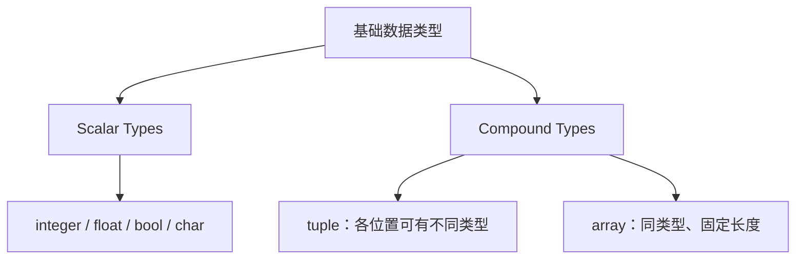

上一篇用变量打印了温度。这一篇先看变量能否修改，再看类型怎样决定它能保存哪些值。

## let、mut 与 shadowing

普通 `let` 绑定默认不可变。需要重新赋值时写 `mut`；重新写一个 `let` 则会创建新的绑定，这叫 shadowing。

```rust
fn main() {
    let mut count = 1;
    count += 1;

    let spaces = "   ";
    let spaces = spaces.len();

    const SECONDS_PER_MINUTE: u32 = 60;
    println!("count={count}, spaces={spaces}, minute={SECONDS_PER_MINUTE}");
}
```

`count` 从 1 改为 2，类型没变。第二个 `spaces` 遮蔽了第一个：前者是字符串引用，后者是 `usize`。`mut` 允许修改原绑定的值，但不能把一个整数变量改成字符串变量。`const` 必须标注类型，值必须能在常量求值中得到。

Rust 是静态类型语言，编译时要确定类型，但不必处处手写类型标注。编译器会结合初始值和后续使用推断；整数在没有其他类型约束时默认推断为 `i32`，浮点数默认是 `f64`。

## 基础类型的范围

Book 在基础章节把下面这些类型分成 Scalar Types 与 Compound Types。这是入门分类，不是 Rust 所有类型的完整列表。



### integer：位宽与正负范围

| 位宽 | 有符号 | 无符号 |
| --- | --- | --- |
| 8 | `i8` | `u8` |
| 16 | `i16` | `u16` |
| 32 | `i32` | `u32` |
| 64 | `i64` | `u64` |
| 128 | `i128` | `u128` |
| 目标架构的指针位宽 | `isize` | `usize` |

n 位有符号整数的范围是 −2ⁿ⁻¹ 到 2ⁿ⁻¹−1，无符号整数是 0 到 2ⁿ−1。例如 `i8` 是 −128 到 127，`u8` 是 0 到 255。代码中可以直接使用 `i32::MIN`、`i32::MAX` 等常量。

array、slice 的整数索引和 `len()` 使用 `usize`。它的位宽取决于编译目标，不是仅看运行编译器的电脑是不是 64 位。数据文件或网络协议要求固定宽度时，应按格式选择 `u32`、`u64` 等类型。

```rust
fn main() {
    let decimal = 98_222;
    let hex = 0xff;
    let octal = 0o77;
    let binary = 0b1111_0000;
    let byte = b'A';
    let small = 57u8;
    let large: i64 = 10;
    println!("{decimal} {hex} {octal} {binary} {byte} {small} {large}");
}
```

`_` 只用于分隔数字，不改变值。`b'A'` 是一个 `u8` 字节字面量；`57u8` 通过后缀指定类型。

### overflow：超出类型范围怎么办

对普通整数加、减、乘，Cargo 的 dev profile 默认启用 overflow checks，release profile 默认关闭；配置可以改变这个行为。开启检查时，运行中的溢出会 panic；关闭时按类型位宽 wrapping。常量求值中的溢出可能直接成为编译错误，不能靠切到 release 绕过。

需要明确处理溢出时，直接选相应方法。下面以 `250u8 + 10` 为例：

```rust
fn main() {
    let x = 250u8;
    assert_eq!(x.wrapping_add(10), 4);
    assert_eq!(x.checked_add(10), None);
    assert_eq!(x.overflowing_add(10), (4, true));
    assert_eq!(x.saturating_add(10), 255);
}
```

| 方法 | 溢出时的处理 |
| --- | --- |
| `wrapping_add` | 返回按位宽回绕后的值 |
| `checked_add` | 返回 `None`；未溢出时返回 `Some(结果)` |
| `overflowing_add` | 返回结果和溢出标志 |
| `saturating_add` | 限制到该整数类型的边界 |

`saturating_add` 限制的是类型范围，例如 `u8` 的上界 255，不会自动限制到业务中的“百分比 100”。除零等错误也不能用“release 会回绕”概括。

### float 与 bool

`f32`、`f64` 分别使用 IEEE 754 的 32 位、64 位二进制浮点表示。很多十进制小数无法精确表示；格式化显示到两位小数也不会改变保存的数值。

```rust
fn main() {
    let sum = 0.1_f64 + 0.2;
    println!("{sum:.17}");
    assert_ne!(sum, 0.3);

    let ready: bool = true;
    if ready && sum > 0.0 {
        println!("ready");
    }
}
```

这里的比较用于观察表示误差。实际计算应根据单位和允许误差选比较方式，不能把某个固定容差用于所有场景。`bool` 只有 `true`、`false`，条件表达式不会把整数自动转换成真假。

### char 与字符串

`char` 用单引号，表示一个 Unicode scalar value，在 Rust 中占 4 字节。双引号产生字符串字面量，类型是 `&str`。

```rust
fn main() {
    let letter: char = '中';
    let text = "中文";
    assert_eq!(std::mem::size_of_val(&letter), 4);
    assert_eq!(text.len(), 6);
    assert_eq!(text.chars().count(), 2);
}
```

`str::len()` 数的是 UTF-8 字节，`chars().count()` 数的是 Unicode scalar value。组合字符和部分 emoji 由多个 scalar value 组成，因此后者也不一定等于屏幕上看到的字形数量。

## tuple：按位置组合不同类型

```rust
fn main() {
    let sample: (i32, f64, u8) = (500, 6.4, 1);
    let (x, y, z) = sample;
    println!("{x} {y} {z}");
    assert_eq!(sample.0, 500);

    let single = (5,);
    let unit = ();
    println!("{single:?} {unit:?}");
}
```

tuple 的长度固定，各位置可以有不同类型。`(5,)` 是单元素 tuple，`(5)` 只是带括号的整数表达式。空 tuple 的类型和值都写成 `()`，称为 unit；没有返回其他值的函数通常返回它。

## array：同类型、固定长度

`[T; N]` 的元素类型是 `T`，长度是 `N`，长度也是类型的一部分。`[i32; 3]` 与 `[i32; 5]` 是不同类型。

```rust
fn main() {
    let values: [i32; 3] = [10, 20, 30];
    let repeated = [3; 5];
    assert_eq!(values[0], 10);
    assert_eq!(repeated, [3, 3, 3, 3, 3]);

    match values.get(10) {
        Some(value) => println!("value={value}"),
        None => println!("index out of bounds"),
    }
}
```

普通索引访问越界会 panic；编译器有时能提前发现明显的越界。`get` 返回 `Option<&T>`，越界时为 `None`，调用者可以处理这个分支。优化器可以消除已经证明不必要的边界检查，不必把每一次索引理解为必定产生一条运行时检查指令。

array 的元素数量在类型中固定；需要在运行时增加或删除元素时，可用标准库 `Vec<T>`。这里先认识区别，Ownership 一篇会解释拥有数据与复制数据的关系。

参考：[Variables and Mutability](https://doc.rust-lang.org/1.92.0/book/ch03-01-variables-and-mutability.html)、[Data Types](https://doc.rust-lang.org/1.92.0/book/ch03-02-data-types.html)、[Cargo profiles](https://doc.rust-lang.org/1.92.0/cargo/reference/profiles.html)、[Integer overflow](https://doc.rust-lang.org/1.92.0/reference/expressions/operator-expr.html#overflow)。
