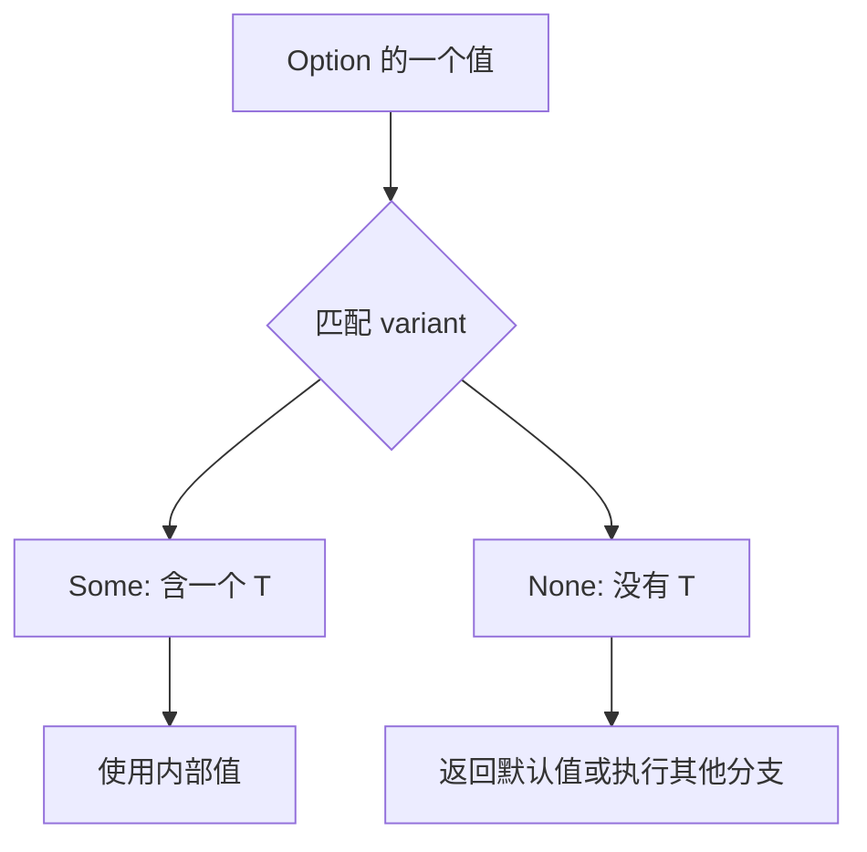

`struct` 把相关字段放在同一个值里；`enum` 列出一个值可能采用的不同形式，每一种形式称为 variant。IP 地址可以是 IPv4 或 IPv6，就适合从这里理解 enum。

## variant 可以携带不同的数据

```rust
#[derive(Debug)]
enum IpAddr {
    V4(u8, u8, u8, u8),
    V6(String),
}

fn show(ip: IpAddr) {
    match ip {
        IpAddr::V4(a, b, c, d) => println!("{a}.{b}.{c}.{d}"),
        IpAddr::V6(text) => println!("{text}"),
    }
}

fn main() {
    show(IpAddr::V4(127, 0, 0, 1));
    show(IpAddr::V6(String::from("::1")));
}
```

两种值都属于 `IpAddr` 类型，因此能传给同一个 `show` 函数。这个教学类型用 `String` 保存 IPv6 文本，并不验证它是否为合法地址；实际处理地址可以使用标准库 `std::net::IpAddr`，其两个 variant 分别包含 `Ipv4Addr` 和 `Ipv6Addr`。

这里的 tuple-like variant 可以像函数一样构造，例如 `IpAddr::V6(String::from("::1"))`。不要把“每个 variant 都是构造函数”推广到所有形式：unit-like variant 直接写名字，struct-like variant 使用花括号。

## 用 Message 对照三种形式

```rust
enum Message {
    Quit,
    Move { x: i32, y: i32 },
    Write(String),
    ChangeColor(i32, i32, i32),
}

impl Message {
    fn call(&self) {
        match self {
            Self::Quit => println!("quit"),
            Self::Move { x, y } => println!("move to {x}, {y}"),
            Self::Write(text) => println!("{text}"),
            Self::ChangeColor(r, g, b) => println!("color {r}, {g}, {b}"),
        }
    }
}

fn main() {
    let messages = [
        Message::Quit,
        Message::Move { x: 3, y: 4 },
        Message::Write(String::from("hello")),
        Message::ChangeColor(255, 0, 0),
    ];
    for message in &messages {
        message.call();
    }
}
```

`Quit` 不带数据，`Move` 带命名字段，`Write` 和 `ChangeColor` 带位置字段。`call(&self)` 借用消息，`match self` 中的模式按照引用匹配，不会把 `Write` 里的 `String` move 出来。

## Option<T>：明确表示可能没有值

标准库 `Option<T>` 有 `Some(T)` 和 `None` 两个 variant，并与它们一起进入 prelude，可以直接使用。



`Option<i32>` 与 `i32` 是不同类型。前者可能为空，不能直接与整数相加：

```rust compile_fail
fn main() {
    let value: Option<i32> = Some(5);
    let sum = 5 + value;
    println!("{sum}");
}
```

这段预期编译失败，错误 E0277。可以先匹配 `Some` 和 `None`。`Option` 帮助表达缺失，但使用 `unwrap()` 处理 `None` 仍会 panic；Rust 也存在可以为空的 raw pointer，不能把它概括成“语言中没有任何空指针”。

## match：覆盖所有可能情况

下面沿用 Book 的“可选整数加一”例子，测试的值没有发生溢出：

```rust
fn plus_one(value: Option<i32>) -> Option<i32> {
    match value {
        Some(number) => Some(number + 1),
        None => None,
    }
}

fn main() {
    assert_eq!(plus_one(Some(5)), Some(6));
    assert_eq!(plus_one(None), None);
}
```

`Some(number)` 把内部值绑定给 `number`。`match` 按顺序选择第一个匹配的 arm，并产生该 arm 的结果；各 arm 的结果要能统一为兼容类型。这个加一函数仍受 `i32` 范围限制；需要处理最大值时，可在 `Some` 分支返回 `number.checked_add(1)`。

漏掉 `None` 的反例预期编译失败，错误 E0004：

```rust compile_fail
fn main() {
    let value = Some(5);
    match value {
        Some(number) => println!("{number}"),
    }
}
```

### other 与 _

```rust
fn main() {
    let dice_roll = 9;
    match dice_roll {
        3 => println!("add hat"),
        7 => println!("remove hat"),
        other => println!("move {other} steps"),
    }
    match dice_roll {
        3 | 7 => println!("hat event"),
        _ => (),
    }
}
```

`other` 是变量名，匹配并绑定剩余值；`_` 只匹配，不绑定。通配 arm 一般放最后，否则可能先匹配掉后面希望处理的情况。

## if let：只处理关心的模式

```rust
fn main() {
    let config_max = Some(3u8);
    if let Some(max) = config_max {
        println!("maximum={max}");
    }
}
```

匹配 `Some(max)` 时执行代码，否则跳过。`if let` 不要求列出每个 variant，适合只关心一个模式的场景；如果每种情况都需要处理，用 `match` 更容易核对覆盖范围。

## let...else：不匹配就提前退出

```rust
fn describe_limit(limit: Option<u8>) -> String {
    let Some(max) = limit else {
        return String::from("no limit");
    };
    format!("limit={max}")
}

fn main() {
    assert_eq!(describe_limit(Some(3)), "limit=3");
    assert_eq!(describe_limit(None), "no limit");
}
```

匹配成功后，`max` 可以在后续 scope 使用。`else` 必须 diverge，不能正常继续到后面使用 `max` 的代码；`return`、退出相应循环的 `break` / `continue`、`panic!` 都可以用于合适的上下文。整个 `let...else` 语句末尾需要分号。

参考：[Defining an Enum](https://doc.rust-lang.org/1.92.0/book/ch06-01-defining-an-enum.html)、[The match Control Flow Construct](https://doc.rust-lang.org/1.92.0/book/ch06-02-match.html)、[if let and let...else](https://doc.rust-lang.org/1.92.0/book/ch06-03-if-let.html)。
