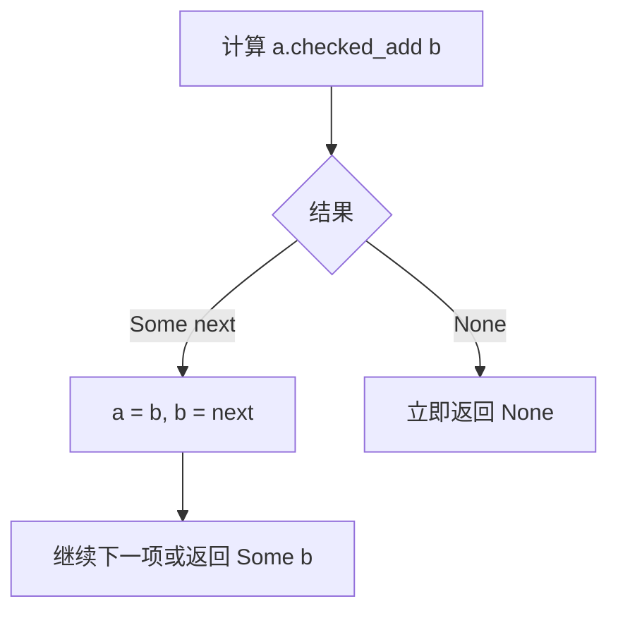

本篇沿用目录中原有的 Fibonacci 练习：`F(0)=0`、`F(1)=1`，后面的项等于前两项之和。先把函数放进 library，再检查正常结果和超出 `u64` 范围的情况。

## 创建 library 项目

```powershell
cargo new fibonacci_demo --lib --edition 2024
cd fibonacci_demo
```

把 `src/lib.rs` 替换为下方完整代码。函数使用 `Option<u64>`：能表示的结果返回 `Some`，加法溢出返回 `None`。

```rust
pub fn fib(n: u64) -> Option<u64> {
    match n {
        0 => Some(0),
        1 => Some(1),
        _ => {
            let (mut a, mut b) = (0u64, 1u64);
            for _ in 2..=n {
                let next = a.checked_add(b)?;
                a = b;
                b = next;
            }
            Some(b)
        }
    }
}

#[cfg(test)]
mod tests {
    use super::fib;

    #[test]
    fn initial_values() {
        assert_eq!(fib(0), Some(0));
        assert_eq!(fib(1), Some(1));
        assert_eq!(fib(2), Some(1));
    }

    #[test]
    fn known_value() {
        assert_eq!(fib(10), Some(55));
    }

    #[test]
    fn u64_boundary() {
        assert_eq!(fib(93), Some(12_200_160_415_121_876_738));
        assert_eq!(fib(94), None);
    }
}
```

## 两个变量怎样推进

每轮计算开始时，`a` 和 `b` 保存相邻两项。先算和，再把两个变量向前移动一项。

| 准备计算 | a | b | next |
| --- | --- | --- | --- |
| `F(2)` | 0 | 1 | 1 |
| `F(3)` | 1 | 1 | 2 |
| `F(4)` | 1 | 2 | 3 |
| `F(5)` | 2 | 3 | 5 |

`checked_add` 在溢出时返回 `None`。跟在后面的 `?` 用于返回 `Option` 的函数时，会取出 `Some` 内的值，遇到 `None` 则立即从当前函数返回 `None`。



`F(93)` 能放进 `u64`，`F(94)` 不能。使用 `checked_add` 后，这个函数的溢出结果不依赖 dev / release 的默认 overflow checks 设置，也不会继续遍历后面所有项。

## 运行 unit tests

```powershell
cargo test
cargo test --release
cargo test u64_boundary
```

`#[test]` 标记测试函数，`assert_eq!` 在不相等时 panic，测试工具据此报告失败。`#[cfg(test)]` 让这个 module 仅在测试配置下编译；`use super::fib` 从父 module 引入待测函数。

这里定义了三个 unit tests。可以临时把 `fib(10)` 的期望值改成 `Some(54)`，重新运行，观察失败位置和左右值，再恢复为 `Some(55)`。测试通过只说明这些断言成立，不代表任意输入都已经穷尽验证。

## 从使用者角度写 integration test

创建 `tests/fibonacci.rs`：

```rust
use fibonacci_demo::fib;

#[test]
fn public_api_returns_a_value_or_none() {
    assert_eq!(fib(10), Some(55));
    assert_eq!(fib(94), None);
}
```

```text
fibonacci_demo/
├── Cargo.toml
├── src/
│   └── lib.rs
└── tests/
    └── fibonacci.rs
```

运行 `cargo test` 时，除三个 unit tests 外，还应执行这个 integration test。它作为独立 crate 使用 library 的公开 API，所以 `fib` 声明为 `pub`；同文件内部的 unit tests 则可以检查父 module 的私有实现。

参考：[Writing Tests](https://doc.rust-lang.org/1.92.0/book/ch11-01-writing-tests.html)、[Test Organization](https://doc.rust-lang.org/1.92.0/book/ch11-03-test-organization.html)、[u64::checked_add](https://doc.rust-lang.org/1.92.0/std/primitive.u64.html#method.checked_add)。Fibonacci 是本目录的练习案例，不是声称摘录自 Book 的原题。
