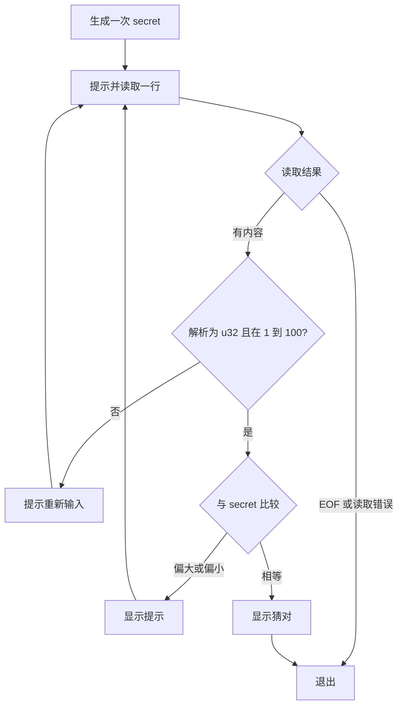

现在把前面的变量、Borrowing、enum 和循环放进一个程序：先生成一个 1 到 100 的整数，再反复读取猜测，提示偏大或偏小，猜对后退出。

## 创建项目并固定依赖

```powershell
cargo new guess_number --edition 2024
cd guess_number
cargo add rand@=0.9.2
```

`rand` 是第三方 crate，不属于 Rust 标准库。本篇使用 `rand 0.9.2` 的 `random_range`，`Cargo.toml` 的依赖应为：

```toml
[dependencies]
rand = "=0.9.2"
```

`=0.9.2` 固定直接依赖版本；Cargo 会把解析后的依赖记录在 `Cargo.lock`。这里使用默认 features，它们提供 `random_range` 所需的 thread-local RNG。不要把旧教程中的 `thread_rng().gen_range(...)` 与本篇依赖配置混着使用；遇到版本问题先看依赖文档，而不是换成一个据称“更通用”的名字。

## 第一步：读取一行并显示

把 `src/main.rs` 替换为：

```rust
use std::io;

fn main() {
    println!("请输入一个数字：");
    let mut input = String::new();
    let bytes = io::stdin()
        .read_line(&mut input)
        .expect("Failed to read line");
    println!("读取 {bytes} 字节，内容：{input:?}");
}
```

执行 `cargo run`，输入 `42` 并回车。`Debug` 格式会把行末的 `\n`、可能存在的 `\r` 显示出来，所以读到的字节数不一定是 2。

`read_line` 向传入的 `String` **追加**内容，包含读到的换行符。它返回 `Result<usize>`：`Ok(n)` 表示本次读取 n 个字节，`Err(error)` 表示读取失败；`Ok(0)` 表示已经到达 EOF，且本次没有读到字节。

`expect` 在 `Ok` 时取出内部值，在 `Err` 时 panic 并带上提示。这个最小例子用它缩短代码；最终程序会单独处理 EOF 和读取错误。

## 第二步：把文本解析成数字

```rust
fn main() {
    for input in ["42\n", "abc", "101"] {
        match input.trim().parse::<u32>() {
            Ok(number) => println!("parsed={number}"),
            Err(error) => println!("parse failed: {error}"),
        }
    }
}
```

`trim()` 去掉首尾空白，返回借用的 `&str`；`parse::<u32>()` 明确目标类型。`42` 与 `101` 都能解析为 `u32`，`abc` 不能。解析成功只说明符合类型的表示与范围，游戏要求的 1 到 100 还要另外检查。

## 第三步：比较大小

`cmp` 返回 `Ordering`，有 `Less`、`Greater`、`Equal` 三个 variant。下面先用固定值观察分支；最终代码再使用随机数：

```rust
use std::cmp::Ordering;

fn main() {
    let guess = 30u32;
    let secret = 42u32;
    match guess.cmp(&secret) {
        Ordering::Less => println!("太小了"),
        Ordering::Greater => println!("太大了"),
        Ordering::Equal => println!("猜对了"),
    }
}
```

`cmp(&secret)` 接收另一个值的引用，这个 `&` 与 Borrowing 一篇是同一个语法。

## 把步骤放入 loop



最终完整的 `src/main.rs`：

```rust
use std::cmp::Ordering;
use std::io;

fn main() {
    let secret: u32 = rand::random_range(1..=100);

    loop {
        println!("请输入 1 到 100 的整数：");
        let mut input = String::new();
        match io::stdin().read_line(&mut input) {
            Ok(0) => {
                println!("输入结束");
                break;
            }
            Ok(_) => {}
            Err(error) => {
                eprintln!("读取失败：{error}");
                break;
            }
        }

        let guess: u32 = match input.trim().parse() {
            Ok(number) if (1..=100).contains(&number) => number,
            _ => {
                println!("需要输入 1 到 100 的整数");
                continue;
            }
        };

        match guess.cmp(&secret) {
            Ordering::Less => println!("太小了"),
            Ordering::Greater => println!("太大了"),
            Ordering::Equal => {
                println!("猜对了");
                break;
            }
        }
    }
}
```

`secret` 在循环外生成，每轮比较的是同一个数。`String::new()` 在循环内，避免把本轮输入追加到上一轮后面。`Ok(number) if ...` 中的 `if` 是 match guard，除了匹配 variant，还检查值是否在游戏范围内。

## 运行并检查分支

```powershell
cargo run --locked
```

先输入 `abc`、`0`、`101`，应得到重新输入提示；再输入范围内的数字，根据提示缩小范围。随机值每次运行可能不同，不应把某一轮终端记录当作固定输出。

也可以用 PowerShell 检查 EOF：

```powershell
'abc' | cargo run --locked
```

程序处理无效输入后，管道输入结束，应打印“输入结束”并退出。若忽略 `Ok(0)`，EOF 后不断解析空串并 `continue`，就可能一直重复提示。

参考：[Programming a Guessing Game](https://doc.rust-lang.org/1.92.0/book/ch02-00-guessing-game-tutorial.html)、[Stdin::read_line](https://doc.rust-lang.org/1.92.0/std/io/struct.Stdin.html#method.read_line)、[rand 0.9.2 random_range](https://docs.rs/rand/0.9.2/rand/fn.random_range.html)。本篇沿用 Book 的任务结构，采用这里明确固定的 rand API，并加入输入范围与 EOF 分支。
