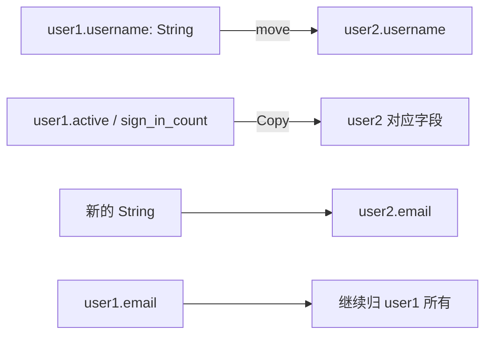

`(String, String, bool)` 能装下用户名、邮箱和状态，但读到 `.0`、`.1` 时，需要记住位置含义。带命名字段的 `struct` 可以直接写 `user.email`。

## 定义类型，创建实例

```rust
#[derive(Debug)]
struct User {
    active: bool,
    username: String,
    email: String,
    sign_in_count: u64,
}

fn build_user(email: String, username: String) -> User {
    User {
        active: true,
        username,
        email,
        sign_in_count: 1,
    }
}

fn main() {
    let mut user = build_user(
        String::from("someone@example.com"),
        String::from("someusername123"),
    );
    user.email = String::from("another@example.com");
    println!("{user:?}");
    assert!(user.active);
    assert_eq!(user.sign_in_count, 1);
    assert_eq!(user.username, "someusername123");
}
```

`User` 是类型，`user` 是它的一个实例。创建实例时，字段名决定值放在哪里，不必按定义顺序填写。`username` 是 field init shorthand，等价于 `username: username`。

`build_user` 接收两个 `String`，它们 move 到参数，再 move 到返回的 `User` 字段。它是普通函数，不是 Rust 自动提供的构造器。

这里修改局部变量的普通字段，使用 `let mut user`。不能在 `struct` 定义中写 `mut email: String` 来单独标记某个字段；通过 `&mut User` 访问时也可修改其字段。interior mutability 类型有另外的规则，不在这个例子中使用。

## 字段访问也要考虑 Ownership

`println!("{}", user.email)` 借用字段用于格式化；`let mail = user.email` 则会 move 出 `String` 字段。点号相同，不代表使用上下文相同。

## struct update syntax 与 partial move

`..user1` 从原实例获取没有显式提供的字段，不是默认把所有字段 clone 一遍。

```rust
#[derive(Debug)]
struct User {
    active: bool,
    username: String,
    email: String,
    sign_in_count: u64,
}

fn main() {
    let user1 = User {
        active: true,
        username: String::from("someusername123"),
        email: String::from("someone@example.com"),
        sign_in_count: 1,
    };
    let user2 = User {
        email: String::from("another@example.com"),
        ..user1
    };

    assert_eq!(user2.username, "someusername123");
    assert_eq!(user1.email, "someone@example.com");
    assert_eq!(user1.active, user2.active);
    assert_eq!(user1.sign_in_count, user2.sign_in_count);
    println!("{user2:?}");
}
```



`user1.username` 已被 move，`user1.email` 没被取走，两个 `Copy` 字段也仍然可用。这个状态叫 partial move：不能再把 `user1` 作为完整值使用，例如加入 `println!("{user1:?}")` 会编译失败。

`..user1` 必须放在字段列表最后。如果为新实例显式提供所有非 `Copy` 字段，剩余取用的又都是 `Copy` 字段，那么原实例仍可完整使用。上述 partial move 示例中的 `User` 没有实现 `Drop`；不能把从字段移出的规则直接套到实现了 `Drop` 的类型。

## impl：把操作写在类型旁边

前面的函数独立定义。使用 `impl` 可以定义 associated function；其中第一个参数是 `self`、`&self` 或 `&mut self` 等 receiver 的函数称为 method。

```rust
struct Rectangle {
    width: u32,
    height: u32,
}

impl Rectangle {
    fn square(size: u32) -> Self {
        Self { width: size, height: size }
    }

    fn area(&self) -> u64 {
        u64::from(self.width) * u64::from(self.height)
    }

    fn set_width(&mut self, width: u32) {
        self.width = width;
    }
}

fn main() {
    let mut rect = Rectangle::square(3);
    assert_eq!(rect.area(), 9);
    rect.set_width(4);
    assert_eq!(rect.area(), 12);
}
```

`Rectangle::square` 没有 receiver，用 `::` 调用；`area` 借用实例读取字段，`set_width` 通过 mutable reference 修改字段。`Self` 指当前实现的类型。面积先把两个 `u32` 转成 `u64` 再相乘，避免先在 `u32` 中溢出。

| receiver | 函数取得什么 |
| --- | --- |
| `&self` | shared reference |
| `&mut self` | mutable reference |
| `self` | 值本身；对非 Copy 类型通常会消费实例 |

## tuple struct 与 unit-like struct

```rust
struct Color(i32, i32, i32);
struct Point(i32, i32, i32);
struct AlwaysEqual;

fn main() {
    let black = Color(0, 0, 0);
    let origin = Point(1, 2, 3);
    let Point(x, y, z) = origin;
    let _marker = AlwaysEqual;
    println!("color={} {} {}, point={x} {y} {z}", black.0, black.1, black.2);
}
```

`Color` 和 `Point` 都是 tuple struct，字段类型相同但仍是不同类型，不能互相替代。`AlwaysEqual` 是 unit-like struct，没有字段；这个名称本身并不会赋予“永远相等”的行为，比较能力仍需要相应 trait 实现。

参考：[Defining and Instantiating Structs](https://doc.rust-lang.org/1.92.0/book/ch05-01-defining-structs.html)、[Method Syntax](https://doc.rust-lang.org/1.92.0/book/ch05-03-method-syntax.html)。
